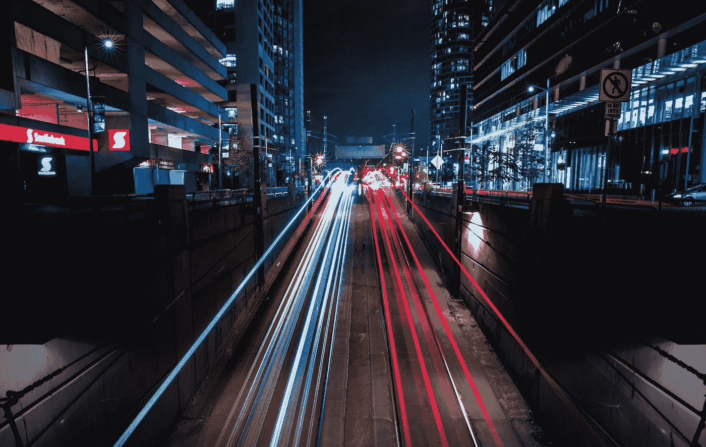

# 车辆对车辆(V2V)和车辆对基础设施(V2I)技术

> 原文：<https://medium.com/hackernoon/vehicle-to-vehicle-v2v-and-vehicle-to-infrastructure-v2i-technologies-f142eac11c28>

随着物联网(IoT)在全球的扩展，汽车行业正在为个人和公共交通的巨大变化做准备。根据美国交通部的数据，考虑到 80%的车祸可以通过增强的车辆连接来预防，科技公司和汽车制造商正在加大车对车(V2V)和车对基础设施(V2I)技术的开发，以提高我们道路上的安全性和便利性。

V2V 和 V2I 有可能从多方面彻底改善交通状况。从减少碰撞到提高能效，我们正处于出行方式革命性变化的风口浪尖。

当今汽车中存在的自动化系统主要使用传感器，通过超声波、雷达和摄像头技术允许车辆查看和分析周围区域，以便安全驾驶。虽然这些解决方案非常有价值，但传感器的范围有限，并不总是能够有效地管理隐藏的物体和其他汽车的惊人举动。然而，V2V 技术使汽车能够实时相互通信和传递数据，从而大大增加了车辆的视野距离，并进一步提高了预测未来的能力。例如，汽车可以在变道发生之前告诉后面的车辆它将要变道，从而使驾驶更加安全和高效。

虽然 V2V 要求路上的其他车辆也要联网，但 V2I 只在基础设施和汽车本身需要这一点。在这种情况下，基础设施将通过收集交通和道路状况的信息来帮助协调，并随后向一组车辆推荐特定的行为。展望自动驾驶汽车，V2I 将允许基础设施根据交通状况确定车辆的理想速度和加速度以及车间距，这可以大大减少整体排放和燃料消耗。

V2V 和 V2I 的最初市场开发主要集中在缓解交通和减少事故上，而这些技术的长期潜力仍在该领域专家的头脑和实验室中。在汽车行业，这是一个令人兴奋的时刻，因为我们正在进入一个由 V2V 和 V2I 引领的新的交通世界，为我们所有人带来更清洁、更安全、更高效的交通。

*由* [*DataArt*](https://www.dataart.com/industry/iot-and-m2m-solutions?utm_source=medium&utm_medium=social&utm_campaign=i-summer-2018) *物联网负责人伊洛宁撰写。*