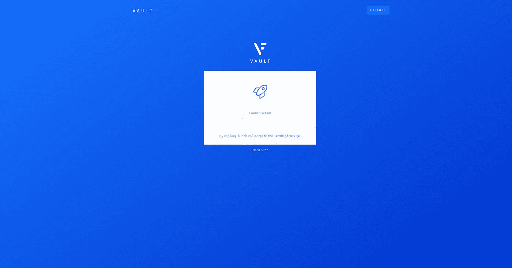

# VEN 至 VET: X 节点分类帐绑定教程

> 原文：<https://medium.com/hackernoon/ven-to-vet-ledger-bind-tutorial-with-x-node-bind-tutorial-included-4789a12ac8d4>

## 绑定您的 VeChain X 节点的时间期限已过(最后一天是 2018 年 8 月 10 日)，您不再能够绑定 X 节点。本教程现在仅供参考。

对 VeChain 的分类帐支持在我的时区今天下午上市，我刚刚经历了整个过程。关于它到底是如何做到的，已经有大量的问题被抛出——结合 X Node 绑定的时间敏感性，已经导致不少 VeChain 粉丝的恐慌，他们希望将他们辛苦获得的 X Node 作为忠诚的早期爱好者。

我觉得我现在训练有素，足以拆除炸弹了。无论如何，这里有一个关于如何用 Nano Ledger 应用程序设置 X 节点的详细指南！

1.  将 VEN 应用程序安装到您的分类帐中
2.  通过桌面应用程序访问您的钱包
3.  将您的地址添加到您的手机应用程序中
4.  绑定 X 节点
5.  (可选)将 VEN 交换为 VET 并传输到您 X 节点

你需要什么:

1.  分类账纳米 S
2.  安装了官方 [VeChain 移动应用程序的移动设备](https://www.reddit.com/r/Vechain/comments/8wm26q/official_vechainthor_wallet_ios_android_wallet_is/)
3.  一台电脑
4.  可选:一个 [L 银行账户](https://www.lbank.info/sign-up.html?icode=2G3A&lang=en-US)(附属链接)。

# 1.安装 VEN 应用程序

要做到这一点，首先你需要[安装 Ledger Live](https://www.ledger.com/pages/ledger-live) ，如果你还没有的话。一旦你打开它，你首先需要确保你的分类帐和你的分类帐都是最新的。为此，请单击程序右上角的设置图标。

在设置中，转到关于。它应该有你的版本信息。如果不是至少版本 1.1.4，那么您需要更新您的 Ledger Live 软件，因为版本 1.1.4 支持 VET wallet。同样，您还必须更新您的分类帐固件，应该是 1.4.2 或更高版本。

> 注:如果您的分类帐在尝试安装固件时出现空间不足的错误，您可以删除分类帐中的其他区块链应用程序，以便为固件更新腾出空间。删除应用程序不会删除你的钱包，你可以随时恢复它，拿回你的钱包。例如，如果您现有的分类帐钱包中有 1 个 BTC，并且您删除了设备上的 BTC 应用程序，重新安装后，您将在设备上再次看到 1 个 BTC，并且可以访问/移动它。所以不要担心删除应用程序。

一旦更新完毕，如果必须重启，请再次打开你的分类帐。再次打开后，进入 Manager 选项卡并搜索 VeChain。应该会出现 VeChain wallet 单击安装。

# 2.打开你的钱包

安装完成后，在你的账本设备上打开 VeChain 应用程序，前往[https://vault.veforge.com/](https://vault.veforge.com/)，你应该会看到以下屏幕:

给这个网站做个书签，在那里你将能够访问你的兽医钱包。

> 注意:如果你上了网站，它给你的文本“解锁你的账本并打开 VeChain 应用程序开始”，那么你必须首先打开你账本上的 VeChain 应用程序。当您看到 VeChain 应用程序位于显示屏中央时，您可以点击您的分类帐上的两个按钮。

一旦你点击启动钱包，它会说获取地址。这部分可能需要几分钟，不确定为什么。打开后，你会看到一个页面，在右下角的账户下有五个地址。

现在是时候把你的地址和你的手机钱包连接起来了，这样你就可以绑定 X 节点了。确保您已经下载了 iOS 或 Android 版的[手机钱包](https://www.reddit.com/r/Vechain/comments/8wm26q/official_vechainthor_wallet_ios_android_wallet_is/)。

# 3.将您的地址添加到您的手机应用程序中

下载 iOS 或 Android 版移动钱包后，将笔记本电脑/台式机和移动设备放在身边。在 VeChain Mobile Wallet 上完成整个帐户创建后(您不必在设置过程中创建钱包，因为您将使用从您的分类帐钱包导入的钱包)，您将能够导入或创建钱包。为此，点击应用右下方的“我”(可能在 Android 上不一样，我在 iOS 上是这么做的)，然后点击管理钱包。

Click Me -> Manage Wallets -> Import a wallet -> Observe Wallet

在下一个屏幕上，你会在底部看到两个选项:创建一个钱包和导入一个钱包。点击导入钱包。在下一个屏幕的右上角，点击观察钱包。

现在回到你的桌面，点击你想使用的地址。它会打开一个有详细信息的新页面。在右侧，对于您要使用的地址，单击接收。会出现一个二维码。

点击文本框右侧显示“扫描二维码或输入钱包地址”的紫色扫描图标，用移动设备扫描二维码扫描应该会自动将钱包地址输入到框中。

在下面，只需输入一个新的钱包名称，点击“我接受”，然后点击导入。现在，在你的移动设备上，你会看到一个有点混乱的新页面。

你现在所要担心的就是那个大大的红色六位数字代码，你将在一分钟内把它输入你的桌面。现在不要担心二维码扫描仪，我们一会儿也会谈到它。在你的移动应用上保持屏幕打开，但是现在检查你的桌面应用。在你的桌面应用上，点击设置，在设置下点击观察钱包授权。

将出现一个标有“观察钱包授权”的弹出窗口。只需点击开始。

在下一个屏幕上，选择您试图绑定的地址。会弹出一个二维码。忽略它。单击下一步。

最后桌面 app 会要求你输入 6 位验证码，也就是大红色的六位。点按“下一步”，转到您的分类帐设备并点按“签署邮件”单击下一步。

会出现一个新的二维码。使用这个，像之前一样通过手机应用程序扫描它。然后在您的移动应用程序上，单击验证签名。将出现一条消息说“观察钱包成功！”

# 4.绑定 X 节点

这部分都是在移动应用上完成的，所以你不再需要你的账本设备或者你的 VeForge 账户(也就是你的桌面应用)。你可以关上了。

现在，重新访问您的移动应用程序，点击左下方的资产。您应该看到刚刚设置的钱包，以及一个显示 X 节点绑定的按钮。点击它。它将带您进入下一个屏幕，这是绑定的第一步。点击你的钱包，然后点击确认。它会带你到第二步。

第二步是应用程序验证你有一个来自 ERC 20 钱包的 X 节点。因此，只需输入您的 ERC-20 VEN 所在的以太坊地址，或者扫描二维码自动输入，然后单击 X 节点验证。如果合格，那么恭喜你，你将进入第三步。否则不能绑定你的 X 节点。

> 请记住，在第 2 步，您需要输入存储了您的 ERC-20 VEN 的以太坊地址，以便 VeChain 可以检查它是否是合格的 X 节点。不要在空白处输入您的新 VeChain wallet 地址，因为它不符合条件。

步骤 3 应该是这样的。我从实际视频中截图了这个，因为我之前没有采取一个，现在我没有其他 X 节点绑定，所以我不能在自己的手机上再次进入第三步。反正就点“明白了，开始绑定。”

在最后一个屏幕上，您会看到三样东西:

1.  发件人地址:这是你必须发件的以太坊地址，因为这是 X 节点合格的地址，你说你拥有它；现在 VeChain 要求你证明你拥有它。不要从其他钱包里给 ERC 寄 20 文。
2.  收件人地址:这是您要发送 0.01 VEN 的地址。可以点击右边的复制，让 oyu 更简单。
3.  金额:应为 0.01

要寄 0.01 文(20 币，不是兽医币)，你需要确保钱包里有足够的以太币来付油钱。所以如果你不知道，那就先做吧。现在你就等着吧。我知道应用程序说等 10 分钟，但我不得不等 30 分钟。不确定 VeChain 在接受交易之前需要多少次确认。你不必打开你的应用程序，一旦交易通过验证，你的 X 节点将自动绑定，你甚至不必点击下一步。

## 您已成功将您的 X 节点绑定到您的分类帐钱包地址，祝贺您！

现在，在曾经显示 X 节点绑定的按钮的位置，您现在应该看到 VeThor X 节点。下一步，你将会想要转移你所有的兽医，但是在这之前，你需要把你的以太坊的兽医换成 VeChain 的主网兽医。

# 5.(可选)用 vent 交换 VET

如果你想立即进行互换，唯一的互换方式是现在就通过 L 银行(币安互换已经结束，其他大多数交易所也是如此)。所以你可以在这里注册[账户](https://www.lbank.info/sign-up.html?icode=2G3A&lang=en-US)(注:附属链接)。如果不想马上换购，可以等待 2018 年 8 月 11 日出来的 VeChain 手机钱包换购支持。在 2018 年 9 月 1 日之前，您必须 1)将您的 VEN 交换到 VET，2)将您的 VET 转移到您的 X Node 钱包。

注册后，你需要做的第一件事是设置谷歌双因素认证。如果没有设置，您将无法撤销任何内容。之后，您每天最多可以提取 20 BTC。

在你这样做之后，是时候存入你的 VEN 了，LBank 会把它转换成 VET。在“资产列表”下搜索“VET ”,单击门户右上角的“我的帐户”,然后在出现的下拉菜单中再次单击“我的帐户”,即可访问该列表。

找到 VET_ERC20(VEN)加密货币(不是 VET 加密货币)后，点击右侧的存款。它会带你到存款页面，在那里会先给你一个警告。点击同意，存款地址就会出现。

你可以把你 ERC-20 硬币存入那个地址，LBank 会自动为你兑换。如果没有发生，一旦存款发生，您可以随时单击“VET_ERC20(VEN)”加密货币旁边的资产列表下的转换。

> 建议:先发少量到存款地址，测试一下你是否收到了。一旦确认，你可以把剩下的送过来。此外，您需要确保您的以太币钱包中有足够的以太币，以便进行转账！

在你的虚拟币被送过去并交换给兽医后(这是即时发生的)，你可以撤回你的兽医。转会费是 200 兽医(2 文)。将其转移到 X 节点绑定的新钱包地址。现在您已经设置好了，您在 VeChain 主网上的 X 节点已经准备好了！只是坐在后面看着韦托堆起来。

如果你想给我留下一笔捐款，你可以寄给我一些

*   VET:0x45b 95748825 fdcb 9 c 359 C4 c 074 e 3154278 a 8182d
*   BTC:3 hsmztytqiaczyvvws 5 vtpoitujs 4 r 5f 5k

# 有问题吗？

*   如果你想让我亲自指导你，我们可以打电话:【https://clarity.fm/kennymuli
*   如果你有一次性的问题，你可以在我的个人资料上给我发信息:[https://worth.yt/kenny](https://worth.yt/kenny)
*   Twitter(请不要在那里给我发 DM，因为我收到太多垃圾邮件，如果你想问我什么，请使用 Worthyt):【https://twitter.com/kennymuli