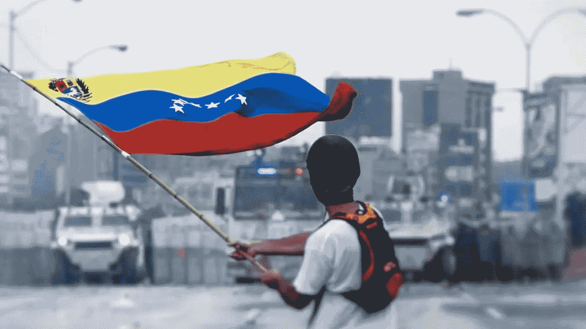
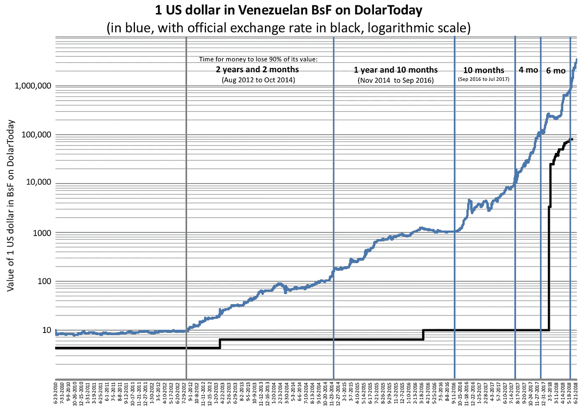
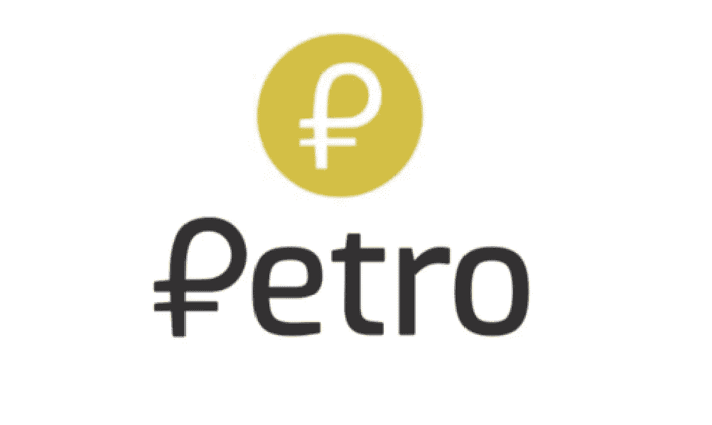

# 委内瑞拉石油公司:政府支持的秘密交易的不幸开端

> 原文：<https://medium.com/hackernoon/venezuelan-petro-an-unfortunate-start-for-government-backed-cryptoccurrencies-26749daaa34d>

Image Attribution: Efecto Eco. Licensed under Creative Commons 3.0.

委内瑞拉经济陷入危机已经快十年了。事情始于乌戈·查韦斯任总统期间的内部政治冲突。政府采取民粹主义政策，以增加其在该国的政治权力，这些政策导致该国进入恶性通货膨胀，委内瑞拉开始无法支付其债务，它滚雪球。国家陷入危机并不是什么新鲜事。另一方面，委内瑞拉试图重振经济的方式相当新颖，甚至可能是独一无二的。

Licensed under Creative Commons 1.0

由于危机和恶性通货膨胀随之而来，委内瑞拉比索遭受了极大的价值损失，货币体系崩溃。这让政治家们看到了替代的解决方案。因此，委内瑞拉推出了世界上第一种政府支持的加密货币 Petro T1。事实上，还有其他尝试，如 Estcoin、emCash、Crytporuble 等。然而，可能由于迫切需要一个替代的支付系统，Petro 成为第一个实施的。

**什么是石油？**

Logo of Petro

Petro 是一种原材料支持的，更准确地说是基于石油的，由委内瑞拉政府发行的加密货币。这是一种预先开采的加密货币，总共将有 100.000.000 Petros。不会有特别的发行。1 Petro 可被称为“Mene”的 100.000.000 单位整除。

委内瑞拉政府发布了一份[白皮书](http://www.elpetro.gob.ve/pdf/en/Whitepaper_Petro_en.pdf)，其中解释了其推广石油的计划。Petro 的预售从 2 月份开始，据称第一天就吸引了 7.35 亿美元。据委内瑞拉总统尼古拉斯·马杜罗(Nicolas Maduro)称，到今年 3 月上市时，Petro 已经筹集了 50 亿美元。这些数字导致一些消息来源报道 Petro 是有史以来最大的 ICO。然而，必须指出的是，这些数字是有争议的，迄今没有证据。

最终在 8 月 13 日，马杜罗宣布，Petro 将于 8 月 20 日作为第二种官方货币在该国开始流通，这是一个新颖但也是大胆的举动，因为国际上对政府支持的加密货币持怀疑态度。

**争议**

佩特拉号的发射在国内和国际上都受到了批评。由反对派控制的委内瑞拉议会宣布石油非法，因为它是该国石油储备的抵押。路透社[报道](https://www.reuters.com/article/us-venezuela-economy/venezuelas-congress-declares-petro-cryptocurrency-illegal-idUSKBN1EY2H2)称，委内瑞拉议员 Jorge Millan 表示:

> 这不是加密货币，这是委内瑞拉石油的远期销售。它是为腐败量身定做的。

3 月 19 日，川普签署了一项[行政命令](https://www.whitehouse.gov/presidential-actions/executive-order-taking-additional-steps-address-situation-venezuela/)，禁止美国公民或美国人购买委内瑞拉政府或代表委内瑞拉政府发行的加密令牌。

会发生什么？

委内瑞拉政府宣传石油是一种更强大、更稳定的经济出路。其他各方的论点是什么？风险是什么，如果出现问题会发生什么？加密货币能成为货币遭受通货膨胀的国家的解决方案吗？

首先，必须记住，加密货币的价值高度依赖于发行者的可信度。此外，即使是一个看似可信的项目也可能会出现严重的问题，正如道和黑客向我们展示的那样。此外，由于底层区块链技术的分布式和跨境性质，补偿方法尚不清楚，如果有的话。事实上，发行人是一个政府，导致自己的国家陷入经济危机，无法获得国民议会的批准，这使事情变得更糟。

*与 Petro 相关的具体风险有哪些？*

1.  **波动性**

这是加密货币的普遍问题。人们认为，由于缺乏中央权威机构的支持，加密货币的价值极不稳定。因此，让政府支持加密货币将被视为一种稳定因素，而不是额外的波动性。然而，在 Petro 的案例中，支持它的政府是一个涉嫌腐败和价格操纵的政府。

可能是因为这种不可靠的形象，委内瑞拉政府选择将石油价格与其信誉挂钩，而不是与一桶委内瑞拉石油挂钩。肯定比政府的声望可靠得多，但仍不足以阻止委内瑞拉石油价格的大幅波动。

如果加密货币可以与商品随意交换，或者流通水平很高，可以进行清算，那么让商品支持加密货币将是有意义的。在 Petro 的案例中，两者都不可能。

2.**采用和流通**

政府可能会在全国推广使用石油，甚至出台法律让人们采用它。然而，政府并不足以让 Petro 在世界范围内被采用。虽然加密货币的世界是分散的，但人们通过主要的交易所进行交易，在这些交易所上市是增加采用的非正式要求。目前，Petro 没有在任何主要交易所上市。此外，这些主要交易所之一 BitFinex 明确拒绝 Petro 上市。

另一方面，委内瑞拉加快了本国密码交易所的认证速度。4 月，T2 政府认证了 16 家交易所，并宣布对交易所的这一要求表明了对 Petro 的信心。

简而言之，购买或投资 Petro 意味着投资一种在秘密世界中没有真正流通的资产。

Image Source: TaxRebate.org.uk. Sharing is permitted.

**3。洗钱**

谈到加密货币，洗钱是最大的担忧之一。不幸的是，委内瑞拉总统马杜罗和其他政治人物被认为涉嫌洗钱。他们没有促进透明度，他们甚至没有提供证据来证明他们所宣布的关于 Petro 股票的数字。政府声称已经与腐败做了很长时间的斗争，但是该国的经济形势并不容易让人相信这些努力已经到位。

**4。规避国际制裁**

这一点也与洗钱问题有关。政府可能会利用 Petro 来规避国际社会对委内瑞拉的制裁。事实上，它可能已经这样做了。

委内瑞拉公民无法购买石油，他们受经济危机的影响最大，因为在代币销售中只接受美元、欧元、比特币和以太币。因此，中石油的预售完全由外国投资者出资。然而，由于国际制裁，这种来自外国投资者的资金流动用传统方法是不可能的。

**结论**

政府使用加密货币是一个非常新颖的话题，在该领域有讨论、辩论和试点应用的空间。然而，使用不稳定的加密资产来吸引外国投资者的资金流向臭名昭著的政府似乎并不好，至少目前是这样。

Petro 不仅为其投资者，也为整个加密货币树立了一个有问题的榜样。

Petro 的投资者可能获利或遭受损失，这对于加密货币的风险投资来说是完全正常的。然而，Petro 也有被其他处理经济问题和国际制裁的政府效仿的风险。

此外，由于其政治性质，政府会宣传他们的项目是最好的。在很长一段时间里，政治就是这样运作的。然而，当这种民粹主义与公众不容易理解和看穿的复杂计划和技术结合在一起时，事情就变得危险了。首先，这可能导致资金流向这些危险甚至非法的计划，其次，对加密货币的信任崩溃。

鉴于这一切，彼得罗看起来不像救世主，而是恶魔。然而，只有时间会证明结果如何。