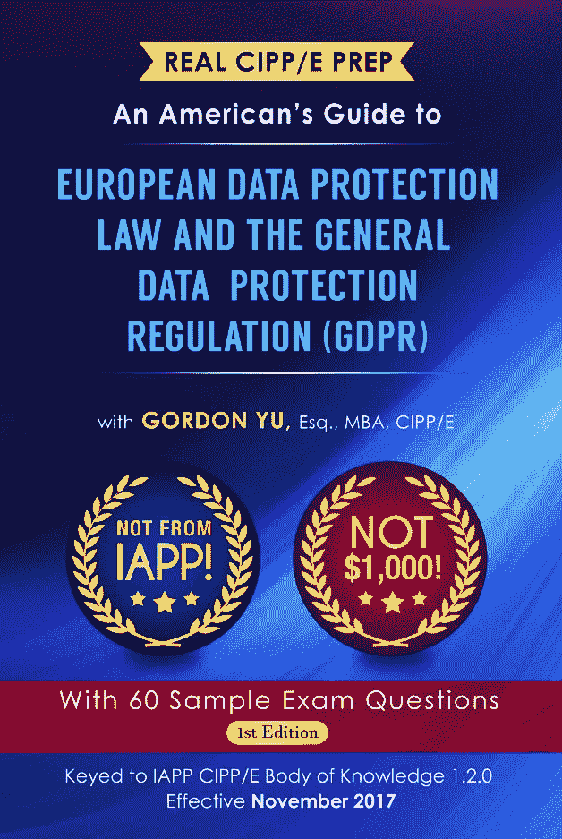
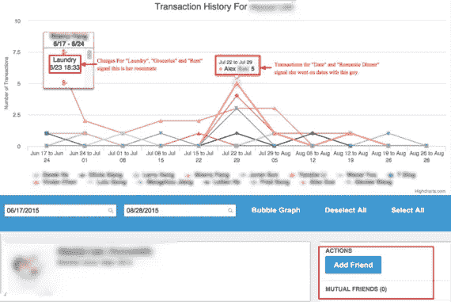
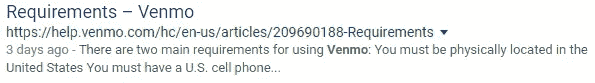
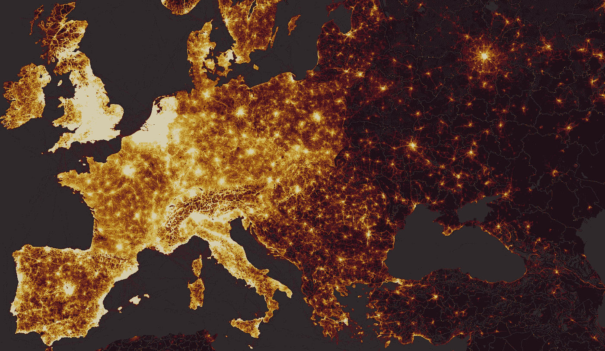
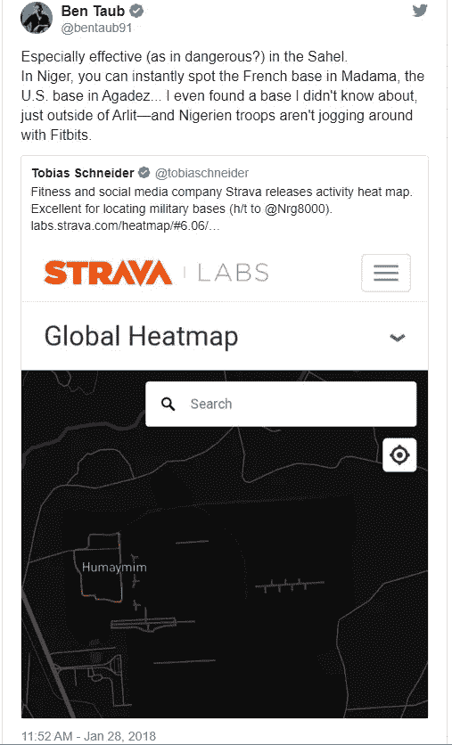
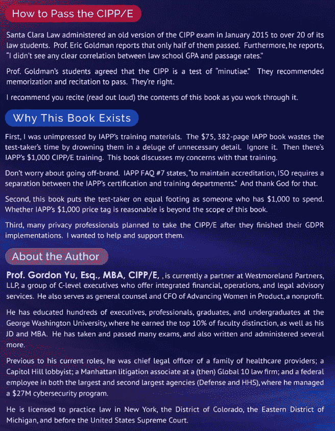

# 文莫，斯特拉发，为什么他们没有被罚款€2000 万

> 原文：<https://medium.com/hackernoon/venmo-strava-and-why-they-havent-been-fined-20-000-000-f0738680f1c8>

产品中提升女性地位的功能。

戈登的新书，*欧洲数据保护法和一般数据保护条例(GDPR)美国指南*在[亚马逊](https://www.amazon.com/Real-CIPP-Prep-Protection-Regulation-ebook/dp/B07F9B98Q7/ref=sr_1_1?ie=UTF8&qid=1531334679&sr=8-1&keywords=real+cipp%2Fe+prep)和其他优秀零售商处有售。

GDPR 第 25 条要求**数据保护“通过设计”和“默认”**

“通过设计”意味着产品经理应该在产品开发生命周期的每个阶段讨论用户数据的隐私和安全性。应考虑技术(如假名化)和原则(如处理尽可能少的数据)，并记录这种考虑。

“默认”意味着默认设置只处理最少量的数据，以实现产品的“特定目的”

(如果你不熟悉的话，“处理”是一个宽泛的概念，意味着你可以对数据做的一切:收集、发布、分析、存储、删除等等。)

GDPR 第 83 条第(4)款对未通过设计和默认方式保护数据的产品处以最高 10，000，000€的罚款。

自从 GDPR 生效以来，脸书和谷歌已经被起诉了 70 亿€。

那么，为什么文莫和斯特拉瓦没有被€每人至少罚款 1000 万英镑呢？

Venmo 在谷歌上将自己描述为“一个免费的数字钱包”作为 Paypal 的子公司，它允许人们通过手机请求和发送付款。在 2018 年 Q1 奥运会上，它转移了 1 20 亿美元的支付。人们告诉我他们会“venmo 我”，强迫我加入这个平台。没有人说过他们会“整我”或“整我”另一方面，Venmo " [并没有直接产生那么多收入](https://www.theatlantic.com/business/archive/2017/07/venmo-makes-money-banks/533946/)。

Venmo 与众不同的特点是，它将你可能认识的人的金融活动实时推到你面前。为了实现这一壮举，它:

1.  安装时将隐私设置默认为“公共”。默认情况下，这违反了数据保护。

Note the tiny “Public” text and even tinier world clipart

2.发布关于如何使活动保密的错误指示(据称)。如果是真的，这违反了设计的数据保护(因为设计良好的数据保护意味着你了解你的产品是如何工作的。)

3.隐藏设置，使活动成为拜占庭进程背后的私有活动(据称)。美国联邦贸易委员会的律师们用了 [5 页](https://www.ftc.gov/system/files/documents/cases/venmo_complaint.pdf)来记录这个过程。如果为真，这违反了设计和默认的数据保护。

(“成就”2 和 3 可能是在 [Paypal 最近与 FTC](https://www.ftc.gov/news-events/press-releases/2018/02/paypal-settles-ftc-charges-venmo-failed-disclose-information) 达成和解后被修补的。)

这些“成就”产生了以下结果:

1.  Venmo 用户可能会被[数据挖掘以发现他们的习惯](https://www.huffingtonpost.com/aran-khanna/venmo-money_b_8418130.html)，例如他们多久赌一次，他们赌掉多少钱，以及和谁一起赌:

2.Venmo 用户体验" [Venmo 焦虑"](https://nypost.com/2018/06/23/venmo-is-making-its-users-paranoid/):

> “看到这些交易——即使是在我不想交往的人之间——会产生一种空虚和不安的感觉。这就像，S–t，每个人都在周四晚上做一些事情，而我却坐着看书。我是个失败者吗？"

3.根据 GDPR，文莫被罚款。等等，还没有。为什么不呢？

Venmo 没有被罚款，因为 GDPR 只适用于在欧洲经济区(EEA)运行的数据控制器和处理器或针对其中的人。

这是美国公司在 GDPR 生效前常犯的错误。他们会发布声明，如“此政策已更新，以符合 GDPR”或“我们的数据保护官是 Abradolf Lincler。”

你毫无理由地接受 GDPR 的管辖吗？你知道你对数据保护官员的责任吗？

如果您对这些或相关事项的审查感兴趣，请随时与我联系。

Strava 在谷歌上称自己是“运动员在社交网络上的跑步和骑行追踪”它还发布了一个聚集的匿名用户活动的热图:

在第三世界，斯特拉发的热图揭示了[秘密地点](https://www.vox.com/technology/2018/2/1/16945120/strava-data-tracking-privacy-military-bases)，比如中央情报局的安全屋和导弹电池:

Strava 的回应是——听着——拒绝撤下它的热图，据一位评论者说,[指责它自己的用户不理解它的“7 步隐私协议”](http://commentators noted that Strava faulted its users after the data leak and had a "7-step privacy protocol.")的确，Strava 的[默认](https://blog.strava.com/privacy-14288/)隐私设置依然是:

> 最基本的是选择不使用任何隐私控制，公开你的信息，比如像在 Twitter 上那样。

据我所知，没有人因为使用斯特拉发而被杀。一个家伙因使用 Strava 而被捕[。但这是他自找的。](https://community.spiceworks.com/topic/2136162-voluntarily-posted-strava-gps-data-leads-to-self-incrimination-arrest-warrant)

尽管如此，斯特拉发制造了类似于文莫的问题，并通过泄露全球信息，缺乏文莫的防御。那么为什么没有被罚款呢？三个潜在原因:

1.  Strava 的热图可以说是通过设计实现了数据保护！回想一下，假名化是通过设计实现数据保护的一种被认可的方法。可以说，Strava 的热图比 psuedonymous 要好:它是匿名的！虽然热图揭示了国家机密，但它(可以说)没有揭示个人用户的秘密。
2.  Strava 可以说是默认实现了数据保护！与自称为“数字钱包”的 Venmo 不同——钱包不会在你的社交网络上呕吐你的活动——Strava 实际上称自己为“社交网络”。因此，在一定程度上，个人用户(可以说)知道他们会在 Strava 的网络上吐槽他们的活动。
3.  罚款来了。事实上，Strava 一直在寻找一名[“兼职”数据保护官](https://boards.greenhouse.io/strava/jobs/1192005)。

作为一名产品经理，在履行设计和默认的数据保护义务时，您应该询问、研究和记录这些类型的问题。这也不意味着盲目地坚持 GDPR，或者忽视它。这意味着做出明智的选择，最大化这两者。

哦，如果你在欧盟，并且有兴趣投诉 Strava，请随时与我联系。会很有趣的。

戈登的新书《欧洲数据保护法和通用数据保护条例(GDPR)美国指南》(T8)可以在亚马逊和任何有好书出售的地方买到。

