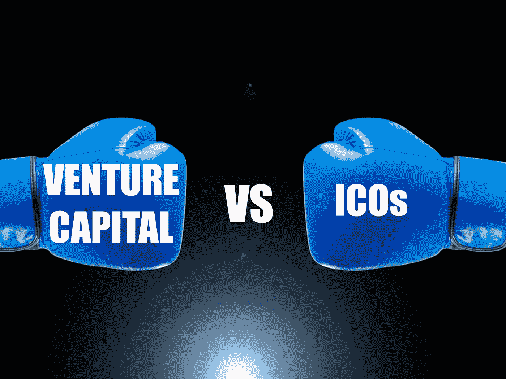

# 加密货币时代风险投资业面临挑战

> 原文：<https://medium.com/hackernoon/venture-capital-sector-facing-challenges-in-the-era-of-cryptocurrency-8a6b03dffa78>

在过去的几年里，[加密货币](https://hackernoon.com/tagged/cryptocurrency)经历了突然的繁荣，现在正在各个领域制造新闻。起初，当比特币处于初始阶段时，每个人都在谈论风险投资(VC)以及它将如何惠及小企业。

如此多的风险投资家通过投资最终变成独角兽的创新想法赚了钱。投资者没有投资比特币等数字货币，而是更喜欢投资 21.co 或比特币基地等公司。

**比特币价格空前高涨**

这些公司中的一些比另一些表现更好。例如，由于对比特币的大肆宣传，比特币基地在去年 12 月最终成为苹果应用商店的第一名。另一方面，21 世纪不停地改变它的名字和商业计划。当比特币基地从风投那里获得第一轮融资时，其价格约为 110 美元。然而，最近，它设法达到了 19，000 美元。

数字货币集团的投资助理 Travis Scher 认为，如果投资者投资加密货币，而不是投资数字货币公司，他们现在会获得更高的回报。

**风投和 ico 的增长趋势**

这不容易理解，因为它使风投的核心理念变得复杂。

传统的投资方式是发现技术的上升趋势，确定符合这些趋势的目标，并在更有利的位置做大，然后在这些公司被出售或上市后立即获利退出。

但对于比特币这样的数字货币来说，这不会是一个有效的策略。事实上，随着越来越多的加密货币进入市场，它变得更加混乱和复杂。梦想家和企业家社区一直在通过 ICOs(初始硬币发行)筹集资金，其中，他们创建自己的数字货币，将其出售换钱，并在公开市场上进行交易。

谈到风险投资公司，它们为投资者提供了不受限制地接触未公开上市的私人公司的机会。因此，问题是，如果 ico 成为人们获得一点热门技术的强大媒介，这些风险投资公司将何去何从。

**风险资本家和他们的新策略**

风险资本家一直在设计新的策略来应对加密货币的狂热。他们不再寻求入股数字货币公司，而是开始通过法律合同购买在首次发行硬币之前获得代币的权利。除此之外，他们正在即兴创作传统的股权交易，向投资者提供担保，如果一家初创公司未来收购 ICO，他们可以获得代币。

一些投资者多年来也一直直接投资比特币。风险投资公司 Social Capital 的创始人查马斯·帕里哈皮提亚(Chamath Palihapitiya)表示，他和他的合伙人投资了流通中的比特币的 5%，并且仍然持有该货币的合理股份。

**投资者在数字货币市场面临越来越大的风险**

尽管加密货币市场正在快速增长，但它并非没有风险。事实上，这么多投资者都遭受过黑客攻击，也受到过身体上的威胁。

威胁是非常真实和有害的，因为如果有人窃取比特币，它将永远丢失。

**加密货币对冲基金和期货代币**

包括红杉资本(Sequoia Capital)、联合广场风险投资(Union Square Venture)和安德森·霍洛维茨(Andreessen Horowitz)在内的许多风险投资公司都对数字货币对冲基金进行了投资，以便从繁荣中受益，而不必担心管理这些货币。他们通过在 ICOs 市场交易 dabble、莱特币、以太坊、比特币来赚取利润。

风投界的一些大腕，包括贝恩资本风险投资公司、联合广场风险投资公司和红杉资本，已经参与了收购数字代币的交易。为此，他们使用了名为“简单期货协议”的法律协议，也称为 SAFT。Andreessen Horowitz 也在采取措施，在标准投资合同中纳入条款，以适当解决 ico 问题。

根据一家研究网站的数据，2017 年，创业公司的 ico 收入约为 36 亿美元。然而，这与 CB Insights 和普华永道(PricewaterhouseCoopers)在报告中指出的全球风投赚得的 526 亿美元相比，根本不算什么。尽管如此，投资者还是倾向于 ico，因为它能让他们在短时间内赚到数百万，相比之下，风投投资需要数年才能获得回报。

在[推特](http://www.twitter.com/eliandalvarez)上关注我！