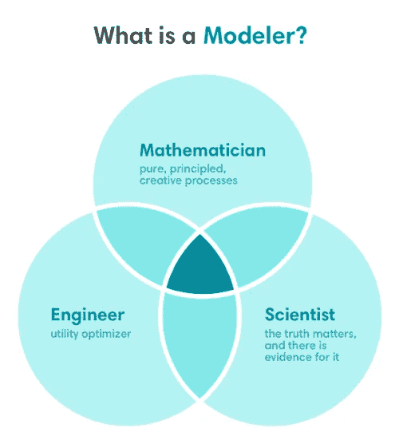

# 真实性:模型、方法和道德

> 原文：<https://medium.com/hackernoon/veracity-models-methods-and-morals-600ccef4690>

哈维尔·瓦雷兹博士

# 概观

我们很兴奋地宣布将在[锻造厂开始一系列关于*真实性*的新帖子。AI](http://www.forge.ai) 博客。本系列将探索多个方面，包括:

*   准确性的机器学习模型
*   建模真实性的道德和伦理方面
*   创建机器学习模型的实验设计和过程
*   系统设计
*   确认

这个系列是与我们在 Forge 的系统和模型的开发同步进行的。因此，与其说它是一个目的地，不如说它是一个旅程。我将探索我们的选择和结构背后的基本原理，以阐明隐藏在我们模型中的假设。我们还将包括我对成为一名*建模师*的想法(相对于一个人在设计、构建或使用机器学习时可以采取的其他观点和立场)。

# 为什么是真实性？

在福吉。我们使用许多类型的文本数据作为输入，包括但不限于:新闻文章、研究和分析报告、推文、营销材料、股东演示、SEC 文件、抄本等。在福吉。我们正在努力将这些“汤”数据转化为连贯、简洁、突出的金块，我们称之为事件。我们的客户利用这些事件来做出决策、采取行动，并对与其业务相关的概念进行推理。在我们可以将输入数据转换成这样的事件之前，我们需要考虑任何计算系统的最基本原则之一，包括机器学习系统:输入质量的概念。这个原理最简洁地表示为: [*垃圾入，垃圾出*](https://en.wikipedia.org/wiki/Garbage_in,_garbage_out) 。

很简单。我们不会给我们的系统错误的输入！完成了。帖子结尾。

然而这个帖子仍然在继续…

那么，我们错过了什么？继续我们的比喻，人们有时忽略的是，一个人的垃圾是另一个人的财富。所谓的不良输入应该被忽略还是被视为信息性的，这是一个视角和用例的问题。对我们 Forge 来说尤其如此。AI 因为我们不知道，也不可能知道我们事件的每一个可能的消费者的每一个用例。了解输入的质量是决定如何处理它的关键——是甚至不使用输入，还是将其视为在特定系统中非常有用的信息。

人们通常感兴趣的文本数据的一个质量是文本的含义实际上是否真实。对于数字数据，我们可以用[信噪比](https://en.wikipedia.org/wiki/Signal-to-noise_ratio)来衡量质量，但是文本数据的质量不容易量化。因此，我们求助于*的准确性*，希望能够理解和推理文本输入的质量。

除了我们自己的机器学习算法。AI，我们还必须认识到我们客户的机器学习系统。我们客户的系统能很好地处理“坏”质量的数据吗？让我们事件数据的消费者知道一些可能不真实的事情有用吗？一些算法可以利用低真实性事件，如小报道听途说或 [FUD](https://en.wikipedia.org/wiki/Fear,_uncertainty_and_doubt) 活动，对其他人来说，无知是福。我们的事件被设计成广泛的机器学习系统的输入；系统本身必须对其输入数据质量进行推理。准确性不仅仅是我们内部机器学习算法感兴趣的，它对我们事件的所有消费者来说都是至关重要的。我们的数据质量模型不仅允许我们对我们的机器学习系统进行推理，还允许我们的消费者对他们的机器学习系统进行推理。

# 一个定义

我们对诚实的最初定义来自《韦氏词典词典》:*与真理或事实的一致*。尽管这个定义只使用了五个词，但我们已经可以看到试图模拟真实性的复杂性。首先，我们可以选择如何解释*一致性*:这是一个布尔属性还是一致性有等级之分？我们是一家面向客户的公司，因此我们的准确性模型的结果——以及我们选择的准确性定义——将被我们的客户用来推理他们自己的机器学习系统。在福吉。人工智能我们在建立机器学习模型时追求简单性，以提高我们自己的推理能力，因为我们模型结果的用户可以思考是否以及如何更有效地使用这些结果。出于这些原因，我们将把一致性视为要么全有，要么全无。

重写定义，我们现在有:真实性=[一滴文本]完全符合真理或事实吗？【是|否】”请注意，我现在将准确性作为一个布尔属性，并进一步将我们的模型集中在文本块上。尽早缩小模型的范围非常重要，这样我们就可以:

*   构建一个有效且有用的问题陈述
*   创建假设和设计实验
*   收集相关数据

让我们来处理最后两个突出的词:*真相*和*事实*。哇哦。这些词承载着潜在的含义、细微差别、政治和哲学陷阱——整个领域都致力于这两个词。我们需要一个从可靠来源广泛采用的基本定义，所以我们求助于最著名的英语词典之一:牛津英语词典。来自牛津英语词典:

*   真实:真实的或与事实或现实相一致的事物
*   事实:与解释相对的事件真相

似乎够清楚了——即使有循环定义；*准确性*是一个布尔属性，表示一个文本块是否包含根据现实为真的事物或事件。此定义的范围是事件所代表的内容。例如，可以有一个断言“Javier * said * I can write”的“真”事件，以及第二个错误断言“Javier I can write”的“假”事件。

**知识、无限和真理**

我们现在有了想要建模的内容的定义，但是还没有模型。我们如何开始对准确性建模，如前一节所定义的？似乎任何模型都必须确定某个东西，称之为 X，是否为真。有多少事情可以是真的？我们如何表现事实？我们如何询问一个东西，称它为 Y，X 是否为真？

永远不会有一个 Y 可以存储“所有真实的东西”，或者，至少，实际上永远不会。我们可以将局部区域的知识存储在[知识库](https://en.wikipedia.org/wiki/Knowledge_base)中，这样的对象将允许我们根据知识库查询 X 是否为真，但是拥有一个全局的、足够的知识库似乎是一个不可能的任务。甚至不清楚真理或事实的数量是有限的还是无限的。此外，已知的情况会随着时间的推移而变化:非平稳性每次都会发生！

当然，我们总是可以*假设*某些关于真理的事情。我们可以假设真理是有限的，或者我们可以沿着非参数贝叶斯路线，假设真理是无限的，但在任何时间点都只需要一个有限的表示。我们也可以假设真理和事实随着时间慢慢变化，也许根本不变，以此来忽略非平稳性或使增长率可控。这些假设能让我们走多远？我们可以将准确性问题归结为:给定一个表示 X 的文本块，X 包含在我们的知识库 Y 中吗？毫无保留地掩饰*我们如何从文本块中获得 X(其中 X 是我们可以查询知识库 Y 的东西)，我们现在已经把我们的准确性模型变成了知识库的查询。警告:*

*   我们的知识库必须包含所有(有限的、当前的、相关的)事实
*   我们的知识库不包含虚假

因此，即使有关于真理的有限性和稳定性的两个非常强的假设，我们仍然必须以某种方式构建一个知识库，这个知识库包含所有的真理，除了真理什么也没有。信封背面的计算足以看出存储所有可能事实的巨大规模和不切实际性:地球上有 76 亿人(来源:[世界统计](http://www.worldometers.info/world-population/))，每个人每天至少做出一个决定，产生至少一个事实……这还不包括关于非人类事物的事实！

这个想法让我犹豫了。让我们说，现在，我们将*而不是*有一个足够大的知识库来包含所有的真理。或许，我们能不能只对我们关心的话题说真话？那么，我们如何定义我们所关心的呢？它是基于某种形式的效用函数，或许应用于未来的状态吗？无论我们如何定义它，我们都可以试着建立一个知识库，它的事实和真理很好地覆盖了某个知识领域。我们可以量化*井*是什么意思，以及*盖*。事实上，这个关于如何建立知识库的想法已经在 Forge 讨论过了。AI 。

然而，总有一天，我们必须将一个真实的模型应用于我们的知识基础之外的东西；要么是因为它是一个全新的事物，要么是因为我们的知识库不完整。那么，有什么办法呢？我们是否会举手说，任何不在我们知识库中的东西，根据构造和定义，都是不合理的(无法推理的)？那么，那些处于风口浪尖的消费者呢？他们的需求需要对新的和未经探索的制度进行推理。那么，真正的问题是，我们能否建立一个不依赖于我们或任何知识基础的准确性模型？ ****1***

# 缺乏事实的真实性

避开知识库，还剩下什么？让我们考虑一下*为什么*我们首先想要一个诚实的模型。我可以提出以下理由:

1.  我们想知道什么时候有人或事在说谎，以便“数谎言”。谎言是关于什么的，或者为什么，并不重要，只是我们看到了一个谎言
2.  我们想知道我们是否能信任某些东西
3.  我们想知道某人或某事是否在说谎，因为我们想知道他们为什么说谎(或说真话):这仅仅是一个错误，还是有其他的游戏正在进行？

选项#1 看起来我们确实需要一个知识库。这个选项是关于文本是否真实，是我们对真实性定义的直接应用。举例来说，我可以看到，想研究谎言统计或谎言动力学的学者对这个选项感兴趣。我看不到为选项#1 创建一个准确性模型的方法；这是一个合理的问题，但不是我们从现在开始要考虑的问题。

选项#2 完全是关于**信任**。现在，信任当然与事实和真相有相似的感觉，但它不是完全相同的东西。通过信任文本的*源*，你也许能够信任一个文本块的内容。事实上，*而不是*知道一段文字背后的真相，并相信其来源，从而将文字内容作为事实来学习是非常合理的。在这里，我看到了几种方法，我们可以尝试模拟一个很像真实的量，但其目标实际上是信任:

*   名声
*   专业知识(全球)
*   专业知识(特定)
*   社区成员资格/“积分”
*   多种来源和佐证
*   过去的经验
*   来源意图

选项#3 是关于目标受众的来源的意图。请注意，前一个选项的最后一个项目符号也有来源的意图。巧合吗？我觉得不是！

意图:目标或计划

章节标题直接来自《牛津英语词典》对*意图*的定义。意图是关于一段特定文本的目的或目标。这篇文章是在试图说服吗？这篇文章是否试图尽可能客观地传达信息？这篇文章是否试图以某种方式重新整合(耸人听闻的写作和/或[点击诱饵](https://en.wikipedia.org/wiki/Clickbait)标题)？文本信息是否有隐藏的目的？如果是，议程是什么？环境中是否存在效用反馈回路，可以告知一篇文章的意图，例如:

*   网络广告+点击收入=点击诱饵
*   学术出版物+资助可能性= [注定成功](https://www.wired.com/2016/03/science-needs-learn-fail-can-succeed/)

上面关于意图的例子的一个显著特征是，它们都没有围绕*真理*。事实上，它们都是相关和有趣的问题，与一篇文章的事实内容(或缺乏事实内容)无关。这看起来是一个有希望的方向，因为意图似乎不需要知识基础。

# 后退和前进:建模者的舞蹈

好吧，让我们退后一步，看看我们到了哪里。我们从真实性的概念和一个坚实清晰的定义开始:符合真理或事实。然而，当我们开始挖掘一个诚实的模型时，我们偶然发现了知识库和一个看似不可能完成的任务，即拥有“包含所有真理，除了真理什么都没有的正确知识库”。那么，建模师做什么呢？我们开始剖析为什么我们需要一个诚实的模型。事实证明，对于我们很快想到的三个原因中的两个来说，*意图*的想法是最重要的。意图与真理或知识库无关，所以我们可以完全避开这一大堆乱七八糟的东西。

这样的来回推理我称之为*建模师的舞蹈*，因为这是创建模型时不可避免的过程。严格地说，从寻求真理的意义上来说，建模者不是科学家；模型可能是现实的近似，也可能是计算某种事物的有用工具。因此，建模者并不明确地与宇宙的真相联系在一起，而是有时像工程师一样，创造对特定功能有用的工具。

现在，你可能会认为，对除了真理之外的任何事物建模总是比对真理本身建模更糟糕。如果你有过这种想法，我问你:在你生活的某个阶段，你有没有发现自我欺骗是有用的，甚至是必要的(例如，在处理恐惧或焦虑时，自我欺骗是一种有用的自我防御手段)？我们没有等待的自由，直到我们完全理解现实生活在其中(我们现在就活着！).类似地，建模者不能不考虑模型需要被使用，问题需要被询问和回答，即使事情的真相还不为全人类所知(或者甚至只是建模者)。在建模过程中，总有一部分我们需要确定我们相信什么是真理，以及我们相信我们需要建模什么；这两者并不总是一回事:

# 建模者之舞 1:意图和句法

到目前为止，我们的旅程将我们带到了一个新的目标:创建一个*意图*的模型。我们希望这个模型明确地远离知识库、事实和真相。此外，我们希望这个模型尽可能广泛地应用于文本。我们如何做到这一点？我们转向詹姆斯·e·彭尼贝克在[“代词的秘密生活”](http://www.secretlifeofpronouns.com/)中提出的有些争议的观点，即语言的使用和结构携带着关于该语言作者的情感和自我概念的信息。举个例子，沉迷于过去的人会大量使用过去时态动词。Pennebaker 的想法很吸引人，因为他们将语言和语言的创造者联系在一起，所以分析语言可以揭示创造者的一些事情——比如他们的意图。 ****2*** 为了对文本类型进行概括，在语法中是否有一些东西可以帮助推断这段文本的意图？根据 Pennebaker 的说法:是的。“功能词”(代词、冠词、助动词)的用法可以让我们洞察说话者、听众或两者。我们将更进一步，尝试使用语法结构本身(而不是实际的单词选择)作为建立意图模型的特征。关于句法如何因意图而不同的一个例子和笑话如下:调查问题(由统计学家设计以不带偏见)中使用的副词的平均数量不同于阅读理解问题中使用的副词的平均数量(在阅读理解问题中，可能没有雇佣统计学家来创建不带偏见的问题)。

虽然语法似乎与意图一致，但我们必须非常谨慎，不要最终为*声音*创建一个模型。声音，有时被错误地称为作品的写作风格，并没有被完全理解。不同的社区和文化可能有规范来决定某一段文本的声音是“合适的”还是“好的”。人类读者经常被一段文字的声音所左右，尤其是当这种声音违背读者群体的规范时。虽然声音可能是一段文本中有趣的部分，但它不是文本的意图。我们的愿望是一个意图的模型，不管声音。为什么？因为作为建模者，我们要对我们模型的决策、行为和可能的误用负责。我们要非常小心地*而不是*制作一个不公平地偏向/反对:

*   人种
*   性别
*   年龄
*   文化

对我们来说，我们将使用下面的定义:声音是所有基于个体说话者/作者和说话者/作者固有的**文体要素；声音包含说话者/作者没有意图的内在属性。另一方面，风格是作家做出的*选择*，其背后有着内在的意向性；我可能会选择以一种有说服力的风格，或者分析性的风格来写作。对于那些对声音更感兴趣的人来说，戴尔·海姆斯的《人种学、语言学、叙事不平等:对声音的理解》是一本有趣的读物。**

既然我们已经把一个看似不可能的建模任务(准确性)换成了另一个看似不可能的建模任务(意图)，那么期待下一篇文章中使用语法的意图模型。

# 冷却

我在这篇文章开始时谈到了了解提供给机器学习算法的数据的“质量”(我指的是真实性)的重要性——不仅仅是在 Forge。AI，也包括我们事件数据流的任何消费者。我们跳舞，我们思考，我们甚至把我们最初的目标从一个纯粹基于事实的诚实模型转移到一个信任的用例从一开始就很明确的模型:一个意图的模型。我们从使用语言本身的底层结构*语法*开始，作为一种将我们的模型推广到多种文本类型的方法。但有些危险是我们必须明确防范的；针对文化或种族、声音或性别的偏见的危险。这样，一个建模者总是愿意创造未来，让现实见鬼去吧！一如既往，我希望我们的模特比人类观众表现得更好。这是一个可以实现的目标吗？或许；但这仍然是我们的目标。

# 脚注:

1.  在这个练习中，我强烈倾向于一个特定的结果。然而，重要的是要明白什么时候你的感觉和你的直觉联系在一起。更重要的是要明白直觉有时是错误的。创建机器学习模型的过程有时被吹捧为一门*艺术*或*创造性过程*。对某些人来说，这可能是真的，但在我看来，模型是理性的，创建机器学习模型的过程也应该是理性的。最好的居住地就在直觉的边缘，再远一点！
2.  如果你想知道，我**没有**只是在没有任何真正定义的情况下抛出了意图的概念。事实证明，[意图是一个令人困惑的概念](https://plato.stanford.edu/entries/intention/)，它值得拥有自己的位置(或者在我们的旅程中前进两三个)。现在，让我们说意图归结为一个作者可能希望的对读者的一小部分未来变化中的一个，包括诸如:欺骗、说服、信息传递、客观问答和情绪调整。

注:本帖原载于我们的博客:[https://www . forge . ai/blog/honeyness-models-methods-and-morals](https://www.forge.ai/blog/veracity-models-methods-and-morals)