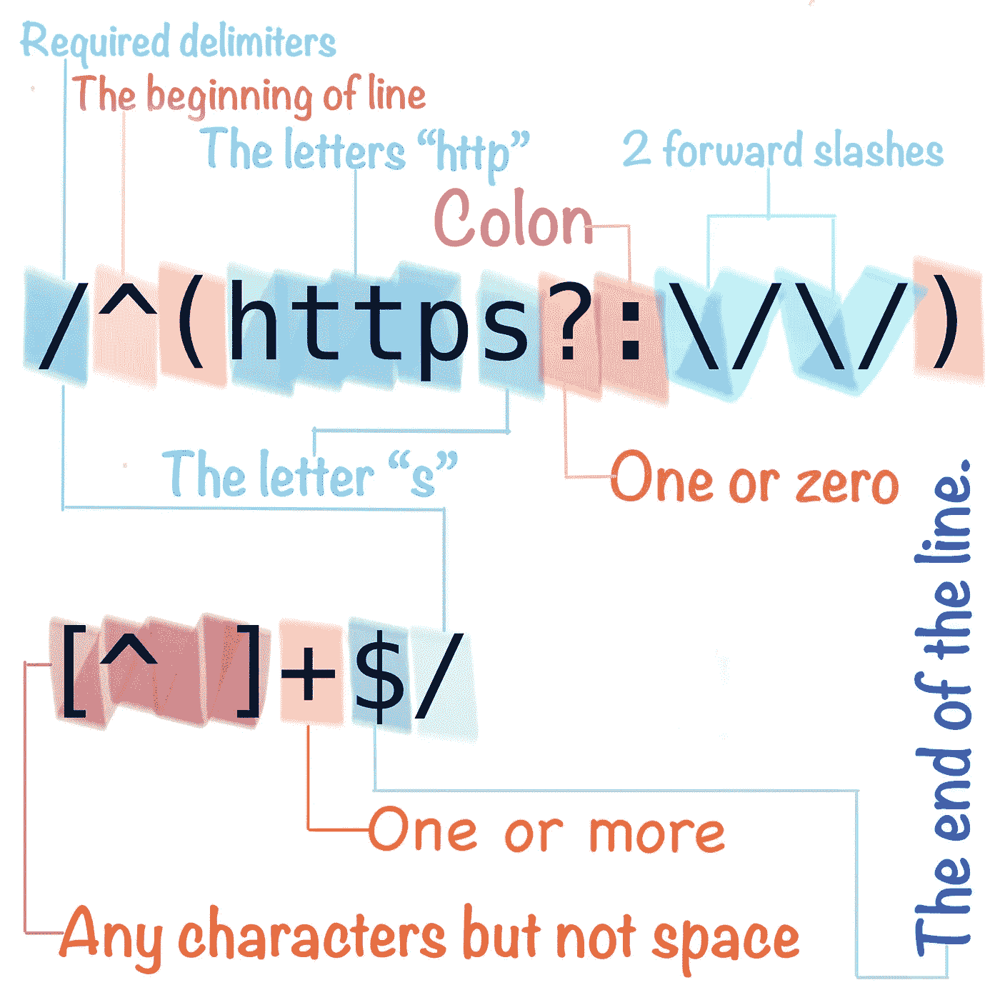
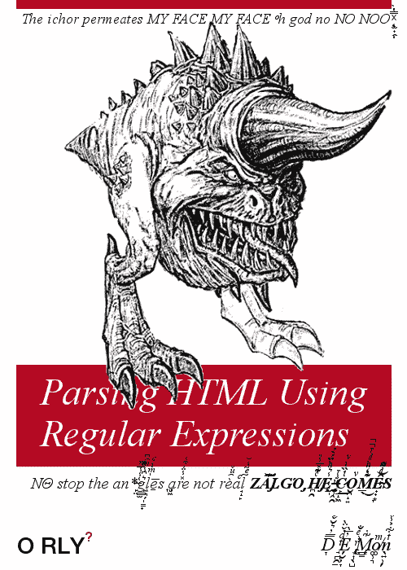
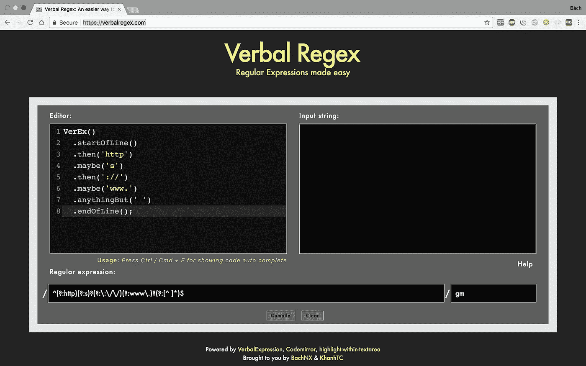

# verb lex expressions—正则表达式变得简单

> 原文：<https://medium.com/hackernoon/verbalexpressions-regularexpression-made-easy-c5750ae224e0>

当你开始学习一门新的编程语言时，也许你一直在按照这些步骤学习:变量、赋值、字符串、运算符……你需要关注的一个主要主题是`string operations`。Fox 示例:从全名中获取名字，查找并审查消息中的所有手机号码，…

在操作过程中，我们通常需要处理一些常见的程序。一个重复的过程是找到一个子串并对子串执行一些操作。也许你在学习之初就做过类似这样的事情。

```
**int** **checkMatchStubPattern**(**char*** string) {
    **for**(**int** i = 0; i < strlen(string); i++) {
        // logic for checking string pattern
        ...
    }
    **return** ...
}
```

不是错误的方法，而是费时。您必须在每种情况下更改检查逻辑。更多的代码，更多的错误，当然更难维护。幸运的是，`Regular Expression - Regex`成了解决这类问题的英雄:查找、输入验证……作为对`Regex`用法的确认，每种编程语言都支持字符串操作的`Regex`。

> 正则表达式是定义搜索模式的字符序列。然后，字符串搜索算法使用这种模式对字符串进行“查找”或“查找和替换”操作，或者进行输入验证。(来源:维基百科)

`Regex`是解决问题的有效工具；但这是有代价的。阅读和理解真的很难(但是*不难学*)。首先试着阅读下面的例子。



Regex for checking whether a string is a valid url or not

由于复杂的语法，阅读和理解`Regex`非常困难。此外，你似乎不经常和`Regex`一起工作。ROI(投资回报率)太低；你需要使用的几乎常见的`Regex`都可以在网上找到(密码，网址，IP 地址，…)。你愿意花几个星期去学习一年只用 4 到 5 次的东西吗？或者只是浏览一些网站，在大约 5 分钟内得到结果？这种思维方式使得开发者倾向于谷歌一些`Regex`并修改以适应他们的需求。有时搜索-修改的重复过程会花费几个小时到一整天的时间…



In every angel a demon hides…

`Regex`解决`string operation`问题；但是`Regex`的问题呢？还好可以用`[Verbal Expressions](http://verbalexpressions.github.io/)`解决。试着看看这个例子。

```
VerEx()
.startOfLine()
.then('http')
.maybe('s')
.then('://')
.anythingBut(' ')
.endOfLine();
```

希望你看完这个例子不要灰心丧气。上面的`Verbal Expressions`是按照这个规则定义的:

*   URL 必须以“http”或“https”开头。
*   然后，URL 必须有“://”。
*   只要不是空格，URL 的“://”后面可以有任何内容。

从上面的代码生成的`Regex`是:`/^(?:http)(?:s)?(?:\:\/\/)(?:[^ ]*)$/`。有点不同，但功能是一样的。你可以在这里找到`Verbal Expressions`几种语言的实现[。](http://verbalexpressions.github.io/)

言语表达解决了`Regex`最大的问题。它是易读易懂的正则表达式。在我看来，从`Regex`到`VerbalExpressions`的转变就像从`SQL`到`ORM`的运动一样伟大。

不管怎样，`VerbalExpressions`还是有一些缺点的。你需要给你的项目安装一个新的库，有时这是很痛苦的(例如，你的客户，经理…认为这是不必要的)。那样的话，你可以去[verbal regex](https://verbalregex.com/)；编写代码，它将为您生成`Regex`。



Online tool for generating Regex

通过访问[verbalregex.com](https://verbalregex.com/)来试试这个工具。

# 结论

`VerbalExpressions`不是`Regex`的替代品；但是一个简单的方法来写可读的`Regex`。可以缓解`Regex`的痛苦，实际上又让写表情变得有趣了。但是请记住，在一些复杂的情况下，`Regex`似乎仍然是最佳选择。