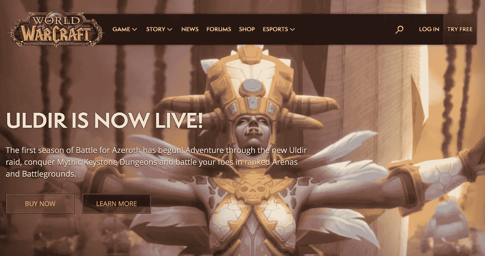
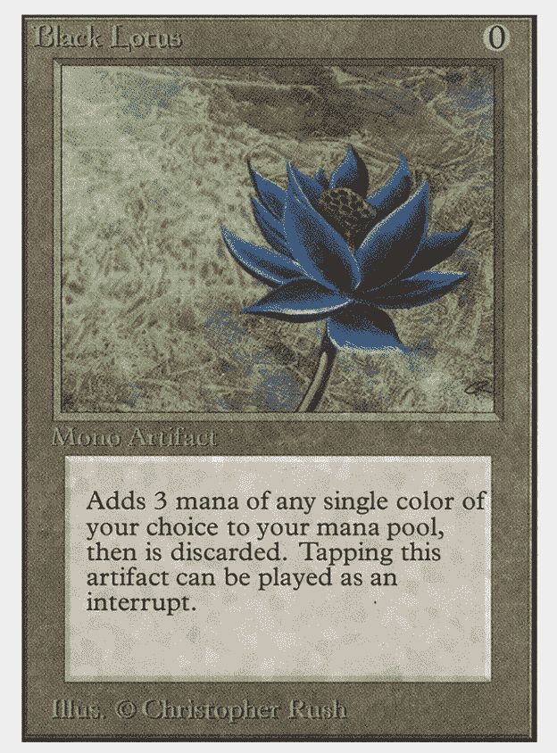
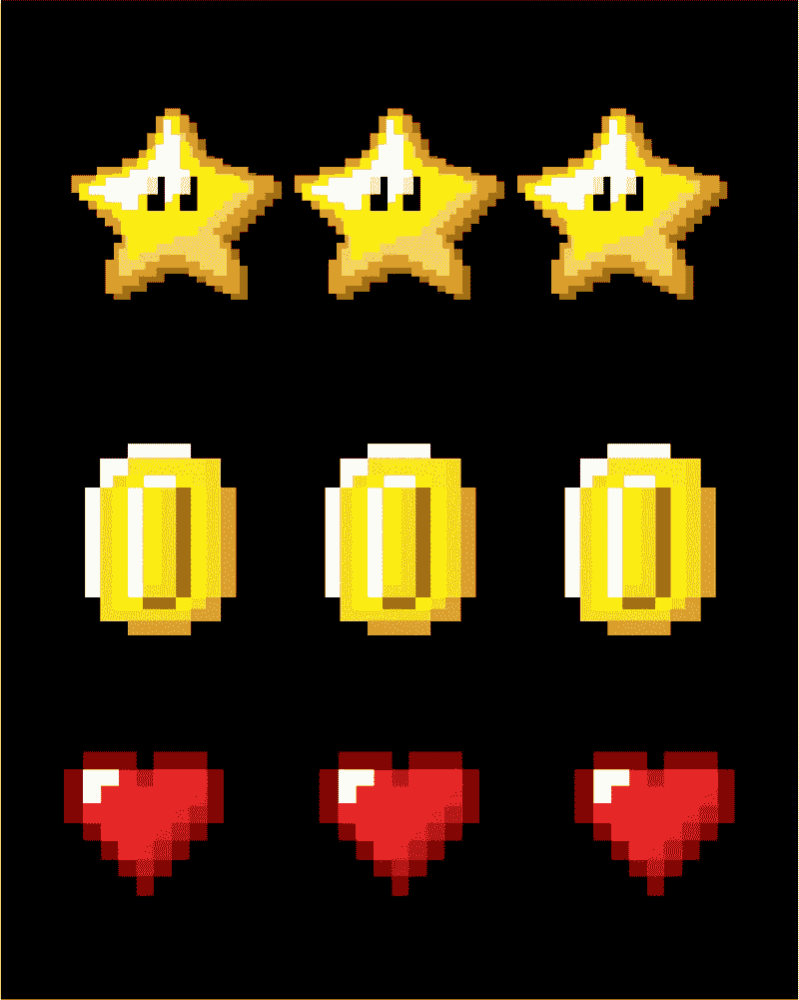
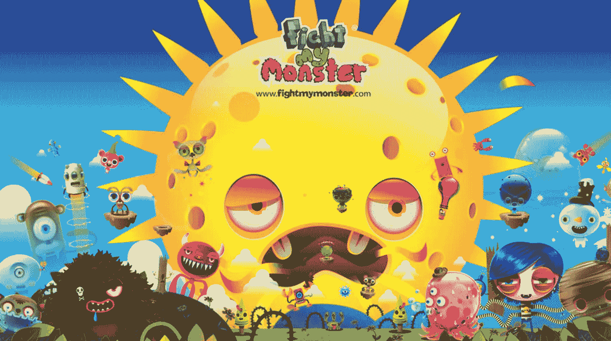
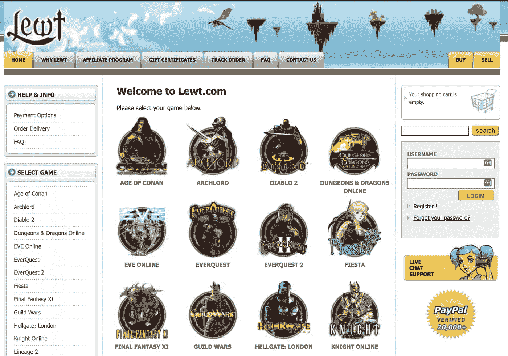

# 视频游戏和加密货币:完美的婚姻

> 原文：<https://medium.com/hackernoon/video-games-and-cryptocurrencies-a-perfect-marriage-ce91d7ab738f>

我的职业生涯始于为 Apple II 开发软件，这是一款先于苹果旗舰产品 Macintosh 的电脑。1991 年，我很幸运地和我的商业伙伴一起收购了 Activision。我们把它重建成了今天世界上最大的视频游戏公司。这是一个漫长的旅程，我亲眼目睹了视频游戏产业是如何发展的。

## **游戏经济的演变**

Gamers enjoying the first video game ever made: Pong

最初，电子游戏只是简单的单人或双人游戏。每个人都记得雅达利游戏机上的 Pong，其中两个带桨的玩家可以离线玩几个小时。接下来是引入分屏的赛车游戏，在这种游戏中，电视屏幕被分成两个不同的图像，每个玩家在游戏中都有自己的观点。你还记得 1987 年的试驾吗？

随着视频游戏的发展和变得越来越复杂，游戏中的经济也是如此。角色扮演游戏，或称 RPG，是第一个开始使用复杂经济在游戏中创造真正深度和复杂性的游戏。Ultima 作为一款突破性游戏出现在我的脑海中，它的世界帮助数百万人了解了虚拟经济。在游戏中，为了生存和完成游戏，玩家必须使用数字货币来购买武器、魔法和食物。

随着游戏机的发展，运行游戏的个人电脑也在发展，拥有更快的处理器和显卡。一旦互联网变得足够快，可以运行在线游戏，你会看到像 Everquest 和魔兽世界这样的游戏招募了数百万独立玩家，他们每月支付费用，游戏时间不限。事实上，无限的游戏时间导致了游戏成瘾的问题，这在《魔兽世界 3》的背景下已经被[很好地记录下来了。](https://www.theverge.com/2014/9/26/6849317/if-world-of-warcraft-is-a-drug-blizzard-is-a-cruel-drug-dealer)

A screenshot of some creature or other from worldofwarcraft.com.

公会的形成是因为全球的玩家联合起来为一个共同的部落和游戏中的共同目标服务。这种数字经济不再只是玩家与游戏中产生的 NPC(非玩家角色)互动。这是一个由玩家*和*玩家*组成的数字经济。结果，这个游戏经济对玩家来说是真实的，所以他们赋予了它真实的价值。玩家开始使用 Paypal 与他们的朋友离线交易黄金，以查看这种游戏中的货币，这种数字黄金，被转换成真实的货币。*

游戏中黄金和稀有物品的二级销售市场，如一件独特的盔甲或一把威力无比的剑，大受欢迎。这导致了围绕这些数字产品市场建立的公司的诞生，比如由ƀrock·皮尔斯创立的互联网游戏娱乐公司。

布洛克看到了任何游戏内货币或物品的二级市场的潜力。如果人们愿意花几个小时用模拟人生来模拟真实生活，为什么他们不把虚拟的数字商品和货币赋予真实的价值呢？稀有孕育价值，所以他建立了一个收集游戏中稀有物品的生意，并在二级市场上出售。

The most expensive Magic the Gathering card on the market.

我不得不承认，最初美国游戏发行商不知道这将会存在。毕竟，自 1993 年游戏推出以来，交易魔术《收集卡片》就存在于现实世界中，这些交易揭示了消费者行为和人们愿意在游戏中投入的资金，令人瞠目结舌。例如，万智牌[罕见的黑莲卡在二级市场上的交易价格高达 2 万美元](https://www.completeset.com/the-10-rarest-magic-the-gathering-cards/)。

当然，在 90 年代，单张卡片的价值要低一些，但即使在那个时候，这些卡片的价值也是显而易见的。人们愿意为这些卡片支付比它们最初的售价更高的价格。*远*更。但是当时没有人想到同样的逻辑会适用于数字游戏。这是一个真正的新事物，直到 21 世纪初才被人们所理解。

然而，这些场外交易违反了几乎所有交易物品的游戏的服务条款。游戏发行商进行了反击，禁止任何明显表明玩家通过购买黄金或购买游戏中的数字物品来“作弊”的账户。

回想起来，当你考虑到游戏内购买推动了今天的移动游戏产业，并且像 EA 的 Battlefront 这样的大型特许经营已经被围绕游戏内购买的赌博争议所控制时，游戏发行商在购买方面存在这样的问题是具有讽刺意味的。

游戏行业当时应该更加关注这些游戏外的购买吗？我猜发行商正忙于玩一个猫捉老鼠的游戏，追踪那些违反他们游戏诚信的用户，他们从来没有意识到这种玩家行为是一个巨大的隐藏机会。

## 从视频游戏到密码

Coins, powerups, items. People were willing to pay a lot of real money for them. A few savvy entrepreneurs realized that potential and capitalized on it.

如果你仔细观察，你会发现许多加密货币的最大玩家来自视频游戏世界。前文提到的 IGE 创始人布洛克·皮尔斯(Brock Pierce)早在 2010 年就是比特币的早期使用者。他后来创立了 DNA，Blockchain Capital，并担任 Block.one 及其区块链 EOS 的联合创始人或顾问。如果你看看加密公司的顾问委员会，你几乎可以在任何地方找到布洛克的名字。布洛克的净资产[可能高达 1B](https://www.forbes.com/richest-in-cryptocurrency/#6acb69901d49) 美元，而且他从一开始就积极参与社区活动。

在 2018 年 7 月[接受滚石](https://www.rollingstone.com/culture/culture-features/brock-pierce-hippie-king-of-cryptocurrency-700213/)采访时，布洛克再次展示了他与视频游戏根源的联系，他通过视频游戏的镜头描述了为什么他对加密世界的事情说是的:“宇宙不断向你扔更多的硬币和能量，如果你继续收集它们，你会得到更多的积分，你的级别也会上升。”

有趣的是，布洛克并不是区块链世界中唯一一个来自电子游戏世界的企业家。

[以太坊的创始人维塔利克·布特林](https://medium.com/u/587a00dbce51?source=post_page-----ce91d7ab738f--------------------------------)将他对建造以太坊的兴趣归功于自己，因为作为一名《魔兽世界》玩家，他痛恨发行商暴雪在没有任何社区参与的情况下改变游戏统计数据的方式。在维塔利克的 About.me 页面上写道:“我在 2007-2010 年间愉快地玩着魔兽世界，但是有一天暴雪移除了我心爱的术士的虹吸生命法术的伤害部分。我哭着睡着了，那天我才意识到集中服务会带来什么样的恐怖。”

相反，Vitalik 认为游戏社区应该对游戏的发展有发言权。不久后，他退出了《魔兽世界》,随着他对社区驱动项目的想法的发展，他发现了比特币。从那里，他梦想出以太坊。

最近进入区块链领域的是成立于 2014 年的 Dfinity 项目。虽然比特币和以太坊等项目是由“代码就是法律”这一口号决定的，但 Dfinity 信奉“[人工智能就是法律](/dfinity/dfinity-in-a-nutshell-a-non-technical-introduction-ec45ec5967c1)”，这意味着该协议有一个额外的算法治理层，应该使其更加安全，冻结网络中更多的不良行为者，并提供区块链项目目前缺乏的其他好处。与以太坊类似，Dfinity 希望成为一个软件和硬件基础设施提供商，供企业家和公司构建去中心化的应用程序。

A screenshot taken from the Change.org petition to revive the game.

关于这个项目有趣的是 [Dominic Williams](https://medium.com/u/68056732c09d?source=post_page-----ce91d7ab738f--------------------------------) ，Dfinity 的创始人兼首席执行官，来自视频游戏行业。他创造了一款非常成功的大型多人游戏，名为《与我的怪物战斗》。

在某种程度上，这款游戏是最成功的儿童网络游戏之一，这种狂热将该公司推上了排行榜的首位。这款游戏也卖出了很多商品。然而，尽管它取得了成功，但“与我战斗的怪物”现在已经停播，尽管有一个[积极请愿](https://www.change.org/p/fight-my-bring-fight-my-monster-back)恢复它。

游戏业务正受到冲击，陷入困境。这不再是一个容易实现盈利的行业——并不是说它曾经很容易，但对于企业家来说，它肯定比今天的情况更现实。多米尼克向前看了。他对大型在线社区的兴趣，以及他在构建软件以支持数百万用户方面的技术专长，让他适应了更大更好的东西:区块链。多米尼克现在利用他在计算机科学方面的深厚背景，发明了一种为企业提供计算服务的新方法。

A screenshot taken from Lewt’s website, via Web Archive

北海巨妖交易所的联合创始人兼首席执行官 Jesse Powell 也是从电子游戏起家的。2001 年，杰西创办了一家名为 Lewt 的公司。像布洛克的 IGE 一样，卢顿是游戏中物品的二级市场:独特的符文、盔甲、药剂和其他游戏中有价值的物品。2003 年，Jesse 从大学退学，全职经营 Lewt，他和 Brock 一样，明白这些数字资产有着不可思议的巨大潜力。

杰西于 2011 年共同创立了北海巨妖，后来他承认自己对电子游戏货币的兴趣是让他发现比特币的关键。如果没有早期对数字货币的接触和兴趣，他可能不会注意到加密货币。

当你开始追踪这种联系时，很明显视频游戏和加密货币是交织在一起的，非常适合彼此。如今，许多创建区块链最大公司的企业家都是从电子游戏和数字货币领域起步的。回想起来，也许这并不奇怪。

StartEngine 是一个领先的股权众筹平台，已经帮助 250 多家公司筹集了超过 8000 万美元。我们目前也在筹集资金。加入已经投资我们的近 3500 名 StartEngine 所有者。 [*这里投资 start engine*](https://www.startengine.com/own?utm_source=Medium)*。*

*欲了解更多信息，请查看我们的* [*发行通告*](https://www.sec.gov/Archives/edgar/data/1661779/000114420419013344/tv515967_253g2.htm) *。*