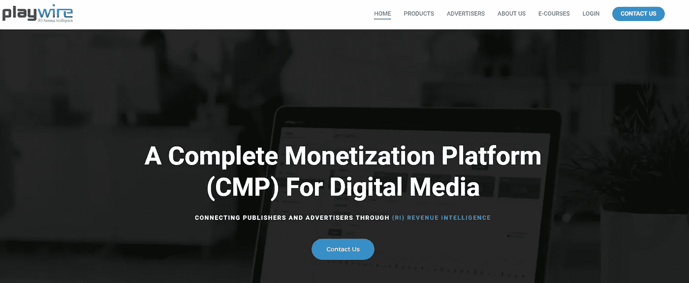

# 视频平台:点击一下就能实现业务增长

> 原文：<https://medium.com/hackernoon/video-platforms-business-growth-thats-one-click-away-3daa050839c8>

Source: pixabay.com

在一个充斥着视频的繁忙的在线市场，想要产生影响越来越难。关于内容趋势的最新 BuzzSumo 研究报告显示，内容出版总体上继续增长，这导致了巨大的饱和。然而，在这个广阔的市场上留下自己的印记仍然是可能的。当然，你必须首先采取必要的步骤。

有趣的是，视频行业正在发生多大的变化。例如，视频平台领域正在改变其路线，从为赚钱巨头(YouTube、脸书等)提供替代选择，转变为让我们将一切我们能做的事情货币化。

我很幸运能从事这个行业(是啊，运气)。我想我应该分享一些想法。我敢肯定，这将是一个有趣的阅读任何市场商人/企业谁正在寻找一种方法，使视频的一部分，他们的营销策略，并赚取美元。

# 互联网是你最强大的盟友

这听起来像是老生常谈，但却是事实。到 2018 年，全球人口的一半，也就是大约 36 亿人，将会使用互联网( [Dazeinfo](https://dazeinfo.com/2014/11/26/india-overtake-us-second-largest-internet-user-base-2015-half-world-internet-access-2018-emarketer/) )。其中的一些主要原因是更便宜的 Android 手机和容易获得的 Wi-fi。

另一个重要的转变是，人们正在转向移动，越来越多的广告收入也随之而来。这创造了 70 亿美元的移动广告机会。除此之外，平台提供安全的内容来托管这些广告，这就是为什么现在是加入视频潮流的最佳时机。此外，必须指出的是，50%的互联网用户在逛商店之前会寻找与产品相关的视频([thinkwithgeeg](https://www.thinkwithgoogle.com/data-gallery/detail/internet-users-product-service-videos/))。

日常使用量(总体而言)再次大幅增长。脸书等社交网站的收入也在增长，2016 年 12 月[移动日活跃用户达到 11.5 亿](https://zephoria.com/top-15-valuable-facebook-statistics/)(移动 DAU)。

但是，我们不要太拘泥于统计数据。

# 入门需要什么？

涉足视频行业已经意味着你的思路是正确的。毫无疑问，视频营销和视频广告在帮助公司销售其品牌、产品和/或服务方面扮演着重要的角色。

当你有了高质量的视频内容，比如在 YouTube 上，对许多人来说，下一步就是赚钱。但一个潜在的问题是，谷歌经常对平台做出重大改变，并倾向于改变针对某些内容的政策，这很容易对渠道和广告收入产生负面影响。

我不是说你应该放弃 YouTube。然而，为了实现你的视频优先战略，你应该更加关注拥有一个可靠的视频播放器，它拥有现代 HTML5 视频播放器的所有必要元素。这是在所有主要移动和桌面平台上随时随地交付视频并从您制作的视频中赚取收入的最快和最简单的方式。

# 选择合适的企业级视频平台/播放器

在搜索原生视频平台时，您需要考虑视频内容，这可以包括从产品演示视频、帮助/培训视频或网络研讨会录像、点播视频、主持直播活动等一切内容。你还应该关注可访问性、安全性，最后但同样重要的是价格(当然，取决于你的预算)。

如果你正在寻找一个合适的 HTML5 视频播放器或视频平台，诚实地说，这取决于你来决定哪一个适合你的业务需求(和预算)。以下是你最好和最安全的赌注:

# [布莱特科夫](https://www.brightcove.com/)

**企业。**从视频云到 Brightcove Enterprise Video Suite，这是您寻找企业级视频平台并且有预算的最佳选择。不管你的业务是否涉及广播、出版、营销或企业通信，这都是一个很好的选择。

**值得一提的附加功能:** [Brightcove Lift](https://go.brightcove.com/lift) 一款广告拦截解决方案。是的，你会在某个时候需要它。

# [Video.js](https://videojs.com/)

**免费。** Video.js 是一个围绕原生视频元素的可扩展框架/库。它提供了一个插件 API，因此不同类型的视频可以传递给本地视频元素(HLS、Flash、HTML5 视频等)。它还具有可扩展和可主题化的用户界面，键盘和屏幕阅读器用户的可访问性，并有附加视频格式的插件。请记住，免费是有代价的，如果你是一个精通技术的船员，这不应该是一个问题，因为这是将你的技能投入工作的最佳框架。

# [BridTV](https://www.brid.tv/)

**两全其美。**当您在寻找 YouTube 等服务之外的视频盈利方式时，您需要的解决方案。与 YouTube 不同，这个平台提供了一个更加可控的环境，在这里你可以最大化你的收入，而不用担心内容政策的变化。它非常适合视频托管(附带价格标签)和发布解决方案，有足够的开发工具(免费)来定制您喜欢的平台和播放器。

**值得一提的附加功能:**adblock 恢复和[白色标签 SSP](https://whitelabel.brid.tv) 全新功能我不太清楚它是怎么回事。这项服务似乎很有前景，有潜力成为游戏规则的改变者。

# [JW 播放器](https://www.jwplayer.com/)

**两全其美。**JW 平台允许您大规模托管和流式传输视频。它确实是最受欢迎的 HTML5 视频播放器/平台之一。这是一个开源的在线视频平台，也是另一个安全可靠的选择。该平台还提供视频托管和流媒体、广告和分析功能(大多数都是如此)。

**值得一提的其他功能:** [JW 推荐](https://www.jwplayer.com/blog/jw-recommendations-2-0/)一种自动化解决方案，可将出版商图书馆中与上下文相关的内容大规模呈现给受众。

# [割草玩家](https://mowplayer.com/)

**免费。与同样免费的 Video.js 不同，MOW Player 实际上免费提供完整的企业视频平台体验。因此，你不仅可以使用他们顶级的 HTML5 视频播放器，还可以免费管理和货币化你的视频内容。有什么条件？嗯，他们会用自己的视频广告头部竞价技术给你牵线搭桥，和你分享利润。**

值得一提的附加功能:你可以通过从你的文章中创建视频来丰富你的内容。

# [游戏线](https://www.playwire.com/)

有了 Playwire，你已经离数字货币化更近了一步。它提供了各种值得称赞的广告解决方案。这是一家以出版商为中心的公司，Playwire Media 以出版商为中心。

**值得一提的附加功能:** [Trendi 视频小工具](https://www.playwire.com/trendi-video/)高级视频内容选项。

那现在怎么办？

# 通过引人入胜的视频将临时观众转化为客户

作为出版商，确保广告收入和稳定投资回报率的唯一方法是与受众建立稳固的联系。仔细想想，整件事归结起来就是常识。

> 你的每一个商业举动都取决于你如何将普通观众转化为顾客

为了推动转化，你可以采用多种策略。其中最重要的一点是，通过为视频创造合适的节奏，在最初几秒钟内吸引观众。

事实证明，这种策略不仅对视频内容创作者有价值，对渴望看到自己品牌成长的出版商和企业主也有价值。随着品牌的成长，广告收入也会增加，这是依靠视频取得成功的另一个重要步骤。

现在，利润…

# 基于视频广告的业务的优先级

视频广告，无论是流内还是流外，都是当今最有效的收入来源之一。可在任何屏幕或设备上观看的 Outstream 广告单元是一种创新的格式，将视频广告置于编辑内容的正中间。最重要的是，这种格式在屏幕上显示时启动，当低于 50%可见时暂停，最重要的是，一旦视图完成，它会无缝地合并到页面中。

请记住，另一方面，instream 是一个相当标准的系统，它表示视频的前置、中间或后置广告位置。尽管它容易受到广告拦截器的攻击，但 instream 是一个非常可靠的视频广告投放系统。这也是最有效的方法之一，因为它很容易进入消费者视频内容的思维模式。流内广告形式通常分为**伴随广告**、**线性视频广告**和**非线性视频广告**。

尽管如此，你仍然可以坚持 outstream，它出现在非视频环境中，比如基于文本的编辑内容、社交提要等。当用户向下滚动并且内容打开时，触发流出视频。诚然，outstream 对视频来说是一个相对新鲜的概念，尽管它拥有坚实的优势，允许你的广告出现在任何地方和任何地方。

这可能会是一段颠簸的旅程…

# 消除障碍，增加广告收入

不得不说，大多数依赖视频的在线企业在预测广告收入方面存在巨大问题，因为他们认为广告屏蔽是一个主要障碍。围绕这一点，你最好的赌注是获得一种可靠的专有广告去屏蔽技术(很像已经提到的 **Brightcove Lift** 或 **AdIQ** )，它可以帮助小企业和大企业对他们的视频广告内容在桌面或移动设备上都能看到充满信心。

# 充分利用您已经拥有的功能

对于视频来说，要记住的最重要的事情之一是充分利用已经可用的功能。也有一些方法可以提高用户参与度。你要做的就是把事情简单化。例如，在视频描述文本中使用缩短的网址可以引导人们去品牌网站获取信息或者购买。该 URL 还可以将潜在客户引导至您企业的 app store 登录页面，在那里他们可以下载您的应用。将这些链接放在视频描述的开头是一个好主意，这样它们就可以在之前看到。

第二，直播不是未来，而是“现在”,所以也要保持关注。直播仍然是与观众联系和互动的最佳方式之一。

尽管内容明显饱和，热门话题/帖子的社交分享减少，但视频绝对是营销人员接触和吸引受众的最佳选择。拥有一个坚实的技术将帮助你找到你独特的声音，这种声音为你的观众提供价值，这反过来又是你与众不同的地方。

## 如果你喜欢这个故事，请点击👏按钮，在[中](/@blockguyeddie)、[推特](https://twitter.com/blockguyeddie)、[脸书](https://www.facebook.com/groups/179414492752527/)关注我，分享出来帮助别人找到！

## 我错过了什么吗？让我知道。在下面的评论区分享你的想法。