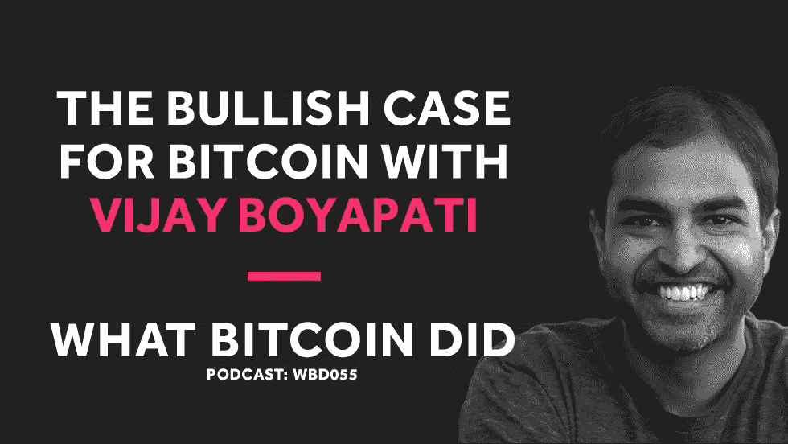

# 维杰·博雅帕蒂看好比特币

> 原文：<https://medium.com/hackernoon/vijay-boyapatis-bullish-case-for-bitcoin-e274eda46bbc>

## 音频采访转录— WBD055

***注:*** *以下是我采访《看涨比特币的理由》一书作者维杰·博雅帕蒂的文字记录。我从翻译中使用 Rev.com，他们删除了嗯，错误和半句。我已经检查了转录，但如果您发现任何错误，请随时发送* [*邮件给我*](http://hello@whatbitcoindid.com) *。可以* [*在这里*](https://www.whatbitcoindid.com/podcast/vijay-boyapatis-bullish-case-for-bitcoin) *听原声录音。*

*你可以在这里订阅播客* [*听所有剧集*](https://www.whatbitcoindid.com/podcast/) *。*

在这一集里，我和《看好比特币》一书的作者 Vijay Boyapati 进行了对话。我们讨论了这篇文章的背景，货币的起源，良好的价值储存的属性，货币的演变和比特币的误解和风险。

联系比特币做了什么:
听:[**iTunes**](https://itunes.apple.com/gb/podcast/what-bitcoin-did-podcast-bitcoin-crypto-trading-strategy/id1317356120?mt=2)|[**Spotify**](https://open.spotify.com/show/0mWUJuONiilW5JSBBFZ0s7?si=5qcbjpjYSRyKpi8wycEZUw)|[**Stitcher**](https://www.stitcher.com/podcast/what-bitcoin-did)|[**SoundCloud**|](https://soundcloud.com/what-bitcoin-did)[**YouTube**](https://www.youtube.com/whatbitcoindid)|[**TuneIn**](https://tunein.com/radio/What-Bitcoin-Did-p1079869/)关注: [**网站**](https://www.whatbitcoindid.com/)

# **采访记录**

**面试日期:2018 年 12 月 4 日星期二**

> **“比特币就像黄金一样，但有一种神奇的能力，你可以传送它。”**
> 
> **—维杰·博雅帕蒂**

**彼得·麦科马克 **:** 晚上好，维杰。嗯，这里是晚上。我总是对人们说这句话，但现在对你来说可能是一个不同的时代。**

**[**维杰博雅帕蒂**](https://twitter.com/real_vijay) **:** 没错。西雅图现在是中午。**

**[**彼得·麦科马克**](https://twitter.com/PeterMcCormack) **:** 对。好吧。好吧，听着。我们有很多事要做。你的文章，比特币的看涨案例，我想我已经读了三遍了。当我第一次看到它时，我读了两遍，因为我好像读了一遍，我想我必须再做一遍，显然我为了这次采访又重读了一遍。除此之外，我花了很长时间才找到你的一些作品。直到那时，我去了……对不起，米塞斯研究所工作。我看过你的一些其他作品，但那是你第一篇关于媒体的大型加密文章，对吗？**

**[**维杰博雅帕蒂**](https://twitter.com/real_vijay) **:** 没错。在那之前，我真的没有写过任何关于比特币的东西。我在 2014 年做过一次采访，在采访中讨论了我在文章中谈到的大多数观点，但我没有写任何东西。没错。**

**[**Peter McCormack**](https://twitter.com/PeterMcCormack)**:**我们将继续讨论这个话题，因为我认为这是一个很好的话题，有很多问题要问，但在此之前，我想问几个问题。好吧，第一个很简单。为什么比特币适合你？**

**[**维杰博雅帕蒂**](https://twitter.com/real_vijay) **:** 哇。那是一个非常深奥的主题。因此，我在 2011 年对比特币产生了兴趣，作为一名奥地利经济学的学生，我立即明白了这是一种货币现象，因此我发现它绝对令人着迷。这东西怎么会有价值呢？它就这样凭空出现了。很长一段时间以来，我一直是一个黄金迷，实际上，我将告诉你一个我从未告诉过任何人的故事。**

**[**Vijay Boyapati**](https://twitter.com/real_vijay)**:**小时候，妈妈得了脑瘤，病得很重，爸爸很担心她。我和我姐姐在澳大利亚出生并长大，但我父母出生在印度，我爸爸有点慌了。一想到他可能不得不在没有伴侣的情况下在澳大利亚抚养和照顾两个青春期的孩子，他真的很害怕，他有一段时间决定要带我们回印度，我们会为他回印度。当时，向印度汇款并不容易。银行系统糟糕透顶，摇摇欲坠。**

**[**维杰博雅帕蒂**](https://twitter.com/real_vijay) **:** 一家银行可以有多家分行，你不能在一家银行自己的分行之间转账。所以他很难把钱转移到印度，所以他卖掉了他在澳大利亚的一些资产，把它们变成了黄金。我清楚地记得小时候和我爸爸一起乘飞机去印度，他提着一袋袋的黄金，他害怕自己的财富被任何人在任何时候抢走，他会失去所有的财富。**

**[**Vijay Boyapati**](https://twitter.com/real_vijay)**:**所以当我碰到比特币时，我立刻明白了它的价值主张，以及它为什么如此独特和特别。这是数字黄金，除了它很容易转移到地球上任何地方的任何人，在某种程度上，它就像黄金，除了你可以传送它的神奇能力。所以我立刻产生了兴趣。**

**[**Vijay Boyapati**](https://twitter.com/real_vijay)**:**告诉你另一个故事，我在 2011 年得到的第一个比特币是因为我和一个朋友打了一个赌。**

**[**彼得·麦科马克**](https://twitter.com/PeterMcCormack):我听说过这个。**

**[**维杰博雅帕蒂**](https://twitter.com/real_vijay) **:** 耶。这是一个…**

**彼得·麦科马克 **:** 所以根据 12 月份的价格，他给了你 10 万美元？**

**[**维杰博雅帕蒂**](https://twitter.com/real_vijay) **:** 对，他给了我很多钱。所以这个故事有点意思。他赌输了，赌的是一只银鹰，当时价值 50 美元，我的朋友在 2010 年开始对比特币感兴趣，他说，“听着，不要拿银币。如果你想要，我可以给你，但让我给你比特币。”我不知道他在说什么。他说，“看，这是一项惊人的新技术。这是一种新的货币形式。”我真的很信任这个人，他很聪明，给我介绍了很多东西。我认识的最好的投资者之一。所以我说，“好吧，好吧。我要了。”他说，“嗯，你必须下载这个软件。”我就想，“这到底是什么？”我下载了核心软件，并开始下载区块链，花了好几个小时，这是一个非常小的笔记本电脑，我在上面做这个。我就想，“这到底是怎么回事？为什么我必须下载千兆字节和千兆字节的数据才能接收这个东西。”**

**[**Vijay Boyapati**](https://twitter.com/real_vijay)**:**他把它发给了我，并在一个非常原始的 block explorer 上向我展示了他发给我的比特币。它只是一串数字和字母。我当时想，“我不知道这是什么。好吧。”所以他给了我。所以，不幸的是，这是五个比特币，不幸的是，这些比特币在我前女友的笔记本电脑上，当时它们并不太值钱，可能值 70 美元，所以我没多想。2017 年期间，随着比特币价格的上涨，我想，“哦，天哪，我应该联系她吗？我应该说那台笔记本电脑有价值 2 万美元的比特币吗？”哦，该死，5 万美元，10 万美元。最后，我给她发了电子邮件，她告诉我，不幸的是，它在明尼苏达州的一家酒店丢失了。这些比特币已经永远消失了，这五个比特币你可以在区块链上看到。自从给了我，它们就没动过。我就是这样进入比特币的。**

**[**彼得·麦科马克**](https://twitter.com/PeterMcCormack) **:** 我曾经有过几百枚莱特币，但一文不值。我把它们放在钱包里，我以前工作的地方也有密码，只是想都没想，就像我和我哥哥花这么少的钱买它们，然后去年当它们涨到几百时，我就想，“哦，不。”我到处找密码，从来没找到。我认为只有大约 400 万比特币丢失。**

**[**维杰博雅帕蒂**](https://twitter.com/real_vijay) **:** 没错，耶。我认为这是因为早期的人们并不真正理解它是什么。许多人认为它是一种交换媒介，这是它的主要价值主张，所以他们认为，“好吧，我会得到一些，我会用它来购买羊驼袜子或杂草或网上的东西。”但是我真的不在乎我有多少钱，因为它是一种交换媒介，就像美元一样。我不明白它真的更接近黄金，除了它比黄金更稀缺。所以如果这个东西真的被采用了，它会很值钱。**

**[**Vijay Boyapati**](https://twitter.com/real_vijay)**:**人们不太重视安全性，所以你会听到有人说他们的硬盘上有 1 万个比特币，他们把电脑扔了，然后他们最终去垃圾场，试图挖出硬盘，这样他们就可以拿回自己的私钥。我认为这种情况现在已经很少发生了，因为人们了解它是什么，并且更加意识到保护他们的密钥的重要性，并且像处理数字黄金一样处理它。**

**[**彼得·麦科马克**](https://twitter.com/PeterMcCormack) **:** 对。所以我们将把你的文章分成四个部分。我们将分四个部分来做。**

**[**Vijay Boyapati**](https://twitter.com/real_vijay)**:**它最初是分四部上映的。**

**[**彼得·麦科马克**](https://twitter.com/PeterMcCormack) **:** 是啊，是啊。我将把它分成四个部分，因为我认为这是分割要点的好方法。我们将开始第一部分，货币的起源。所以 2008 年，聪放下了一份白皮书。告诉我它的独特之处。它解决了什么？**

**[**Vijay Boyapati**](https://twitter.com/real_vijay)**:**它解决了计算机科学中被称为拜占庭将军问题的难题，这是一个很多人都认为没有解决方案的问题。他提出了一个系统，使用他所谓的区块链来解决这个问题，这个系统的第一个应用是基于他对拜占庭将军问题的解决方案创建一种新的数字好比特币。这是一项意义深远的重大创新，不仅在经济学上，因为它改变了我们对金钱的理解，也改变了我们对金钱可以凭空产生的理解。这也是计算机科学上一项意义深远的重大创新。在我的文章中，我说他应该是第一个有资格同时获得诺贝尔经济学奖和图灵奖的人，图灵奖相当于计算机科学中的奖项。我想说的是，我文章中的一个错误是。实际上有一个人赢得了两项冠军，我当时并不知道，但还有另外一个人。**

**[**彼得·麦科马克**](https://twitter.com/PeterMcCormack) **:** 那是谁？**

**[**Vijay Boyapati**](https://twitter.com/real_vijay)**:**希尔伯特·西蒙，他是一位经济学家，对计算机科学也做出了一些惊人的贡献。**

**[**彼得·麦科马克**](https://twitter.com/PeterMcCormack) **:** 对，好的。所以，你认为 Satoshi 最终，让我们从一个开始，诺贝尔奖。你认为那会发生吗？**

**[**Vijay Boyapati**](https://twitter.com/real_vijay)**:**我觉得他当之无愧，绝对我觉得这是一千年来对金钱最重要的创新。我不认为这会不幸地发生，因为诺贝尔奖委员会…我不认为他们会把它颁给一个匿名的人，总的来说，我不认为他们对比特币所基于的那种经济学是友好的，所以可能性更小。我认为，他们只把一个诺贝尔奖颁给了一个有资格成为奥地利经济学家的人，所以我认为这不太可能发生，很遗憾。**

**[**彼得·麦科马克**](https://twitter.com/PeterMcCormack) **:** 好吧。所以比特币下跌。该协议最重要的设计特征是什么？**

**[**维杰·博雅帕蒂**](https://twitter.com/real_vijay) **:** 我认为这是点对点的自然分布，很难审查和阻止。Satoshi 早些时候写道，他有点模仿文件共享系统 BitTorrent，他评论说，许多这样的文件共享系统，像 Napster 这样的集中式系统，很容易关闭。但 BitTorrent 仍然很强大，人们在 BitTorrent 上传输文件，所以他模仿这种设计，并分发对等网络，这使得政府很难说这需要停止，我们将取缔它，网络关闭。**

**[**Vijay Boyapati**](https://twitter.com/real_vijay)**:**我认为另一件非常重要的事情是它的货币政策，这是一种严格固定的供给。永远不会超过 2100 万个比特币。因此，比特币是有史以来最炙手可热的货币，甚至连我们认为供应有限的黄金也和比特币一样炙手可热。每年开采的黄金越来越多。如果黄金价格上涨，将会释放出大量我们从未想过的供给。人们会以足够高的价格开始开采海底和小行星，以及诸如此类的东西。对于比特币来说，无论价格多高，都不会超过 2100 万。这是我们从未见过的。我们从来没有见过一种货币商品，在那种情况下是纯粹的通货紧缩。**

**[**彼得·麦科马克**](https://twitter.com/PeterMcCormack) **:** 有意思的是，我上周采访了那些咧嘴笑的家伙，他们今天发表了这些言论，他们反对通货紧缩。他们不相信它。**

**[**维杰博雅帕蒂**](https://twitter.com/real_vijay) **:** 耶。这是一种意识形态观点和经济观点。如果你相信奥地利学派，那么你就会明白，更多的钱并不意味着更多的财富。更多的财富意味着更多的商品和服务，更多的工厂，更多的食物，这就是更多财富的含义。创造更多的钱，创造更多的纸票并不能创造更多的财富，事实上，它阻碍了我们创造财富的能力，因为它确实影响了价格信号。价格信号是经济学中最重要的事情之一，它允许企业家找出需求在哪里，供应状态，以及如何将这些东西匹配在一起以创造新的财富。我认为通货膨胀的货币是非常有害的，它们也与政府的支出能力有关。政府喜欢通货膨胀的货币，因为它允许他们暗中向人民征税。**

**[**Vijay Boyapati**](https://twitter.com/real_vijay)**:**税收是从人民那里获得资金的直接手段，你必须进入人民的口袋，把钱拿出来，所以他们意识到了这一点，他们不喜欢它，这有政治上的反弹，而通货膨胀则是隐藏和阴险的。我认为政府特别喜欢通货膨胀的货币，为什么他们会为之争论，为什么会有一整个家庭经济学家解释为什么通货膨胀对我们有好处，我认为这完全是胡说八道。**

**[**彼得·麦科马克**](https://twitter.com/PeterMcCormack) **:** 所以通货膨胀就是征税？**

**[**维杰博雅帕蒂**](https://twitter.com/real_vijay) **:** 正是，绝对是。这是税收，这是一种非常不公平的税收形式，它将财富从普通人手中转移到首先获得膨胀资金的人手中，也就是银行系统。说真的，你想以一种阴险的方式将财富从农民、护士、医生转移到银行家手中吗？我不这么认为。我认为这是不经济的，也是不道德的，需要停止。**

**[**彼得·麦科马克**](https://twitter.com/PeterMcCormack) **:** 好的。因此，比特币是一项伟大的投资，但我们不会给出任何财务建议。但是假设来说，为什么会有人想要购买数字资产呢？变魔术般地变成没有任何商品或政府支持的货币。这不是风险很大吗？**

**[**维杰博雅帕蒂**](https://twitter.com/real_vijay) **:** 正是。这是一个巨大的风险，但如果你将比特币理解为一种货币商品，我们就可以理解并思考好的货币商品的属性。比特币在这些属性上表现出色。自亚里士多德时代起，人们就知道好钱的属性，可替代性、便携性、可分性，诸如此类的属性。如果你从这些属性来看比特币，它绝对是出类拔萃的。它是稀缺的，我认为稀缺是另一个最重要的属性。比特币更易携带，更易分割，更稀缺，也能抵御审查。有很大一部分需求来自那些希望将财富存放在非主权价值储存库中的人，这种东西不容易被抓住。在像中国这样的地方，有些人在一生中积累了财富，他们可能想离开中国，但如果他们使用主权货币，如果他们使用中国的人民币，他们没有办法做到这一点。**

**[**Vijay Boyapati**](https://twitter.com/real_vijay)**:**他们会要求比特币之类的东西，因为它具有让人们将财富保存在某种东西中的属性，这种东西不能被扣押，易于转移和运输。我的观点是，比特币的经济案例是，它是一种优于我们现有货币类型的货币形式。它当然优于法定货币，我认为它也优于黄金。黄金相对于比特币的一个优势是历史悠久。黄金被用作货币商品已经有 5000 年了，所以人们对它有一定程度的信任。但我认为，人们对货币商品的历史信任是渐进的，这意味着随着时间的推移，比特币将很快收敛到黄金的信任程度。**

**[**维杰·博雅帕蒂**](https://twitter.com/real_vijay) **:** 在比特币存在的最初几年，人们对它的信任度很低。人们甚至不知道密码术是否正常工作。此外，人们还担心交易所是否容易被黑客攻击等等。比特币现在已经 10 岁了。我认为到它 20 岁的时候，几乎所有人都会相信它会永远存在。你可以想象，在 90 年代末，人们并不真正了解互联网是什么，也不知道它是否会成为我们生活中重要的一部分。那是互联网 10 岁左右的时候。你快进 10 年后，当互联网大约 20 岁时，大约在 2010 年，我认为有一个普遍的信念，即互联网是我们世界的一个永久机构。我认为 10 年后比特币也会如此。**

**[**Vijay Boyapati**](https://twitter.com/real_vijay)**:**如果你想到它的价值主张，人们会相信它会永远存在。它不能被贬低，也不能被扣押或没收。这是一组非常强大的属性，我认为将在未来十年推动大量需求。**

**[**彼得·麦科马克**](https://twitter.com/PeterMcCormack) **:** 好的。但是，如果社会趋同于单一价值储存手段，比特币得到全球接受和认可，那么持有黄金是否存在重大风险，即黄金相对于比特币将大幅贬值，因此黄金可能失去其储存价值的地位？**

**[**维杰博雅帕蒂**](https://twitter.com/real_vijay) **:** 是的，是的，绝对是，这真是一个了不起的观点。比特币与其他货币商品竞争。货币商品的价值是收益论的。它们的价值并不依赖于某种使用价值。你不能用美钞做任何事情，你不能吃它，你也不能用它来建造任何东西。我在文章中提出的一个观点是，货币商品的价值是基于每个人对其他人对该商品的欲望的评估。这是一个很难思考的概念。但它的意思是，你有所有这些不同的货币商品，它们基于人们对哪一个是储存其价值的最佳场所的看法而相互竞争。**

**[**Vijay Boyapati**](https://twitter.com/real_vijay)**:**如果比特币成为世界储备货币，那么最受打击的将是竞争性货币商品，如黄金和政府债券，它们也在某种程度上被用作储存价值。我认为在那里你会看到利率上升，你会看到黄金价格下降。老实说，我认为你已经可以看到这一点，当你与年轻的专业人士和孩子们交谈，问他们对黄金的看法时，他们中没有人对黄金感兴趣。他们谁也没想过要买。但几乎都听说过比特币。这将是今天成长的孩子们的资产类别。这可能不是那些把金币藏在床底下的央行行长和老古董的资产类别，但在未来，这将是今天的年轻人想要的资产类别。**

**彼得·麦科马克 **:** 有点像 YouTube 对电视所做的。我有两个孩子，女儿 8 岁，儿子快 15 岁了。他的整个媒体消费就是 YouTube 和 Twitch。我女儿就像是 YouTube。我儿子看电视的唯一原因是为了运动。我真的不知道是什么，我的女儿几乎只是 YouTube。他们对传统电视没有兴趣，所以我想这是同样的情况。另外一点，实际上，我在之前的几集播客中已经说过了，你也在文章中引用了约翰·普费弗的话。**

**[**Vijay Boyapati**](https://twitter.com/real_vijay)**:**我不记得引用了约翰但是约翰太棒了。**

**[**彼得·麦科马克**](https://twitter.com/PeterMcCormack) **:** 他最后还是谢过了。**

**[**维杰博雅帕蒂**](https://twitter.com/real_vijay) **:** 哦耶。他为我读了这篇文章。**

**彼得·麦科马克 **:** 去年我和他共进午餐，他说了一句让我难忘的话，我重复了很多次。但是他说，“快进 200 年，我们在我们的千年猎鹰里飞来飞去，你认为我们会转移和携带大量的黄金吗？”我只是说，“我觉得你是对的。”**

**[**维杰博雅帕蒂**](https://twitter.com/real_vijay) **:** 耶。我认为令人惊奇的一件事是，如果你足够善于观察，你可以在现在看到未来，如果你像关注你的孩子在做什么一样关注他们，你可以看到未来会是什么样子。我认为最精明的投资者可以理解这一点，他们可以理解比特币是年轻人未来想要的这种新的稀缺数字商品。他们不会渴望黄金。作为一个黄金迷和黄金持有者，我很难想到这一点。当我第一次购买比特币时，我认为它们是针对我黄金头寸的保险政策，现在我反过来想了。我认为黄金是我防范比特币头寸的保险单。如果发生了太阳耀斑之类的事情，地球上所有的计算机都被清空了，没有人知道谁有多少比特币，那么也许黄金会回来。我觉得可能性不大。**

**彼得·麦科马克 **:** 回到你的文章，我发现你谈到社会在成长、扩张和贸易过程中，跨越国界和海洋，在竞争价值储存中的不同之处，这一部分真的很有趣。当黄金成为第一个全球价值储存手段时，它的好处之一是提高了贸易效率，因为它是全球公认的价值储存手段。比特币更进了一步，你可以轻松地在全球范围内转移它。所以你对我说，“看未来。”未来就绪玩家一你在一个虚拟世界里，和世界各地的人在一起，你需要交易，你需要像比特币这样的东西，对吗？**

**[**维杰博雅帕蒂**](https://twitter.com/real_vijay) **:** 是啊，绝对是。我们生活在一个数字社会，今天创造的大部分价值都是数字的。我相信，比特币将成为数字财富的记账单位。它已经成为购买数字资产的人的一种记账单位。那些来回交易其他加密货币的人……人们真正想做的是积累更多的比特币。他们认为他们的利润是比特币形式的，比如你有一定数量的现金，你认为这值 0.2 比特币，所以我可以增加 20%的比特币头寸。我认为它已经开始获得某些数字产品的记账单位地位，我认为这将持续到未来。**

**[**彼得·麦科马克**](https://twitter.com/PeterMcCormack) **:** 好的。现在转到第二部分，商店价值的属性。我有点不同意你的观点，但是让我们继续。**

**[**维杰博雅帕蒂**](https://twitter.com/real_vijay) **:** 好的。**

**[**彼得·麦科马克**](https://twitter.com/PeterMcCormack) **:** 理想的价值储存手段的属性，是耐用。它是可移植的，可替换的，可验证的，稀缺的，有固定的历史，有一种抵制狗屎的感觉。让我们暂时忘记法币，因为法币与黄金和作为价值储存手段的比特币相比，我认为我们可以同意，是相当垃圾的，但让我们与黄金相比。你会说黄金比比特币更耐用。**

**[**维杰·博雅帕蒂**](https://twitter.com/real_vijay) **:** 我不记得我给黄金的评级了，但我想我说过是-**

**彼得·麦科马克 **:** 你给了它一个 A 加。**

**[**Vijay Boyapati**](https://twitter.com/real_vijay)**:**A 加，对。我应该把我的图表拿出来，但是我记得我说过黄金更耐用，因为黄金……历史上被开采的黄金仍然存在。法老使用过的黄金仍然存在，其中一些可能存在于美联储金库的金条中。所以是的，黄金非常非常耐用。**

**[**彼得·麦科马克**](https://twitter.com/PeterMcCormack) **:** 但是比特币更便携？**

**[**维杰博雅帕蒂**](https://twitter.com/real_vijay) **:** 是的。它比黄金更便于携带，所以如果你回到我告诉你的我父亲去印度的故事，他没有带走那么多财富，但想象一下，如果你试图将价值 1000 万或 2000 万美元的黄金转移到印度，那将是多么困难，实际携带它。贷款会非常困难。你可以携带一亿美元的比特币穿越地球上的任何边界，没有人会知道。这是一个非常非常强大的东西，我认为这是比特币相对于黄金的最大优势之一。**

**[**彼得·麦科马克**](https://twitter.com/PeterMcCormack) **:** 对，好的。在那一点上我同意你。我认为这个故事的讽刺之处在于，现在把黄金带出印度是有限制的。**

**[**Vijay Boyapati**](https://twitter.com/real_vijay)**:**这是把黄金带进印度，但是是的，有限制。印度有各种各样的资本控制，并用自己的钱进行各种疯狂的实验。所以是的，不要带任何有价值的东西去印度。你不知道你是否能保住它。**

**[**彼得·麦科马克**](https://twitter.com/PeterMcCormack) **:** 你说黄金比比特币更具可替代性，因为你可以将黄金熔化，创造出新的金条，也许你并不知道其中的区别。那不跟混个比特币一样吗？**

**[**维杰博雅帕蒂**](https://twitter.com/real_vijay) **:** 对，就是。确实是。我想说的是，比特币在网络层是可替代的，这意味着任何比特币都可以像任何其他比特币一样在网络上转移，但在应用层不一定是可替代的，这意味着……所以美国最近禁止了他们所说的与伊朗有关的某些地址，这意味着如果交易所收到来自这些地址的资金，他们将没收这些资金。而这一点，我认为是比特币的弱点之一，就是它在基础层没有非常强的隐私技术。这降低了它的可替代性。当然，你可以混合你的硬币，但混合硬币有风险，它也不是完美的。对区块链进行足够复杂的分析，或许能够发现是谁在混合他们的硬币。它并不完美。我认为这个问题会得到解决，但它是比特币的一个缺点，比特币协议。**

**[**彼得·麦考马克**](https://twitter.com/PeterMcCormack) **:** 有人对我说，他们认为这将是下一场比特币战争，类似于缩放，有些人不想要可替代性，他们想要一个透明的基础链。**

**[**Vijay Boyapati**](https://twitter.com/real_vijay)**:**我认为如果人们试图在基础层推动它，就会发生战争，但我认为那不会发生。我认为隐私改善将发生在第二层，它们将发生在闪电网络中，因为基本层协议最有价值的重要事情是它是不可变的。很难改变。如果任何人都可以轻易改变它，那么它就会失去价值。我们在缩放辩论中看到了这一点，即比特币需要更大的块大小来缩放。这是一个非常简单的软件变更。那就是改变一行代码或者几行代码。但如果你能做到这一点，你就证明了一件事，即比特币可以很容易地被改变，在这种情况下，人们改变的意图可能是好的，但在未来的某个时候，政府想要改变它，并说，“嗯，这已经成为一种储备货币。我们需要让它通货膨胀，因为我们相信这对每个人都有好处。”**

**[他们没有意识到这是核心价值主张。](https://twitter.com/real_vijay)**

**[**彼得·麦科马克**](https://twitter.com/PeterMcCormack) **:** 对，好的。那么闪电网络是否提供了可替代性，即你可以在闪电网络上存放比特币，并在闪电网络内开始交易，而你无法让制裁发挥作用？**

**[**维杰·博雅帕蒂**](https://twitter.com/real_vijay) **:** 这并不是说制裁不起作用，而是我认为隐私技术将很容易建立在闪电网络之上，这样你就可以进行层级之间的转移等等。老实说，我不是闪电网络方面的专家，但从我的阅读和理解来看，在那一层结合隐私技术会很容易，然后在基础层。在基础层中做任何事情都很困难，特别是如果它不是向后兼容的，因为如果你这样做，那么你将会有一些非常直言不讳的少数派或多数派说我们不想改变基础层。**

**[**彼得·麦科马克**](https://twitter.com/PeterMcCormack) **:** 好的。我将跳过可验证，因为它有点无聊。可分性是显而易见的，我们知道它可以归结为八位小数，这很酷。稀缺是伟大的，我们理解稀缺。你说这是它最重要的特点，对吗？**

**[**Vijay Boyapati**](https://twitter.com/real_vijay)**:**是的，我认为金钱最终获得价值的地方就是它的稀缺性。货币商品，如果你看看货币商品的历史，他们都有相同的属性，他们相对稀缺。它们很难生产。如果生产一种货币商品变得容易了，那么它们就完全失去了价值。人们相信的一件事是，黄金是有价值的，因为它看起来很好，而且有光泽，它可以用来做珠宝。我认为这完全是倒退。我认为它是用来做珠宝的，因为它很值钱，它值钱是因为它很稀有。当你以这种方式转变你的思维模式时，你会意识到为什么比特币有一个价值主张，那就是终极稀缺性。这就是它今天价值数百亿美元的原因。**

**[**彼得·麦科马克**](https://twitter.com/PeterMcCormack) **:** 对。因此，如果比特币真的成为价值的主要储存手段，破坏了黄金的价值，人们就不会再佩戴黄金了。**

**[**维杰博雅帕蒂**](https://twitter.com/real_vijay) **:** 耶，耶，耶。我也这么认为我认为这是可以相信的。你必须意识到黄金的价值很大程度上来自于货币需求。有很大一部分黄金保存在金库的金条中，不是作为珠宝使用，而是保存在金库中。这是美联储在中国，在德国，在瑞士，如果这些人抛售他们的黄金，黄金价格将暴跌。它会从 1200 美元一盎司跌到，我想，50 美元一盎司。那么它看起来真的不像是…它不再是炫耀或装饰性的了，因为它们一文不值。在印度，人们把黄金作为珠宝佩戴，因为他们把积蓄放在身上。如果黄金失去了它的价值，那么你就不再把钱存在身上了，你只是在保存无用的金属。**

**[**Peter McCormack**](https://twitter.com/PeterMcCormack)**:**我不知道你会如何佩戴比特币，但是……我去过印度，我惊讶于那里有这么多像珠宝店一样的金店。太不可思议了。**

**[**Vijay Boyapati**](https://twitter.com/real_vijay)**:**这是他们更喜欢的储存财富的方式，因为他们有一个长期贬值货币的政府。**

**[**彼得·麦科马克**](https://twitter.com/PeterMcCormack) **:** 耶。拿出了，那张 500 卢比的钞票，他们刚刚把它从流通中拿走了？**

**[**维杰博雅帕蒂**](https://twitter.com/real_vijay) **:** 耶，耶。你甚至不知道第二天你口袋里的钱还值不值，因为政府只会说，“我们现在禁止这些纸币。它们不再合法，因为我们不喜欢它们的使用方式。”他们没有能力这样对待黄金，所以印度人热爱黄金已经很久很久了。**

**[**彼得·麦科马克**](https://twitter.com/PeterMcCormack) **:** 印度人如何看待比特币？**

**[**维杰·博雅帕蒂**](https://twitter.com/real_vijay) **:** 我认为印度政府压制了比特币，所以它没有像你在西方看到的那样被广泛采用，很不幸。从很多方面来说，印度政府确实压制了它的人民和他们采用新技术的能力，因为从根本上说，印度政府不信任它的人民。它不信任他们使用新技术。如果你想在印度使用手机，你必须经历重重困难才能实现。**

**[**彼得·麦科马克**](https://twitter.com/PeterMcCormack) **:** 比特币对某些政府货币政策的威胁程度与存在的抑制程度之间有关联吗？你明白我想说什么吗？**

**[**维杰博雅帕蒂**](https://twitter.com/real_vijay) **:** 耶。我完全明白你想说什么，在委内瑞拉等地，我确实认为他们在试图打击比特币。这里有一个很大的讽刺，最应该禁止比特币的国家是美国，因为它拥有世界储备货币美元，如果比特币成为世界储备货币，美国损失最大。具有讽刺意味的是，与俄罗斯或中国相比，美国对比特币最开放，如果他们开始积累比特币储备，并加快比特币成为世界储备货币，他们可以大大改善他们的地缘战略地位。他们可能会对美国造成很大伤害，但他们更担心这对他们国内市场的影响，所以他们基本上忽略了比特币，或者像中国一样打击比特币。**

**[**彼得·麦科马克**](https://twitter.com/PeterMcCormack) **:** 所以对这两个，我只是略有不同意见。所以我们要去历史悠久的地方，我认为你现在支持比特币是相当苛刻的，我会告诉你为什么。因为我认为比特币不需要像黄金或法币那样有既定的历史，因为技术发展如此之快。我认为它现在是 C，也许是 C +,因为就像你说的，如果 10 年后它还在这里，那它就永远在这里了，所以它已经在中途了。**

**[**维杰博雅帕蒂**](https://twitter.com/real_vijay) **:** 耶。我是一个严厉的老师，我给低分。你是对的，我认为存在线性效应，如果比特币存在 20 年，它在未来的存在将几乎和存在了 5000 年的黄金一样可信。所以再给它 10 年时间，我会给比特币的历史记录打个 b+。**

**[**彼得·麦科马克**](https://twitter.com/PeterMcCormack) **:** 那么审查阻力，你给 A 但是我认为这关系到可替代性，对吗？因为如果你能批准一枚硬币，而交易所不能接受它，我们将不得不报告它这不是真正的审查抵抗，对不对？完全？**

**[**Vijay Boyapati**](https://twitter.com/real_vijay)**:**的确，这是一个问题，政府可以识别区块链上的比特币，并说，“我们不希望你使用它们。”但是这些限制通常是在一个国家内部，然后适用于其他国家。我认为比特币在早期是匿名的，这是人们用它购买毒品等非法物品的原因，但我认为这实际上是一个错误。比特币根本不是匿名的，它是完全公开的。这有点像执法部门的白日梦，他们可以看到一切都在进行，他们可以进行分析，他们可以在几年后追踪到你。**

**[**维杰·博雅帕蒂**](https://twitter.com/real_vijay) **:** 我认为比特币在网上交易毒品如此受欢迎的原因是它无需许可，这意味着没有人干预决定哪些交易可以发生，哪些交易不能发生。例如，如果你使用贝宝，你试图用贝宝购买药物，他们会阻止你，他们会封锁你的账户。比特币没有对等物。没有人说，“你不能在网上买海洛因。”我认为比特币在非法交易中如此受欢迎是因为它的无权限性，而不是它的匿名性。**

**[**彼得·麦科马克**](https://twitter.com/PeterMcCormack) **:** 我不知道你在听过的我的采访中有没有听过。我的比特币故事和你的有点类似。你写的是你爸爸因为你妈妈生病而拿回了金子。我妈妈生病了，我们想给她买一种只有用比特币才能买到的治疗方法。**

**[**维杰博雅帕蒂**](https://twitter.com/real_vijay) **:** 哇。**

**[**Peter McCormack**](https://twitter.com/PeterMcCormack)**:**所以我不得不去比特币基地买比特币，去其中一个市场，买 CBD 的石油。这是真正的啊哈时刻，我现在明白了，这有点意思。总之，如果那是你的评分报告，你的成绩是 A，B，C +,那么最后的校长总结是菲亚特真是太糟糕了。黄金相当不错。比特币很优秀吧？**

**[**彼得·麦科马克**](https://twitter.com/PeterMcCormack) **:** 它最大的问题可能并不是真正确定的历史、耐久性和可替代性，尽管分数是对的。我认为它最大的问题可能是让人们相信它不一定是你可以拿在手里的有价值的东西。几乎就像从 CD 到 MP3 的运动一样，有很多人一直在买 CD，我就是其中之一。我有一柜子的 CD。我一直在买，因为我好像不是在买一首数字音乐。我想要有镶嵌卡的 CD。我已经三年没买过 CD 了。我有满满一橱柜。我可能比我应该买的多买了两三年，这种跳跃可能是它最大的问题。**

**Vijay Boyapati**:**嗯，你在变老，彼得，还有我，因为我也有同样的心态。我们知道今天的孩子不是这样想的。说服人的过程，只是时间问题。**

**[**彼得·麦科马克**](https://twitter.com/PeterMcCormack) **:** 我今年 40 岁了。**

**[**维杰博雅帕蒂**](https://twitter.com/real_vijay) **:** 我也是。**

**[**彼得·麦科马克**](https://twitter.com/PeterMcCormack) **:** 没有，我有。**

**[**维杰博雅帕蒂**](https://twitter.com/real_vijay) **:** 我也是，耶。**

**[**彼得·麦科马克**](https://twitter.com/PeterMcCormack) **:** 你是什么时候？**

**[**维杰博雅帕蒂**](https://twitter.com/real_vijay) **:** 十一月。**

**[**彼得·麦科马克**](https://twitter.com/PeterMcCormack) **:** 我是十月。我是旧的那个。十月三十一日。**

**[**Vijay Boyapati**](https://twitter.com/real_vijay)**:**我们当时都是 78 年出生的。**

**[**彼得·麦科马克**](https://twitter.com/PeterMcCormack) **:** 对，78 年，对。没错。好吧。第三部分，货币的演变。所以有四个阶段，很多人会批评比特币，因为它太不稳定了。对此有一个明智的、伟大的答案。你能走过四个阶段，解释它们是什么，然后解释比特币在那四个阶段的位置吗？**

**[**维杰博雅帕蒂**](https://twitter.com/real_vijay) **:** 好的。我想只是为这个问题做个铺垫，我认为人们犯的最大的错误之一，总的来说，就是认为货币是一种交换媒介。这不是偶然的，经济学专业这样定义它也不是偶然的。货币还有其他用途，作为记账单位和价值储存手段。在我看来，之所以这样定义，是因为政府一直在试图摧毁货币作为价值储存手段的作用，而黄金同时满足了这两个目的。它起到了价值储存和交换媒介的作用。黄金没有被市场拒绝。黄金被武力废除，被世界各国政府没收，就这样被废除了。在这个阶段，我只想说，大多数人认为货币是一种交换媒介，但实际上，货币演变成了一种交换媒介。**

**[**维杰·博雅帕蒂**](https://twitter.com/real_vijay) **:** 货币进化的阶段，首先是货币开始作为收藏品，这是一种因其独特性而有价值的东西。想象一下，古代人捡起一样东西，一块闪亮的金块，然后想，“哇，这太酷了，”只是因为它很酷才想要它。同样的事情也适用于比特币。第一批获得比特币的人，或者说卖比特币的人，为什么你认为他们当时没有市场价值？他拿走它们是因为它们很酷。因此，它们成为拥有者的奇思妙想，是这个人所珍视的东西。**

**[**Vijay Boyapati**](https://twitter.com/real_vijay)**:**下一个阶段，一旦有足够多的人将这件东西视为收藏品，人们就会开始将它视为一种价值储存手段。也就是说，它是我可以在市场上交易的东西，因为还有其他人重视它，认为它很酷。随着人们开始将它视为价值储存手段，他们将开始将其作为价值储存手段持有。他们会想，“这东西似乎很保值，而且随着时间的推移，它还会增值，所以我要买一些。”这实际上加速了成为价值储存手段的过程，这是一个反馈循环。当每个人都把它作为价值储存时，这个反馈循环最终会结束。每个人都想要一点，因为他们认识到它是一种价值储存手段。在他们的社会里，这基本上就是发生在黄金上的事情，还有小规模的其他货币商品，如珠子或贝壳。**

**[**Vijay Boyapati**](https://twitter.com/real_vijay)**:**一旦它被完全采用，一旦它作为价值储存手段在社会中被广泛拥有，它的购买力就会稳定下来，因为没有新的进入者进入市场要求它。例如，人们现在认为比特币太不稳定了。它太不稳定了，因为所有权基数太小了。只有几千万人。在早期，当只有几千人的时候，如果一个新人走过来说，“我想投资一百万美元，”这将导致价格大幅飙升。认为你可以从一文不值的东西变成一万亿美元的价值储备而看不到波动性的想法是绝对荒谬的。没有波动性，就没有从零到全球价值储存的直线路径。**

**[**彼得·麦考马克**](https://twitter.com/PeterMcCormack) **:** 所以，穆拉德在盛典上提到了这一点，我从来没有想到过，尽管这很明显，这就是为什么我们在炒作周期中有这些你谈到的因素，这是挑战周期，对吗？我们得到新进入者，然后他们离开，然后新进入者往往在前一个失去一点的基础上来的晚，我们只是得到这个冲洗和重复。**

**[**维杰博雅帕蒂**](https://twitter.com/real_vijay) **:** 没错。关于这些阶段，我想说的最后一件事是在交换媒介之后的一个阶段，它变成了一个记账单位。记账单位意味着你开始看到商品的报价。例如，一条面包是十分之一盎司黄金。当你去你国家的商店买“我在美国”时，你会看到以美元标价的商品。你不会用棒球棒或鞋子来衡量商品的价格，你会用美元来衡量，所以最后一个阶段是记账单位。正如你提到的，这些阶段的这种转变或这种演变并不是以一种平稳的方式发生的，而是以一系列循环的方式发生的，这些炒作循环。**

**[**Vijay Boyapati**](https://twitter.com/real_vijay)**:**我发现比特币最吸引人的一点是，我们从未见过任何东西像比特币一样被实时货币化。黄金货币化的过程花了几个世纪，几千年。所以我们可以实时观察这看起来像什么，我们看到的是这种分形模式，你得到这个巨大的繁荣，然后崩溃，然后你得到这个平台期，它一直在发生，除非它的幅度增加。如果你把 2016 年、2017 年、2018 年的图表叠加在 2012 年、2013 年、2014 年的图表上，看起来几乎一样，只是更大了。我认为最令人惊讶的是，如果你看看从 70 年代到 2010 年的黄金图表，它展示了几乎完全相同的模式。这是一个完美的炒作周期。**

**[**维贾伊·博雅帕蒂**](https://twitter.com/real_vijay) **:** 我推测的一件事是，这是货币化过程中固有的社会动力，在比特币被广泛采用之前，我们会一直看到这一点。我们不能指望这将是一帆风顺的，这将是一系列的繁荣和萧条，越来越大，直到最终成为全球资金。**

**[**彼得·麦科马克**](https://twitter.com/PeterMcCormack) **:** 这似乎是两个非常重要的炒作周期。一个是比特币的真正制度化，不仅仅是一些感兴趣的对冲基金或家族理财室和富人，而是比特币作为一种产品交易或在全球每个交易所交易的真正制度化，然后也是一个民族国家的循环。你同意吗？我错过了什么吗？**

**[**维杰博雅帕蒂**](https://twitter.com/real_vijay) **:** 是的，我同意。我认为这将是比特币货币化的最新阶段，尤其是民族国家的进入。许多民族国家在意识形态上反对比特币之类的东西，大多数国家的当权派经济学家不喜欢它，因为这不是他们可以控制或通胀的东西，所以他们失去了对货币政策的控制。你开始看到比特币对全球央行构成的生存威胁的初步迹象。如果比特币成为世界储备货币，他们将失去对货币政策的控制，我认为随着这些炒作周期的继续，他们会越来越担心这一点。**

**[**彼得·麦科马克**](https://twitter.com/PeterMcCormack) **:** 你认为民族国家会有先发优势吗？**

**[**维杰博雅帕蒂**](https://twitter.com/real_vijay) **:** 有巨大的先发优势。随着价值储存被更广泛地采用，首先获得价值储存的人增加了他们的储蓄。如果你是第一个，你可以从根本上改变你的国家在地球上的货币地位，从一个默默无闻的国家变成最富裕的国家之一，如果你是第一个将比特币加入储备的国家。我认为这实际上将会发生。我想某个小国会过来说，“我们应该买些比特币。我们可以多印一些我们自己的钱，然后买下来，我们会把它们作为储备，如果这件事真的变成，“十亿美元对一个非常小的国家来说真的不算多，”让我们把十亿美元投入比特币，然后坐以待毙。”如果它真的成为世界储备货币，我们的国家财富将会超过 50 个国家。**

**[**彼得·麦科马克**](https://twitter.com/PeterMcCormack) **:** 第一次做的时候公开承认大概不好吧？**

**[**维杰博雅帕蒂**](https://twitter.com/real_vijay) **:** 哦，绝对是，你在积累的时候不想承认。你想积累完了再承认。**

**彼得·麦科马克 **:** 政府现在很有可能在积累资金。**

**[**维杰博雅帕蒂**](https://twitter.com/real_vijay) **:** 当然有可能。我认为这将是一个很难保持沉默的阴谋。我认为在西方国家这是不可能的。我认为这可能已经在朝鲜发生了。我认为他们可能有一群人在世界各地入侵账户，只是为了积累比特币。另一个很大的讽刺是，美国有相当大的比特币头寸，他们没有保留它们并将其加入国库储备，而是出售了它们。他们没收了 Russell Albrecht 的比特币，成千上万的比特币，然后以极低的价格出售。**

**[**彼得·麦科马克**](https://twitter.com/PeterMcCormack) **:** 对蒂姆·德雷珀没错吧？**

**[**维杰博雅帕蒂**](https://twitter.com/real_vijay) **:** 耶到蒂姆德雷珀。这有点类似于 1999 年英格兰银行在市场最低谷时抛售所有黄金。各国政府在这种投资上并不明智，所以我不认为美国政府或英国政府会在最后一刻才把比特币加入储备，所以他们会处于巨大的劣势。**

**[**彼得·麦科马克**](https://twitter.com/PeterMcCormack) **:** 好的。所以我们要进行第四部分。你还好吗？**

**[**维杰博雅帕蒂**](https://twitter.com/real_vijay) **:** 对，我是对的，没错。**

**[**彼得·麦科马克**](https://twitter.com/PeterMcCormack) **:** 误解，真实风险，然后你的结论。让我们先来看看误解。比特币是泡沫。**

**[**维杰·博雅帕蒂**](https://twitter.com/real_vijay) **:** 是的，人们批评比特币是泡沫，他们用这个词作为贬义词，好像它是一件坏事。我的观点是，所有货币商品都是泡沫。所有货币商品都表现出高于其使用价值的溢价。如果黄金价格只反映其使用价值，它可能是 50 美元或 100 美元，因为它并不真正用于任何东西，可能是金牙和少量用于电子产品。它的溢价比它的使用价格真的很大，它就像一千美元。法定货币的溢价甚至更大，就好像整个价值就是这种货币溢价，因为你不能用法定货币做任何事情。我的回答是，是的，比特币是泡沫，但所有货币商品都是泡沫。这是货币商品的一个定义性特征，它表现出这种类似泡沫的现象，其价格水平远远高于你认为它只用于人类的价格水平。**

**[**Peter McCormack**](https://twitter.com/PeterMcCormack)**:**比特币太不稳定了，所以我们已经讨论过了。交易费用太高。你猜怎么着我遇到过这样的事情，当你在讨论时，有人说有人对比特币现金感兴趣，他们在 12 月抱怨 50 美元的费用，是的，他们很沮丧，但有时你可能会转移一个或两个比特币或五个比特币。尽管这些费用令人沮丧，但只有当你选择转移它们时，你才需要支付这些费用。这是一个完美的市场，对吗？**

**[**维杰博雅帕蒂**](https://twitter.com/real_vijay) **:** 对，而且你需要高额的交易费来保障网络安全。最终，矿工们获得的集体奖励将趋于零。因此，如果没有交易费，矿商就没有开采和保护网络的动力，所以你需要高额的交易费。我认为这里的问题是人们…他们对比特币是什么感到困惑。这种困惑从一开始就存在，比特币的早期。出现混淆的原因是，如果你从不同动物物种的角度来考虑，在胚胎阶段，它们看起来非常相似。如果你观察早期阶段的鱼和人的胚胎，它们看起来非常相似。因此，处于价值储存和支付系统早期阶段的比特币看起来非常相似。所以比特币看起来有点像支付系统，因为它很容易转移，而且费用很低，所以很多人认为这是一个支付系统。但它确实是一个货币基础。这是货币溢价中最值得信赖的部分，是你进行大额结算的地方。**

**[**Vijay Boyapati**](https://twitter.com/real_vijay)**:**这是因为比特币就像价值转移的集装箱船，它意味着大额价值转移，在这种情况下，你不信任你的交易对象，你想跨境转移数十万或数百万美元。如果比特币是一艘价值转移的集装箱船，那么闪电网络(Lightning Network)就是最后一英里递送服务。是那个骑自行车把两个包裹送到你家门口的家伙。BCash 人想要的是一艘集装箱船，把一包口香糖送到你家门口，这不是比特币的初衷，也不是它擅长的。我认为他们一直抱着这种愿景，但它在市场上失败了，因为它真的否认了比特币诞生的现实。**

**[**彼得·麦科马克**](https://twitter.com/PeterMcCormack) **:** 我现在要给你打电话了。闪电网络的开发是比特币历史上一项意义深远的重要技术创新，随着它在未来几年得到开发和采用，它的价值将变得显而易见。闪电网络对比特币来说是必不可少的，如果没有闪电网络，区块就会有很大的问题。这是整个缩放问题，对不对？**

**[**维杰博雅帕蒂**](https://twitter.com/real_vijay) **:** 耶。我想我不太同意你的措辞方式。我不认为这是比特币的问题，因为如果没有闪电网络，比特币只是结算层，如果它只是数字黄金，那将是一个巨大的成功案例。这将让你以每比特币 40 万的价格获得比特币，这不是一个失败。但如果比特币被用作交易媒介，你需要一种低成本的方式来转移小额比特币，而没有闪电网络这是不可能的。因此，为了让比特币成为成熟的全球货币，为了让它达到每比特币 500 万或 1000 万的价格水平，是的，我认为闪电网络非常重要。**

**[**彼得·麦科马克**](https://twitter.com/PeterMcCormack) **:** 好的。另外两种误解认为货币竞争和加密是一个问题。**

**[**维杰博雅帕蒂**](https://twitter.com/real_vijay) **:** 是的。人们都说它是开源的，很容易复制。为什么不会有比它更好的东西出现，超越比特币，比特币就会消亡？我的主要论点是，比特币有很强的网络效应。这是第一家，所以吸引了最好的开发商，它在市场上有最大的流动性，也有最大的安全性。对于任何产品或服务来说，网络效应可能是该产品最重要的特征。为什么微软 Windows 统治了这么久？它不是最好的操作系统。它统治了这么长时间，因为它有非常强的网络效应，大多数应用程序都在 Windows 上，所以如果你想买一个操作系统，你会想要一个有最多应用程序的操作系统，因为大多数人都想用它来实现这个目的，所以大多数开发者都为它开发了多种应用程序。这是一个非常强大的反馈回路。我认为它适用于比特币，就像它适用于微软视窗系统或脸书或其他具有网络效应的产品一样。**

**[**彼得·麦科马克**](https://twitter.com/PeterMcCormack) **:** 最后一个误解是分叉是个问题。顺便说一句，我认为分叉已经死了。**

**[**维杰博雅帕蒂**](https://twitter.com/real_vijay) **:** 耶。我不记得我说过什么分叉。我想-**

**[**彼得·麦考马克**](https://twitter.com/PeterMcCormack) **:** 大概是这样的:当你遇到一个反对者，比如一个诺里埃尔，他会说，你可以创造新的硬币，创造新的货币，每个人都可以马上得到他们的股份。**

**[**Vijay Boyapati**](https://twitter.com/real_vijay)**:**与 Litecoin 等常规竞争略有不同的是，你复制了整个交易历史。所以你是在利用比特币的所有权分配。这意味着 BCash 在创建之初就和比特币拥有相同的所有者。他们可以声称他们像比特币一样广泛分布和拥有，实际上这也是为什么 forks 的部分原因…许多人认为 forks 是一种很好的方式来引导他们的新替代币，因为它会给他们一个基本的所有权和需求水平，实际上它在一段时间内有点工作。BCash 的市值一度非常非常大，大概有 200 亿或 300 亿美元。我认为骗子总是想找到轻松赚钱的新方法，他们尝试了所有这些不同的方法，比如 ico 和空投，以及分叉硬币，但我认为最终人们会发现并意识到这些东西是一个骗局，它们不再管用了。**

**[**Vijay Boyapati**](https://twitter.com/real_vijay)**:**第一个分叉在比特币被创造出来的时候就掌控了其价值的很大一部分。我认为，在某一点上，BCash 的价格约为 0.3 比特币，所以 30%的比特币。下一个出现的分叉是比特币黄金，我认为在它的顶峰时期，它约占比特币资本总额的 4%。然后，如果你看看在那之后出现的，它们的价值基本上为零，所以甚至没有赎回它们的意义。我认为这种特殊类型的骗局已经完全上演，当我写它的时候，更明显的是它们可能是比特币的威胁，但现在完全明显的是，仅仅从它们的市场价格来看，它们根本不是威胁。**

**彼得·麦科马克 **:** 那么让我们来谈谈真正的风险吧。我认为你的第一个可能是最大的一个，这是协议级别的风险。因此，最近的 CVE 错误，而吉米宋经历了博弈论，并表示利用它是困难的，但代码有错误，比特币是代码，它是一个全球系统，最终可能拥有数万亿美元的价值。所以这是一个真正的风险，对不对？**

**[**维杰博雅帕蒂**](https://twitter.com/real_vijay) **:** 我没想到 CVE 的 bug 有那么大。当我谈到协议风险时，我指的是发现比特币所基于的加密技术在某些根本方面存在缺陷，因此可以被黑客攻击，或者有人可以立即发现每个人的私钥。于是比特币就失去了所有的价值。我不认为 bug 是一个大问题，因为虽然比特币是一种软件协议，并且在网络上运行的节点运行这种软件，但如果发现了 bug，比特币本质上是运行软件的个人的共识，软件帮助他们达成共识。如果发现了一个 bug，网络上的人认为它足够严重，他们也可以达成共识，让网络来移除这个 bug。一个错误不是灾难性的。**

**[**Vijay Boyapati**](https://twitter.com/real_vijay)**:**比特币过去有 bug，已经整改。如果每个人都决定他们需要带着这个 bug 继续运行，这只会是一个问题，因为这个 bug 在某种程度上被认为是非常重要的。如果这是像 Satoshi 发现的让任何人花别人的比特币的漏洞一样的东西，那么你很快就会从网络上的每个人那里得到共识，就像我们需要修复这个漏洞一样。所以这不是一个问题，它再次成为一个软件问题，错误可以很快被发现和修复。**

**[**Peter McCormack**](https://twitter.com/PeterMcCormack)**:**你认为密码系统的黑客攻击或密码系统的漏洞是一个重大风险吗？我真的没听人说起过。**

**[**维杰·博雅帕蒂**](https://twitter.com/real_vijay) **:** 我认为在比特币的早期，这是一个重大的风险，因为没有人真正确定 Satoshi 所做的事情甚至是可能的，即使 Greg Maxwell 也认为这是行不通的。我认为随着时间的推移，我们对加密技术越来越有信心。但是，举例来说，如果量子计算得到发展并变得有成本效益，那么就有可能破解一些密码。我不是密码学本身的专家，但这是我认为的异常风险，我们相信数学是合理的，但也许在未来的某个时候，有人发现了一些以太坊，证明数学是不合理的，并可能因此灾难性地破坏比特币的协议。**

**[**彼得·麦考马克**](https://twitter.com/PeterMcCormack) **:** 风险二除了交易所关闭，我还没有考虑过这个问题，我还是要引用你的话。价格发现的关键过程发生在流动性最强的交易所，这些交易所都是集中的，比特币交易所的全球协调关闭退出了货币化的过程被完全停止。**

**[**维杰博雅帕蒂**](https://twitter.com/real_vijay) **:** 耶。我认为这是最大的风险，也是最常见的风险，我认为这种情况在不同的国家已经发生过很多次了。中国关闭了所有交易所，美国正在监管其交易所。比特币的流动性来自于法定货币。当货币商品相互竞争时，人们来回交易的能力允许流动性从美元流入比特币或从黄金流入比特币。如果你关闭了这个机制，它真的会阻碍货币化的进程，真的会减慢它。我不知道它是否会彻底扼杀比特币，但它肯定会将货币化进程推迟几十年。如果有一个协调的全球关闭，例如，各国政府在大会上走到一起，说，“我们需要禁止这个东西，它正在失去控制，任何拥有比特币的人都是非法的。任何交易比特币的人都是非法的。任何为非法交易提供便利的人，”那真的会让事情变慢。你会得到更多的黑市交易，比如本地比特币。**

**[**彼得·麦科马克**](https://twitter.com/PeterMcCormack) **:** 是的，我认为我们已经度过了一个主要政府关闭比特币的风险点，因为不管出于什么原因，感觉上很多西方政府都支持比特币。但后来我开始考虑，如果我们有更多的可替代性，那实际上又会成为一种风险，因为 KYCAML 相当困难。你永远不会在 coin base 上看到 Monero，但如果比特币变成了，比如说基础链变成了私有，他们会不会不得不移除比特币？**

**[**维杰博雅帕蒂**](https://twitter.com/real_vijay) **:** 耶。监管机构并不完全了解这些问题。**

**[**彼得·麦科马克**](https://twitter.com/PeterMcCormack) **:** 谢天谢地。**

**[**维杰·博雅帕蒂**](https://twitter.com/real_vijay) **:** 是的，对他们来说一切……他们有一把锤子，一切看起来都像钉子，所以他们想打碎一切。一个例子就是禁止这些所谓的伊朗地址。精通技术的人会明白，绕过这一点很容易，比如你可以将它们转移到其他地址，你可以混合它们，你可以做一大堆不同的事情。但你是对的，监管者可能会担心它正在成为非法交易或恐怖主义的工具，或者至少这将是他们试图关闭它时使用的合理化手段。**

**[**彼得·麦科马克**](https://twitter.com/PeterMcCormack) **:** 好的。我们有一个风险，然后我们要做结论。最后一次冒险。比特币面临的风险是可替代性。**

**[**Vijay Boyapati**](https://twitter.com/real_vijay)**:**也许风险不是一个恰当的词，我认为这是比特币最大的弱点。如果你将比特币视为一项技术发展，那么之前就有人尝试过使用数字现金，比如 David Charm 的电子现金，我想它叫做 eCash，内置了更多隐私功能。我认为就竞争而言这是一个风险。如果说另一种数字货币可以创造强大的隐私保障，那么现在 Monero cash 允许某种程度的隐私，但随之而来的是一些重大的权衡。但如果你能做到不做交易，这将是一个巨大的需求来源，因为以完全私人的方式存储你的资金是一件非常令人向往的事情。**

**[**维贾伊·博雅帕蒂**](https://twitter.com/real_vijay) **:** 你可以想象一下，地球上有数亿人更愿意把他们的储蓄存在一种不用缴税的东西里。想象一下，你可以保留你所有的存款，而且每年不会损失 20%或 30%,这是一个巨大的激励。因此，对我来说，风险在于其他一些货币首先开发了比特币，并以某种方式让它们超越比特币。我认为这不太可能，因为我认为如果它被开发出来，它可能会被折叠到比特币中，或者被折叠到像闪电网络这样的更高层协议中。**

**彼得·麦科马克 **:** 你有没有仔细看过格林？头号成员实现。**

**[**维杰博雅帕蒂**](https://twitter.com/real_vijay) **:** 我看过关于 Mimblewimble 的报道，它看起来非常非常有前景。老实说，我从来没有拥有过一个狗屎硬币，但是 Mimblewimble 或者 Mimblewimble 的实现将是我第一次考虑购买一个狗屎硬币。**

**[**Peter McCormack**](https://twitter.com/PeterMcCormack)**:**我今天采访了来自 Grin 的 Michael，他是首席开发人员之一，我对他说的一件事是，在我的旅程中，我遇到了比特币 Maximus，是的，我是比特币 Maximus，但 Monero 有点酷。我注意到了另一件正在发生的事情。这就像 Monero 的那种很酷的笑容看起来很有趣。詹姆森·洛普在我的第三次采访中告诉了我这件事。我认为它分享了比特币的许多特征，它有一个神秘的创造者。它有创始团队，就像开发者一样，没有创始人奖励，他们都是自愿工作或者筹集资金。我认为他们唯一的挑战可能是他们的货币政策，因为它与比特币如此不同。他们有一个永久的发行，所以他们有永久的通货膨胀，这是一个发行随着时间减少的百分比，因为它是静态的，它是每小时 60 格林或每分钟 60 格林，它可能是每分钟，但那永远是静态的。因此，随着时间的推移，这将是一个减少的数额，但它仍然是通货膨胀。**

**[**Vijay Boyapati**](https://twitter.com/real_vijay)**:**我认为这些人中的一些人已经真正理解的是，这是比特币的一个弱点，它是隐私。就像你说的，有趣的是，从事 mimble 这类工作的人之间的区别在于他们有意识形态上的信念。他们这样做是出于意识形态的原因，这与那些喜欢抽 ICOs 或做叉子的人非常不同，他们这样做只是为了从他们可以倾倒硬币的人那里快速赚钱。我认为，这就是为什么当你看到有人在做一个项目时会很有趣，因为他们对这个项目深信不疑，相信它可以改变世界，改变地球上的力量平衡。这非常有吸引力，也是我被比特币吸引的原因之一。**

**[**彼得·麦科马克**](https://twitter.com/PeterMcCormack) **:** 让我们得出结论。这篇文章是比特币的子弹壳，50 年后，货币基础将会是比特币。所以你很确定？**

**[**Vijay Boyapati**](https://twitter.com/real_vijay)**:**在我的文章中，我试图做到的一件事是保持冷静，并为理解比特币提供一个经济学框架。真的，这是我最后一句让我的热情闪耀的话，我希望我能被原谅。我一直在努力克制自己。我认为我们很难想象人们未来的思维方式，但我的观点是，如果比特币作为一种人类机构在 10 年或 20 年后存在，并且它作为一种人类机构的持久性与它的估值以及人们将如何对它进行估值密切相关。如果人们相信它会在未来永远存在，为什么不买一些呢？为什么不买一个呢？如果当我的孙子们在的时候，这个东西还在，那只有 2100 万个，我们仍然生活在这个有可能得到它的历史时期。**

**[**Vijay Boyapati**](https://twitter.com/real_vijay)**:**拥有一枚比特币意味着地球上拥有比你多的人不超过 2100 万，所以世界上不到 0.02%的人口拥有比你多的比特币。这是一个惊人的想法，你可以以如此低廉的价格获得有史以来最伟大的投资之一。就像用 25 美分买下曼哈顿一样。**

**彼得·麦科马克 **:** 我认为这是一个很棒的结束方式。但是在我们走之前，最后谢谢你。这太棒了。这正是我所想的。其次，只是让人们知道他们如何跟踪你，他们可以跟踪你，你想听谁的。**

**[**维杰·博雅帕蒂**](https://twitter.com/real_vijay) **:** 我喜欢听到任何对比特币感兴趣的人的声音。你可以在推特上关注我。我是 [real_vijay@Twitter](http://www.twitter.com/real_vijay) 。我在媒体上，但我只有，实际上我有两篇关于媒体的文章，大多数人不知道我在那里写了另一篇文章。是关于比特币税的，没那么性感。但是，是的，推特是你能找到我的地方。和你一样，我也是两个孩子的父亲，我白天有工作，所以很不幸，我没有足够的时间写作。我喜欢一直这样写文章。令人尴尬的是，这篇文章花了我六个月的时间来写。比特币涨到两千的时候我就开始写了。我想我大概能在两周内完成这个，但是当你有孩子的时候，真的很难找到空闲时间。等我看完的时候，熊市已经开始了。我的观点是，我在 Twitter 上写得更多，因为如果我有一个想法，我可以很快让它出来，它不需要那么完美。如果你想听听我对比特币其他方面的看法，可以在 Twitter 上找到我。**

**[**彼得·麦科马克**](https://twitter.com/PeterMcCormack) **:** 你还有其他困扰你的文章想写吗？我想那里一定有什么东西。**

**[**维杰博雅帕蒂**](https://twitter.com/real_vijay) **:** 哦对了，有。我会破坏惊喜，现在给你头衔。你可以让我负责，说，“他们在哪里？你还没写呢。”这两篇文章是以太坊的看跌案例，另一篇文章被称为比特币大分裂。我想谈谈关于规模的争论，以及规模争论的重要性，以及比特币是什么的问题是如何一劳永逸地得到解决的，以及这对比特币来说是一件多么伟大的事情。**

**[**彼得·麦科马克**](https://twitter.com/PeterMcCormack) **:** 我认为以太坊的看跌观点是与比特币的看涨观点相矛盾的最大化观点，但我认为这篇文章可以用许多其他硬币和代币来代替以太坊，对吗？**

**[**维杰博雅帕蒂**](https://twitter.com/real_vijay) **:** 没错。大多数替代币的看跌理由非常明显，但我认为以太坊的看跌理由需要写出来，因为我职业生涯的大部分时间都在硅谷度过，我不相信硅谷理解比特币。我认为在硅谷有很多人认为以太坊很神奇，它将会取代比特币，甚至联合广场风险投资公司伟大的板凳资本家弗雷德·威尔逊也预测到了这一点。我认为这是严重错误的，因为它误解了这些货币商品，并且从技术的角度看待它们。如果从技术的角度来看，以太坊似乎很神奇。这就像是一台真正的全球计算机，你可以在上面运行任何合同，听起来很棒。但当你从货币理论的角度来看，以太坊有很多问题。我想写那篇文章，我们看看我是否能写出来。**

**彼得·麦科马克 **:** 太棒了。感谢你的到来，非常感谢。我期待着有一天再次这样做。**

**[**维杰博雅帕蒂**](https://twitter.com/real_vijay) **:** 谢谢，彼得，太棒了。**

**联系比特币做了什么:
听:[**iTunes**](https://itunes.apple.com/gb/podcast/what-bitcoin-did-podcast-bitcoin-crypto-trading-strategy/id1317356120?mt=2)|[**Spotify**](https://open.spotify.com/show/0mWUJuONiilW5JSBBFZ0s7?si=5qcbjpjYSRyKpi8wycEZUw)|[**Stitcher**](https://www.stitcher.com/podcast/what-bitcoin-did)|[**SoundCloud**|](https://soundcloud.com/what-bitcoin-did)[**YouTube**](https://www.youtube.com/whatbitcoindid)|[**TuneIn**](https://tunein.com/radio/What-Bitcoin-Did-p1079869/)关注: [**网站**](https://www.whatbitcoindid.com/)**