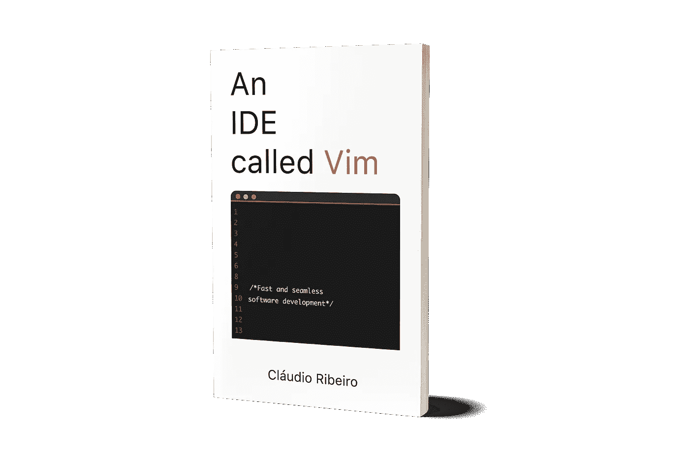

# 三分钟后 Vim

> 原文：<https://medium.com/hackernoon/vim-in-3-minutes-bc65b1f367ce>

*这篇文章的灵感来源于保罗·戈尔曼的* [*一篇名字非常相似的文章(vim in 5 minutes)*](https://paulgorman.org/technical/vim5minutes.html) *。*

**什么是 Vim？**


*   Vim 是一个文本编辑器。

**如何获得 Vim？**

*   根据您的操作系统，下载并安装它(windows)、apt (Linux)或 brew (macOS)。

**如何使用 Vim？**

在命令行中，键入“vim”或“vim {filename}”，或者为图形版本键入“gvim”。

Vim 是一个模态文本编辑器，它有 4 种主要模式:

*   **正常模式** : Vim 在正常模式下启动。它用于浏览文本和输入命令。

命令按以下方式构建:

[操作符][计数][动作]当操作符指示一个动作时，计数是执行该动作的次数，并移动要应用的字符或字符组。

例如:

y3w = >猛拉(复制)接下来的 3 个单词。

d5j = >向下删除 5 行。

在本文的最后，我们可以找到一个操作符和动作的列表。

*   **插入模式**:用于插入文本，在正常模式下输入“I”即可。

要返回正常模式，请输入“ESC”(这对所有模式都有效)。

*   **命令模式**:用于输入命令(如保存和退出)。

在正常模式下，命令使用“:{command}”，搜索使用“/{string}”，甚至？“{string}”用于向后搜索。

最常见的命令是:

:w = >保存

:wq = >保存并退出

:q！= >不保存就退出

:e = >从磁盘重新加载

/foo = >向前搜索“foo”

？foo = >向后搜索“foo”

*   **视觉模式**:用于选择和操作一组字符。

通过“v”从正常模式到达。正常运动会改变突出显示的区域，正常操作会影响它。

最后但同样重要的是，Vim 有一些我见过的最好的帮助菜单。要获得帮助，请使用:

:帮助

或者:帮助{topic}

:vimtutor 将推出一个快速、实用的 Vim 教程。


Vimtutor example

**总结:**

要开始使用 Vim，您真正需要知道的是用“vim {filename}”打开一个文件。输入“I”开始添加文本。添加完文本后，输入“ESC”。最后，输入':wq '保存并退出，或者':q！'不保存退出。

当然，Vim 远不止这些。这篇文章是试图总结一种向 Vim 介绍基本知识的快速方法的结果。欲了解更多详细信息，请查阅 vimtutor 或以下两本书之一:

*   德鲁·尼尔的《实用维姆》
*   一个名为 Vim 的 IDE，作者是 Claudio Ribeiro



This book will take you from Vim installation to use it as an IDE.

**多余的**:

正如所承诺的，这里有一个可以在 Vim 上使用的操作符和动作的列表。

## 操作

```
d      Delete
dd     Delete line
y      Yank
yy     Yank line
c      Change
u      Undo
Ctl-r  Redo
r      Replace character
.      Repeat last operation
```

## 提议

```
h      Left (like left arrow)
j      Down (like down arrow)
k      Up (like up arrow)
l      Right (like right arrow)
w      Work forward/right
b      Work back/left
W      Whitespace work forward
B      Whitespace work back
0      Start of line
$      End of line
^      Non-whitespace start of line
Ctl-f  Screen forward
Ctl-b  Screen back
gg     Start of file
G      End of file
(      Sentence back
)      Sentence forward
{      Paragraph back
}      Paragraph forward
%      Jump to matching brace
23G    Jumpt to line 23
`.     Jump to last change
*      Jump to next instance of word under cursor
#      Jump to previous instance of word under cursor
f*x*     Next character *x* on this line
F*x*     Previous character *x* on this line
;      Repeat f*x* or F*x*
```