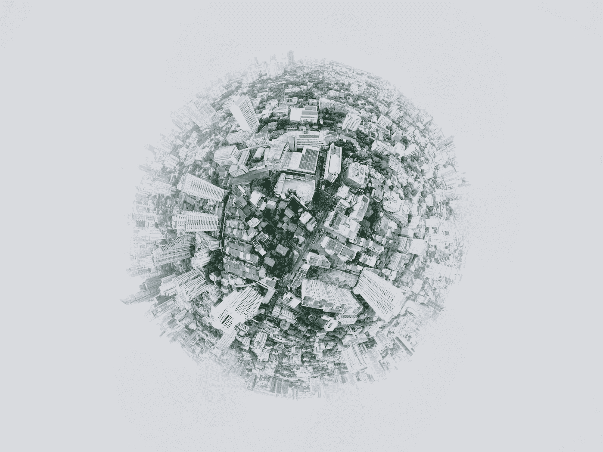

# 利用人工智能进行病毒预测

> 原文：<https://medium.com/hackernoon/virality-prediction-using-artificial-intelligence-33ee8c80f180>

***“万物皆有美，但不是每个人都看得到。”***

视觉美学是一门被广泛认可的学科。“这幅画好看吗？”从来没有一个答案。直到今天。量化图像美感的长期问题现在解决了。人工智能现在可以**‘看到’**美，并暗示什么会被别人称为美。现在可以知道一幅图像是否会流行，而不必麻烦地咨询多位专家。ParallelDots 的人工智能研究小组已经能够建立一种技术，这种技术将帮助用户高度确定地知道，他们的图像库中的内容如果继续公开，是否会产生良好的影响。

以下是一些可以从这项技术中受益的实体。

# 餐厅聚合器

任何智能手机的空间都有很大一部分用于专门设计的应用程序，以发出那种闪烁的声音——送货员手里拿着丰盛的食物按门铃的声音，希望还能有一些折扣券。

为了获得竞争优势，餐馆用来吸引应用程序用户的一个有用手段是在他们的网站上张贴令人垂涎的菜肴图片。在 [ParallelDots](https://www.paralleldots.com/) 的人工智能更进了一步，实际上帮助识别一幅图像有多大可能变得流行。餐馆可以使用[病毒检测 API](https://www.paralleldots.com/virality-detection) 来选择性地识别那些具有高流行度分数的图像，并将它们放在网站上。这不仅消除了摄影师的主观偏见，也使创建在线光环变得毫不费力。只需要收集真实的图片，剩下的就交给 AI 了。

# 公关

对名声的追求是公关公司承诺为客户提供的一个不断变化且广为觊觎的目标。任何想登上杂志头版，想让自己电影的海报在时代广场的屏幕上闪现，或者想让出版社报道他们的故事的人，都知道一张好照片的重要性。问题是太多人对一张好照片的样子有太多的看法。

有没有更简单的靠好图成名的方法？是的。用人工智能。

使用[病毒检测 API](https://www.paralleldots.com/virality-detection) ，有可能知道一张图片有多大可能被病毒式传播。公众人物可以使用这种简单的技术来找出他们的照片将成为流行，而不会被偏见、捷径和认知错觉的主观性所困扰。

# 租赁平台

使用聚合器出租旅馆、服务公寓、寄宿家庭、公寓、房间等可能是获得庞大客户群的最简单方法。选择一个特定的酒店入住，完全取决于业主提供的图片。随着这个地区变得竞争激烈，每个业主都需要知道如何获得最好的照片，并吸引更多的租户。[病毒检测 API](https://www.paralleldots.com/virality-detection) 是让酒店变得时尚的最佳配方之一。它使用人工智能来暗示一张图片传播的可能性有多大。你所需要做的就是上传一张图片，看看它的受欢迎程度，然后决定是否应该把它放到网上让全世界看到。

# 股票照片聚合器

社交媒体已经转变为一个旨在以数字方式记录生活和事件的照片库。与此同时，人们希望有一个广受欢迎的图片集。倾向于使用偏见来偏爱某些图片，这是不可避免的，也是徒劳的。相反，利用人工智能可以快速顺利地完成这项任务。使用[病毒检测](https://www.paralleldots.com/virality-detection)技术，人们可以知道他们的照片被病毒传播的概率。因为这里应用的先进科学是基于人工智能的，所以它是可靠和高度准确的。股票照片聚合器可以使用这种技术来决定哪些图像应该放在网站上，以便最大限度地提高知名度，并确保公众的认可，而不必经历手动选择的麻烦。同时，他们可以使用[图像识别 API](https://www.paralleldots.com/object-recognizer) 来筛选数百万张图像，以确定大多数图片中的趋势对象，并建立对需求的深入了解。

随着人工智能敲开我们的大门，带来迫在眉睫的简单和进步，是时候搞清楚这项技术能为广大企业做些什么了。谁会想到病毒式传播是任何人都能拥有的超能力？我们真的无法预测明天会发生什么。我们真的不知道它会有多大。

你可以在这里阅读关于如何使用人工智能技术来判断照片质量。

我们希望你喜欢这篇文章。请[注册](http://user.apis.paralleldots.com/signing-up?utm_source=blog&utm_medium=chat&utm_campaign=paralleldots_blog)一个免费的 ParallelDots 账户，开始你的 AI 之旅。你也可以在这里查看[的人工智能应用程序的演示。](https://www.paralleldots.com/text-analysis-apis)