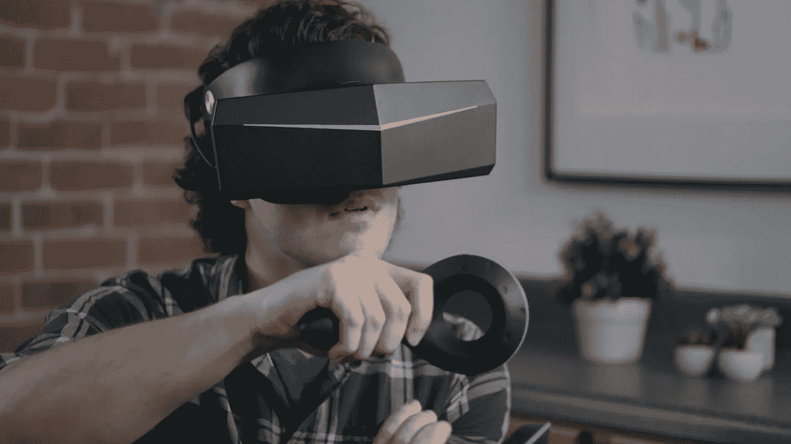

# 管弦乐队的虚拟现实

> 原文：<https://medium.com/hackernoon/virtual-reality-at-the-orchestra-703ca7f3ce93>

VR Headset. Source: Kickstarter.

虚拟现实——它的应用几乎是无限的。想到如此前卫和高科技的东西会在古典娱乐的老派领域产生影响，有点可笑。 [360 度虚拟现实视频制作](/iotforall/how-to-film-vr-videos-53d82994ee11)和电影摄影是最新最伟大的东西。然而，作为一种艺术形式，它仍处于起步阶段。到目前为止，并不是每个人都接受它。

最近，在英国，虚拟现实耳机和一套令人印象深刻的扬声器已经在伦敦皇家节日大厅实施。管弦乐队的观众现在有了一个虚拟现实系统，可以和音乐表演者一起体验音乐。根据 Phys.org 的说法，有人主张这种虚拟现实技术“将改变艺术和娱乐产业”

最伟大的现代指挥家和表演者登上皇家节日大厅的舞台。在那里可以听到许多伟大的古典音乐作品，其中包括马勒的第三交响曲和贝多芬的第五交响曲。伦敦爱乐乐团交响乐团是几个常驻纽约的交响乐团之一，它对新的发展寄予厚望。

乐观地说，这项技术有望吸引观众观看古典音乐表演，这些人以前可能对此不感兴趣。但是现在有了 VR 的介入。爱乐乐团的创新负责人卢克·里奇喜欢这个想法，他说这“让你走进管弦乐队……对管弦乐队来说，这完全改变了他们的先入之见。”

然而，虚拟现实的这种特殊用途只是一种暂时的测试。就像 1953 年电影 [*Bwana Devil*](http://www.nydailynews.com/entertainment/movies/bwana-devil-3-d-feature-film-premieres-1953-article-1.2533594) 的观众一样，戴着 3D 眼镜观看画面，现代管弦乐队观众戴上的耳机可能会成为未来体验娱乐的一种强大方式。事实上，由于虚拟现实设备是可移动的，Phys.org 说“现场表演有可能被传送到电影院。”

无论它最初是否能满足爱乐乐团的需求，虚拟现实技术的独特应用都是非常有前途的。展望 21 世纪，它几乎肯定会重塑人们娱乐的方式。