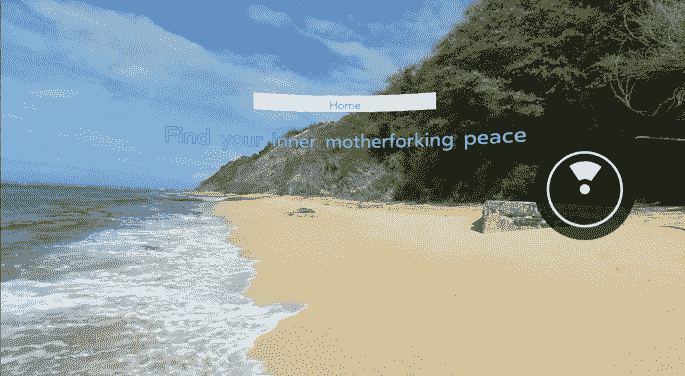
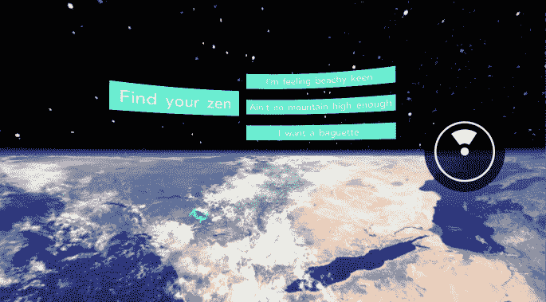
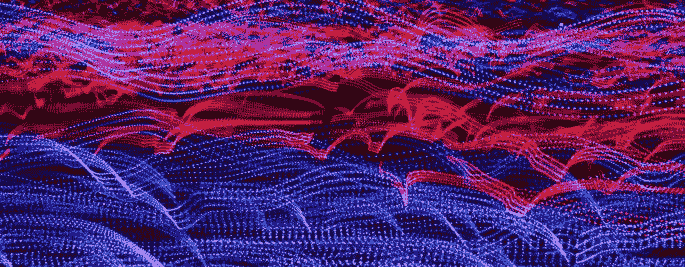

# React 360 虚拟现实

> 原文：<https://medium.com/hackernoon/virtual-reality-with-react-360-ce24b611f0f5>



作为一名软件开发人员，我花时间构建网站和网络应用，但长期以来，我还对虚拟现实感兴趣。我将我的 Oculus Go 命名为“Betty ”,并开始兴奋地谈论如何体验威尼斯的贡多拉之旅、惊险的过山车以及在人体血管中旅行。因为我使用 React，主要是，我很兴奋地得知我可以用一个我已经知道并喜欢的库来开发虚拟现实体验。

T [为了尝试 React VR](https://lilydbarrett.com/2018/04/23/recompose-with-react-vr/) ，我最近创建了一个名为 [Find Your Zen](https://github.com/lilybarrett/find-your-zen-react-360) 的虚拟现实应用程序，它允许用户选择一个沉浸式冥想环境，每个环境都有自己的咒语，灵感来自非常优秀的节目[“好地方”。](https://www.nbc.com/the-good-place?nbc=1)2018 年 5 月，在我建立我的应用程序后不久，脸书发布了一个经过修改和更名的 React VR 版本，名为 [React 360](https://facebook.github.io/react-360/) ，有多处变化和重大改进。

当我将我的应用程序移植到 React 360 时，我注意到了 React VR 和 React 360 之间的一些重要差异。我为拥有 React 应用知识的开发人员写了下面这篇文章。如果你不熟悉这个库，我推荐你先从这里的开始。

如果你想要 React VR 的介绍(以及[重组](https://github.com/acdlite/recompose)，它的效用函数帮助管理我的应用程序的状态)，你可以在这里找到[，在这里](https://lilydbarrett.com/2018/04/23/recompose-with-react-vr/)找到[。](https://lilydbarrett.com/2018/05/05/recompose-with-react-vr-pt-2/)

**查看完成的演示代码**

```
$ git clone [https://github.com/lilybarrett/find-your-zen.git](https://github.com/lilybarrett/find-your-zen.git)
$ cd find-your-zen
$ npm i
$ npm start
```

**文件结构**

React VR 的基本文件结构如下:

*   `index.vr.js` =我的应用程序的入口
*   `vr`文件夹=存储启动我的应用程序的代码，包括`index.html`和`client.js`文件
*   `static_assets` =存储图像、音频文件和其他外部资源

这是 React 360 的新文件结构:

*   `index.js` =我的应用入口
*   设置“运行时”，将我的 React 组件转换成我们的 VR 场景中的 3D 元素
*   `index.html` =在典型的 React 应用程序中，为我安装 React 代码提供了一个位置
*   `static_assets` =存储图像、音频文件和其他外部资源

我将文件夹结构的其余部分设置如下:

```
- components // shared components 
  - base-button
  - content
- consts
- providers // Recompose providers live here
- scenes
  - home-environment 
    - components
      - menu
      - title
      - zen-button
      - zens 
    - zen-environment
      - components
        - home-button
        - mantra 
- static-assets
  - images
  - sounds 
```

共享组件位于顶层`components`文件夹中。存储在`scenes,`我的`HomeEnvironment`中——第一个加载的环境，在那里我的用户访问冥想环境菜单进行探索——并且`ZenEnvironment`场景每个都有自己的相关组件集。我的状态管理由[重组](https://github.com/acdlite/recompose) `providers`处理，并在功能上组合成每个需要访问状态的组件。



**安装应用**

在 React VR 中，我的`client.js`相当简单，没有给我太多的配置选项:

```
// React VR application -- vr/client.js
// Auto-generated content.
// This file contains the boilerplate to set up your React app.
// If you want to modify your application, start in "index.vr.js"import { VRInstance } from "react-vr-web";
function init(bundle, parent, options) {
   const vr = new VRInstance(bundle, "MeditationApp", parent, {
      cursorVisibility: "auto",
      // Add custom options here
      ...options,
   });vr.render = function() {
      // Any custom behavior you want to perform on each frame goes  
      here
   };
   // Begin the animation loop
   vr.start();
   return vr;
}
window.ReactVR = {init};
```

在 React 360 中，我可以将应用程序的内容安装到某个表面或位置。Surfaces，[正如文件所说](https://facebook.github.io/react-360/docs/surfaces.html)，“允许你在 3D 空间中添加 2D 界面，让你以像素而不是物理尺寸工作。”在我的例子中，我将应用程序的可视内容包装在一个`AppContent`组件中，我将这个组件挂载到 React 360 的默认柱面上。这个表面将内容投射到一个半径为 4 米的圆柱体内部——位于用户前方的中心。


我可以在 React 360 中创建自己的自定义曲面，增加或减少半径或使曲面平坦而不是圆柱形。

我还将整个应用程序本身挂载到 React 360 的默认位置，这允许我的应用程序利用 React 360 的运行时。

新的运行时是 React 360 相对于 React VR 的显著优势之一。为什么？将应用程序的渲染或“运行时”方面从应用程序代码中分离出来，可以改善**延迟**:用户操作与视图中像素更新以响应该操作之间的时间。如果数据传输太慢，会给用户带来断断续续、令人迷惑的画面——类似于 Youtube 视频中的缓冲或电视屏幕上的静态画面。



[React 360 文档进一步解释了](https://facebook.github.io/react-360/docs/runtime.html)，网络浏览器是单线程的，这意味着作为应用程序后台更新的一部分，该进程可能会阻止或阻碍数据传输。“这对于在 VR 头戴设备上观看 360°体验的用户来说尤其成问题，在那里，显著的渲染延迟会破坏沉浸感，”文件告诉我们，“通过在单独的上下文中运行应用程序代码，我们允许渲染循环以高帧速率持续更新。”

> ***如果数据传输太慢，会给用户带来断断续续、令人迷惑的画面——类似于 Youtube 视频上的缓冲或电视屏幕上的静态画面。***

在我的`index.js`中，我*注册*我的`MeditationApp`(见下面的第二个代码块)以挂载到默认位置——让我的整个应用程序访问运行时——同时我将我想要显示的内容(同样，存储在`AppContent`中)注册到默认的柱面。

```
// components/content.jsimport React from "react";
import { View } from "react-360";
import { HomeEnvironment, ZenEnvironment } from "../../scenes";
import { withAppContext } from "../../providers";const AppContent = withAppContext(() => (
   <View>
      <HomeEnvironment />
      <ZenEnvironment />
   </View>
));export default AppContent;// index.jsimport React from "react";
import {
   AppRegistry,
   View,
} from "react-360";
import { AppContent } from "./components";
import { withAppContext } from "./providers";const MeditationApp = withAppContext(() => (
   <View style={{
      transform: [{ translate: [0, 0, -2] }]
   }}>
      <AppContent />
   </View>
));AppRegistry.registerComponent("AppContent", () => AppContent);
AppRegistry.registerComponent("MeditationApp", () => MeditationApp);
```

我的`client.js` 负责将组件安装到位置和表面:

```
// client.jsimport { ReactInstance, Surface } from "react-360-web";function init(bundle, parent, options = {}) {
   const r360 = new ReactInstance(bundle, parent, {
      fullScreen: true,
      // Add custom options here
      ...options,
   }); r360.renderToSurface(
      r360.createRoot("AppContent", { /* initial props */ }),
      r360.getDefaultSurface()
   ); r360.renderToLocation(
      r360.createRoot("MeditationApp", { /* initial props */ }),
      r360.getDefaultLocation(),
   ); r360.compositor.setBackground(
      r360.getAssetURL("images/homebase.png")
   );
}window.React360 = {init};
```

**播放音频**

在我的`consts`文件夹中，我创建了一个`zens.js`文件来快速存储我的数据——包括每个环境的正确音频文件和图像:

```
const zens = [
   { id: 1,
     mantra: "Find your inner motherforking peace",
     image: "images/hawaii_beach.jpg",
     audio: "sounds/waves.mp3",
     text: "I'm feeling beachy keen",
   },
   { id: 2,
     mantra: "Breathe in peace, breathe out bullshirt",
     image: "images/horseshoe_bend.jpg",
     audio: "sounds/birds.mp3",
     text: "Ain't no mountain high enough",
   },
   { id: 3,
     mantra: "Benches will be benches",
     image: "images/sunrise_paris_2.jpg",
     audio: "sounds/chimes.mp3",
     text: "I want a baguette",
   },
   { id: 4,
     image: "images/homebase.png",
     text: "Home"
   }
]export default zens;
```

为了在我的 React VR 场景中播放音频，我使用了一个`Sound`组件，它接受一个在`static_assets`文件夹中的声音文件的 URL 作为`source`道具。为了防止音频在不属于它的环境中播放——比如家庭环境——我通过重新组合实现了逻辑，根据我们是否处于没有音频文件与之关联的环境中来“隐藏”和“显示”`Sound`组件。

```
// React VR -- components/audio.jsimport React from "react";
import { Sound } from "react-vr";
import zens from "../consts/zens.js";
import { compose } from "recompose";
import { asset } from "react-vr";
import { hideIf, usingAppContext } from "../providers/index.js";const hideIfNoAudioUrl = hideIf(({ selectedZen }) => {
   const zenAudio = zens[selectedZen - 1].audio;
   return zenAudio === null || zenAudio === undefined || zenAudio.length === 0;
});export default compose(
   usingAppContext,
   hideIfNoAudioUrl,
)(({ selectedZen }) => {
   const zenAudio = zens[selectedZen - 1].audio;
   return (
      <Sound source={asset(zenAudio)} />
   )
});
```

React 360 在此基础上有了很大改进。对于播放音频，我使用的是`AudioModule`原生模块。它的`playEnvironmental`方法允许我提供一个路径(到我们的 assets 文件夹中的音频)和一个音量来循环播放所述音频。一旦音频文件停止播放，它将重新开始。

在这个过程中，我意识到我需要告诉我的应用程序在切换场景时何时停止播放特定的音频文件。(否则，在沉浸于寻找你的禅时，你可能会在导航回到家庭环境后，听到来自你以前环境的音频——例如，巴黎城市广场上的教堂钟声)。我用`AudioModule`的`stopEnvironmental`方法完成这个任务。

请继续阅读以了解这一点…

**使用图像**

在 React VR 中，我使用了一个`Pano`组件来显示一张 360 度的照片。为了显示特定的图像，`Pano`和`Audio`一样，接受一个资产 URL 作为`source`道具。根据用户选择的环境，应用程序的状态会更新以显示该环境的图像。

```
// React VR -- components/wrapped-pano.jsimport React from "react";
import { Pano } from "react-vr";
import { usingAppContext } from "../providers/index.js";
import { Audio } from "../components/index.js";
import zens from "../consts/zens.js";
import { asset } from "react-vr";export default usingAppContext(({ selectedZen }) => {
   return (
      <Pano source={asset(zens[selectedZen - 1].image)} >
         <Audio />
      </Pano>
   )
});
```

你可能注意到了，也可能没有注意到，在我的 React 360 应用程序的`client.js`中，我在渲染了我的应用程序的组件后写了下面一行:

`r360.compositor.setBackground(r360.getAssetURL("images/homebase.png"));`

这一行代码在应用首次安装时立即设置背景图像，使用 React 360 的`asset`实用程序自动在我的`static_assets`文件夹中查找正确的图像。

这很好，但是我仍然希望根据用户选择的环境来改变图像。幸运的是，我可以通过使用 React 360 的`Environment`模块来处理 React 事件中的动态图像。下面是一些用法示例:

`Environment.setBackgroundImage(asset(someImage));`

为了将所有这些放在一起，下面是我如何使用 Recompose 的`withState`和`withHandlers`函数，根据用户选择的环境动态设置我的背景图像和音频:

```
// providers/withStateAndHandlers.jsimport React from "react";
import { withState, withHandlers, compose } from "recompose";
import { Environment, asset, NativeModules } from "react-360";
const { AudioModule } = NativeModules;
import { zens } from "../consts";const withStateAndHandlers = compose(
   withState("selectedZen", "zenClicked", 4),
   withHandlers({
      zenClicked: (props) => (id, evt) => {
         Environment.setBackgroundImage(asset(zens[id - 1].image));
         if (zens[id - 1].audio !== null && zens[id - 1].audio !== undefined) {
            AudioModule.playEnvironmental({
               source: asset(zens[id - 1].audio),
               volume: 0.3,
            });
           } else {
               AudioModule.stopEnvironmental();
           }
         props.zenClicked(selectedZen => id);
      }
   }),
)export default withStateAndHandlers;
```

**设计应用程序**

与 React VR 一样，React 360 使用 [Flexbox](https://css-tricks.com/snippets/css/a-guide-to-flexbox/) 来轻松调整应用程序的布局以适应任何显示器，无论是笔记本电脑的网络浏览器还是手机屏幕或 VR 耳机。然而，对于安装在某个位置的应用程序部分——比如我的例子中的`MeditationApp`——React 360 从 Flexbox 布局切换到基于米的三维坐标系统。这就是为什么你会在我的`index.js`中看到这段代码:

```
// index.js// other code goes here
const MeditationApp = withAppContext(() => (
   <View style={{
      transform: [{ translate: [0, 0, -2] }]
   }}>
      <AppContent />
   </View>
));// other code goes here
```

传入`transform`的值依次为`x`、`y`和`z`。`x`代表用户右边的对象的方位；`y`表示向上或向下的方向，`z`表示感知到的与用户的距离。

在上面的例子中，`View`应该在中心，在用户前方 2 米处。

变换都是相对于它们的父对象定位的。

**对我有效的实践**

**样式表**

来自`react-native`的`StyleSheet` 允许我使用 JavaScript 来设计我的 React 组件。请参见下面的我的代码:

```
// scenes/home-environment/components/zen-button/style.js
import { StyleSheet } from "react-360";export default StyleSheet.create({
   text: {
      backgroundColor: "#29ECCE",
      textAlign: "center",
      color: "white",
      marginTop: 30
   }
})
```

在这里，我创建并导出了一个`StyleSheet`对象，它允许我在组件本身中以简洁的方式引用样式。

```
// scenes/home-environment/components/zen-button/index.js
import React from "react";
import { BaseButton } from "../../../../components";
import style from "./style";const ZenButton = ({ text, buttonClick, selectedZen }) => {
   return (
      <BaseButton
         text={text}
         selectedZen={selectedZen}
         buttonClick={buttonClick}
         textStyle={style.text}
      />
   )
}export default ZenButton;
```

**状态管理**

因为，归根结底，这仍然只是 React，您可以用与典型 React 应用程序相同的方式处理状态: [Redux](https://redux.js.org/) 、 [Recompose](https://github.com/acdlite/recompose) 、 [Mobx](https://github.com/mobxjs/mobx) 等等。我选择使用重组，因为我喜欢它允许我构建功能组件的方式。如前所述，我在 React VR 的上下文中写过一些关于重新组合的帖子，你可以在这里找到[，在这里](https://lilydbarrett.com/2018/04/23/recompose-with-react-vr/)找到[。将我的应用从 React VR 移植到 React 360 时，我不需要对我的状态管理方法做任何改变。](https://lilydbarrett.com/2018/05/05/recompose-with-react-vr-pt-2/)

**调试 React 360**

当你打开应用程序时，你会看到 React 360 把所有的文件打包成一个巨大的 blob，这个 blob 不太容易被破解。好在因为 React 360 支持 [sourcemaps](https://trackjs.com/blog/debugging-with-sourcemaps/) ，所以我们还是可以访问原始文件，使用`debugger`等。