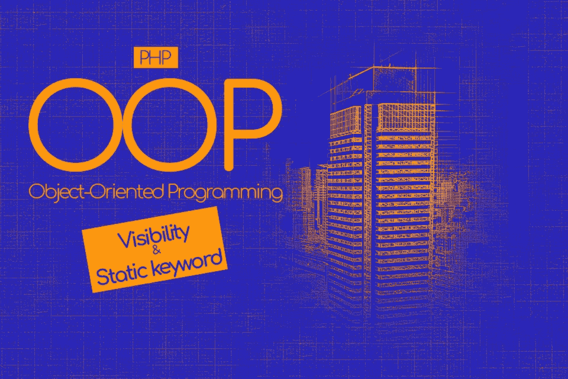
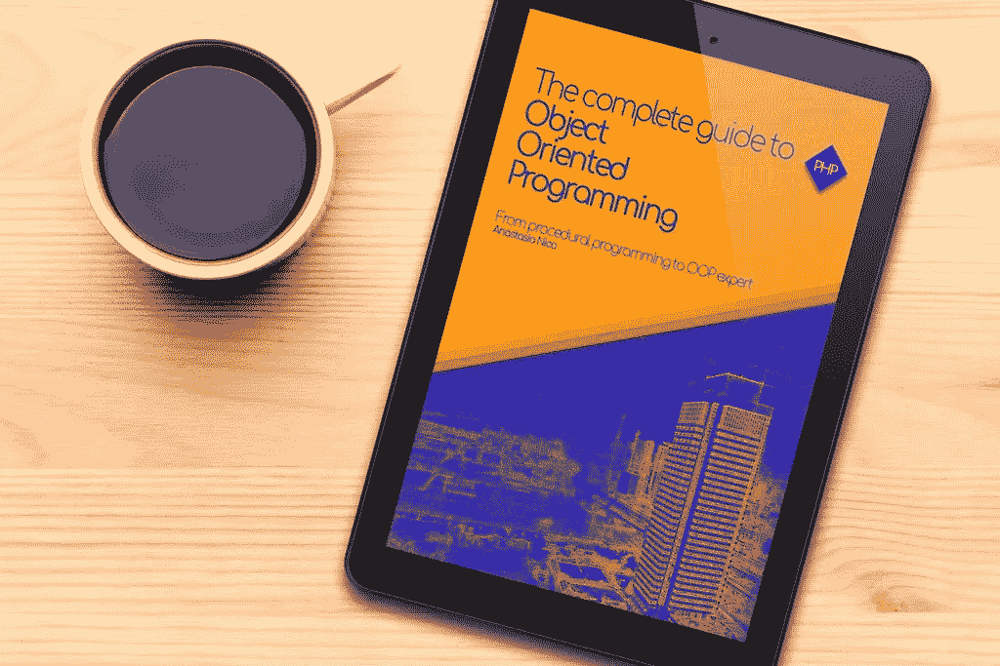

# PHP 中的可见性和静态关键字

> 原文：<https://medium.com/hackernoon/visibility-and-static-keyword-in-php-f03c751c0c03>



# 跟随系列…

这篇博文是“ [**面向对象编程完全指南”的第四部分:**](https://amzn.to/2OfCZej) 从过程化[编程](https://hackernoon.com/tagged/programming)到 OOP 专家 [PHP](https://hackernoon.com/tagged/php)

如果你还没有阅读其他部分

你可以查看下面链接的其他博文
[面向对象编程简介](http://anastasionico.uk/blog/the-complete-guide-to-object-oriented-programming)，
[PHP 中的继承和接口](http://anastasionico.uk/blog/inheritance-and-interfaces-in-php)，
[可见性和静态关键字](http://anastasionico.uk/blog/visibility-and-static-keyword-in-php)，
[构造函数和魔法方法*尚未发布，订阅获取通知*](http://anastasionico.uk/blog/visibility-and-static-keyword-in-php#) 和
[抽象类和额外的位*尚未发布，订阅获取通知*](http://anastasionico.uk/blog/visibility-and-static-keyword-in-php#)

# 可见性概念介绍

理解可见性和范围非常简单，

但如果背景不够强大，会导致一些混乱。

我不知道为什么，但是程序员总是喜欢定义一些花哨的词语来描述简单的概念。

你已经看到了一些多态、继承例子，现在你将发现另一个词:

**封装。这个精心设计的词只意味着以一种代码的其余部分不会影响的方式收集数据。**

在下面的例子中，您将了解范围的概念。

给定两个名为 *$schoolsCount* 的同名变量，一个统计我们城市所有的
所学校，另一个只统计主要街道上的学校数量，你会发现结果会有所不同。

发生这种情况是因为第二个变量被封装在函数中，因此被分配在不同的范围内。

我们可以通过使用超级全局变量*GLOBALS[' school count ']*
来使用全局作用域，但是，这不是一个好的做法，它将很快使代码变得非常混乱。

```
$schoolsCount = 7;function getSchoolsCountInMainStreet () { $schoolsCount = 4; return var_dump($schoolsCount);}var_dump($schoolsCount); // This will output the total amount
```

在 PHP 的面向对象编程中，你有三个不同的可见性级别。

它们是:

*   公共
*   保护
*   私人的

# 公共

公共是第一个也是最不受限制的级别，

这个级别的属性和方法可以从代码中的任何地方访问、查看和更新，在一个类中，在一个子类中，甚至在类之外。

可见性是在 PHP4 之后出现的，为了回溯兼容性
声明它不是强制的，实际上如果你没有在一个元素上声明可见性
，代码会认为它是公共的。

所以，

考虑到目前为止你在本文中看到的所有例子都是公开声明的。

有消息称，这种情况不会持续太久，部署在 PHP4 上并且仍然在线的 web 应用非常少。

这意味着您需要养成声明可见性的习惯，即使出于未来兼容性的原因，方法和属性是公共的

# 保护

受保护是第二个层次。

这很容易理解，所以我不会在这上面花太多时间。

**当声明一个受保护的属性时，你是在说这个变量在类内部的任何地方都是可用的，并且在任何扩展它的类中都是可用的。**

[(关于这个主题的更多信息请参见继承和接口)](http://anastasionico.uk/blog/inheritance-and-interfaces-in-php)

# 私人的

第三个层次更加有限，

**私有属性和方法只能从声明它们的类中访问。**

没有子类，其他地方也没有。

这种类型的可见性用于非常敏感的信息，例如当您使用密码或处理支付数据时。

PHP 语法命令我们在编写元素之前定义可见性。

让我们重写一个先前的例子:

```
class Building{ public $inCostruction = false; protected $isOpen = true; private $safePassword = “qwerty” public function closeBuilding() { return $this->isOpen = false; } protected function openBuilding() { return $this->isOpen = true; }}class School extends Building{}class Office extends Building{$isOpen = false;}
```

目前*$ in construction*变量在程序中的任何地方都是可访问的，

*$isOpen* 在子类中的 *Building* 类中可见，而 *$safePassword* 仅在 *Building* 类中可见。

学校和办公室都不能访问和更新 safePassword 变量。

这是 PHP 的一个非常基本的特性，但是必须清楚地理解。

当一个变量的作用域出错时，由于可见性的原因，大多数错误都是致命的

如果没有显示错误，要找到问题是非常困难的。

# 静态

这里是一个新的 PHP 关键字供你学习。

它们永远不够，

不是吗？

static 关键字用于改变属性和
方法的可访问性。

通过将一个类的元素(属性或方法)声明为静态的，你是在对代码说，该元素将对所有程序可用，而不需要实例化该类。

由于没有实例化的类，关键字 *$this* 在这些方法中不可用。

取而代之的是 **self::** 关键字。

迷茫？

让我们把事情弄清楚一点。

## 为什么首先要使用静态？

在前面的例子中，当我们创建我们的城市时，我们使用同一类建筑作为蓝图，从那里我们提取我们需要的数据，并且我们已经创建了实际的对象，办公室、学校等等。

为此，我们需要创建 *Building* 类的副本，我们执行的所有操作将只改变实例化的对象，而不会改变类本身。

这意味着在我们想象的城市中，我们可以有几十个、几百个甚至几千个办公室，我们可以编辑其中的每一个，而不会影响到其他的。

```
$officeInMainStreet = new Office()$officeInPiccadillyBoulevard= new Office()
```

这两个对象是同一类的两个不同实例，

他们使用相同的蓝图建造，但他们不是同一个办公室

你可以在其中一个物体上增加一个窗口或者重新粉刷墙壁，这不会有任何问题，因为另一个物体永远不会知道。

嗯，当使用静态的东西是不同的。

```
class Building{ public static $planningPermission = ‘accepted’;}echo Building::$planningPermission; // this command will echo “accepted”
```

在上面的例子中，我们不再试图访问对象，而是直接访问属性，

所以，

您看到的是实际类的实际静态参数。

如果你要创建一个方法来结束对参数的编辑，那么它将会是类的参数，而不是某个实例之后创建的参数。

静态方法的相同价值:

```
class Building{ public static $planningPermission = ‘accepted’; public static function setDeniedPermission() { self::$planningPermission = ‘denied’; return self::$planningPermission; }}echo Building::setDeniedPermission(); // this command will echo “denied”
```

这种想法使得 static 关键字非常强大，但同时也不被许多开发人员看好，他们认为使用 static 关键字和全局范围通常是一种不好的做法。

# 第四部分结论



[*一体化版的《面向对象编程完全指南》的完整版在亚马逊上以 Kindle 格式出售*](https://www.amazon.co.uk/dp/B07J47L6PB) *反正下面的部分很快就会出版。*

**这是一篇简短的文章，向你展示了 PHP 中可见性和静态关键字使用的简单概念。**

尽管这些要素只需要基本的知识水平并且可以直接应用，

没有人能否认使用它们的重要性，

尤其是，如果运用得当。

在许多方面，

选择受保护的或私有的可见性级别有助于 web 开发人员定义什么是可共享的，什么留在友好的墙内更好。

与此同时，

您已经知道现在可以声明类，而不需要实例化它们。

static 关键字是该语言的另一个强大但危险的特性。

学习一些新的关键字并开始在你的脚本中到处使用它们是一个基本的错误。

但是要小心，

误用它，尤其是在开始的时候，会导致已经完成的特性的完全重写(这发生在我身上，从我的错误中学习)。

**下一集，**

**我们将关注魔法方法**

我准备了一个完整的列表，里面有详细的描述和代码示例。

由于这个原因，

请继续关注并使用下面的表格订阅，以便在它出版时得到通知。

[](http://eepurl.com/dIZqjf)

**现在轮到你了:**

*你打算用受保护的和私有的关键字来更新你的方法和属性吗？还是你更喜欢到处传播静态关键字？
在下面的评论框里告诉我吧！*