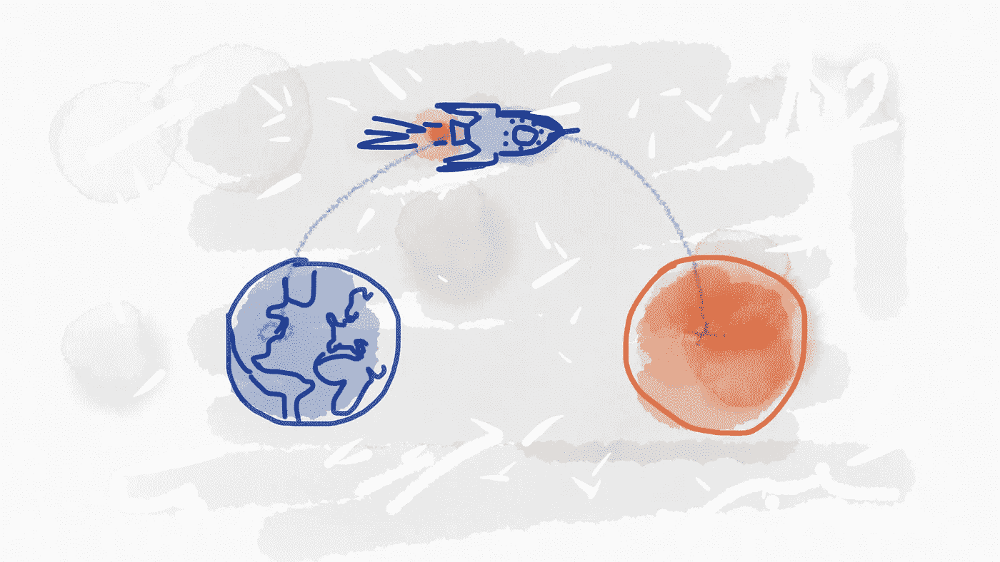
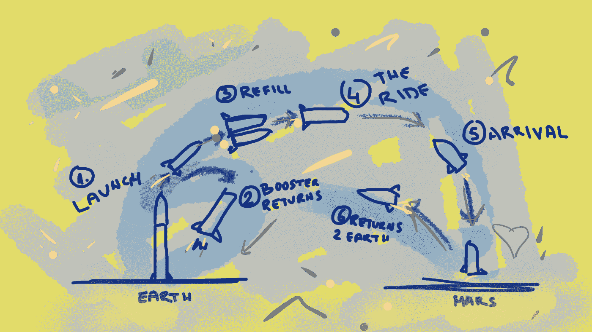
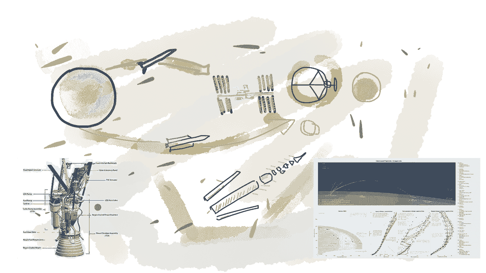

# 愿景-战略-战术。进入快车道

> 原文：<https://medium.com/hackernoon/vision-strategy-tactics-get-in-the-fast-lane-f28cb8590420>

如果你不知道你要去哪里，任何一条路都会把你带到那里但是，如果你想走上成功之路，你必须有一个强大的愿景，制定一个战略，将你带到那里，并采取行动。

[愿景](https://hackernoon.com/tagged/vision)，[战略](https://hackernoon.com/tagged/strategy)，战术。我不喜欢这三个字。但是，我还是决定写一写他们。高管和经理喜欢大量使用它们。但是，在他们开始交流他们的愿景之前，他们必须非常非常深入地思考这个问题。在大多数情况下，同样的高管和经理有许多紧迫的问题，几乎没有时间将他们的愿景转化为声明。几乎每一件紧急的事情都没有那么重要，重要的事情也没有那么紧急。尽管如此，我们倾向于处理紧急的、不太重要的事情，比如让自己淹没在通知、电话和电子邮件的海洋中。因为我们白天的时间是有限的，重要的事情(比如把愿景变成语言)从来没有得到它需要的关注。

> 几乎每一件紧急的事情都没有那么重要，重要的事情都不紧急。

这个幻象到底是什么意思？还是战略或者战术？首先，我想强调为什么这三个词对你和你的企业很重要，为什么你要花时间去定义它们。清楚之后，我会试着解释这些单词的意思，以及如何用在你喜欢的地方。

# 为什么这很重要？

想象你的生意就是你的身体。你的眼睛定义了视觉。你在酒吧里发现了一个迷人的人，你很想和他聊聊天，可能还不止于此。你的**愿景**听起来会像这样:“了解房间另一边的人”(*愿景主要是一个长期目标，但为了这个例子，让我们把注意力放在这个短期愿景*)。好的，你已经创造了你的愿景，随之而来的是追求那个目标的意图。

为了实现目标，让你的梦想成真，你必须制定一个计划让事情发生。这就是你的**策略**。你要用你的大脑去思考如何接近这个人，而不要看起来像个混球。你的策略可能是:“去拿两杯那个人正在喝的饮料，提供一杯饮料，讲一个笑话来打破僵局”。

既然你已经有了一个计划，你必须想出**策略**来帮助你执行实现愿景的策略。策略可能包括你阿尔法风格的休闲走路，你迷人的外表，一个好笑话，如果第一个笑话不能让她/他笑，还有一个备用笑话，用两根吸管喝一杯，这样你就可以分享它，无论你能想到什么(*我真的不擅长接近女孩，所以不要从我这里得到提示*)。

让我们想象一下，一切都很好，你遇到了那个人，度过了一个美好的夜晚，你们下周五要一起出去。

但是，如果你没有愿景、战略或战术，会发生什么？

## 缺乏远见

如果你没有见到那个人的远见，你就不会产生让它发生的意图。如果没有远见，你可能会和你的朋友一起度过剩下的夜晚，就像你一直做的那样。没有什么新鲜或令人兴奋的事情会发生。

有趣的是，在没有形成愿景的情况下，我们甚至没有意识到我们正在错过的东西。和朋友出去玩一个晚上很好，没什么不好。但是如果你有上述的愿景，你的夜晚会变得更加有趣。这就是为什么有一个愿景是重要的。愿景是推动事情发生的动力。

## 缺乏战略

首先，如果你没有愿景(或者你没有意识到)，策略可能不足以实现目标。实际上，你没有意识到目标。让我们假设你有一个策略，走到酒吧，拿起饮料，然后去见那个人。你点了一份餐，在等酒保的时候，你注意到一碗免费的花生。你的大脑发出“啊，免费的花生”的声音，然后你开始吃东西，你就偏离了你的目标。然后，你抬头看吧台上方的电视，注意到你最喜欢的球队正在比赛。如果你没有愿景，或者愿景不够吸引人，你很可能会呆在酒吧里，看比赛。因此，没有强有力的愿景的战略可能是不够的，你很容易分心。

没有策略也会影响你努力的结果。试想一下，在没有任何计划(策略)的情况下接近那个人。你能过去打个招呼吗？最有可能的是，“嗨”后面会跟着“哦，操，现在是什么天才？”。所以未雨绸缪，制定坚定明确的战略是非常重要的。

## 缺乏策略

你有去那里讲笑话的策略。但总得有人想出这个笑话。一旦你到了那里，你不太可能会突然想到什么，所以要做好准备。提前考虑。如果你不知道说什么，你会看起来很迟钝。

愿景、战略和战术的结合对你企业的成功至关重要。三者的结合是每个成功组织的支柱。它提供激励、对目标的清晰理解、所有团队成员和组织层之间的一致和理解。这就是为什么在组织的每个部分传达愿景是重要的。因此，每个人都会朝着同一个目标努力。

既然我们已经确立了这三个术语作为一个整体的重要性，那么让我们来分别讨论它们。

# 视力

愿景是长期的思考。它应该说你(你的公司)想成为什么。愿景应该回答“[为什么](https://www.amazon.com/Start-Why-Leaders-Inspire-Everyone/dp/1591846447)？”问题，每一个成功企业的核心。当你弄清楚你的原因时，客户和员工都会理解你的最终目标和他们在你的生态系统中的角色。愿景应该代表你的最终目标。

定义这一愿景需要付出巨大的努力。如果愿景没有被恰当地定义，一个淡化的声明可能会赶走人们，不管你脑子里有多么巧妙的想法。

> 除非远见能指导行动，否则它毫无用处。

为了指导行动，愿景:

*   必须既有挑战性又可以实现，
*   无论技术如何变化，都必须保持相关性，
*   必须与你的员工和顾客产生共鸣，
*   必须经常传达给所有员工。

*举例:*

假设你有一家公司想成为第一大火星运输公司(*这个想法听起来可能很熟悉*)。你想定居红色星球，并把一些人类从地球运送到火星。为了分享你的想法，并吸引未来的乘客，你必须制定一个反映你的愿景的声明。听起来可能是这样的:"*通过建立可靠和负担得起的运输方式，成为前往火星的头号运输公司。*”

High-level vision illustration

这一愿景具有挑战性，但可以实现。仅仅因为问题的规模，你很可能会吸引世界上最优秀的人才。潜在的乘客也会跳上宣传列车。这个故事很有趣，是一种前所未有的冒险，但你强调它是可靠的(*不会在平流层*爆炸)。此外，它说“*运输方式*”，这并没有暗示所使用的技术。这使得这一愿景与技术无关，并且不排除未来的突破性发现，如浓缩暗物质。

# 战略

如果我们有无限的资源，无限的时间，没有竞争，每个目标最终都会实现。但是现实有一点不同。团队成员不足、激烈的竞争和紧迫的期限是我们每天面临的紧迫问题。战略将目标(愿景)与当前现实联系起来。按照这些思路，对战略的正确商业定义应该是引导你的可用资源在尽可能短的时间内实现目标。通过制定你的战略，你正在把你的资源引向你的最终目标。

该战略适用于整个公司，并回答了这样一个问题:“给定当前的市场条件、市场预测、竞争等，我们将如何实现我们的愿景？?"

> 这个策略应该为你的北极星(最终目标)设定一条路线，但是在细节的层面上要允许战术的改变和适应。

该战略应该:

*   勾画出通向最终目标的道路，
*   沿途设置检查点和里程碑，
*   被限制在太多的细节上以允许灵活性，
*   触及技术点，但把细节留给战术部分，
*   确定团队可以实现的目标。

*例子续*:

此前，我们已经确立了我们的愿景:“*通过建立可靠且价格合理的运输方式，成为前往火星的头号运输公司。*”。现在，我们要制定实现这一目标的策略。这个策略有点复杂，不能用一句话来概括。所以，为了达到我们的最终目标我们不得不:“*开发一种可重复使用的火箭，尽可能使用内部生产来降低整体成本。解决加油问题。确定最佳轨迹，计算旅行的预计到达时间，并尝试考虑沿途的任何意外情况。在可靠性上下功夫，但也要注意美观——有人会在那里住上至少六个月。*

Strategy defines a path to the ultimate goal

这个策略听起来可能是这样的。我知道，它听起来可能更好，它需要一点额外的工作。但重要的是，这一愿景现在被分解为几个目标——建造火箭、加油、轨道、航天器娱乐等。这应该足以激发你队友的想象力。他们肯定会尽力为每个目标提供最先进的解决方案。在这样的环境中，人才会在这里茁壮成长，人们也会在这里茁壮成长。

(*地球 2 号火星计划的范围远远超出了本文的范围，所以让我们假设这个幼稚的故事足以将某人送上火星*

# 战略

你不直接执行战略；战略通过战术变成现实。该战略使您的愿景更加明确，但它没有足够的细节让团队去执行。这是理所应当的。作为一名优秀的领导者，你应该让你的团队来决定正确的策略以及如何执行它们。策略是技术领导、高级开发人员和其他有实践经验的人的领域。只要为他们提供清晰而富有挑战性的愿景，制定策略，以最短的路径引导他们，团队就会创造奇迹。说真的，他们会踢屁股。

策略通常被划分为目标，这样团队就可以逐步实现最终的结果。

> 战术是你在追求与战略相关的目标时使用的一种工具。

策略是:

*   交付长期战略的短期实施计划，
*   一份详细具体的日常活动计划，
*   一套达到目标的工具，
*   一个渐进的步骤让你更接近你的愿景。

*举例*:

所以你已经确定了几个目标——建造火箭、加油、轨道、宇宙飞船娱乐等。你将让你的团队实现这些目标。他们必须为每一个目标制定一个策略，使他们保持在正确的轨道上。请记住，战术是实现长期战略的短期实施计划。因此，为了建造一个火箭，你可能应该首先运行一些模拟。然后，可以建立一个原型并进行测试。您将从原型失败中收集重要的见解，并在下面的版本中实现它们。进行第一级分离。为第一级回收着陆开发导航软件。调查在月球轨道上给火箭补充燃料的可能性。我是说，这个名单可以一直列下去。战术是任务、实验、概念验证……一切有助于实现目标或获取对潜在破坏重要的知识的东西。

Tactics — actions that lead to success

# 结论

到目前为止，您可能已经理解了定义这三个部分的重要性。

你的**视野**规划了一个目的地。

你的目的地指引着你的**策略**。

战略选择行动。

走向成功的是**行动**！

## 我想掌声在这里很重要，所以一定要按下下面的掌声按钮👏👏👏🙏

# 想了解更多？

学习如何将你的想法转化为成功的业务。

这本书为你提供了创建一个成功企业的整个过程的全面指导。它旨在为你展示整个[商业计划](https://treasureroadmap.com/)，让你的起步更加容易。整个过程归结为它的要点，使步骤简单易懂。

如果你遵循我在这本书里揭示的公式，很有可能你可以通过把一个[想法变成一个成功的生意](https://treasureroadmap.com/)来谋生。

 [## 宝藏路线图——如何将你的想法转化为成功的业务——企业家的最佳书籍…

### 如果你选择遵循我在这本书里揭示的公式，很有可能你可以通过转行谋生…

treasureroadmap.com](https://treasureroadmap.com/) 

点击下面的图片获取您的免费图书摘要:

