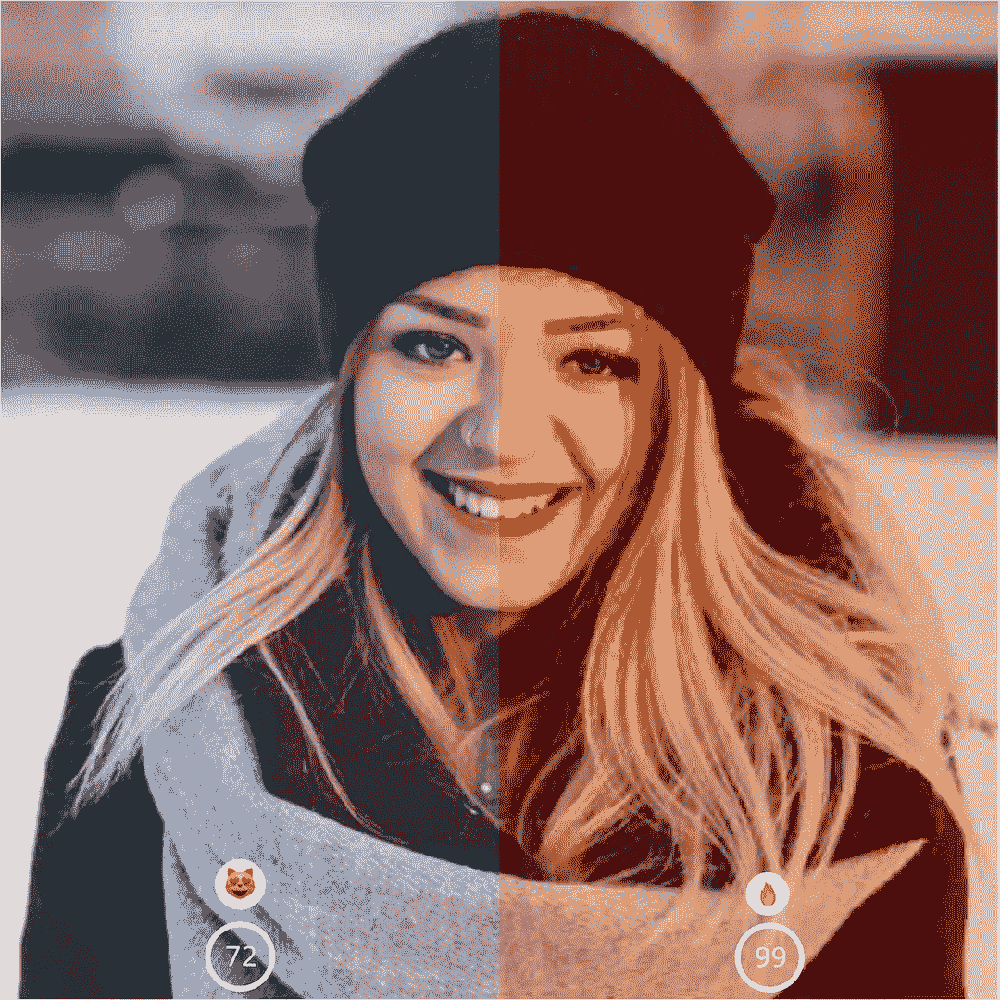
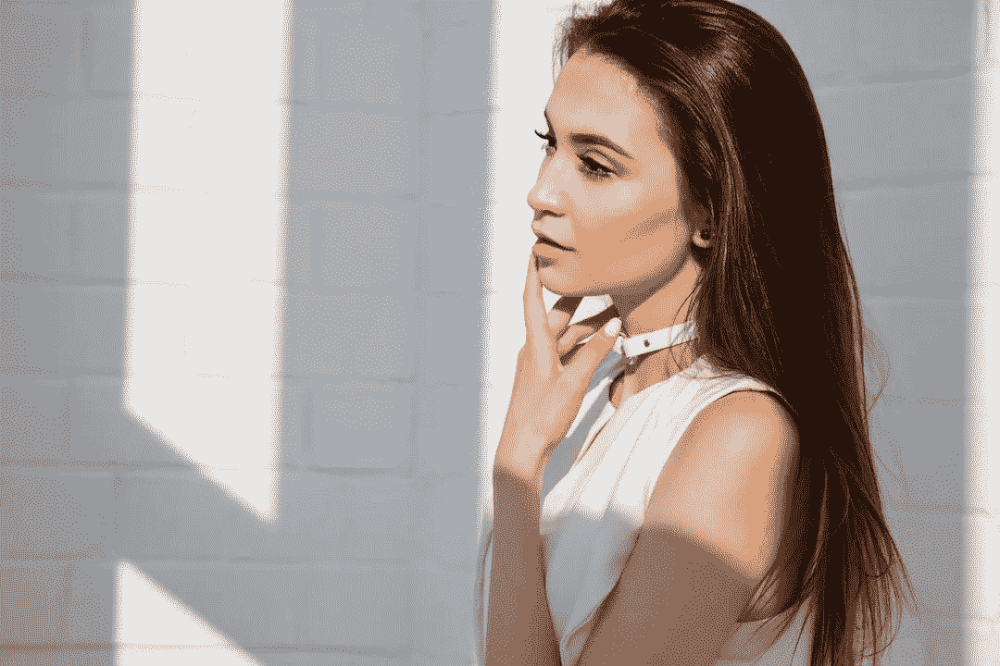
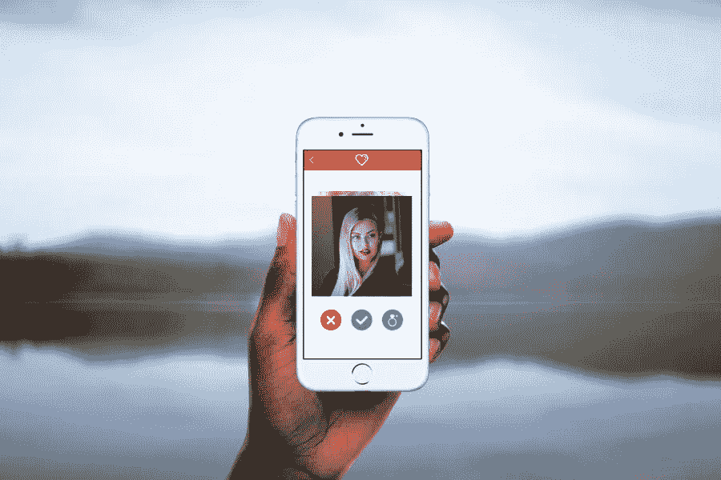

# 视觉美学:用人工智能技术判断照片的质量

> 原文：<https://medium.com/hackernoon/visual-aesthetics-judging-a-photos-quality-using-ai-techniques-6f2551cc9b0b>

视觉美学已经被证明对各种各样的结构有决定性的影响，比如感知可用性、满意度和愉悦度。然而，视觉美学也是一个主观的概念，因此，在训练机器学习算法来学习这种主观方面，视觉美学提出了独特的挑战。

鉴于视觉美学在人机交互中的重要性，机器充分评估视觉美学的概念至关重要。机器学习，尤其是深度学习技术，已经在目标明确的任务上显示出巨大的前景，例如识别图像中的对象或从一种语言翻译成另一种语言。然而，图像美学的量化一直是图像处理和计算机视觉中最难解决的问题之一。
我们决定建立一个深度学习系统，该系统可以高精度地自动分析图像并对其美学质量进行评分。请查看我们的[演示](https://www.paralleldots.com/visual-analytics)来检查你的照片的审美分数。

# 关于研究

我们提出了一种新颖的深度卷积神经网络，它可以被训练来识别图像的美学质量。我们还在训练算法时提出了多种黑客攻击，以提高准确性。

在我们发表于 [arxiv](https://arxiv.org/abs/1712.03382v1) 的论文中，我们提出了一种新的神经网络架构，它可以通过同时考虑低级和高级特征来有效地对数据进行建模。它是 DenseNets 的一个变种，在每个密集块的末尾都有一个 skip 连接。除此之外，我们还提出了可以提高算法训练精度的训练技术。这些方法是在 LAB 颜色空间上进行训练，并使用 minibatch 中的相似图像来训练算法，我们称之为相干学习。使用这些技术，我们获得了 AVA2 数据集的 78.7%的准确率。AVA2 数据集上的最先进精度为 85.6%，它使用了一个深度卷积神经网络，并在 imagenet 数据集上预先训练了权重。使用手工特征的 AVA2 数据集上的最佳精度为 68.55%。我们还表明，向我们的训练集添加更多的数据(来自不包括在 AVA2 中的 AVA 数据集)会将其在 AVA2 测试集上的准确率提高到 81.48%，因此表明模型随着数据的增加而变得更好。

# 视觉美学的使用案例

1.  **为您的社交媒体账户选择最佳个人资料照片**

社交媒体网站的应用程序开发者可以帮助他们的用户决定哪张照片最适合他们的个人资料图片。我们都曾在社交媒体网站上传照片或更改展示图片时面临焦虑。通过我们的 API 集成，应用程序开发人员可以帮助他们的用户永远保持良好的形象！
2。**约会应用**

好吧，现在这个用例可能对我们当中的禅宗、非唯物主义者没有吸引力，但老实说，约会导致了最大的社交焦虑。约会的前景也在不断变化，因此，如果你在约会应用程序上很活跃，选择你最好的照片以提高你正确刷卡的机会是很重要的！
约会 App 开发者可以轻松集成我们的 API，帮助他们的用户上传自己最好的照片；如果开发人员希望在他们的数据集上优化视觉美学模型，也可以对其进行微调。

**3。支持人工智能的照相手机**

最近，谷歌推出了 Pixel 2 和 Pixel 2 XL，这两款产品都具有人像模式。这款手机提供了人像模式，尽管它没有许多其他手机拥有的第二个镜头。例如，iPhone X、Galaxy Note 8、OnePlus 5……所有这些手机都提供人像模式，因为它们使用来自两个镜头的数据。一个镜头捕捉图像，另一个镜头捕捉深度信息，除了为模糊的背景提供一些焦距魔术。然而，Pixel phone 使用人工智能向用户提供 HDR+图像，这些图像可与 DSLR 相机点击的图片相媲美。

类似地，移动制造商可以通过集成视觉美学 API 来增强其本机相机的功能，让用户甚至在拍照之前就能实时了解照片的质量！这将使您的用户能够放心地分享他们的照片，最终您将在不增加硬件成本的情况下为您的品牌创造一个巨大的差异化优势。

**4。在线内容的病毒式传播**

内容为王，现在越来越难写出能引起观众共鸣的引人入胜的内容。然而，如今最好的内容通常都有很棒的图片来补充，因此，你必须包含一些能让你的视线继续向下移动的内容。
BuzzSumo 对超过 100 万篇文章进行了分析，发现每 75-100 个单词有一张图片的文章有更多的社交分享。使用我们的视觉美学工具，您可以快速检查您的图像有多吸引人，并相应地提高您的博客帖子的病毒式传播。你可以在这里查看演示[。](https://www.paralleldots.com/visual-analytics)

在这篇博文中，我们介绍了视觉美学 API 的一些用例。当机器变得比人更有能力判断这种主观内容时，它开辟了许多可能性来利用这些可能性，而这在当时是不可行的。你可以在这里阅读更多关于视觉分析的博客[。](http://blog.paralleldots.com/category/product/visual-analytics/)

您能想到任何其他激动人心的使用案例可以使用该技术解决吗？请在下面的评论中告诉我们，我们将在下一篇博客中讨论您的用例，并让您尽早使用这项技术。