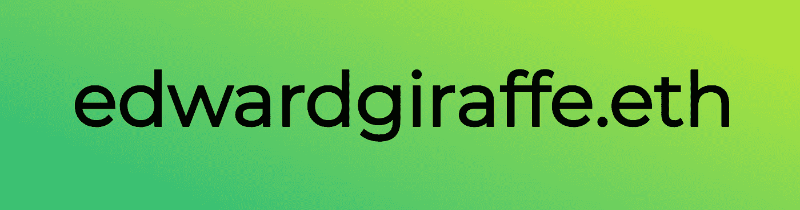

# 购买带 ENS 和 MyCrypto 的虚空以太坊地址的视觉指南

> 原文：<https://medium.com/hackernoon/visual-guide-to-buying-a-vanity-ethereum-addresses-with-ens-and-mycrypto-1b75f98139ca>

An ENS name, for your viewing pleasure.

## 没有什么比你的名字出现在区块链上更能说明“我对以太坊是认真的”

如果你像我一样，你可能有一些经常使用的[以太坊](https://hackernoon.com/tagged/ethereum)地址。此外，如果你像我一样，你可能是一个卡通长颈鹿。如果是这样，请伸出手来——我们应该挂。

总之，一遍又一遍地复制和粘贴同一个旧的 *0xaBc123…* style 地址可能会很乏味、无聊，而且容易出错。或者，但愿不会如此，您可能需要手动键入一个地址(protip:永远不要键入以太坊地址)。为你的以太账户取一个漂亮的、人类(长颈鹿)可读的名字不是很好吗？

嗯，以太坊名称系统(ENS)完全可以做到这一点。它的工作方式类似于 DNS——域名(例如[hambutton.com](https://hambutton.com/))映射到 IP 地址(34.193.187.110)。相反，我们给以太坊地址一个以*结尾的“域名”。eth* (如 edwardgiraffe.eth) *。*

购买互联网域名的过程非常简单——找到一个未使用的域名，去注册机构，点击购买。ENS 的情况并非如此。为了防止[域名抢注者](https://en.wikipedia.org/wiki/Cybersquatting)抢购所有好域名，一种拍卖形式被建立起来。ENS 拍卖的基础是这样的:

1.  发出你想买一个名字的信号。
2.  等待几天，并透露您的出价。
3.  如果你赢了，就完成你的出价。

因为这是我们正在谈论的以太坊，这整个过程发生在公共[区块链](https://hackernoon.com/tagged/blockchain)上。要获得更多的技术解释，请查看这个漂亮的可视化时间线…

 [## 以太坊名称服务投标的可视化时间表

### 还在想以太坊域名服务(ENS)的竞标流程是如何运作的？这个可视化时间表向您展示了…

medium.com](/the-ethereum-name-service/a-visual-timeline-of-an-ethereum-name-service-bid-20c368865f56) 

# 先决条件

在开始之前，你需要一点以太，和一个以太钱包，如 Ledger Nano、MetaMask 或 MyCrypto(以前称为 MyEtherWallet)。我将在本文中使用 MetaMask，因为他们有所有可用选项中最酷的徽标。如果你在安装 MetaMask 时需要帮助，请点击这里。我首先在 MetaMask 中创建了一个新帐户，并加载了 0.08 Ether。ENS 名称的最低出价是 0.01 英镑，所以至少要有这么多，再加一点汽油费。会有几笔交易。系好安全带。

MetaMask with a fresh account and no ETH. You will need some ETH.

# MyCrypto ENS

前往 MyCrypto.com，点击主菜单中的 **ENS** 链接。您应该会看到一个搜索框。键入您有兴趣购买的名称，看看是否有。如果是这样，太好了！我们可以继续。如果没有，你需要去二级市场，比如 https://namebazaar.io/的，我们假设你的名字是可用的，然后继续。

MyEtherWallet.com ENS page

通过从列表中选择一个选项来连接到您的 ETH wallet 在本例中是元掩码。点击*连接到元掩码*(或钱包的等效按钮)。

# 开始拍卖

对于*实际出价金额*，输入您愿意支付的最高 ETH 金额。如果你觉得厚颜无耻，在*出价掩码中输入更高的金额，*将隐藏你的实际出价。重要提示——您需要在钱包中实际准备好放入出价屏蔽中的 ETH 数量。

最后复制赠送给你的*密语*，点击*开始拍卖。*

将会出现一个重要的弹出窗口。照它说的做，截图(就像下面这张！).这也有助于复制靠近窗口底部的大块文本。

点击*是，我确定！进行交易。*您选择的钱包将为您提供一项交易以供提交。检查[https://ethgasstation.info/](https://ethgasstation.info/)以计算出合适的天然气价格，并提交交易。

一旦你得到交易 ID，你就可以去 [https://etherscan.io](https://etherscan.io) 在区块链上查找。

如果想在 etherscan.io 上获得更多乐趣，可以尝试输入相关的 ENS 名称。它会弹出一些有趣的拍卖数据。它还会让你知道日期，你需要透露你的出价。在你的日历上标出这些日期。如果你错过了“揭示”，你将失去你的 ETH！！！

# 展示你的出价(3 天后)

拍卖开始三天后，是时候公布你的出价了。你有两天的时间来做这件事，所以确保你有时间去做这件事。

回到 MyCrypto.com 的 ENS 区，输入你的 ENS 名字。点击*检查 ENS 名称*，它会告诉你是时候展示你的出价了。

还记得几天前的那个截图吗？还有那一大串带引号和弯弯曲曲的括号的文字？你会需要的。

如果有一长串文本，将其粘贴到第一个文本框中。如果一切正常，那么剩下的信息将自动填充。如果没有，请手动输入您的出价金额和机密短语。

点击*显示您的出价*后，您将看到一系列确认屏幕。

点击*是的，我确定！进行交易。*使用 MetaMask(或您选择的钱包)支付交易费用。交易*必须*来自用于投标 ENS 名称的同一地址。一旦完成，你需要再等两天来完成拍卖。

# 完成拍卖(2 天后)

再次回到 MyCrypto.com 的 ENS 页面，输入你的 ENS 名字。蓝色按钮现在应该显示，*完成你的姓名*。

点击按钮，确认您*真的*想要完成，并支付您的油费。这个步骤也必须由用于进行原始出价和显示交易的相同以太坊帐户来完成。

完成最终交易后，ENS 名称就是您的了！前往 etherscan.io 查看。它应该告诉你名字有人了，主人是你！

现在你所有的朋友都可以用你的名字发送以太和代币。在未来，你也许可以做一些简单的事情，比如在那个地址建立一个蜂群网站，或者把它转移到一个为三条腿的长颈鹿收钱的智能合同地址。天空是无限的。

如果你喜欢这篇文章，请鼓掌并在推特上关注我！