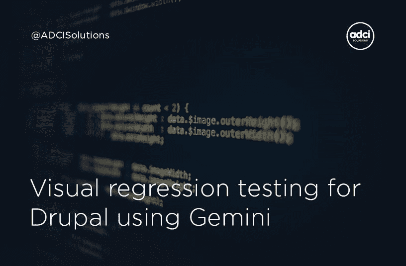

# 使用 Gemini 对 Drupal 进行可视化回归测试

> 原文：<https://medium.com/hackernoon/visual-regression-testing-for-drupal-using-gemini-b9fafe025f7>

## 常见的做法:在 CSS 文件做了小改动之后，测试很多页面。双子座让你摆脱这种浪费时间的行为。让我们看看如何

[By ADCI Soutions](https://www.adcisolutions.com/?utm_source=medium&utm_medium=referral&utm_campaign=medium-hacker-noon-gemini-mainpagewebsite&utm_content=medium-hacker-noon-gemini)

*回归测试*允许发现由之前的变更引起的错误。这在前端尤其明显。这是常见的做法——当开发人员在 *CSS* 文件中做了小改动后，不得不测试大量页面。

我认为那只是浪费时间。我们应该使这些过程自动化。虽然计算机视觉和人工智能可能能够解决这个问题，但现在很难使用这样的技术。因此，我们将只比较图像。为此，需要*截图* 的原页面和修改后的页面。有很多工具可以让你不用手动操作。但是我更喜欢用双子座。

*Gemini* 是 Yandex 开发的可视化回归测试工具。它可以与 Chrome、Firefox、IE8+和 Opera 12+兼容。此外，它支持一些网络驱动程序:Selenium 服务器，Chrome 驱动程序，PhantomJS 和云网络驱动程序，如 BrowserStack 或 SauceLabs。

要安装，运行*这个命令:*

另外，你必须有*网络驱动*和 png-img 工具。

请特别注意配置参数。我想强调几个最重要的问题:

*   rootUrl(必需)-将被测试的网站的 Url
*   grid Url——一个用于截图的网络驱动 URL
*   截图目录—保存截图的目录
*   公差——两张截图之间的最大允许偏差
*   窗口大小—浏览器窗口的尺寸
*   截屏模式—图像捕捉模式(整页或视窗)

*Gemini* 使用. gemini.yml 文件进行配置，但是您可以通过命令行标志覆盖所有设置。

**如何与双子座共事**

一开始，你必须运行你的网络驱动。*例如*，如果使用 PhantomJS，执行该命令:

因为您目前没有参考图像来与下面的截图进行比较，所以您需要捕捉它们。快跑吧

双子星座将为你的测试生成新的参考图像。之后，您可以将它们与页面的当前状态进行比较。

如果您的测试失败， *Gemini* 将在“报告”文件夹中生成新图像，显示差异。

**如何编写双子测试**

这很容易。您需要创建一个新的测试文件(例如 test.js)并在其中定义 gemini.suite 方法。让我们看一个简单的例子:

该方法的第一个参数是您的*测试套件*的名称。然后我们描述一个我们想要测试的页面(在这个例子中是主页)，这个页面上的一个元素和一个要捕获的新状态。

**如何扩展双子座**

*双子*支持插件系统，可以扩展其功能。你可以在[这个资源库](https://github.com/gemini-testing)里找到很多有用的插件。如果没有你需要的，写一个新的也很容易。

*双子插件*只是一个 npm 包。看*这段代码*:

您需要定义一个函数来接收 *2 个参数:*一个 Gemini 对象和必要的选项。

**后记**

我希望这篇文章对你有用，现在你明白了*可视化回归测试*有多简单。你将不再需要浏览所有页面。现在你可以享受开发过程了。

*原载于*[*ADCI 解决方案网站*](https://www.adcisolutions.com/knowledge/visual-regression-testing-drupal-using-gemini?utm_source=medium&utm_medium=referral&utm_campaign=medium-hacker-noon-gemini-article&utm_content=medium-hacker-noon-gemini) *。*

**作者是 ADCI 解决方案公司的团队领导 Erlan Aytpaev**

多年的经验使 Erlan 成为一名出色的全栈专业人员，他不断学习新技术并在我们公司采用这些技术。他声称每个新项目都教会他从不同的角度看待平常的事情。

**在社交网络上关注我们:** [Twitter](https://twitter.com/ADCISolutions) | [脸书](https://www.facebook.com/adcisolutions/) | [LinkedIn](https://www.linkedin.com/company/adci-solutions/)

 [## 用 BackstopJS 进行可视化回归测试

### 项目越大，每次变更后花在回归测试上的时间就越多。BackstopJS 是一种工具，它…

codeburst.io](https://codeburst.io/visual-regression-testing-with-backstopjs-bc749615191a)