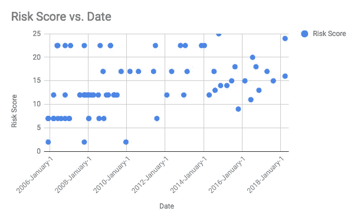

# 可视化 Drupal 安全顾问数据

> 原文：<https://medium.com/hackernoon/visualising-drupal-security-advisory-data-c802fead0d7e>

Drupalgeddon 2.0 带来了对 Drupal 安全计划及其实践的大量关注。安全团队主动披露信息的方式，以及与开发者、社区和媒体沟通的方式值得称赞。除此之外，交流是持续不断的。

3 月 28 日开始的风险分值为 21/25 的[漏洞](https://www.drupal.org/node/2956770/revisions/10900566/view)在 4 月 13 日升级为 [22/25，最终在 4 月 14 日被标记为](https://www.drupal.org/node/2956770/revisions/10921333/view) [24/25。](https://www.drupal.org/sa-core-2018-002)如果你对这些天来分数的变化感兴趣，你可以查看修订版并自己比较[这里](https://www.drupal.org/node/2956770/revisions)。

我们观察到的一件事是，尽管进行了所有的交流，但没有多少人知道细节和术语。安全风险级别在[安全风险级别定义页面](https://www.drupal.org/drupal-security-team/security-risk-levels-defined)中有明确的定义，但看起来仍没有多少人仔细阅读。这种直觉基于对来自印度三个不同城市的大约 100 名开发人员的抽样调查。虽然这可能不是一个实际的表现，但它仍然突出了一个需要解决的问题。如果 Drupal 协会把这个问题加入到他们的调查中，那就太好了。“您是否阅读了[https://www . Drupal . org/Drupal-security-team/security-risk-levels-defined](https://www.drupal.org/drupal-security-team/security-risk-levels-defined)”选项为“是”和“否”。这将为我们提供更多见解。如果开发商自己不知道这些细节，我认为让建筑商知道这些并采取纠正措施是一个过分的要求。因此，我们创建了一个简单的静态文件，让人们可以很容易地理解安全字符串的含义，如[24∕25 AC:none/a:none/ci:all/ii:all/e:exploit/TD:default](https://www.drupal.org/security-team/risk-levels)。虽然安全分值是不言自明的，但是第二部分通常会难倒许多人。

*你可以在*[*https://nkgokul.github.io/drupalsecurity/*](https://nkgokul.github.io/drupalsecurity/)*上查看。*

一旦你输入类似“24∕25 AC:none/a:none/ci:all/ii:all/e:exploit/TD:default”的安全字符串，它会给出一个人类可以理解的描述。这是一个未经验证的非常粗糙的版本。如果有人能清理干净就太好了。

完成后，我们希望对迄今为止发布的安全公告进行基本分析，并了解每个安全公告的安全分值。虽然官方的[安全跟踪记录](https://www.drupal.org/drupal-security-team/security-track-record)有一些细节，但不是最新的，也不够详细。所以我们开始收集数据。尽管有 API 端点，如

> 【https://www.drupal.org/api-d7/node.json?type=sa】*&状态= 1*[*https://www.drupal.org/api-d7/node.json?taxonomy _ forums = 1852*](https://www.drupal.org/api-d7/node.json?taxonomy_forums=1852)[*https://www.drupal.org/api-d7/node.json?分类学 _ 论坛=1856*](https://www.drupal.org/api-d7/node.json?taxonomy_forums=1856)

我们觉得标准化这些终点的数据工作量太大。所以我们采取了不同的方法从 https://www.drupal.org/security 收集数据。这不是一项简单的工作，也不像我们最初想象的那么容易。我们采用的途径是利用我们良好的旧谷歌文档和一些查询来搜集 https://www.drupal.org/security 的信息。

由于数据不一致，我们不得不根据发布这些公告的不同时间窗口使用不同的查询。在完成第一轮搜集后，我们做了一些数据操作，以我们想要的格式获得所有相关数据。

下一个挑战是使用两种不同的方法。2014 年 8 月 6 日发布 [NIST 常见误用评分系统(NISTIR 7864)](http://www.nist.gov/itl/csd/cmss-072512.cfm) 机制用于对漏洞进行分类和评分。这样数据的结构就更好了。在此之前，Drupal 团队有自己的漏洞分类方法。

*你可以在这里读到它们——*[*https://www . Drupal . org/Drupal-security-team/security-risk-levels-defined*](https://www.drupal.org/drupal-security-team/security-risk-levels-defined)

为了获得一些有意义的见解，我们希望获得 2014 年 8 月 6 日之前报告的漏洞的安全风险评分。因此，根据新的指导方针和之前公布的漏洞的安全风险级别，我们进行了反向映射。

> *对于高度关键，我们给了 22.5 分，*
> 
> *批判我们给了 17，*
> 
> *中度临界我们给了 12，*
> 
> *不太关键我们给了 7 和*
> 
> *不关键我们给了 2。*

虽然这些数字不准确，但这给了我们一个宽泛的概念。为了获得准确的评分，我们需要对 NISTIR 7864 中定义的六个风险指标进行评级。这可能很耗时，因此我们暂时搁置。如果有人能按照新的指导方针来评价旧的 SAs，那就太好了。如果你想深入了解它，你可以在这里自由地做——Drupal 核心漏洞分析。所有用户都有编辑权限。因此，请继续更新以橙色标记并带有文本“详情不可用”的列 H 到 M。完成后，您还可以更新 G 列，并且可以在[https://security.drupal.org/riskcalc](https://security.drupal.org/riskcalc)中使用这些值来找出风险分值。

根据目前可用的数据，我们做了一些可视化。

这是使用谷歌电子表格创建的。正如您所看到的，sa 的数量已经随着时间的推移而减少，特别有趣的是，得分低于 10 的漏洞在 2010 年 1 月后大幅减少。我不确定这是否可以归因于当时的自动化工具。

使用来自 Google 电子表格的数据，我们在 PowerBI 中创建了一些交互式地图。

你可以在这里查看这些[互动地图。](https://app.powerbi.com/view?r=eyJrIjoiNTJjMThmY2UtOTk2Ny00NDIxLWI3YmYtOWJiM2MzZTk1YTdjIiwidCI6ImI2OWIxZjY3LWI1MTItNDQ2NS04OTEwLWZkM2U3NDJmZDk1YSJ9)