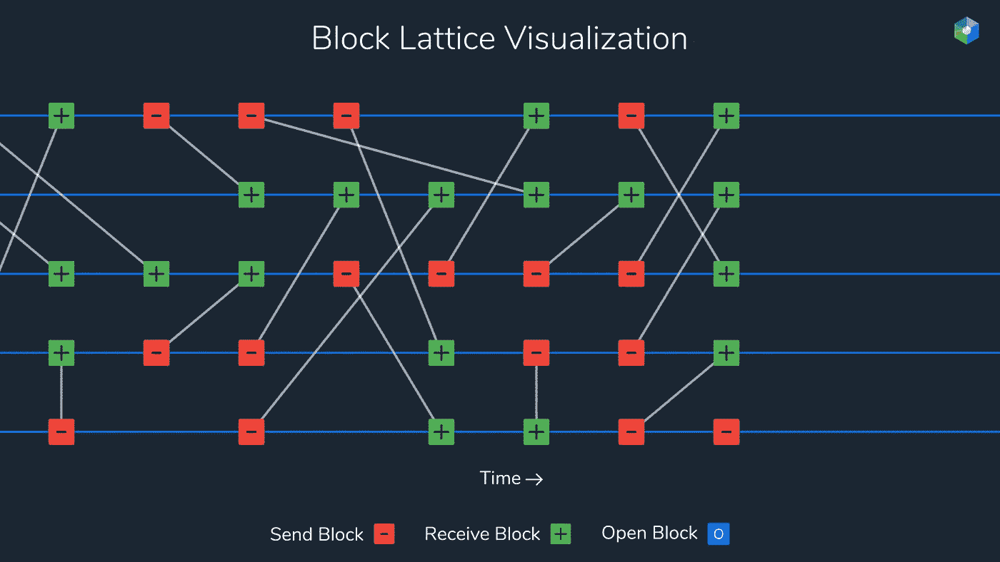

# 想象纳米是如何工作的

> 原文：<https://medium.com/hackernoon/visualizing-how-raiblocks-works-8c70678ef082>

NANO(原 RaiBlocks)是一种基于 DAG 和 block-lattice 数据结构的加密货币，是一种新技术，不同于比特币和所有其他加密货币。消除了对采矿的需求，实现了几乎即时的零利率交易。下面是一些简单的动画，展示了 NANO 的一些设计特点。

# 块点阵可视化

NANO 的每个帐户都有一个区块链，由帐户的私钥控制，每个区块链复制给网络中的所有对等体，我们称这种安排为块格。

余额通过发送和接收块在区块链之间转移。发送块减少账户余额，并通过账号将增量标记为应收。在稍后的时间，接收账户创建接收块，该接收块将他们账户的余额增加该增量。

*更多详情:*

# *分类帐修剪(开发中)*

*由于每个账户都有自己的区块链，因此精简版的同行能够更有选择性、更积极地削减区块链。只有 bootstrap 或对完整分类帐验证感兴趣的同行才需要存储完整的分类帐历史记录。*

*这段视频只是展示了一个大概的视觉例子，是不准确的。*

**更多详情:*[*https://github.com/clemahieu/raiblocks/wiki/Design-features*](https://github.com/clemahieu/raiblocks/wiki/Design-features)*

# *双重支出和确认*

*这是一个简短的动画，展示了确认和分叉解决(双支出)的过程。*

*NANO 使用利害关系证明而不是工作证明作为共识协议。在 PoS 系统中，参与者投票的权重相当于他们在给定加密货币中拥有的财富量。在这种安排下，那些拥有更多金融投资的人被赋予了更大的权力，并受到内在的激励来维持系统的诚实性，否则就有失去投资的风险。PoS 消除了浪费计算能力的竞争，只需要在低功耗硬件上运行轻量级软件。*

**更多详情:*[https://github . com/clemahieu/rai blocks/wiki/Double-spending-and-confirmation](https://github.com/clemahieu/raiblocks/wiki/Double-spending-and-confirmation)*

*从视频中摘录的一些 gif:[https://imgur.com/a/Uozo2](https://imgur.com/a/Uozo2)*

*欲了解更多信息，请参见 [wiki](https://github.com/clemahieu/raiblocks/wiki) 或阅读 NANO [白皮书](https://raiblocks.net/media/RaiBlocks_Whitepaper__English.pdf)*

****提示:使用*** `***shift + <***` ***降低 youtube 视频播放速度****

***如果你喜欢这个帖子，分享和/或考虑给我买杯咖啡:)** *xrb _ 1 o9 p 7 xkk 5 NNC 1 q 7 nunp 3 tecsmi 7 twyagw 8 DD top 1 h1 k 4 iow pker ww 9 fdzt**

* [## RaiBlocks 4k 壁纸系列

### 通过 Behance

medium.com](/@lucasols/raiblocks-4k-wallpapers-collection-b2dc37c7f426)*