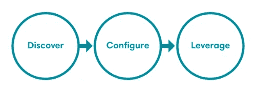
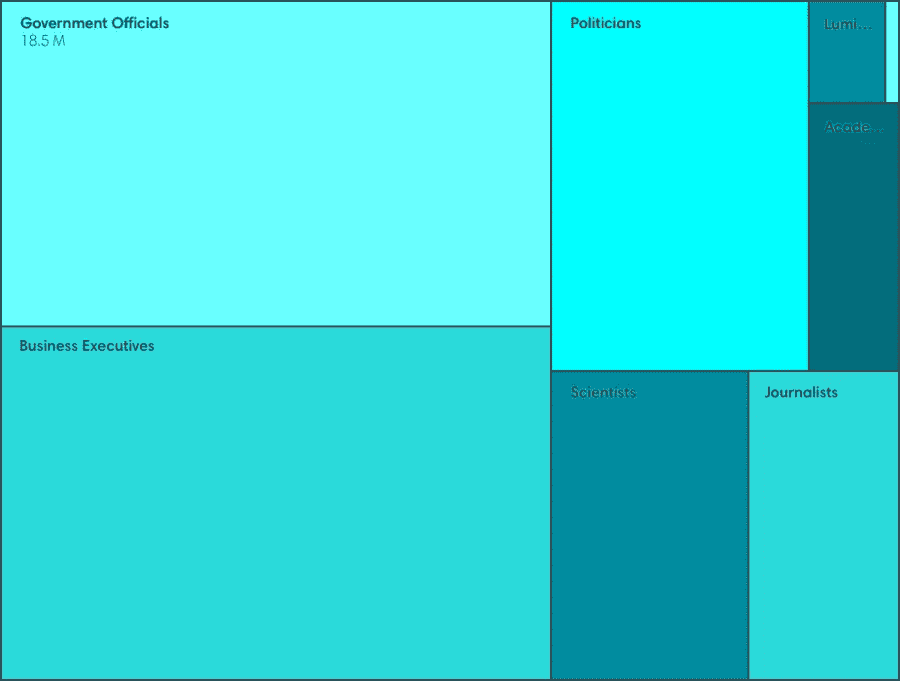
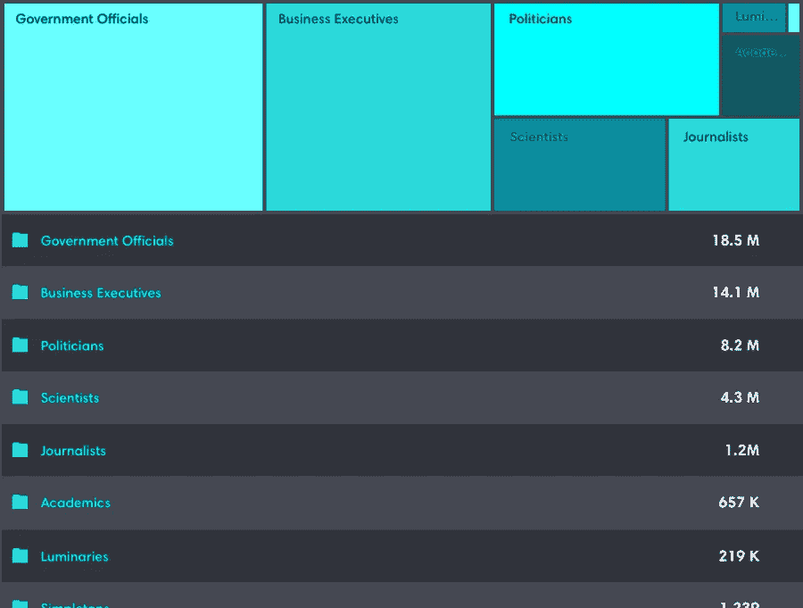
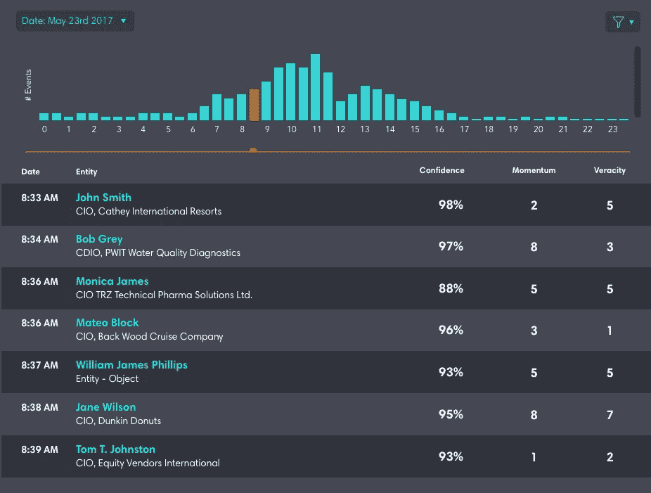
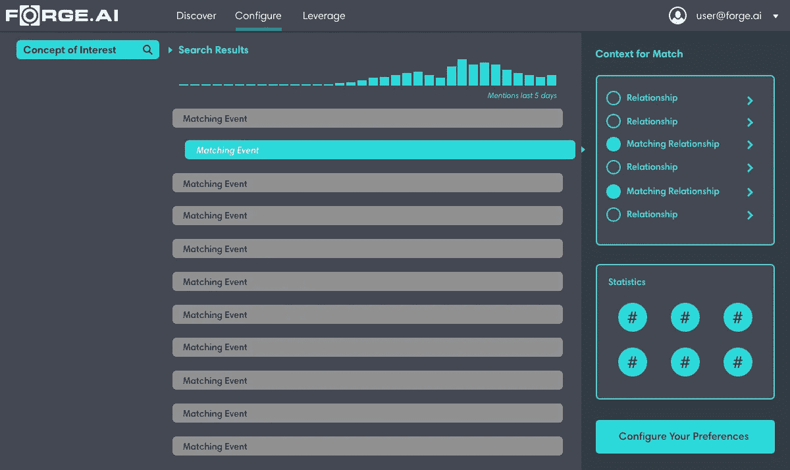
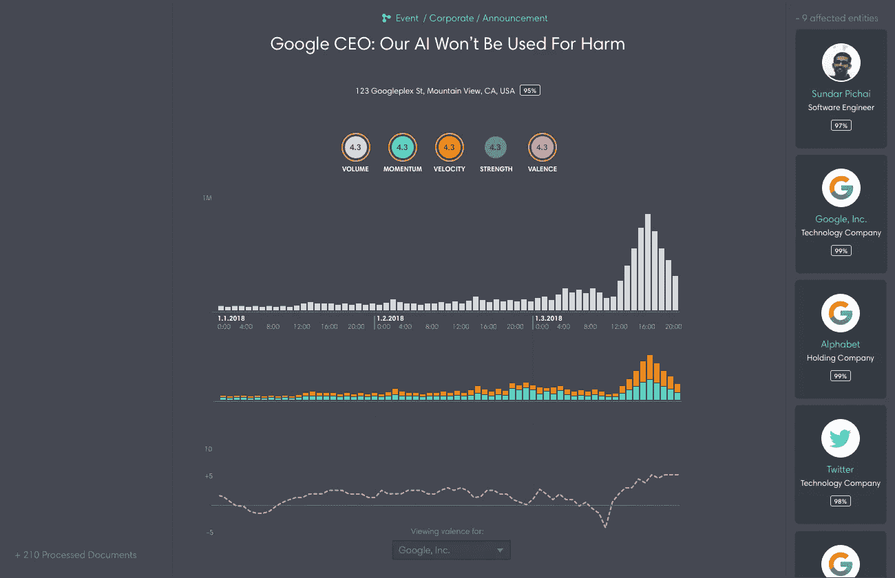
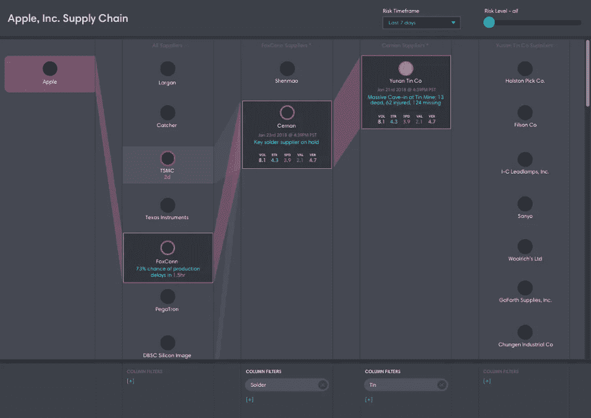

# 在 Forge 可视化知识。人工智能

> 原文：<https://medium.com/hackernoon/visualizing-knowledge-at-forge-ai-c9bb6797341>

作者:[米·贾尔斯·菲利普斯](https://medium.com/u/fc924a63614e?source=post_page-----c9bb6797341--------------------------------)

[Forge](http://www.forge.ai) 获取非结构化数据，并将其转换为结构化事件流。这些事件流在转换过程中被丰富了知识，并以机器就绪的方式实时交付以描述世界上发生的事情。我们的结构化事件流使下游人工智能系统能够根据我们的数据进行推理，同时使人类分析师能够开发和验证有关特定事件或一系列相关事件在相关领域的影响的新假设。

为了实现这一价值，我们必须帮助客户了解我们数据的范围和结构，以及如何利用这些数据。交互式数据可视化已经成为我们用户体验的一个重要方面，因为它们提供信息、教育、推动探索，并最终使我们的客户能够配置他们的数据流以满足他们的特定需求。

# 挑战

设计 Forge 可视化时最直接的挑战。人工智能数据是数据的绝对规模——它既是高容量的，又是高速度的——这使得它很容易淹没用户。我们的结构化事件数据也具有显著的丰富性、维度性和多样性，因此不容易用标准的可视化来描述。真实和准确的表示是最重要的，这使得通过我们的任何交互式视觉体验清楚地建立数据上下文变得至关重要。通过我们的设计，我们必须激发探索和发现，同时允许事件流的知情配置。总的来说，这些目标意味着我们的交互式用户体验不能过于复杂，概念上不能过于复杂，也不能难以理解。

# 方法

我们的方法不是专注于仪表板和配置屏幕，而是设计一个直观的交互式可视化序列，使客户能够逐步发现我们数据的丰富性，然后在上下文中指定感兴趣的数据。在客户旅程的特定点上，精心制作了聚焦的可视化，以使客户能够实现特定的目标。这些点由三个特定的客户旅程阶段定义:

*Figure 1: Stages of the Forge.AI Customer Journey*

接下来是我们一直在积极探索的一组可视化效果，以支持这一客户之旅的各个阶段。

# 第一阶段:发现

伪造数据包含几种不同类型的知识。我们的数据包括关于各种实体和概念的知识，如人员、产品、组织和位置。它还包含关于这些不同实体如何相关的知识以及实体之间发生的特定类型的事件；例如，人员 A 是组织 B 的首席执行官，或者人员 A 已经离开了她在组织 B 的职位。除此之外，我们的数据还包括许多计算出的统计测量值，例如，反映描述事件的特定故事的势头或真实性，以及关于最初获得的非结构化数据的各种其他元数据。总之，这些方面说明了锻造的不同方面。我们必须为客户可视化的人工智能事件流。

[树形图](https://en.wikipedia.org/wiki/Treemapping)是分级[分类](https://www.forge.ai/blog/hierarchical-classification-at-forge.ai)数据的通用表示，特别是在交互式体验中实现时，使用户能够扩展到任何感兴趣的特定节点。当与父容器的面包屑配对时，这种可视化可以提供复杂分层数据集的简单向前/向后导航。Treemaps 还可以可视化每个级别的几个维度的数据，用大小、颜色和上下文标签来表示。综上所述，这些属性构成了高度可探索的密集数据可视化，同时强化了数据上下文。然而，这种表达能力是有代价的:对于许多用户来说，树形图不是直接直观的，它们的具体细节必须通过经验来学习。

*Figure 2: A Treemap showing Hierarchical Entity Categories. Size represents the number of entities within a category, while color represents popularity of the category on a scale of 1–5.*

因为树状图有这种前期认知成本，我们已经探索了使它们更直观的方法。一种选择是在更传统的搜索或浏览体验的上下文中引入树形图，然后在用户表示感兴趣时展开树形图视图，如图 3 所示:

*Figure 3: A Treemap shown in context.*

在这里，树形图对于下面的列表来说是部分冗余的，但是它作为正在探索的部分的快速、可扫描的可视图，而下面的列表帮助向用户解释树形图中至少一个(可能更多)可视元素的含义，在这种情况下是盒子大小和实体计数之间的相关性。

我们还探索了其他的上下文可视化。在下面的概念中，我们将一系列事件的时间信息可视化。[时间序列](https://en.wikipedia.org/wiki/Time_series)可视化是交互式的，你可以点击一个时间单位并过滤下面的列表。这为客户提供了随时间变化的即时和直观的量感，同时还允许对特定时刻进行快速和集中的调查。

*Figure 4: Temporal Visualization in an Event Space.*

上面的可视化设计旨在让客户能够探索我们的数据，不仅发现具体的见解，还发现感兴趣的一般领域。虽然底层的 Forge 处理创建了一个不断更新的实时信息流，但这些发现体验将由最近处理的历史数据的子集来推动，这些数据将为一个交互式系统(如所描述的系统)编制索引。

# 阶段 2:配置

我们的客户有各种各样的需求，需要完全控制他们想要传输的数据类型。例如，一个客户可以包括或排除涉及特定组织的事件，而另一个客户可能对产品公告感兴趣。一些客户可能只有几个标准，而另一些客户可能有很多。此外，随着客户自身需求和兴趣的发展，他们需要不断扩展或完善这些选择的能力。我们认为这种持续的用户需求就是事件流配置，我们的客户能够在旅程的任何阶段创建准确和完整的配置设置是至关重要的。

我们的客户需要一种灵活的配置体验，让他们能够坚持自己的标准，检查/验证其配置提供的数据，然后轻松修改其设置。配置体验需要灵活、高效且易于使用。

*Figure 5: Filter Configuration with Contextual Knowledge Display*

在图 5 中，您可以看到我们正在探索的一种设计模式，它使客户能够配置一组过滤器，以定义我们应该实时向他们传输哪些数据。在设计中，用户在左侧指定了感兴趣的概念，并在中间面板提供了即时(历史)事件数据预览。在右边的面板中，我们展示了一系列上下文相关的[卡片](https://www.nngroup.com/articles/cards-component/)，以提供所选事件的更多细节。这些卡片结合了关系知识和统计数据的图表，以帮助用户在配置过程中发现、理解和探索关系。

我们的设计目标是，用户将能够探索数据，评估其中的知识，并自信地对这一感兴趣的领域做出明智的配置决策。随着上下文中数据的增加，搜索交互使得用户能够验证感兴趣的概念的肯定匹配，并且还能够基于所呈现的数据来转移她的范围或焦点。

# 第三阶段:杠杆作用

一旦我们的客户准确配置了他们希望从 Forge 接收的数据。人工智能，他们可以开始利用这些数据来增强他们的业务流程。Forge 支持无数的业务用例，其中一些涉及到交互系统或可视化，这些系统或可视化包含了我们的数据以支持业务或分析决策。

*Figure 6: A Structured Event Representation*

我们的数据中表示的主要知识单元是一个**事件**。我们为我们知道的每一个事件创建一个结构化的表示，以便让我们的客户能够使用数据做出合理的假设或断言。该事件数据被设计为由下游计算系统或通过监控应用程序使用。图 6 是对后者的探索，由我们的事件数据的各种结构元素组成，使用了直方图、线图和卡片的组合。

*Figure 7: Supply Chain Risk*

图 7 显示了另一个更复杂的例子:一个可视化，它基于我们对实体关系的丰富知识来显示复杂供应链中发生的事件导致的风险。这个接口用统计和关系信息扩展了经典的[米勒列](https://en.wikipedia.org/wiki/Miller_columns)模式。这种接口最初可以实现为在存在异常事件量的情况下发出或记录信号，但最终可以通过分析进行扩展，该分析可以预测某些事件类型对供应商和消费者造成的影响的时间和程度。

# 后续步骤

我们正处于可视化锻造之旅的早期。人工智能知识对我们的客户来说是鼓舞人心的。未来工作的一个主要领域是继续扩展和改进我们的过滤经验。过滤是一个至关重要的配置步骤，需要丰富上下文知识——我们当前的 UI 原型将需要大量的额外迭代和测试。我们将评估我们对各种实体之间关系的知识的不同可视化。最后，我们将重点探索结构化事件数据本身的新的和不同的表示，以及我们用来对事件进行分类的本体，以便为我们的客户提供各种用例。

这里强调的概念和原型将随着我们从用户那里学到的更多而继续发展。一些概念将成长为我们用户体验的核心方面，而另一些将被作废和搁置。在博客上，我们将不时地回到数据可视化的话题，因为我们重复我们的产品体验，展示我们的成功和经验教训。

# 结论

锻造。人工智能数据通过 API 或代理直接消费，并被各种下游系统利用；这些系统不一定直接可视化我们的数据。事实上，我们已经将我们的数据设计为最适合用于下游数据建模过程。即便如此，我们交付数据的交互式可视化的能力是至关重要的。我们的可视化工具可以让客户了解我们数据的本质，通过发现和探索向客户展示我们数据的强大用途，并使数据高效地流向客户。

随着我们对客户的目标、需求、挫折和障碍的了解越来越多，我们已经开始确定一套视觉体验，以支持特定时刻的特定用户需求。我们发现，在我们早期的概念和原型中，数据的上下文显示和数据不同方面的渐进揭示是最有前途的方法。