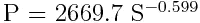
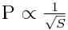

# 可视化加密资产人口统计学(第一部分)

> 原文：<https://medium.com/hackernoon/visualizing-the-cryptoassets-demography-part-i-c9eb5427d899>

在过去几年中，加密货币获得了很大的吸引力。过多的货币已经出现，更多的货币还将出现。目前，截至 2018 年 5 月 29 日， [Coinmarketcap](https://coinmarketcap.com/all/views/all/) 报告了超过 1633 种不同的硬币，每种硬币都有自己的一套目标、角色和目的。对于开发人员和团队来说，启动他们自己的项目和部署他们的新硬币已经变得相对容易。相反，新来者已经很难理解这个领域的[人口统计](https://hackernoon.com/tagged/demography)，因此，他们越来越不愿意投资。早期投资者无法跟上增长的步伐，错过了关键的投资。此外，在这场[寒武纪大爆发](http://burgess-shale.rom.on.ca/en/science/origin/04-cambrian-explosion.php)中，许多欺诈和骗局已经开始滋生并钻了出来。

我们在 zk Capital 所做的部分工作是教育投资者和公众关于加密空间，作为我们对去中心化未来愿景的一部分。我们利用我们团队的最佳多样化技能，并将其应用于各个方面，其中之一就是数据分析。数据分析定义了收集、清理和建模数据以推断相关性和预测未来行为的过程。

我们决定创建一个**系列**，致力于分析加密货币的数据，并将我们的结果可视化，以便普通读者可以访问。在第一篇媒体文章中，我们将详细介绍[加密资产](https://hackernoon.com/tagged/cryptoassets)人口统计，特别是，我们将举例说明:

## 1-每个类别的市场规模分布

## 2-每个类别的领先资产

## 3-资产价格和供给之间的量化关系。

# 可视化人口分布

Interactive chart for the Marketcap distribution of cryptoassets per category. The categories are not mutually exclusive, meaning that a cryptoasset can be tagged by several categories. Note: this chart is interactive, [use this link to zoom in](https://plot.ly/~Elseidy-zk/11/).

如前所述，coinmarketcap 上大约有 1633 枚硬币。这使得很难区分各种加密资产。解决这个问题的一个方法是将空间划分为不同类别的子集，使我们能够独立于其他部分关注和理解每个部分。例如，我们可以了解每个部门的市场规模，从而量化每个类别中的资本量和投资者兴趣。

我们发现的一个问题是，这些数据无法通过网络访问。因此，我们必须设计自己的自动化方法来收集数据，并使用高级数据分析工具，如聚类和主题建模(L [atent Drichlet 分配](https://en.wikipedia.org/wiki/Latent_Dirichlet_allocation))。上面的饼图展示了加密资产领域 130 个不同类别的市场分布。请注意，属于数字货币类别的资产(如 BTC、Dash、LTC)占据了饼图的大部分(约 2620 亿美元)。其次是智能合约平台(如以太坊、EOS、NEO 等)，销售额超过 980 亿美元。这些观察并不令人惊讶，因为最近的兴趣(公众和投资者)集中在设计新的可伸缩区块链和数字货币上。另一个观察结果是，隐私币和分散式交易所并没有像媒体所说的那样获得同等的投资兴趣。前者约占总市值的 2%，而后者在 0.25%以内。继续和图表互动，找到你喜欢的硬币的市场规模。

# 确定每个类别的领先资产

将数据分类后，我们可以做的另一件事是查找哪些资产领先于其空间(按市值)。这可以帮助投资者了解哪些项目已经获得势头、网络效应和投资分配。下表给出了该数据的详细描述。

The leading asset, and its marketcap in USD, for each category in the cryptocurrencies space. Note: this chart is interactive, [use this link to zoom in](https://plot.ly/~Elseidy-zk/38/#/).

# 可视化加密资产价格和供应之间的关系

加密货币的主要宣传优势之一是供应有限。[供给和需求](https://en.wikipedia.org/wiki/Supply_and_demand)是一个众所周知的经济模型，有助于确定资产的价格。一个流行的说法是，供应越有限，需求就越有可能增加，从而导致价格上涨。我们可以在加密货币中看到同样的行为。下面的交互图演示了这种行为:

Price in USD (y-axis) vs Available supply (x-axis) represented in **log-scale for** all coins as of 29 May, 2018\. Sizes of data points represent rank in market cap. The regression function (purple line) for this chart is: *Price = 2669.7 * (supply)^-0.599\.* Note: this chart is interactive, [use this link to zoom in.](https://plot.ly/~Elseidy-zk/1/?share_key=oABNWVgGeXFSE4ukltLLcR)

该图表绘制了截至 2018 年 5 月 29 日来自 [Coinmarketcap](https://coinmarketcap.com/all/views/all/) 的所有 1633 种加密货币的美元价格(y 轴)与可用供应量(x 轴)。x 轴和 y 轴都用**对数刻度**表示。每个数据点的大小反映了硬币按照市值的排名。

从互动情节中，我们可以观察到几点:

1.  大多数硬币存在于 100 万到 10 亿硬币的供应量范围内。此外，它们中的大多数价格标签范围在 0.01-1 美元之间。
2.  不出所料，随着供应量的增加，价格往往会下降。然而，更有趣的是了解价格下降相对于供给增加的速度。我们能找到一个表达这种关系的函数吗？

在数据分析中，我们有一个称为[回归](https://en.wikipedia.org/wiki/Regression_analysis)的常用分析工具，它试图通过将输入数据拟合到输出函数中来估计变量之间的相关性，在这种情况下，变量是价格和供应。我们对基础数据运行了几个回归工具，发现下面的**幂**函数最适合，其中 P 是价格，S 是供应。

该函数类似于图中的紫色线。注意，这是**而不是**一条直线，因为它绘制在 [**双对数图**](https://en.wikipedia.org/wiki/Log–log_plot) **中。**
这里有趣的一点不是常数 *2669.7* ，而是 P 和 s 的关系，第一，两者成反比，非常有道理。其次，也是更有趣的一点是，函数并不完全与电源成反比。

## 图表显示，硬币价格大约与供应量的平方根成反比。

## 换句话说，随着硬币供应量的增加，其价格的衰减会减少。

这意味着价格( *P)* 线在开始时快速衰减，但随后随着供给( *S)* 的增加，价格线快速稳定，变化非常小。这表明，在某个阈值之后，增加供应不会对价格产生强有力的影响。

我们试图在不同的数据集群上验证这一观察结果。我们没有在 1633 枚硬币的整个数据集上拟合一个函数，而是试图将它拟合到不同的硬币类别中，结果显示了类似的趋势。这里有两个图表展示了这种行为。

Price in USD (y-axis) vs Available supply (x-axis) represented in **log-scale for** all game coins as of 29 May 2018\. Note: this chart is interactive, [use this link to zoom in.](https://plot.ly/~Elseidy-zk/14/)

Price in USD (y-axis) vs Available supply (x-axis) represented in **log-scale for** all privacy coins as of 29 May 2018\. Note: this chart is interactive, [use this link to zoom in.](https://plot.ly/~Elseidy-zk/16/)

# 结论

数据分析和可视化是投资者必不可少的工具。它们有助于理解投资领域，推断相关性，并做出合理的投资决策。这篇文章是对加密资产的人口统计学的介绍。我们举例说明了加密资产的不同领域；确定每个类别中的主要资产，并量化价格和供应之间的关系。

# 如果你喜欢这篇文章，或者如果你有任何进一步的问题或图表要求，请通过 [Twitter](https://twitter.com/Drmelseidy) 或 [LinkedIn](https://www.linkedin.com/in/mohamed-elseidy/) 联系我。

***免责声明:本文信息仅供教育之用，不能作为投资建议。***

