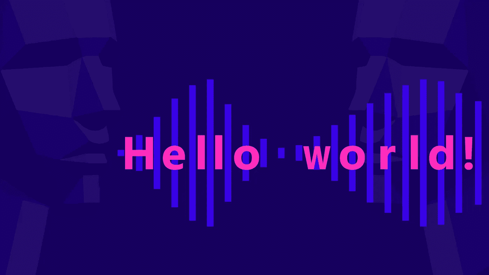

# 语音作为自然的用户界面

> 原文：<https://medium.com/hackernoon/voice-as-a-natural-user-interface-d8a1dd265341>

在家里，我妈妈有两个最好的语音识别系统。他们会理解她所说的一切，有时甚至会根据她所说的去行动。他们可以做简单的事情，比如开灯、换电视频道，也可以做复杂的事情，比如破译她手写的笔记，从特定的商店购买特定的东西，甚至在找不到东西的情况下去替代商店。当她说“关掉”并关掉煤气或调低电视音量时，他们能理解她的语气。这些先进的语音识别系统可以通过获得新的技能做更多的事情，并随着时间的推移不断升级自己。他们中的一个学习如何设计建筑，而另一个学习历史。

这一切并没有持续多久。因为几年后，我和姐姐搬出了房子。

很长一段时间以来，人类一直试图通过添加像鼠标和键盘这样的装置来使机器更有用，最近我们添加了一个触摸界面。但是，有什么方法比简单地告诉机器做什么更方便呢？演讲可以说是与任何人或任何事物互动的最自然的方式之一。像打印文件这样简单的事情在当前的系统中很难完成(更糟糕的是，如果你必须配置打印机)。告诉它打印这该死的文件不是很好吗？

我敢打赌，语音界面将是终极计算机的关键部件之一。然而现在，我们有一些问题。你的宠物能在一百多码外认出你。你的配偶仅仅通过你的表情和肢体语言就能知道你什么时候心情不好，并对你做出相应的反应。他们知道自己什么时候做错了。

你的电脑不知道你是难过还是生气。目前，它甚至不知道你是否在房间里。

我们面临的挑战不是设计更大的屏幕，更好的音质，更好的外观和更容易使用的图形用户界面。就是让机器理解你，并根据你的需求对你做出反应。计算机应该能够理解人类日常互动的各种语言和非语言方式。在特定情况下，当我向桌子对面的朋友眨眼时，我和他都明白我们的意思。不用说一句话就说了很多。

有趣的是，你们中的许多人已经在思考如何解决这些问题。有足够的技术可以引发很有可能成为解决方案的想法。

最好的界面是没有界面。当你和一个人说话的时候，你和他们说话的时候不按任何按钮(或者你有吗？).一开始你可能会意识到他们的表情和手势，但很快这种交流就占据了主导地位。这是自然的。

> 我们需要设计更像人类而不是界面的机器。

我们需要设计更像人类而不是界面的机器。与此相反，大多数设计师专注于试图让愚蠢的机器更容易被聪明人使用。可用性是一个如此引人注目的目标，以至于我们经常意识不到大多数人根本不想“使用”一台机器。他们只想完成一些事情。如果让我们设计一部电话，我们可能会设计一部更好看的智能手机。然而，电话的问题不在于找到更好的拨号或联系方式。人们不想那样做。他们想要的只是联系到其他人。界面通常是一个障碍。

**参考文献:** 1。[被数字化——尼古拉斯·尼葛洛庞帝](https://amzn.to/2ulb0NC)2。设计语音用户界面— Cathy Pearl
3。[语音接口设计—劳拉·克莱因](https://amzn.to/2ujvB4Z)4。[日常用品的设计——唐·诺曼](https://amzn.to/2zr9hMF)

**如果您喜欢这篇文章，请点击👏按钮(一次、两次或更多次)。
分享帮别人找！**