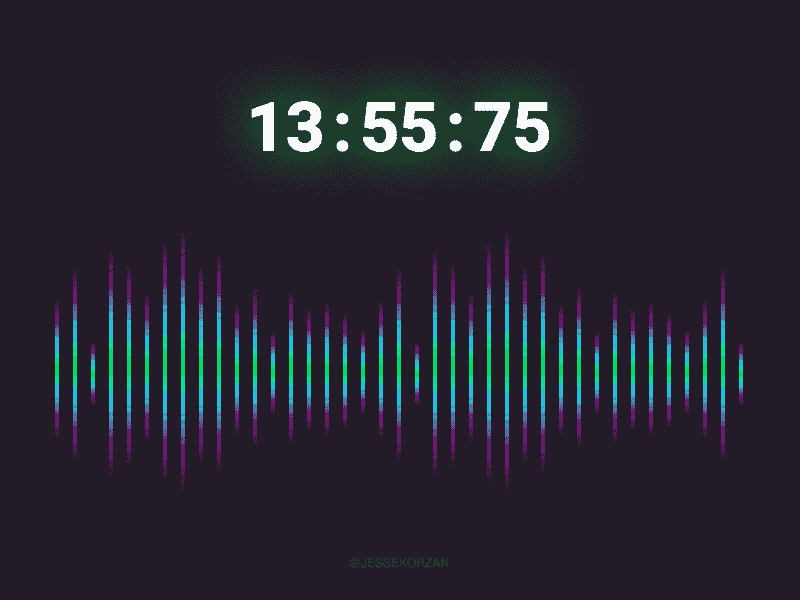
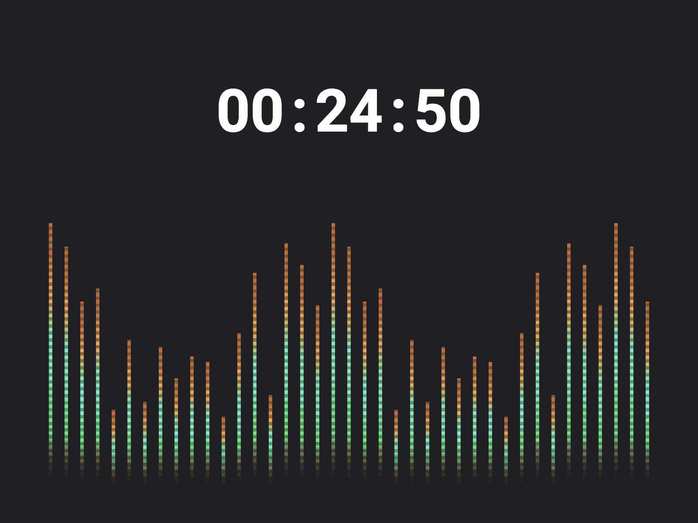

# 用 CSS 实现语音用户界面可视化

> 原文：<https://medium.com/hackernoon/voice-ui-visualizer-in-pure-css-bb2ddbcd5567>

## **CSS 网格的时尚效果&动画**

Voice UI Input (visualization with CSS)

## 演示:[手机友好](https://voice-visualizer-002.netlify.com/)，[另类风格](https://voice-visualizer-001.netlify.com/)，[实时语音](https://voice-interface-002.netlify.com/)

Github: [代码示例](https://github.com/jessekorzan/voice-visualizer)

最近，我有趣地研究了语音输入的外观和感觉。我想我会分享一个将 *CSS 动画*和*显示:网格*配对的技术，以达到一个合适的视觉效果。

如果您正在寻找想法或类似探索的起点，我希望这对您有所帮助:)

你可以从这里随意取出你需要的代码:[https://github.com/jessekorzan/voice-visualizer](https://github.com/jessekorzan/voice-visualizer)

# 瘦瘦的

SASS、SASS 循环、CSS 动画和*显示:网格*的工作知识会有所帮助。但是，即使有最少的 CSS 知识，您仍然可以理解。

## 加价是直截了当的

[https://github . com/jessekorzan/voice-visualizer/blob/master/index . html](https://github.com/jessekorzan/voice-visualizer/blob/master/index.html)

只要在一个容器里包装尽可能多的就可以了。*我叫我的”。语音编码器”。在里面，我添加了 45 个<跨度/ >的*

# 分为两部分的 CSS

首先，我们看一下容器，以及 CSS 网格如何使布局变得非常容易。

参考这个文件，从第 70 行开始:
[https://github . com/jessekorzan/voice-visualizer/blob/master/styles . scss](https://github.com/jessekorzan/voice-visualizer/blob/master/styles.scss)

> 了解更多关于*显示器:网格*这里:
> https://css-tricks.com/snippets/css/complete-guide-grid/

## 网格对齐是一个找乐子的机会

第 78 行， *align-items，*有几个变体…在我的例子中，一个是居中对齐，另一个在底部( *flex-end* )。

其次，我们需要一些看起来很酷的酒吧。这是通过设计 45 个的样式和动画来完成的。

跳到第 87 行，我们建立一个甜蜜的渐变(使用*背景线性渐变*)。

在第 110 行，为了让它更“数字化”，我添加了一个透明的 PNG 文件和一些扫描线到容器中(*)。语音编码器*。这不是必须的，但这是另一个获得一些风格分数的机会。你可以尝试改变不透明度，旋转，使用不同的 PNG 等。

# 动画片

最后一步是在 CSS 中添加动画。使用 SASS 使这变得轻而易举，并保持内容的可读性。

这里的核心思想是稍微改变每一秒和第三秒的动画。你可以看到我在提醒高度在#88 线和#100 线创造弹性。

为了完成这个效果，我们需要错开动画。一个简单的 SASS 循环来错开动画延迟在这里做得很好(参考第 93 行)

您可以在这里添加更多的复杂性，并更改任何值。在你找到适合你需求的东西之前，到处闲逛是很有趣的。

Variation by messing around with the CSS animation and grid values

# 结论

是的，如果我只是需要“语音输入”的错觉，我可以制作一个 GIF。但是有了一些简单的标记，我发现我能够更快更广泛地进行实验。

从本质上说，学习什么是可能的，比模仿更有效。我发现我得到了“更好”的设计作品，我可以在浏览器中看到原型(或者拿在手中)。用一些 JS(和数学)爵士乐手，效果可能会更真实。如果不是 100%模拟真实语音输入。

## 可视化实时音频(用 JS 替换 CSS 动画)

**实验样机:[https://voice-interface-001.netlify.com/](https://voice-interface-001.netlify.com/)

你可以在这里跟随故事:[https://dribbble.com/jessekorzan](https://dribbble.com/jessekorzan)