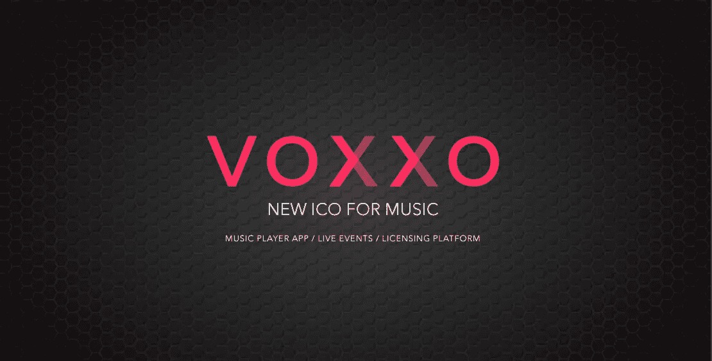
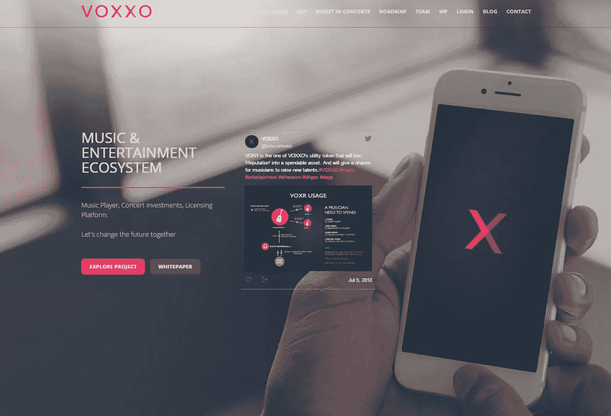
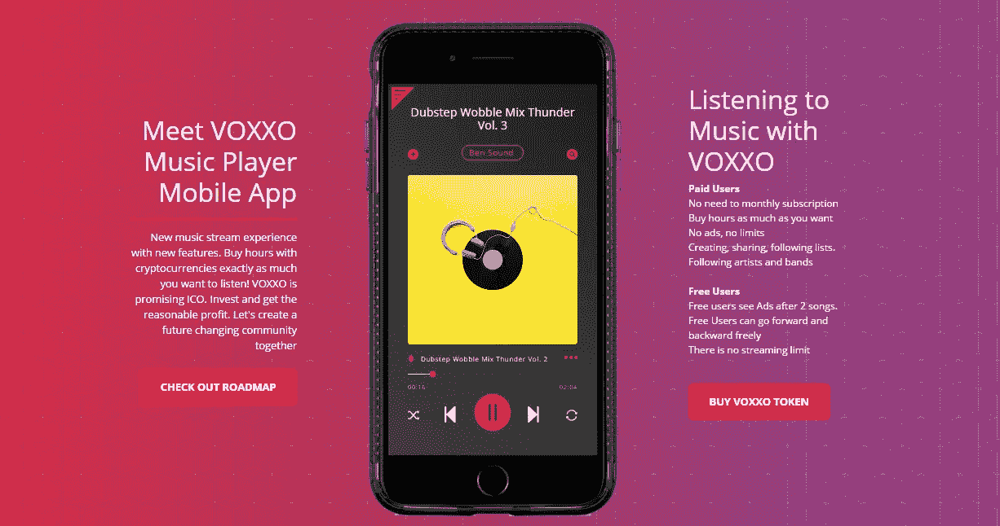
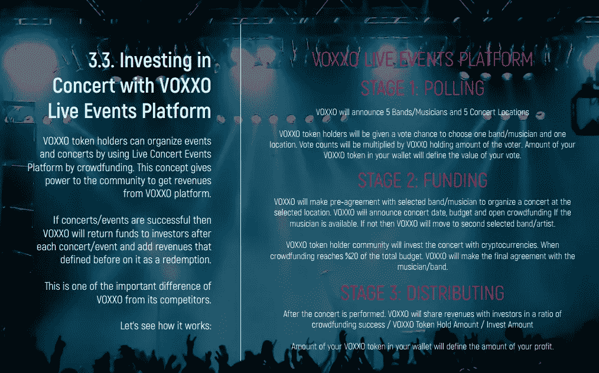
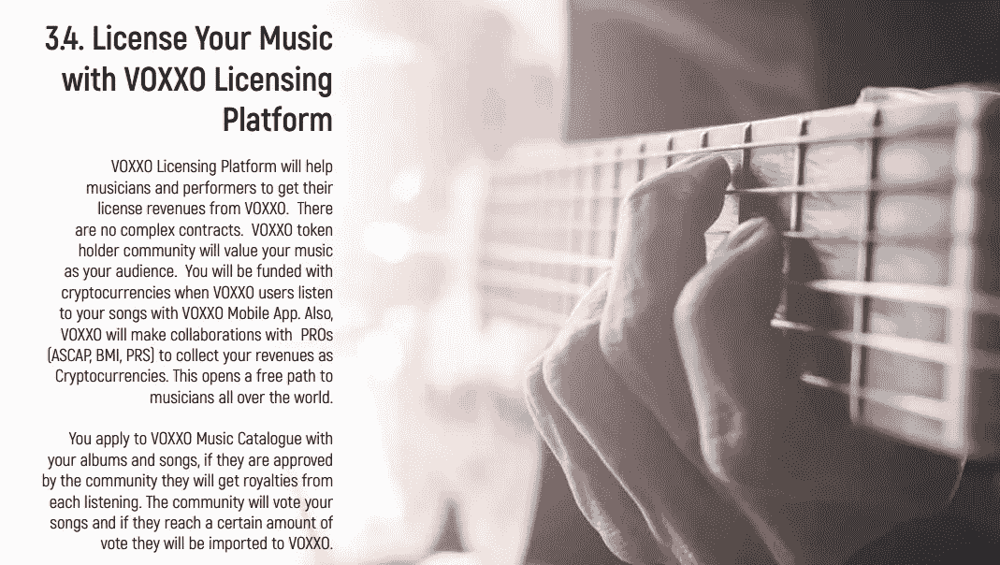
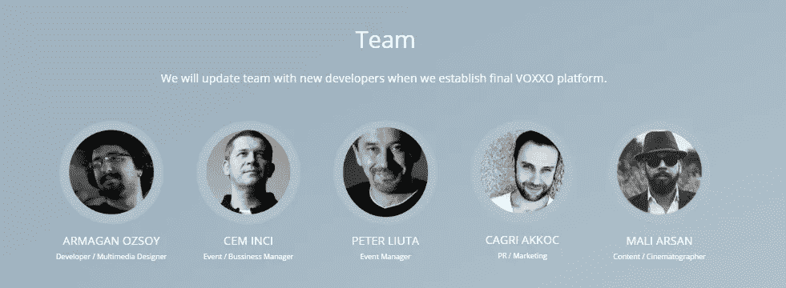
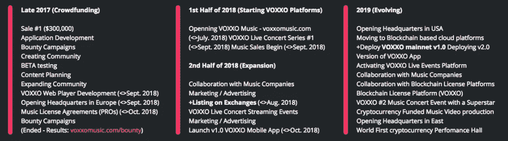

# VOXXO:音乐产业去中心化

> 原文：<https://medium.com/hackernoon/voxxo-decentralising-the-music-industry-f4333318989e>

流式音乐。那是听音乐的现代潮流。几年前，它是 mp3，CD，甚至磁带。如今，人们可以通过 Spotify、Soundcloud、Apple Music 等应用获取音乐。2016 年，主要应用程序的流媒体音乐收入为 150-200 亿美元，预计到 2025 年将增加到 300 亿美元。

音乐听的平台也在改变，从纯音频到更多的接触演唱会和世界巡演。这是因为具有成本效益的运输以及录音和制作技术的进步。

然而，音乐本身正面临操纵，因为真正垄断流媒体音乐行业的只有少数几家大公司。这给了他们巨大的权力，他们可以影响或控制艺术家内容的受欢迎程度和广告。他们的选择不是受音乐质量的驱动，而是受政治和盈利目标的驱动。

音乐家和艺术家被迫遵守他们的协议政策，否则他们就有被排除在流媒体音乐主要来源之外的风险，而用户则需要支付许可费和流媒体会员费。想象一下 Spotify 从这一代人中每个想听音乐的人那里得到 10 美元！这是过高的价格，巨大的持续收入，不一定符合我们的最佳利益。

所有这些问题都是因为音乐和内容是由以利润为导向的结构来评估的，而不是大众本身。

这就是 VOXXO 介入的地方。VOXXO 将音乐与区块链相结合，以实现一个去中心化的社区，该社区将停止在音乐领域组织、过滤或操纵推广。这将使音乐以最小的影响力传播给人们，并开启音乐领域的革命性活动和作品。

VOXXO 项目将由多个不同的组件组成，首先是 VOXXO 移动应用程序、VOXXO 现场活动和 VOXXO 许可平台。

VOXXO 移动应用程序将允许任何人免费播放和收听他们最喜爱的音乐。如果有人选择免费收听，每两首歌曲后会有广告。这是一个无限制的功能，用户可以自由前进和后退。

如果一个人不想听广告，可以选择购买收听时间。参与者可以用加密货币购买流媒体时间，而不是订阅。将有多种加密货币可供选择，但使用 VOXXO 代币支付的人将有折扣。

该应用程序的其他功能包括创建、共享和关注歌曲列表。关注艺术家和乐队，有机会赢得免费音乐会门票和观看现场音乐会。

对我来说，VOXXO 最有趣的方面之一是他们的现场活动平台。现场音乐会是一个非常有利可图的行业，每场音乐会可以赚到数百万美元。VOXXO 允许用户从利润中提成，而不是把钱交给索尼等中间商。

VOXXO 用户将有机会首先投票选出他们希望看到音乐会的音乐家和地点。投票权受持有的 VOXXO 的影响。

一旦决定了谁和在哪里举办音乐会，就会有一个众筹阶段，用户可以选择投资音乐会的组织工作。一旦活动成功结束，众筹者/投资者将获得他们的资金以及额外的收入。

我喜欢这个特性，因为这正是整个去中心化概念的意义所在。它是关于去除昂贵的、垄断的中间人，在两方(在这种情况下是音乐家和听众)之间建立直接联系，并将财富分配给外行人，给普通人一个赚取财富的机会。这正是区块链的概念，一种去中心化的技术。

最后，VOXXO 将帮助音乐人和表演者从 VOXXO 获得许可收入。

同样使用智能合同，当 VOXXO 用户使用 VOXXO 应用程序听他们的歌曲时，音乐家将获得加密货币的支付。整个过程将与专业人员(如 ASCAP、身体质量指数、PRS)合作完成，以确保公平性、安全性和专业性。

这是项目背后的团队。不幸的是，网站/白皮书目前没有提供关于该团队的更多细节，所以我的任何信息都来自 Linkedin。

他们的创始人是 Armagan Ozsoy，他从 2008 年至今一直在 MNV 担任多媒体设计师，从 2016 年至今一直在 CW Co .担任软件开发员(根据 Linkedin)。

我在 Linkedin 上找不到他们的活动经理和内容/摄影师的资料。

Cagri Akkoc 是他们的营销/公关经理。从 2010 年到 2016 年，他实际上是 MNV 创意工作室的所有者/合伙人。所以他一度实际上是阿玛根的老板。形势似乎发生了变化。他目前是 ODS Danismanlik 的通信专家。奇怪的是，他的 Linkedin 个人资料并没有显示他是 VOXXO 项目的一部分。

VOXXO 是一个伟大的项目，但该团队需要尽快更新他们的简历和个人资料页面。公平地说，他们的白皮书指出，他们将在 ICO 完成后用新成员更新团队页面。所以希望他们能尽快解决这个问题。

这是团队的路线图。众筹阶段结束了。预计他们将在 2018 年 10 月推出他们的移动应用程序 1.0 版。这是一个值得期待的里程碑，因为它将是这个项目的 MVP(最小可行产品)。

2019 年将是该项目非常繁忙的一年，这是该项目大多数基础设施将发生的时候，包括迁移到基于区块链的云平台，部署 VOXXO 的 mainnet，激活 VOXXO Live Events 平台，以及与音乐公司的合作等等。2019 年底有望看到世界上第一个加密货币表演馆，这将是绝对巨大的。

# 结论

我认为 VOXXO 是一个非常有趣的项目，有很大的潜力。音乐领域肯定需要一个分散的计划，以更公平的价格向大众提供音乐，并需要一个冠军来将整个音乐行业从当前的大垄断中解放出来。VOXXO 可能就是这样一个项目。VOXXO 仍处于起步阶段，只有时间才能证明这个大卫是否能击败那里的巨人。