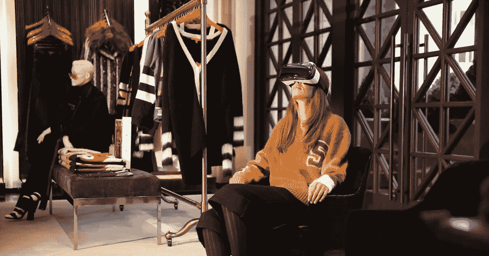
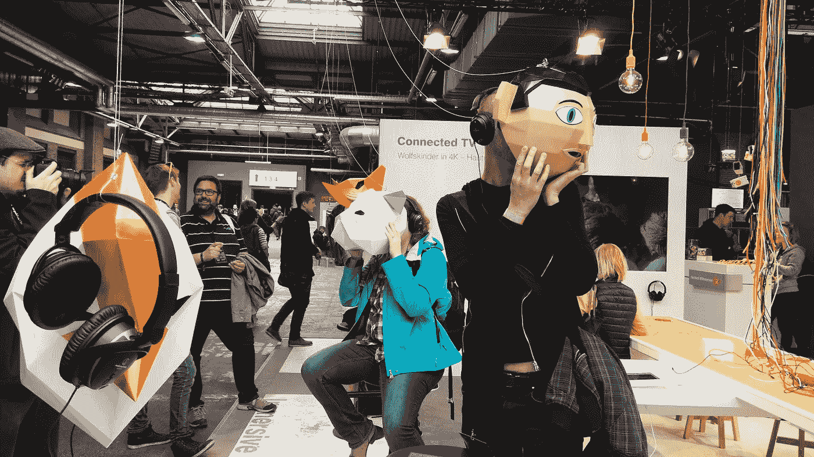

# 虚拟现实在电子商务中的作用是什么

> 原文：<https://medium.com/hackernoon/vr-powered-solution-transforming-e-commerce-433e8ab562fe>

随着时间的推移，电子商务是一个不断变化的领域，每个小型或大型公司都试图在市场上取得领先。为了吸引用户，零售商需要做更多的工作来说服他们，让他们跟随自己的选择，经常在网上购买商品。

> **“根据 CCS Insight 的数据，到 2018 年，预计全球将售出 2400 万台虚拟现实设备。”**

虚拟现实是一种新兴技术，可以为行业提供解决方案。因此，虚拟现实有可能重塑零售业的世界。场景是这样的，三分之一的企业试图在[应用开发公司](http://www.quytech.com/)的帮助下投资虚拟现实技术，以确保他们改善用户的购物体验。

**1。用户可以体验虚拟展厅**

为了将网上购物体验提升到一个新的水平，零售商可以考虑建立虚拟商店。为了更好的用户参与，VR 为客户提供了虚拟体验，就像在自己家里舒适地移动一样。

它在虚拟展厅方面处于领先地位，为用户提供了网上购物的新领域。因此，在虚拟展厅中可视化产品有助于客户更好地可视化他们的产品/项目。虚拟现实技术是新兴技术的主要参与者之一。

2.**客户可以虚拟地看到产品**

虚拟现实充满了可能性，它为消费者提供了在实际购买之前想象产品外观的机会。因此，有许多公司正在试图推出自己的 VR 购物 App，让用户在实际购买之前进行尝试。

因此，公司也在各个方面探索 AR 领域。消费者可以虚拟地想象商品的外观，并且虚拟地了解产品的细节。有零售巨头开始使用虚拟现实技术向用户展示某些产品在发布前的外观。

**3。用户参与利用虚拟现实**

虚拟现实为客户提供了一个新的互动层次，它与用户建立了联系。主要参数不仅帮助用户仅仅阅读产品描述和尺寸，而且帮助用户理解它的物理外观。用户只需通过 VR 耳机按下一个按钮，就可以亲自观看产品。

用户可以在他们的房间里无缝地看到他们正在考虑购买的产品，例如他们桌子上的灯。用户可以看到某些物品如何适应他们的日常生活，VR 能够提供比实体店中的物理物品更好的可视化效果。

4.**给出再次光顾你的商店的理由**

虚拟现实给了消费者很多理由去虚拟商店购物。在体验过虚拟购物后，许多消费者表示他们更愿意再次在虚拟商店购物。

易贝或亚马逊正通过在线产品提供这样的解决方案。这也是电子商务零售商吸引或方便用户的原因。

虚拟现实购物的理想发展目标是利用虚拟现实头戴式设备提升购物体验。因此，目前，电子商务领导者应该尝试推出更多用户参与的虚拟现实解决方案。因此，他们需要专注于虚拟网上购物，更像是身在商店里。

**底线** …

虚拟商店为顾客提供了一种虚拟体验，当他们在家里戴上耳机后，可以立即发现自己置身于虚拟超市之中。业内有[虚拟现实开发公司](http://www.quytech.com/virtual-reality.php)正在使用虚拟现实技术吸引顾客到他们的商店。

因此，对于在线用户来说，这是一个让他们更深地沉浸在商业体验中的机会。这些新的 VR 头戴设备集成了 AR，允许用户在不浪费太多时间的情况下感受虚拟世界。

简而言之，这有点像在家里的实体店，为顾客提供了一种访问在线和实体店的新方法。