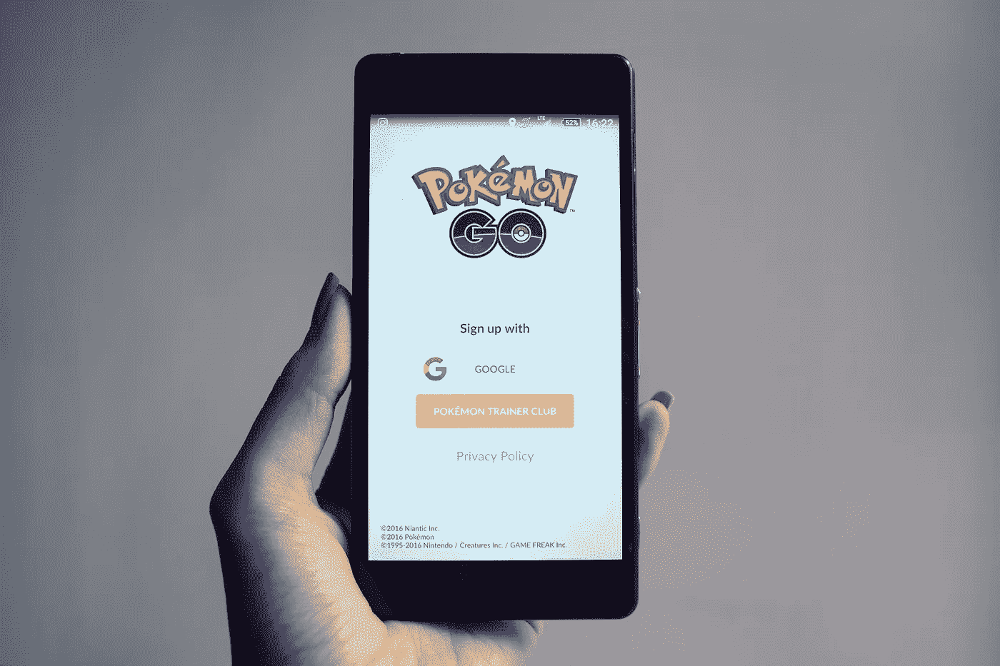
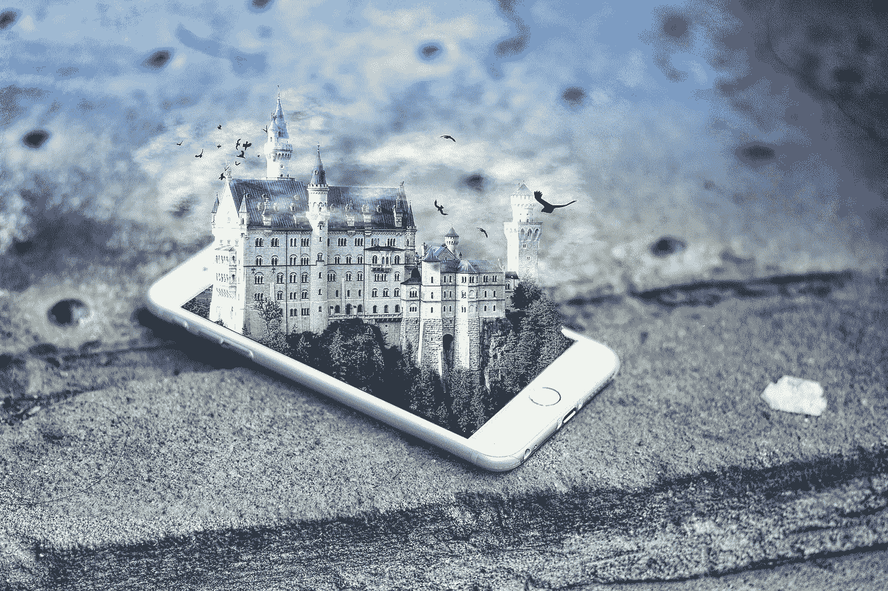

# VR vs AR:现实与欲望之战

> 原文：<https://medium.com/hackernoon/vr-vs-ar-the-battle-of-reality-and-desires-6d5034ff1eec>

技术现在正处于一个美好的未来阶段，这给我们留下了许多选择。从最近出现的趋势来看，最具未来感的趋势之一是虚拟现实，或称 VR。然而，另一个术语也走到了最前面。这不是别人，正是 AR(增强现实)。尽管虚拟现实(VR)和增强现实(AR)已经以某种形式存在了几十年，但直到最近它们才获得主流关注。很多人把 AR 和 VR 混为一谈。让我们找出它们之间的区别，并通过一些很酷的现实生活中的例子来比较它们。

# 虚拟现实:欲望的世界

虚拟现实，顾名思义，是一个虚拟的(或计算机生成的)场景。它模拟真实环境。它与用户所处的实际环境没有任何关系，也不与现实世界互动。虚拟现实就是创造一个用户可以与之互动的虚拟世界。这个虚拟世界应该以这样一种方式设计，用户会发现很难区分什么是真实的，什么不是。

VR 是唯一能保证用户完全专注于内容的媒介。不要转移视线，不要查看电子邮件或短信，不要更新社交媒体状态。虚拟现实是讲述故事的最身临其境的方式，因为耳机里发生的事情会让你感觉到你的大脑、心脏和内脏有什么东西。虚拟现实已经开始彻底改变我们观看内容的方式，但永远不会成为我们日常生活中的技术。

**VR 头戴设备主要有两种**:

*   **连接电脑的耳机:这些虚拟现实耳机连接到电脑或游戏机上，可以产生高质量的虚拟体验。在这种情况下，用户实际上可以与他们沉浸其中的虚拟环境进行交互。最受欢迎的 PC 连接虚拟现实耳机是 [HTC Vive](https://www.vive.com/us/product/vive-virtual-reality-system/) 、 [Oculus Rift](https://www.oculus.com/rift/#oui-csl-rift-games=robo-recall) 和 [PlayStation VR](https://www.playstation.com/en-us/explore/playstation-vr/) 。**
*   **独立耳机:**这些耳机不需要连接到电脑或控制台。大多数独立的 VR 头戴设备使用智能手机屏幕来提供虚拟现实体验。PC 连接的虚拟现实相当昂贵，因此独立耳机是虚拟现实爱好者体验虚拟现实的一种更便宜的方式。[三星 Gear VR](http://www.samsung.com/global/galaxy/gear-vr/) 是热门选择。

## 虚拟现实的现实应用

当你听到 VR 时，你首先想到的行业可能是游戏。但它不是唯一一个拥抱虚拟现实技术的行业。虚拟现实的其他显著应用有:

*   **营销**

企业可以通过发起身临其境、引人入胜的营销活动，轻松接触客户。这在网购时代尤为重要，因为虚拟现实体验有助于人们足不出户就能感受到产品。**系列*权力的游戏*在 2014 年创造了“登墙”VR 体验。当观众爬上 700 英尺高的黑城堡城墙时，他们隆隆的电梯向他们吹出凉爽的空气。这后来在他们第六季推出之前发展成了一种虚拟现实观看体验。这种尖端的体验像病毒一样传播开来，同时给这部热播剧带来了严重的关注。**

*   **行程**

旅游是虚拟现实可以彻底改变事物的一个行业。人们甚至可以在旅行之前就了解一个地方。虚拟旅游可以帮助旅游企业宣传旅游目的地，吸引游客。万豪酒店(一家精致的连锁酒店)为其精选目的地的客人推出了虚拟现实服务。游客可以使用虚拟现实头戴设备，观看从北京到智利的一系列生动的旅游目的地。

*   **房地产**

几十年来，你会看到一处房产的照片，从而了解这个地方。代理人现在可以使用虚拟现实来实现这个目的。与照片不同，虚拟现实可以让潜在买家进行三维漫游，并在亲自参观之前更好地了解每处房产。[**matter port**](https://matterport.com/)**已经在使用 360 度视频展示来帮助代理更好地与客户互动。**这个平台给了客户一个机会，让他们无需移动就能走进豪华住宿的房间，或是一艘专为满足人们需求而设计的游轮。

*   **医疗保健**

虚拟现实可以深入了解人体解剖，帮助医生更好地了解病人的需求。虚拟现实技术在外科培训中也派上了用场。 [**生动视力**](https://www.seevividly.com/) **创造了帮助弱视者改善视力的技术**。用户在家或在临床医生的监督下在计算机上玩 VR 游戏，这些游戏被设计用于治疗弱视、斜视、会聚不足和立体深度不足。

*   **教育**

虚拟现实现在是最好的技术之一，可以在人们的脑海中留下关于特定内容的持久印象。通过 VR 学习内容可以彻底改变教育，让学习变得更有趣、更有吸引力。除了学校和大学，虚拟体验也可以帮助企业培训员工。[**universiv**](https://unimersiv.com/)**正在为企业和机构提供 VR 教育内容。**通过下载该应用程序，您将获得多种体验，让您了解历史、空间或人体解剖学。

# 增强现实:内在世界

增强现实有一个侵入性较小的程序。它所做的是用数字组件覆盖真实世界(通过我们设备的摄像头等看到)，有效地增强现有的环境。增强现实是虚拟现实和现实生活的融合，因为开发人员可以在应用程序中创建图像，与现实世界中的内容融合在一起。通过 AR，用户能够与现实世界中的虚拟内容进行交互，并能够区分两者。

图形、声音、气味等元素被添加到自然世界中，以创造增强现实的感觉。增强现实中计算机生成的增强使它作为一项技术更有意义，用户也能够与它互动，使它更生动。与 VR 相比，AR 通常需要稍少的处理能力，因为它不需要渲染完整的场景。

**可以用来体验 AR 的两样东西是:**

*   便携式设备
*   AR 耳机

## 增强现实技术的应用

Pokemon Go 是手机游戏的一个真正突破，但增强现实技术还有更多的东西可以提供。可以使用 Ar 技术的其他领域有:

*   **零售**

网上购物方便、省时、省钱。AR 应用程序是解决这个问题的一个很好的解决方案，因为它们允许客户虚拟地查看甚至试穿在线销售的产品。**网购体验 AR，试试** [**宜家广场**](https://itunes.apple.com/us/app/ikea-place/id1279244498?mt=8) **。**这款用于 iOS 的增强现实应用程序可以帮助用户检查宜家目录中的一件家具是否适合他们的家。AR 应用程序可以帮助客户想象他们的家具在自己的客厅、街道或电梯里会是什么样子。你不用再玩猜谜游戏了。

*   **维修和保养**

对于某些汽车品牌，以及那些愿意在测试阶段使用应用程序的人来说，ar 辅助汽车维修已经成为现实。以下是 AR 进入汽车维修行业的一些方式。**[**field bit**](https://www.fieldbit.net/)**为设备制造商和用户提供端到端、交互式的现场服务协作平台。**创新软件使远程专家能够使用实时增强现实、实时视频、消息和语音向现场技术人员发送精确的视觉指令。凭借对智能眼镜(以及移动设备)的全面支持，Fieldbit 的平台使企业能够在整个组织内创建、捕捉和共享知识。**

*   ****导航****

**增强现实对导航特别有用。与现实世界重叠的虚拟物体可以显示方向，并指引人们到达目的地。许多企业使用 AR 来吸引人们到他们的商店。**[**Blippar**](https://www.blippar.com/)**推出了一款允许人们用增强现实导航世界的应用。**该应用利用增强现实和计算机视觉，允许用户在城市中旅行和导航时访问信息和内容。****

*   ******广告******

****增强现实正在迅速成为营销和广告行业最热门的趋势之一，被视为与客户联系和增加参与度的创新和创造性方式。 [**家得宝**](https://www.homedepot.com/c/SF_Mobile_Shopping) **在节日期间测试 AR 广告，向消费者展示圣诞树及其装饰品的样子**，希望激发消费者对其选择的兴趣。****

# ****AR 对 VR 是威胁吗****

****Pokèmon Go 的一夜成名揭示了虚拟现实可能受到增强现实(AR)的威胁，增强现实呈现了现实和虚拟世界的无缝融合。与此同时，企业主迅速利用 Pokèmon Go 的营销潜力，建立他们的办公室、餐馆等作为 Pokestops 设施，从而在捕捉数字怪物的同时捕捉真正的客户。AR 为营销人员提供了更多的潜力，因为客户可以同时在数字和现实环境中成为目标。****

****VR 并没有给营销人员提供很多独特的内容营销机会。出于安全原因，VR 通常要求用户保持静止。这给市场营销者带来了困难，因为他们的产业是建立在传统商店出售实物商品的基础上的。AR 和 VR 根本不是真正竞争的技术，而是互补的技术。它们的功能略有不同，而且很有可能在我们的未来都将发挥重要作用。****

********

# ****混合现实的概念****

****混合现实(有时称为**混合现实**)旨在结合虚拟现实和增强现实的最佳方面。混合现实(MR)远比虚拟现实先进，因为它结合了几种类型的技术，包括传感器、先进的光学和下一代计算能力。在混合现实中，你可以看到虚拟物体，就像你在增强现实中一样，但这些物体也可以与现实世界互动。从某种意义上说，混合现实是一种更具沉浸感和交互性的增强现实类型。****

****混合现实的工作原理是扫描你的物理环境，并创建你周围的 3D 地图，因此该设备将准确地知道在哪里以及如何将数字内容放入该空间，同时允许你使用手势与之交互。混合现实正被用来增强包括 NBA 和 NFL 在内的几乎所有运动的粉丝体验。 [**NextVR**](http://www.nextvr.com/#/) 提供各大体育项目的 AR 粉丝体验。例如，球迷可以观看一场 NBA 本周 VR 比赛。****

****微软在旧金山的 Reactor 也有[混合现实捕捉工作室](https://www.microsoft.com/en-us/mixed-reality/capture-studios)和混合现实学院，邀请创意人员来这里体验 AR、VR 和这之间的一切。****

****法国制造商**雷诺卡车**正在研究增强现实的潜在好处——更具体地说是混合现实。雷诺卡车公司在技术上发现了巨大的机会。混合现实的使用改善了流程，同时减少了质量控制时间。此外，它还降低了操作员的认知负荷，并加快了他们的培训。****

# ****未来会怎样****

****到 2021 年，增强和虚拟现实的综合市场规模预计将达到 2150 亿美元。因此，由于易于开发和消费者的认知，市场潜力有望增加。增强现实预计到 2020 年将获得 10 亿用户。对于 VR 和 AR 来说，要达到他们预期的潜力，他们必须为普通消费者清除一些障碍。在尝试了 Oculus Rift、HTC Vive 和 HoloLens 等各种耳机后，很明显，重量、热量、电线和设置时间等问题需要尽快解决。高成本和缺乏应用程序也阻碍了消费者的采用。市场正在快速增长，而我们甚至还没有利用这些技术的 10%的潜力。接下来的几年将会是地狱般的旅程！****