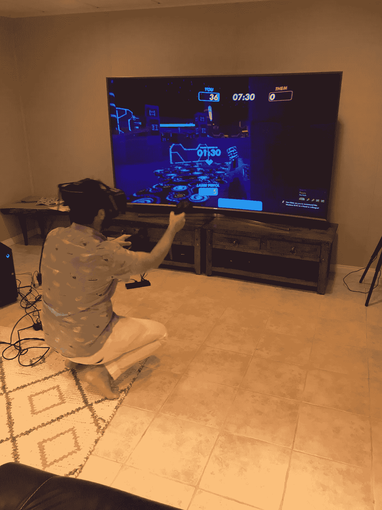
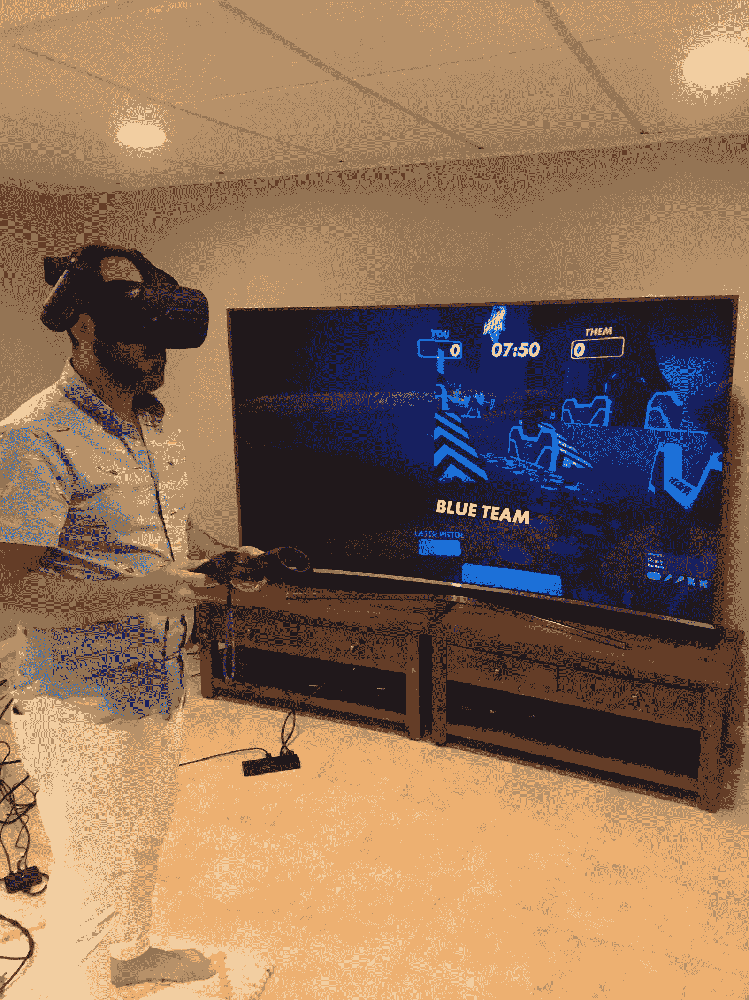

# 虚拟现实将是有趣和有用的，但它仍然离现实很远很远

> 原文：<https://medium.com/hackernoon/vr-will-be-fun-and-useful-but-still-far-far-away-from-reality-38369bd99ec>

在过去的 10 年里，我一直和我爸爸一起参加 CES，几乎看到了每一个小工具、小发明和小部件成为主流之前的样子。可穿戴设备、虚拟现实和增强现实只是在几年前才开始受到关注，尽管它已经走过了漫长的道路，但仍有很长的路要走。

下面的照片来自 CES 2014，在脸书收购它们之前的 5 个月，我在那里试穿了所有新的疯狂头盔，包括 Oculus 的 dev 版本。不用说，我看着很可笑，技术也早。

Early prototypes of AR/VR at CES 2014

当时我真的没有多想，也没有想到它会带来的潜力，直到去年我再次尝试。在整个创业/风险投资热潮中，我遇到了无数的创业公司，尝试了新的设备，并惊讶于它在短短几年内取得的进展。仍然有许多限制，现在很难看到让它成为日常设备所需的大规模消费者采用，但我们肯定正在前进。

# **购买和安装——这真令人沮丧**

几个月前，我父亲最近购买了 HTC Vive Pro，我承认我对它并不太感兴趣，因此开始了我的 VR 兔洞之旅。

当你购买 HTC Vive Pro(约 1000 美元)时，初始套件包括耳机、一个控制器和一个传感器。我们不知道，你需要有两个控制器和两个传感器才能使用它——购买时没有明确说明。当他告诉我他要购买它时，我的任务是得到运行它所需的高端游戏电脑。在成长过程中，我是一个游戏玩家(Everquest，Command&Conquer 等),建造了自己的电脑，所以这一部分实际上是有趣和怀旧的，去百思买和检查最新的设备。我最后买了外星人(1200 美元)台式电脑(是的，就是那种老式的大塔式机)，它比笔记本电脑便宜，而且更容易升级以满足未来的需求。

我把又大又重的塔拖回我的房子，打开 HTC Vive Pro 的箱子，插上所有的东西，非常失望地知道这是一个镇纸，除非你拥有一切。我们订购了第二个控制器和传感器，又等了一周，得到了我们需要的一切。

最后，所有的东西都插上了，到处都是电线(你需要很多插座)，偷工减料地把传感器安装在我面前的电视顶部，后面的一个堆在枕头上。是啊，我不知道我们还需要为它们买三脚架，或者像他们建议的那样，把它们安装在你的墙上/天花板上。

插上电源，准备开始…哦，糟糕，我需要下载和更新所有的东西。这都是 PC 上的，还没到 VR 里。

steam——知道它，读过它，但从未实际使用过。这是所有内容相关的首要市场

Vive port——这是 HTC Vive 版的 Steam，上面有他们所有的品牌内容

Geforce —更新驱动程序并下载内容

好了，准备好了，让我们戴上耳机

像大多数新设备一样，你真的很兴奋，想马上投入进去，但还不确定到底要做什么。尤其是在虚拟现实中，这是一个全新的互动媒介，我一开始很迷茫。

该教程是一个良好的开端，帮助设置房间，感受控制器，360 完全包围的环境和界面直接浮在我面前。就像你不阅读的服务条款/隐私政策一样，我点击了我的方式，这样我就可以最终玩它了。尽管这是几个月前的事了，但光是想想就让我想起了最初的挫折，我的女朋友和父亲很乐意告诉你。

# **内容和初步体验**

像任何新事物一样，你必须习惯它，下载一堆东西，安装它，看看它是否有什么好。尤其是把你的手放在 VR 里，这很奇怪但很酷。

大部分免费内容都很好，可以尝试，但不是为了习惯它或玩几次。我们使用最多的两个应用程序是:

*   谷歌地球——基本上你是超人，可以飞到世界上的任何地方。需要一些时间来适应，所以你不会头晕或恶心，但一旦你系好安全带，世界就是你的了。我可以走在纽约的街道上，看看圣莫尼卡的海滩，然后在大峡谷里巡游。下面是我姐夫向我侄子展示 VR，我想他喜欢它……随着他的成长，这将成为他生活的一大部分，就像我得到我的第一部手机，诺基亚砖，然后是 Razor flip 手机，然后是改变一切的第一部 iPhone。

[https://youtu.be/C1EkSfdx5lk](https://youtu.be/C1EkSfdx5lk)

*   娱乐室——这是平台自带的，有点像 Wii。它有基本的图形，是社会的，所以你可以与其他玩家和许多小游戏互动。到目前为止，我个人最喜欢的是 Lazer Tag 游戏；这很简单，容易学习，我可以用各种可能的方式躲避，并且可以玩几个小时。

*   除了这两个，我们还在尝试新的下载内容、游戏和体验。我们尝试了 NextVR 的体育直播，但内容有限，图形就像一台糟糕的电视，你不能移动。一些水下鲨鱼在凉爽的地方游泳，但过一会儿就觉得无聊了。

**虚拟现实和增强现实将是未来，但我们需要耐心**

玩了几个小时后，我现在相信这些将是未来每个人都将个人或专业使用的系统。我们确实越来越接近了，但仍有一些问题需要解决:

*   成本过高——目前这还不是消费价格。Oculus Rift 和其他耳机都是数百美元，这不是超级贵，但就你预计使用它的次数而言，这不是大多数人的选择。现在肯定更“噱头”,但如果你感兴趣的话会很有趣
*   内容——正如我之前所说，这是一个有很大潜力的新媒体，但很难激励工作室和开发者，因为还没有太多的钱。到目前为止，大多数更好的内容是付费播放，这可能是值得的，但我们已经习惯了免费内容。你可以支付 Viveport，它允许你一个月下载五个新东西。
*   空间要求——这不是最大的问题，但你需要一个完整的空间来放置 HTC Vive，这样你就可以完全移动和互动。这绝对值得，因为我设置了一个 6x2ft 的周界，所以当我靠近它时，虚拟现实中会显示一个网格，警告我正在靠近。

# B2B 是现在赚钱的地方

我见过很多创业公司，消费者方面听起来总是很有趣和性感，但向企业销售通常更容易(仍然很难)也更有利可图。许多虚拟现实公司已经开始关注医疗保健、军事甚至员工培训——幕后有许多用例可以真正从中受益。

几个月前，经过多年的开发、宣传和世界上最好的 2B+美元的资助，Magic Leap 终于推出了(2300 美元)。我认为可以肯定地说，大多数人对它不感兴趣，尽管这项技术确实令人印象深刻，但在如此大肆宣传之后，它并没有达到崇高的期望。我建议通过这次大分解来看看他们实际上建造了什么。[https://www . ifixit . com/tear down/Magic+Leap+One+tear down/112245](https://www.ifixit.com/Teardown/Magic+Leap+One+Teardown/112245)

那么，这将是下一个在未来几年改变我们生活的类似 iPhone 的设备吗？我毫不怀疑最初的生产会销售一空，但接下来的几个版本真正为消费者准备好还需要几年时间。

[http://www.visualvocal.com/](http://www.visualvocal.com/)

为了把我们的钱用在实处，我们去年投资了[的视觉人声](https://www.visualvocal.com/)。他们的平台允许你从球形捕获设备上快速地发布、标记和注释各种各样的内容。基本上，他们想成为虚拟现实的 PDF，并开始与世界上最大的建筑公司合作。他们现在可以与世界各地的任何人一起浏览蓝图，这是一个完全交互式的虚拟现实环境。

老实说，当他们第一次给我送来可折叠眼镜设备时，我觉得这是一个笑话，这种设备可以让你把手机变成 VR 设备(不是他们的技术，他们是软件)。经过尝试，做了一些研究，并意识到这是体验虚拟现实最简单的方式，他们建立了一个惊人的平台，它实际上是可行的，我成为了一个真正的信徒。

虚拟现实潜力的另一个有趣的例子是一个真正创新的平台，我有幸尝试了这个平台，那就是 [Novo Reality](http://novoreality.com/) 。一位雄心勃勃的连续创业者想更进一步，他购买了一个机械工厂手臂，用于制造具有 6 个自由度的汽车，给它安装了一个钻机，并创建了自己的内容来带你通过。把它想象成未来的游乐园。

Full video of me riding it here [https://www.youtube.com/watch?v=DOhPKhjcUwQ](https://www.youtube.com/watch?v=DOhPKhjcUwQ)

我们无疑正在建设一个技术平台，它将从根本上成为我们生活的一部分。一夜之间的成功通常需要数年才能发生，而现在，我们喜欢说迭代是新的创新。我们目前正处于消费者就绪技术 VR/AR 的 1.0 版本，随着技术变得小型化，它只会变得更好，5G 允许我们以更低的功率传输更多的数据，并且有更多的内容供每个人欣赏。

那么你在 VR/AR 方面有什么经验，你认为什么将是让人们参与进来的突破性成功？

*☞以后想听更多我的想法:* [*在 Twitter 上关注我*](https://twitter.com/Trace_Cohen)

*☞如果你喜欢这篇文章，* ***请“鼓掌”*** *帮助向他人推广这篇文章，或者在评论中告诉我你的想法*