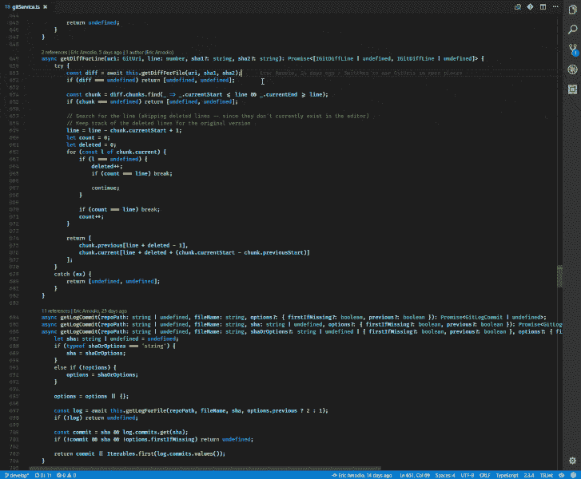

# VS 代码扩展让 JavaScript 编码更快乐

> 原文：<https://medium.com/hackernoon/vs-code-extensions-for-happier-javascript-coding-e258f72dd9c1>


作为一名 web 开发人员，拥有一个校准良好的编辑器对工作效率至关重要。除了免费和[开源](https://github.com/Microsoft/vscode)之外， [Visual Studio Code](https://code.visualstudio.com/) 作为一个通用编辑器的一个最好的部分是，它已经可以做很多开箱即用的事情，只需要最少的改动。也就是说，随着用例变得越来越小众，能够延伸并引入一些扩展来帮助进一步提高生活质量是很好的。幸运的是，VS Code vibrant [扩展社区](https://marketplace.visualstudio.com/VSCode)的一键安装也让这变得非常简单。

这里有个人品味的因素在起作用。因此，这并不意味着这个列表中的所有东西都需要安装，因为您的里程数可能会根据您自己的用例及代码风格而有所不同。

如果你想跳过所有的赘述，直接滚动到最后的***VS 代码扩展*** 部分。

# 必备品

*扩展太好了，它们应该是内置的。*

## [ESLint](https://marketplace.visualstudio.com/items?itemName=dbaeumer.vscode-eslint)


ESLint 是一个非常常用且高度可定制的 JavaScript linter，可以针对大多数主流框架和代码风格进行配置。ESLint 的这个特定 VS 代码实现突出显示了编辑器中的林挺错误，并提供了通过几次鼠标点击来自动解决它们的功能，而不是必须手动运行 ESLint 来查看错误。

现在你可能会对自己说，“VS 代码已经内置了 [IntelliSense](https://code.visualstudio.com/docs/editor/intellisense) ，它完美地完成了代码提示的下降工作。”这是真的，但是如果不是你的项目中的每个人都使用同一个编辑器呢？如果您想为 JSX、浏览器中运行的普通 JS 的特定 ECMAScript 版本或 Node.js 服务器代码设置不同的配置，该怎么办呢？好吧，ESLint 已经帮你解决了所有这些情况。同样，ESLint 也可以整合到你的[预提交](https://github.com/okonet/lint-staged)工作流程中，以确保每个人都使用团队定义的风格提交。

## [GitLens](https://marketplace.visualstudio.com/items?itemName=eamodio.gitlens)



VS 代码自带 Git 功能，所以这是另一个扩展，更多的是丰富现有功能，而不是添加新功能。有许多 Git 插件，但让 GitLens 脱颖而出的是其高度的[粒度可定制性](https://github.com/eamodio/vscode-gitlens/#gitlens-settings)，允许它如你所愿地可见或隐藏，以及其庞大而活跃的社区。


GitLens 在大型项目中特别有用，因为您可能不知道谁在给定的文件中写了什么。使用 GitLens，你可以很快地从底部状态栏中看到是谁写了特定的一行。因此，当出现关于为什么或如何完成某件事情的特定问题时，您可以将它们提交给最初的开发人员，以便进行快速、低摩擦的交流。

一个个人建议是将下面的代码片段添加到 VS 代码设置中。这将删除可能会分散注意力的每行注释。

```
"gitlens.currentLine.enabled": false
```

## [待办事项高亮显示](https://marketplace.visualstudio.com/items?itemName=wayou.vscode-todo-highlight)


评论有一种逐渐消失在背景中的方式，这在大多数情况下是好的，因为你不想过分分心。然而，其他时候你可能想让某些评论脱颖而出，以保证它们被阅读。这可能是因为添加了一个提醒标记，提醒您离开的地方，或者作为对其他人的注释。

有了这个扩展，只需输入包含`TODO`或`FIXME`的注释，它就会自动高亮显示，以确保它始终可见。很简单。

## [进口成本](https://marketplace.visualstudio.com/items?itemName=wix.vscode-import-cost)


如果你想拥抱你内心的受虐狂，这是一个很棒的插件。每当您将另一个模块导入到您的项目中时，Import Cost 将会给您一个即时且持续的提示，提醒您它的大小。因此，你必须不断问自己收益是否值得付出。这是件好事。

# **富人阶层**

提高了生活质量，但没有它们仍然可以勉强度日。

## [更漂亮的代码格式化程序](https://marketplace.visualstudio.com/items?itemName=esbenp.prettier-vscode)

[pretty](https://prettier.io/)与上面描述的 ESLint 类似，因为它的目的是试图加强和标准化编码风格，这个特定的插件允许它直接在编辑器中使用。pretty 与 ESLint 的区别在于，它没有列出错误(尽管 ESLint 确实有一个`--fix` [选项](https://eslint.org/docs/user-guide/command-line-interface#options))，而是提供了代码应该如何格式化的重印版本。这在与[预提交](https://github.com/okonet/lint-staged)工作流一起使用时非常有用，因为它可以自动重新格式化代码并保存它，以匹配每个`git commit`所需的样式。

应该注意的是，Prettier 主要关注格式，所以对于代码质量来说, [linter 仍然是有用的。除此之外，更漂亮的可以](https://prettier.io/docs/en/comparison.html)[集成到 ESLint](https://prettier.io/docs/en/eslint.html) 中用于单一命令执行。默认情况下，Prettier 确实有自己强烈的观点，但如果你自己的观点不同，它可以很容易地配置。

## [在浏览器中打开](https://marketplace.visualstudio.com/items?itemName=techer.open-in-browser)


有时，您可能会发现自己正在做一些不涉及整个构建过程食物链的事情，打开一个 HTML 文件就可以看到您正在做的事情，就像过去的好时光一样。

对于这种越来越罕见的情况，您可以使用这个扩展在 VS 代码中右键单击，并使用默认浏览器或您安装的替代浏览器打开它。不要再为了打开一个文件而改变 shell 中的目录。

## [vs code-style-components](https://marketplace.visualstudio.com/items?itemName=jpoissonnier.vscode-styled-components)


好吧，我承认这是列表中更合适的一个，因为它是一个特定库的扩展，设计用于另一个特定库([styled-components](https://www.styled-components.com/)with React)。也就是说，如果您是使用样式化组件的人，那么这个扩展几乎肯定是必备的。

由于样式化组件是在一个模板文字中编写的，许多语法高亮器会将整个部分作为引用来突出显示。有了这个扩展，您仍然可以在模板中保留完整的类 CSS 代码突出显示。生活是美好的。

## [VSCode 大图标](https://marketplace.visualstudio.com/items?itemName=emmanuelbeziat.vscode-great-icons)


给 VS 代码添加了一堆很棒的文件图标 *(100+)* 。还有什么需要说的？

## [书签](https://marketplace.visualstudio.com/items?itemName=alefragnani.Bookmarks)


理想情况下，你的代码总是模块化的，可读性强，并且足够简洁，这样你就不会费力去查看一个给定文件的全部。如果一个不完美的时刻出现了，而不是因为你自己的原因，能够放入几个快速书签来快速来回跳转是很好的。

## [一个 Monokai 主题](https://marketplace.visualstudio.com/items?itemName=azemoh.one-monokai)


我有一个可行的理论，丑陋的东西会增加眼睛疲劳。还在完成这个的论文。

默认的 VS 代码主题其实也没那么差。然而，如果你将整天生活在其中的应用程序可以很容易地变得更好，更有个性，为什么不呢？不用说，自定义主题多如牛毛，但这个主题的某些东西对我来说就是点击，当然是出于完全主观和站不住脚的原因。

# VS 代码扩展概述

***提问/评论/其他？*** *在*[*GitHub*](https://github.com/Alek-S)*[*LinkedIn*](http://linkedin.com/in/alekshnayder)*或者我的* [*网站*](https://www.alekshnayder.com/)*