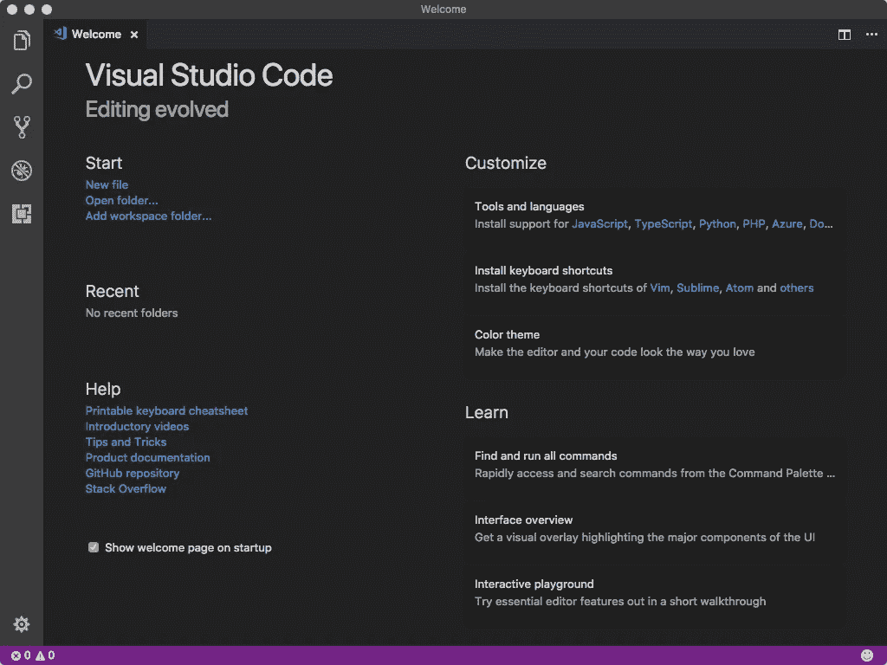

# WebStorm 用户的 VSCode

> 原文：<https://medium.com/hackernoon/vscode-for-webstorm-users-1cb57e01d40c>


我喜欢喷气式飞机。自从七年前 [PyCharm](https://en.wikipedia.org/wiki/PyCharm) 发布以来，我一直是它的忠实用户。

最近，如果我在看一个演示，有人在编辑器中写代码，那个编辑器几乎总是*[vs code](https://hackernoon.com/tagged/vscode)。*

*出事了，*我要查个水落石出*。人们对这东西赞不绝口。*

*我将为自己回答一些问题——如果幸运的话，也许我可以为 JetBrains-faithful 节省一些时间和精力。我的目标是发现:*

*   *它支持我的键绑定吗，或者我需要重新学习所有的东西吗？*
*   *“运行配置”的模拟是什么？*
*   *调试是什么样子的？源图支持怎么样？*
*   *配置起来有多容易？*
*   *延伸生态圈怎么样？*
*   *VCS (Git)集成有何不同？*
*   *关于内联错误或警告有什么故事？*
*   *类型和代码完成有多智能？*

*我将从一个 JavaScript 开发者的角度来看待这个问题，所以我将写“WebStorm”，但我真正的意思是“一个 JetBrains IDE”*

> *我当然对 VSCode 如何处理 Python 和 C/C++感兴趣，但我不打算在这篇文章中探究它。*

# *第一印象*

*我用[自制桶](https://caskroom.github.io/)安装它:*

```
*$ brew cask install visual-studio-code
==> Satisfying dependencies
==> Downloading https://az764295.vo.msecnd.net/stable/f88bbf9137d24d36d968ea6b2911786bfe103002/VSCode-darwin-stable.zip
==> Verifying checksum for Cask visual-studio-code
==> Installing Cask visual-studio-code
==> Moving App 'Visual Studio Code.app' to '/Users/boneskull/Applications/Visual Studio Code.app'.
==> Linking Binary 'code' to '/usr/local/bin/code'.
🍺  visual-studio-code was successfully installed!*
```

*这在我的 2016 款 MBP 上花了大约 4s——但我还没有安装任何扩展。*

*迎接我的是这个:*

**

*VSCode’s “Welcome” Page*

*它还在 Chrome 浏览器中打开了一个网页:*

**

*Online tutorials & such for VSCode*

*我忽略了这个网页(谢谢，但不用谢)，点击了几个**工具和语言**下的“安装对…的支持”链接，安装了一些基本的扩展。我想避免一开始就定制太多。由于 C/C++没有列在“欢迎页面”上，我开始钻研扩展……不由自主地安装了一堆扩展。哎呀。*

*然而，我很高兴地报告说 [JetBrains IDE Keymap](https://marketplace.visualstudio.com/items?itemName=isudox.vscode-jetbrains-keybindings) 是一个东西，它工作得很好。*

*我打开我的[摩卡](https://github.com/mochajs/mocha)工作副本…*

# *摘要*

*   ***安装“扩展包”快速入门。**你将安装许多扩展。*
*   *有很多教程。*
*   *如果你在 WebStorm 中使用默认绑定，你可能需要**安装**[**JetBrains IDE Keymap**](https://marketplace.visualstudio.com/items?itemName=isudox.vscode-jetbrains-keybindings)扩展。*
*   *按键绑定比 WebStorm 更强大也更复杂。很难发现一个特定的按键在任何给定的时间做了什么，但是**也支持条件，这是一种近乎荒谬的控制水平**。*

# *近距离接触版本控制*

*好了，所以我要编辑摩卡的`CHANGELOG.md`。但我知道`origin`有我需要的改变。*

*幸运的是，VSCode 知道这实际上是一个工作副本。为了拉，我在我的状态栏找到一个小“刷新”按钮，并点击它。我*认为*成功了？上面写着"同步"什么是“同步”？*

*我不确定刚刚发生了什么。Git 拉了哪些变更集？我想看看历史。在徒劳的搜索之后，我意识到*没有内置的对 Git 历史*的支持，我需要为此获取一个扩展。*

*[GitLens](https://marketplace.visualstudio.com/items?itemName=eamodio.gitlens) 似乎解决了这个问题(还有其他)。但是 VSCode 有许多与 Git 相关的扩展。这是 VSCode“小核心”哲学的一个弊端(这让我想起了 Node.js 生态系统)。值得称赞的是，VSCode 通过标签、过滤器和排序来帮助发现。*

*GitLens 做了一些古怪的事情，比如“内联指责”和“代码镜头”(这是对“指责”的另一种看法？我不明白)。我想把这吵闹的东西关掉。*

*提示:从命令面板运行`GitLens: Toggle Code Lens`和`GitLens: Toggle Line Blame Annotations`。*

*GitLens 然后在左侧栏中提供 Git 历史。回购的呈现有点无所适从(这么多树，就像一片森林)，但是我*确实*看到了被拉的变更集。*

*咻。*

*我已经对`CHANGELOG.md`做了修改，现在是提交的时候了。VSCode 在文件列表中用一个大的`M`标记这个文件是很有帮助的。 *+1* 。*

*我通过命令面板找到了`Git: Commit`，并意识到我可以使用我信任的`⌘-K`。但是提示我舞台是空的。*

*如果你*只用*WebStorm 内置的版本控制客户端(我没有)，这将是文化冲击。VSCode 使用 stage，就像除了 WebStorm 之外的其他 Git 客户端一样。*

*我继续并提交一切(包括未分级的变更；如果我想避免提示，这将是`Git: Commit All`)，然后按下。*

*不是最好的初始体验，但我相信从这里开始会更顺利。*

*接下来，我将运行 Mocha 的测试套件，为发布做准备。*

# *摘要*

*   *由于 VSCode 的基本客户端实现，您可能希望**安装 Git 扩展包**。*
*   *VSCode **使用 stage** ，不像 WebStorm。*
*   *VSCode **自动为工作副本**启用 Git 支持，而不是*提示*您遗忘。*

# *VSCode 中的任务*

*我认为“任务”可能是“运行配置”或“外部工具”。*

*“任务”与 WebStorm 中的“任务”不同，后者是 WebStorm 对问题、阶段性变化和分支的(漏)抽象。*

*让我们看看“配置任务”有什么作用…*

**

*What’s do you call a widget like this, anyway?*

*Ooook。这需要一些进一步的解释，但当然。它是否试图自动检测我的 npm 脚本？作为参考，摩卡的`scripts`在它的`package.json`中字面上只是:*

```
*{
  "scripts": {
    "prepublishOnly": "nps test clean build",
    "start": "nps",
    "test": "nps test"
  }
}*
```

*我用`npm: test`掷骰子。*

*VSCode 创建并打开一个`.vscode/tasks.json`文件:*

**

*At least it’s not XML, amirite?*

**引人入胜的*。我点击链接，[了解这个文件](https://code.visualstudio.com/docs/editor/tasks#vscode)。不清楚 VSCode 是否打算让用户提交`.vscode/`给 VCS(我不这么做；事实上，我将`.vscode/`加到我的`.gitignore`后加速中。*

*VSCode 可能不需要我来“配置”任务——它自己发现了脚本。我执行`Run Task…`，选择`npm: test`，输出如您所料在终端中打开。*

*我现在确信“任务”类似于“外部工具”。就像在 WebStorm 中一样，用户(看起来)不能调试任务，而且几乎没有集成。VSCode 附带了一些常用构建工具的助手(不幸的是， [nps](https://npm.im/nps) 不在其中)。像 WebStorm 一样，用户可以自由创建基于“外壳”的任务。*

*我仍然在寻找“运行配置”的模拟，它似乎是一个“调试配置”，尽管它只是在 VSCode 的“调试”菜单下被称为“配置”。接下来，我要试驾一下。不管它叫什么。*

# *摘要*

*   ***vs code 中的“任务”类似于 WebStorm 的“外部工具”**。*
*   ***通过 JSON 文件配置任务**。这并不太棒，但 VSCode 在编辑时提供了验证/完成，这比什么都没有好。*
*   *您必须**选择是否将** `**.vscode/**` **提交给 VCS** 。我*从未*成功将`.idea/`的任何条子*交付给 VCS，但也许这里的故事是不同的。不要看着我；找些其他的豚鼠。**

> *花絮:VSCode 将`tasks.json`的文件类型识别为“带注释的 JSON”，这，AFAIK，是纯粹的，虚构的废话。到底是不是 [JSON5](http://json5.org/) ？*

# *排除故障*

**

*Photo by [Mink Mingle](https://unsplash.com/@minkmingle?utm_source=ghost&utm_medium=referral&utm_campaign=api-credit) / [Unsplash](https://unsplash.com/?utm_source=ghost&utm_medium=referral&utm_campaign=api-credit)*

*首先，我安装了 [Node.js 扩展包](https://marketplace.visualstudio.com/items?itemName=waderyan.nodejs-extension-pack)，因为我认为我需要它来正确地调试。*

*从 VSCode 的菜单中，我打开`Debug > Open Configurations`。我看到了一个新文件，`.vscode/launch.json`。和`tasks.json`一样，这是我的配置文件。*

> *这个菜单项莫名其妙地对应了命令`Debug: Open launch.json`。*

# *In Node.js*

*你想先听好消息还是坏消息？我不在乎。*

*坏消息是，我不能只是把`npm test`扔进`launch.json`然后期望我的断点被命中。为什么不呢？因为`npm`产生`nps`，它连续产生十个不同的`mocha`进程，每个进程产生`_mocha`，其中很多进程又产生`_mocha`*。**

**这绝不是 VSCode 的错，但是在 Node.js 中调试子进程的故事是一个悲哀的故事。期待奇迹是愚蠢的。**

***好消息*是，如果我选择测试的某个子集与`bin/_mocha`一起运行，调试工作会很好(除非我想调试更多的子进程)。这是一个可靠的调试体验，尽管缺少一些 WebStorm 调试器的铃声。**

# **在浏览器中**

**用[因果](http://karma-runner.github.io/2.0/index.html)调试测试，尴尬的是。**

**在 WebStorm 中，您创建基于 Karma 的运行配置，将它指向您的配置文件，指定任何特定的浏览器或其他额外的选项，然后按下按钮。它工作得很好，即使你碰巧把你的代码和 [karma-browserify](https://www.npmjs.com/package/karma-browserify) 捆绑在一起，Mocha 就是这样的。**

**这就是 VSCode 体验:**

*   **你需要安装 [Chrome 调试器](https://github.com/Microsoft/vscode-chrome-debug)扩展。**
*   **创建一个与以下内容相同的`chrome`调试配置:**

```
**{
  "type": "chrome",
  "request": "attach",
  "name": "Attach to Karma",
  "address": "localhost",
  "port": 9333,
  "pathMapping": {
    "/": "${workspaceRoot}/",
    "/base/": "${workspaceRoot}/"
  }
}** 
```

*   **修改你的`karma.conf.js` ( *ugh* ，真的？)将自定义启动器添加到您的设置对象中。下面的端口必须与上面的端口相同。希望不是在用！**

```
**{
  customLaunchers: {
    ChromeDebug: {
     base: 'Chrome',
      flags: ['--remote-debugging-port=9333']
    }
  }
}**
```

*   **开始因果报应(你可以创建一个任务来做这件事):`karma start —-browsers ChromeDebug --auto-watch --no-single-run`。让它开着。**
*   **运行您的“附加到 Karma”调试配置；从“调试”>“运行配置…”中选择它。**

**此时，您可以通过单击编辑器的栏来设置断点，尽管它们不会立即启用。**

**在窗口顶部附近出现了一个小的、奇怪的、可移动的工具栏。在这个顽皮的工具栏中有一个“刷新”按钮；单击它以重新运行测试。然后，VSCode 将能够发现 Karma 加载了哪些脚本/文件。如果你幸运的话，它甚至会击中你的断点！**

**上面花了整整一个小时才弄明白，即使有一些零散的例子。**

**最后我想评价的是 VSCode 的“智能感知”能力。**

# **摘要**

*   ****“运行配置”=“调试配置”**。我称之为“调试配置”，就这样。**
*   ****通过 JSON** 配置“调试配置”，像“任务”一样。**
*   **VSCode 具有**非常基本的断点**，但不支持基于先前断点的启用/禁用或点击后禁用等功能。**
*   ****在 Karma 中调试是很差的体验**。我找不到一个特定于 Karma 的扩展来帮助解决这个问题。**

# **代码完成、检查和意图(天哪)**

**假设你使用 ESLint，安装 [ESLint 扩展](https://marketplace.visualstudio.com/items?itemName=dbaeumer.vscode-eslint)。**

**在检查方面，我只是希望 ESLint 在我的 JavaScript 上运行。我不需要任何其他检查，所以我禁用了所有随机垃圾网络风暴船。**

**ESLint 扩展“工作正常”，用户可以在 WebStorm 中看到与 ESLint 相同类型的内嵌检查，就像“用 ESLint 修复文件”一样。**

**Node.js 扩展包提供了一些与 npm 相关的“智能感知”，它知道关于`package.json`的重要信息，比如一个包是否丢失或无关，它会告诉你，并通过一个意图自动为你修复它。**

> **“智能感知”是商标还是什么？这是微软主义，对吗？我很确定我讨厌这个词。**

**我相信 VSCode 在幕后使用 TypeScript 定义(不仅仅是在 TypeScript 文件中)来检查代码，至少是部分地。这导致*极其精确和几乎瞬时的*代码完成、跳转到声明等等。如果说 JavaScript 开发人员有什么“杀手锏”，那就是这个。你可以在 WebStorm 之外哄骗这样的行为，但它仍然会慢得多。**

**对 WebStorm 用户来说，深入研究这一点将是一个极好的信息来源(想想:CSS、HTML、TypeScript、模板语言等等。)，但不幸的是超出了范围。下面我以我最后的想法来结束。**

# **摘要**

*   **VSCode(和/或它的扩展)为 JavaScript 提供了**准确、灵活的代码完成和内联文档。****
*   **VSCode **没有附带一系列内置检查。如果你使用它们，你会错过它们，除非你找到替代品。****
*   **ESLint 体验很强**。****
*   **npm 相关的体验非常好。**

# **VSCode:判决**

****

**Photo by [chuttersnap](https://unsplash.com/@chuttersnap?utm_source=ghost&utm_medium=referral&utm_campaign=api-credit) / [Unsplash](https://unsplash.com/?utm_source=ghost&utm_medium=referral&utm_campaign=api-credit)**

**Visual Studio 代码比我预期的要好。就功能集而言，它可以和 WebStorm 相媲美——通过扩展。然而，与 WebStorm 相比，它有几个明显的优势:**

*   **VSCode 通常比 WebStorm 更快，响应更快**
*   **VSCode 的 JavaScript 检查/完成体验更好**
*   **像啤酒一样免费**
*   **多刺激啊！**

**显著的缺点包括:**

*   **糟糕的基于浏览器的调试体验(至少对我来说)**
*   **零碎(尽管完整)的 Git 支持**
*   **基于 JSON 的配置**
*   **没有客户支持**

**作为一名开发人员，我的代码编辑器是我最重要的工具。在 JetBrains 和 WebStorm 上呆了很多年——并且很少不满意——一个不同的工具必须非常吸引我去拿起它。**

**我对 WebStorm 用户的建议？*除非准备转行，否则不要尝试 VSCode。***

***本文* [*原载*](https://boneskull.com/vscode-for-webstorm-users/)*2018 年 3 月 9 日*[*boneskull.com*](https://boneskull.com)*。***