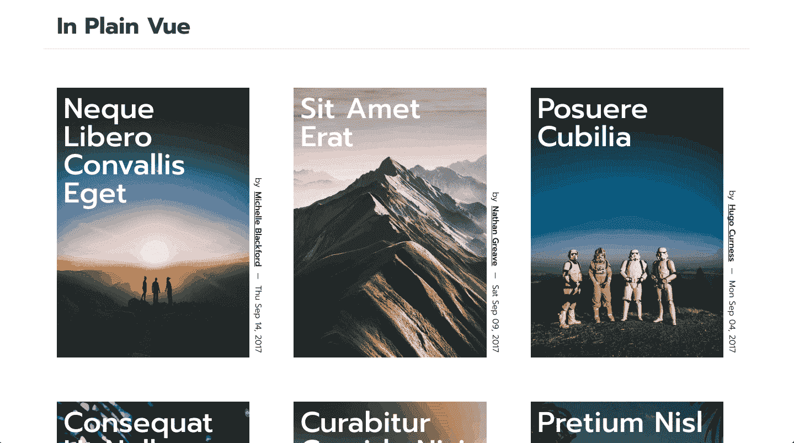
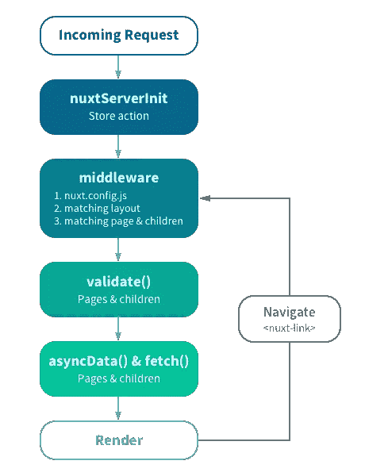
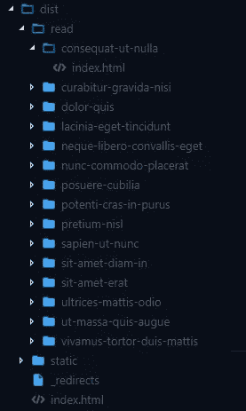

# Vue.js SEO 友好的 spa:提示、工具和先决条件示例

> 原文：<https://medium.com/hackernoon/vue-js-seo-friendly-spas-tips-tools-prerender-example-c160e0282eaf>


Photo by [Steven Lelham](https://unsplash.com/photos/atSaEOeE8Nk?utm_source=unsplash&utm_medium=referral&utm_content=creditCopyText) on [Unsplash](https://unsplash.com/search/photos/ranking?utm_source=unsplash&utm_medium=referral&utm_content=creditCopyText)

你知道 Hulu 的 [JavaScript](https://hackernoon.com/tagged/javascript) 失败的故事吗？

回到 2016 年，由于糟糕的 JS 处理，在线视频流媒体服务经历了 [56%的可见性下降。](https://www.linkresearchtools.com/case-studies/hulu-javascript-fail-visibility-drop/)

没有企业愿意经历的噩梦。


为了避免这样的灾难，在使用现代 JavaScript 框架时，您必须知道自己在做什么。

在 Snipcart 这里，[我们喜欢 Vue.js](https://snipcart.com/blog/progressive-migration-backbone-vuejs-refactoring) ，但是完全意识到 Vue.js 单页应用程序的 [SEO](https://hackernoon.com/tagged/seo) 问题。

在这篇文章中，我想向 JS 开发者展示让 Vue SEO 友好是多么容易。

我要说的是:

*   你应该经常应用的一般 SEO 技巧。
*   具体 Vue.js SPA SEO 问题。
*   通过服务器渲染和预渲染来修复它们的工具。
*   使用`prerender-spa-plugin`的技术 Vue.js SEO 示例。

> 这篇文章之后是另外两篇关于 JS 框架 SEO 问题的文章，[关于 React](https://snipcart.com/blog/react-seo-nextjs-tutorial) 和 [Angular](https://snipcart.com/blog/angular-seo-universal-server-side-rendering) 。

# 一般搜索引擎优化技巧

在我们探讨特定于 JavaScript SPAs 的 SEO 问题之前，让我们先了解一下开发人员在构建搜索引擎优化站点时应该采用的最佳实践。

> 正如有人已经说过的:“隐藏尸体的最好地方是谷歌搜索的第二页。”

这份名单的灵感来自于一些最大的搜索引擎优化公司，如 Moz、Backlinko 和 Ahrefs。如果你想深入了解，我已经添加了他们资源的链接。

## →元标签🏷️

Meta 标签是垂手可得的果实。它们让你向搜索引擎精确地展示你的内容。

然而，并不是所有的标签都生来平等。你应该把精力集中在其中的几个方面，即:

*   **元内容类型**—必须出现在每个页面上，声明您的页面字符集。
*   **标题**—选择一个独特的标题，在准确描述页面内容的同时吸引搜索者的注意。保持简洁！
*   **元描述**—它应该说服 SERP(搜索引擎结果页面)访问者点击你的链接，找到他们特定研究意图的答案。
*   **视口**—良好移动体验的基本要素。

了解更多: [SEO 元标签](https://moz.com/blog/seo-meta-tags)，作者 Moz。

> [vue-meta](https://github.com/declandewet/vue-meta) 是一个在 Vue 2.0 组件中管理页面元数据信息的可靠工具。

**社交标签**也可以对 SEO 产生重大影响，因为它们有助于你的内容在社交平台上传播，从而增加你的 SEO 社交信号。所有的大平台都有特定的标签(脸书、Twitter、Pinterest、Google+)。

了解更多:【Twitter、Google+、脸书等的必备社交元标签，作者 Moz。

## →移动优化📱

如果你不知道[谷歌的移动优先索引](https://webmasters.googleblog.com/2018/03/rolling-out-mobile-first-indexing.html)，好吧，这是一个警钟！谷歌现在对流畅的移动体验比桌面体验投入了更多的爱，你也应该如此。

了解更多:[移动搜索引擎优化:权威指南](https://backlinko.com/mobile-seo-guide)，作者 Backlinko。

> [NativeScript](https://www.nativescript.org/vue) 支持跨平台 Vue.js 移动应用。

## → HTTPS 🛡️

缺失的 HTTPS 认证或损坏的配置可能会对你的网站不利。毕竟，搜索引擎倾向于推送可信且经过认证的网站，这难道不是可以理解的吗？

即使不是为了 SEO，你也可能想为你的用户提供一个尽可能安全的平台。所以没有理由不符合这个标准！

了解更多: [HTTP 与 HTTPS 的搜索引擎优化:你需要知道什么才能获得谷歌的青睐](https://ahrefs.com/blog/http-vs-https-for-seo/)作者 ahrefs。

## →页面速度🚀

人们的注意力持续时间很短——搜索者很快就会放弃加载速度慢的页面。谷歌知道这一点，为了给搜索者提供最好的 UX，它会惩罚那些速度慢的网站。

谷歌机器人本身非常不耐烦，不会等待超过 5 秒的脚本。如果你不满足这个超时时间，你的内容就有可能得不到充分的呈现。加快速度！

了解更多:[现场 SEO:页面速度](https://moz.com/learn/seo/page-speed)，Moz 著。

## →网站地图🗺️

对于搜索机器人来说，站点地图相当于站点架构地图。其中应该包括你认为是高质量的登陆和导航页面，值得索引。

网站地图对于小网站来说可能没那么有用，但是它仍然是一个值得考虑的 SEO 工具。

了解更多:[XML Sitemaps:SEO 工具箱中最容易被误解的工具](https://moz.com/blog/xml-sitemaps)，作者 Moz。

> 你可以通过 [vue-router 配置](https://github.com/40818419/vue-router-sitemap)生成一个 sitemap.xml。

## →链接建筑⛓️

建立你的域名权威仍然是一个关键的 SEO 策略。谷歌怎么知道你已经成为一个权威资源？通过让其他相关领域链接到你的网站。

这里没有什么秘密公式，**要做到这一点，你需要努力创作出精彩的内容**。其他人希望在自己的站点上共享和用作资源的内容！

你从相关来源获得的链接越多，你的权威就会上升得越多，当涉及到排名的时候，你就会获得越多的谷歌青睐。

了解更多:[SEO 链接构建:权威指南](https://backlinko.com/link-building)，Backlinko。

# 具体的 Vue.js SPA SEO 问题



在接下来的教程中，我决定使用我们在之前的帖子中制作的博客演示，因为老实说，它看起来棒极了。如果你有兴趣知道它是如何建造的，请看[这篇文章](https://snipcart.com/blog/vuejs-blog-demo)。

虽然它在视觉上是一件很棒的作品，但从搜索引擎优化的角度来看，它的设置并不理想。这是一个完全的 SPA，搜索引擎可能很难抓取和索引。

这是为什么呢？

单页面应用程序动态地向页面添加内容，这有它的好处，但也带来了两个重要问题:

1.  **我们真的不知道 Google 能够抓取并正确渲染 JS** 到什么程度。几年来，他们一直在说谷歌机器人有能力做到这一点。然而，这些说法后面总是跟着一两个“但是”。
2.  谷歌并不是唯一的搜索引擎。如果事情仍然不稳定，我们知道一个事实，其他玩家还没有抓取 JS，因此没有遇到页面的实际内容。

所以没办法绕过。如果你想确保你的 Vue.js 网站/应用程序在 SERPs 上排名，你必须采取行动。

你的选择？

## 服务器端渲染

通过 SSR 设置，您可以在 Node.js 环境中直接在后端完成呈现逻辑。HTML 视图然后被返回到客户端，准备好提供给搜索机器人。

对于时间敏感的应用程序来说，这是非常好的，因为您希望在服务器上卸载尽可能多的逻辑，但这是有成本的。您将需要一个健壮的基础设施来处理增加到服务器上的压力，这需要更多的开发时间。在此过程中，您还可能会降低系统速度。

但是如果你能处理好，这绝对是更大的应用程序应该走的路。 [**Nuxt.js**](https://nuxtjs.org/) 毫无疑问是用于你的[服务器渲染 Vue.js SPA](https://snipcart.com/blog/cockpit-cms-tutorial-nuxtjs) 的工具。



Nuxt.js rendering process [[source]](https://nuxtjs.org/guide)

## 预渲染

但是有时候，服务器端的渲染可能会感觉有些过火，就像我的演示一样。对于一个只有几个页面的小型 SPA，预渲染就能很好地完成这个任务。如果你只关心搜索引擎优化，那就更是如此。

这样，就不需要将你的 Vue.js 应用附加到任何服务器上。渲染在客户端使用第三方插件完成，如:

*   [**prerender . io**](https://prerender.io/)——兼容所有最流行的 JS 框架，包括 Vue.js。
*   [**prerender-spa-plugin**](https://github.com/chrisvfritz/prerender-spa-plugin)——一个将你的页面编译成静态页面的 webpack 插件。使源代码中的所有内容都可用，并且索引是轻而易举的事情。

后者非常容易使用，是由 Vue.js 核心团队成员构建的，因此它非常适合我的用例。

# 使用预渲染的 Vue.js SEO 技术示例


是时候修复之前展示的 Vue.js 博客了。使用`[prerender-spa-plugin](https://github.com/chrisvfritz/prerender-spa-plugin)`，我将很快拥有一个受到谷歌青睐的 Vue.js SPA。

**先决条件**

*   Vue.js 的基础知识
*   Node.js 和 npm 安装

## 1.安装 prerender-spa-plugin

配置插件非常简单。在这个设置中，我将只在为生产而构建时运行插件。在积极开发组件时，不需要预渲染。

首先从 npm 安装插件。

```
npm install prerender-spa-plugin
```

然后，打开`build/build.js`文件。在那里，你可以找到定制的产品。您需要导入插件并在文件顶部添加以下几行:

为什么是`PrerenderSPAPlugin.PuppeteerRenderer`？因为您需要自定义渲染器。您需要注入一些数据，让应用程序知道它何时被预渲染。有些东西，比如 Disqus 评论，你无法预读。

> 在一个 100% SEO 友好的应用程序中，将这些评论作为呈现在页面上的内容会更好。如果你使用静态站点生成器，你应该考虑静态用户生成内容的 [Staticman](https://staticman.net/) 。

您需要获取所有的博客条目，并生成一个将被预先呈现的路线列表。在真实的生产场景中，您可能希望调用您的 headless CMS API 或提供您的内容的外部服务。在这种情况下，数据保存在简单的 JSON 文件中。

读取`feed.json`文件并生成您的路线:

将插件添加到 webpack 配置:

当站点预渲染时，您将可以访问`window.__PRERENDER_INJECTED.prerendered`变量。这将有助于排除您不想预呈现的内容。

您还需要指定对`app.rendered`事件的等待。

在这个演示中，我将使用`[Pace](https://github.hubspot.com/pace/docs/welcome/)`，这是一个很棒的库，可以在站点上快速添加进度条。然而，你需要确保在预渲染站点之前加载完成，否则，你将会在多个页面上看到一个随机的进度条。

## 2.为 prerender 配置 Vue.js

然后，您需要在一些组件中应用一些小的更改。为此，我改变了开始配速的方式。我去掉了`startup.cs`文件，把所有东西都放在了`main.js`里。

打开`main.js`文件，更改`App`组件的包含方式:

一旦您的主要组件安装完毕，启动`Pace`并在初始加载完成时分派`app.rendered`事件。

你要做的最后一个更新是确保在网站被预渲染时 Disqus 没有被加载。

打开`BlogPost.vue`文件，其中包含 Disqus 组件。

由于最初配置`prerender-spa-plugin`的方式，您将可以访问一个变量，该变量表明站点正在被预渲染。

以这种方式更新`showComments`方法:

## 3.构建 SEO 友好的 Vue.js 网站

现在，您已经准备好构建您的站点了。在您的终端中使用以下命令:

```
npm run build
```

然后，如果你查看`dist`文件夹，你应该会看到`read`文件夹中的所有帖子。已经为每个帖子生成了一个静态 HTML 文件:



就是这样！多简单啊，对吧？

# 现场演示，Github 回购

> *看现场演示* [*这里*](https://vue-blog-prerendered.netlify.com/)
> 
> *参见 GitHub 回购* [*此处*](https://github.com/snipcart/vue-blog-demo)

# 结束语

`prerender-spa-plugin`是一个整洁的插件。配置起来很容易，而且足够灵活，可以处理异步用例，就像我们用`Pace`处理的那样。

我花了大约 2 个小时来弄清楚如何将所有这些东西连接在一起，并更新我们的初始应用程序以支持预渲染。

正如我前面提到的，这个插件很简单，最适合静态博客这样的简单应用。如果你想构建更复杂的东西，我建议你看看 Nuxt！

*如果你喜欢这篇文章，请花点时间在 Twitter 上分享一下。有意见或问题吗？点击下面的部分！*

*我最初在* [*the Snipcart 博客*](https://snipcart.com/blog/vue-js-seo-prerender-example) *上发表了这篇文章，并在* [*我们的时事通讯*](https://us5.list-manage.com/subscribe?u=c019ca88eb8179b7ffc41b12c&id=3e16e05ea2) *上分享了它。*