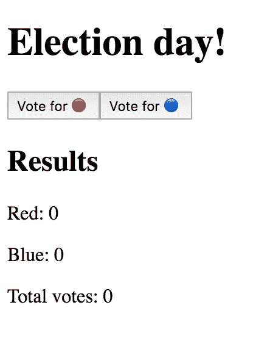

# Vue 自下而上的状态管理

> 原文：<https://medium.com/hackernoon/vue-state-management-from-the-ground-up-a31eb87c668d>

## 让我们管理一些州💃


> 计算机科学只有两个硬东西:缓存失效和事物命名。— *菲尔·卡尔顿*

嗯，我想菲尔·卡尔顿从来没有在前端处理过管理状态..！

国家管理就是*那些事情*之一。后端翻白眼，前端藏桌子底下。毕竟，管理状态是前端开发人员最难的部分:您需要将 UI 看作是随时间变化的东西。而且我们也不是特别擅长。

在这篇文章中，我们将从头开始探索如何在 Vue 应用程序中处理状态。我们将最终创建我们自己的状态管理器生成器！

让我们开始吧:

# 第一步:我们的第一个应用程序。选举日！

首先，我们需要一个应用。没有应用程序，我们就无法管理应用程序状态，对吗？

让我们创建一个投票应用程序，让你们为下一任总统投票(？):

Yes, I merged Single File Components and inline components.

*TODO(发布前删除):避免开政治玩笑。不是时候，不是时候。*

上面的代码呈现了如下漂亮的东西:



It looks like the browser failed to load the CSS

我能听到你的大脑在尖叫:

”*老兄，你不是管理国家的。您只是将道具传递给每个组件。你向国家管理层保证过。你最好把*送过来。

嗯，传道具不就是最简单的“状态管理”形式吗？难道我们的主要组件不是拥有我们的状态片段`red`和`blue`吗？

*(答案是肯定的和肯定的)*

但是，是的，我听到了。传道具不好看不舒服也不可升级，我们试试别的吧。

# 步骤 2:隔离状态

让我们创建一个“状态持有者”对象，并从那里管理我们的整个状态。

```
const **state** = {
  red: 0,
  blue: 0,
}
```

在那里！我们的应用程序状态，正确保存和封装。没那么难。

现在，从我们的组件中，我们可以执行如下操作:

```
const **TotalVotes** = {
  render: h => h('div', `Total votes: ${state.red + state.blue}`)
}const **Results** = {
  render: h => h('div', `Red: ${state.red} - Blue: ${state.blue}`),
}// ...and, inside our main component,...
methods: {
  voteForRed () { state.red++ },
  voteForBlue () { state.blue++ },
},
```

剧透:**这个不行**。为什么？

因为 Vue 使用`data`的方法来触发它的“魔法反应力”。如果不将我们的数据传递给`data` (heh)，Vue 将无法跟踪值的变化并相应地更新我们的组件。

轻松说，*轻松(？)*固定:

那里发生了一些事情:

1.  听着，妈妈，没有道具！*(第 8、9 行)*
2.  每个组件都在它们的`data`方法中注册我们的状态。现在 Vue 能够跟踪状态变化，所以当我们投票给🔴我们所有的组件*都用正确的值重新渲染*。*(第 20、27、35 行)*
3.  我们不得不从渲染函数中移除漂亮的箭头函数，因为现在我们正在使用`this`。*(第 21、28 行)*
4.  现在我们的状态与组件“隔离”。*免费啤酒*。*(14 行)*

好了，现在我们已经把状态从“UI 实现”中分离出来了，但是有一些注意事项:**我们需要把状态注册到`data()`中的每个组件**，我们不能在渲染函数中使用漂亮的箭头函数…

酪

等等。

我刚才是不是说“ *Vue 需要在* `*data()*` *中注册数据，使其反应性？*”。

是的，我做到了。

但是在我的解决方案中，我使用每个组件实例来使完全相同的数据具有反应性，对吗？

是的。

我是否可以创建一个共享的 Vue 实例来保持这种反应，这样我的组件就不必这样了？

嗯，是的。让我写一个大标题:

# 步骤 3:创建一个共享 Vue 实例来保存反应

因此，存储在`data()`中的信息变成了“默认反应”。我们想让哪条信息起反应？

我们的州！

如果我们这么做了呢？

```
const state = new Vue({
  data () {
    return {
      red: 0,
      blue: 0,
    }
  },
})
```

整洁！现在我们的状态是被动的。我们将为所有数据共享一个 Vue 实例，但这将比我以前的解决方案更干净，对吗？

但是等等。等等。等等。我们现在有一个 Vue 实例。除了反应性数据，您知道 Vue 实例还能保存什么吗？

正是:**方法**。

现在我们的`voteforRed()`和`voteForBlue()`方法可以**搭配**我们的状态了！

让我们来看看:

Vuetiful！让我强调一下我们取得的进步:

1.  状态和改变我们状态的方法现在被**放在一起**。不再泄露实现细节！注意，我们的 voteFor 方法非常简单，但是它们可以根据需要变得复杂。*(第 9、10 行)*
2.  我们仍然需要从组件中调用这些方法。*(第 25、26 行)*
3.  回到带箭头的渲染函数。*(第 15、19 行)*

我们删除了许多样板代码(所有的`data()`声明)。

好的，目前为止一切顺利！我们当前的解决方案简洁、简单且符合习惯。

但是我们需要导入 Vue，然后创建一个新的实例。虽然这本身并不“糟糕”，但我觉得我们可以做得更好，不是吗？

例如，我们的解决方案现在不能在项目间共享。我需要教人们创建一个 Vue 实例，填充它的`data`方法，然后注册一些方法来修改状态…太多了。

是时候…

# 步骤 4:将我们的状态封装在一个函数中

幸运的是，Javascript 为我们提供了一个很酷的特性，它允许我们隐藏所有这些细节，让事情变得简单:函数。我们将创建我们的[工厂函数](/javascript-scene/javascript-factory-functions-with-es6-4d224591a8b1)。

让我们定义一下我们的`createStore`函数。API 是什么？我希望:

1.  一个*数据*参数来设置我们的初始状态。为了清楚起见，我们可以称这个参数为“状态”。
2.  需要时，一系列的突变功能会改变我的状态。为了清楚起见，我们可以称这个参数为“突变”。

最后，我希望我们的`createStore`公开一个泛型方法，允许我的组件“运行”突变。为了清楚起见，我们可以称这个参数为“提交”(你通常*提交突变*，对吗？).

你知道我要去哪里，不是吗？

我们想以此结束:

```
const store = createStore({
  **state**: { red: 0, blue: 0 },
  **mutations**: {
    voteForRed (state) { state.red++ },
    voteForBlue (state) { state.blue++ },
  },
})
```

很不错，对吧？而且非常简单。

现在，我们将如何实现这个`createStore`助手呢？请记住，我们应该使用 Vue 实例来利用它的反应能力:

```
const **createStore** = ({ state, mutations }) =>
  new Vue({
    data () {
      return { state }
    },
    methods: {
      commit (mutationName) {
        mutations[mutationName](this.state)
      },
    },
  })
```

那里发生了一些事情:

1.  首先，我们返回一个新的 Vue 实例。到目前为止一切顺利。
2.  然后，我们将状态参数注册到实例的`data()`方法中。嘭！我们的国家现在是被动的。
3.  最后，我们创建我们的公共`commit()`方法。该方法将一个变异的名称作为参数，然后运行完全相同的变异(并传递我们的状态)。如果我们调用`commit('someMutation')`，我们的方法就会调用`mutations.someMutation(this.state)`。请注意，在实际的实现中，我们应该处理不存在的突变！

那么，我们的组件现在看起来怎么样？

```
const TotalVotes = {
  render: h => h('div', `Total votes: ${store.state.red + store.state.blue}`),
}const Results = {
  render: h => h('div', `Red: ${store.state.red} - Blue: ${store.state.blue}`),
}export default {
  components: { TotalVotes, Results },
  methods: {
    voteForRed () { store.commit('voteForRed') },
    voteForBlue () { store.commit('voteForBlue') },
  },
}
```

现在我们访问`store.state`来获取我们的状态，并使用`store.commit`来修改它(注意，我们将所需的突变名称作为参数传递)。

所有人现在在一起！：

是不是很酷？

现在我们可以通过提供一个简单的`createStore`方法来生成数十万个商店。您可能希望将您的`createStore`放在一个文件中并导出它，这样您就可以将它导入到您的应用程序中并创建一个全新的商店。如果你调用这个文件`Vuex.js`😁。

# ✅，结束了！

`state`、`mutations`……你听着耳熟吗？好吧，如果你曾经用过 [Vuex](https://vuex.vuejs.org/) ，它肯定应该。在我们的例子中，我们有效地映射了 Vuex API。

我们遗漏了 getters 和 actions，但是我希望你明白 Vuex 是我们已经知道的东西的抽象**。这是一个很好的抽象，非常完美、有用、可扩展。但毕竟是一种抽象。我们只是不断地给框架的核心增加层次:**反应**。那是触发一切的核心特征。**

> Vuex 是我们已经知道的事物的抽象。

快速回顾一下:

1.  前端的状态管理是可伸缩的。我个人的建议:尽可能从小做起，在添加新的东西之前，要三思而后行。Vuex 是惊人的(真的是！)，但是你真的需要它吗？
2.  **反应性**是 Vue 之王。一切，我是说一切，都依赖于数据的反应。这很好，因为我们可以利用这种反应能力，创造出漂亮、有用的抽象概念。
3.  现在我们有点明白 Vuex 在做什么了，这很酷。
4.  有时，**冗长胜过简洁**，如果它为我们的代码提供了上下文、意图和可重复性(例如，步骤 4 比步骤 2 需要更多的代码)。

想吃吗？[我用 4 次提交创建了一个 Github repo](https://github.com/afontcu/vue-state-management/commits/master): post 的每一步提交一次。请随意使用它，检查每一个变化。

你想用我们的解决方案练习一下吗？这里有一个挑战:你将如何实现`getters`？还有`actions`？还有… [模块](https://vuex.vuejs.org/guide/modules.html)？😏

希望有帮助！