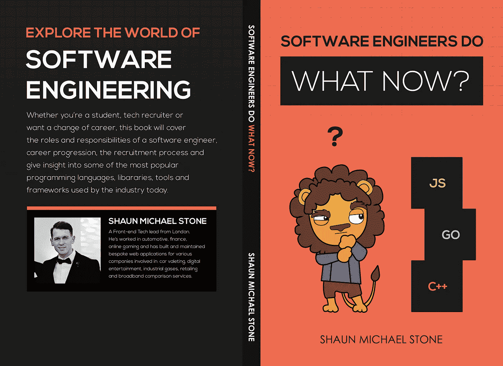

# 等一下 js！

> 原文：<https://medium.com/hackernoon/wait-a-moment-js-80e329fcfc3>

啊，日期和时间。在开发过程中，这是一件非常有趣的事情。当我们需要的不仅仅是日期对象所能提供的便利时，我们会求助于日期包装库，比如 [Moment.js](https://momentjs.com) 。

> Moment.js 是一个 JavaScript 库，设计用于客户端(在浏览器中)和服务器端(在 Node.js 中)。它有很多解析、显示和操作日期的功能。这让约会变得不那么痛苦。

我同意它使事情不那么痛苦，但是让我们看看在源代码中发生了什么。假设我必须计算出我的生日和英国纳税年度的最后一天之间有多少天。

我们用 Moment.js 来做这个吧。考虑以下代码:

**瞬间例子**

**从纳税年度的最后一天到我的生日有 166 天**

好极了，我们现在有了天数。简单的东西，一个非常方便的方法。那么，为了获得这个结果，在执行过程中发生了什么呢？

**请注意:**我正在分析我的应用程序的生产版本，它正在以匿名模式被查看。

Photo by [Fabian Grohs](https://unsplash.com/@grohsfabian?utm_source=medium&utm_medium=referral) on [Unsplash](https://unsplash.com?utm_source=medium&utm_medium=referral)

好的，首先，我的主包总共是 66KB。力矩是其中的 51KB，是我的包的 77%。该库正在获取大约 4500 行代码。使用 Chrome Developer Tools 中的 JavaScript Profiler，我可以看到我在示例中使用的 3 个函数的 moment 源代码中调用了 23 个函数。

如果我为纳税年度的最后一天创建了一个 Moment 对象，那么总共会调用 18 个函数。通过聚合慢速 3G 连接上的所有函数调用，记录了 5 毫秒。

耗时最长的矩的内部函数是:

1.  createFromConfig(0.9 毫秒)
2.  创建本地(0.9 毫秒)
3.  createLocalOrUTC(0.8 毫秒)

现在我知道你在想什么，这太微不足道了。可怕的微优化。当然，这取决于问题的环境以及您的日期逻辑有多复杂，但是如果有必要导入一个包来做这样的事情，这总是值得回顾的。在我的情况下，我会说这是不需要的。所以我决定求助于一个名为 [date-fns](https://date-fns.org/) 的库，只是为了看看它如何比较。

date-fns 库是不同的，因为它是模块化的，这意味着您只需要导入您需要的功能。这当然会减小最终的束尺寸。它不像 Moment 那样尝试创建自己的对象，它仍然使用 JavaScript 提供的原生日期对象。

**日期 FNS 举例**

使用 date-fns 中的 differenceInDays 函数花费的总时间为 0.1 毫秒。它需要其他 3 个内部模块来完成任务，但与 moment 相比要轻得多。我的包的文件大小是 18KB。这意味着 date-fns 的功能需要 3KB 才能实现同样的功能！

Photo by [Ian Stauffer](https://unsplash.com/@ianstauffer?utm_source=medium&utm_medium=referral) on [Unsplash](https://unsplash.com?utm_source=medium&utm_medium=referral)

> 花一点时间来观察您的包的大小，并提高您的整体页面性能。

很抱歉这个令人畏缩的双关语。感谢阅读，如果你觉得有用，请鼓掌。期待 9 月中旬生日快乐时间在评论:)男人…我老了。

> **‘软件工程师现在做什么？’**

Book Cover for Software engineers do what now?

通过这本书，我们将向您介绍各种各样的技术角色、招聘流程、职业阶梯上存在的职位，并通过大量受欢迎的技术语言、工具、库和框架来了解当今公司从候选人那里寻求的方法。

【https://www.amazon.co.uk/dp/1707231079】打印: [打印](https://www.amazon.co.uk/dp/1707231079/)

**Kindle:**[https://www . Amazon . co . uk/Software-engineers-do-what-now-ebook/DP/b 08413 xhs 8](https://www.amazon.co.uk/Software-engineers-do-what-now-ebook/dp/B08413XHS8)

**Leanpub:**[https://leanpub.com/softwareengineersdowhatnow](https://leanpub.com/softwareengineersdowhatnow)

**Google Play:**https://books.google.co.uk/books/about?id=lijLDwAAQBAJ

New Book, ‘Software engineers do what now?’

感谢您的阅读！附言:如果你买不起这本书，请直接通过 Twitter 给我发消息！

肖恩·迈克尔·斯通

肖恩·迈克尔·斯通推特:@肖恩·斯通