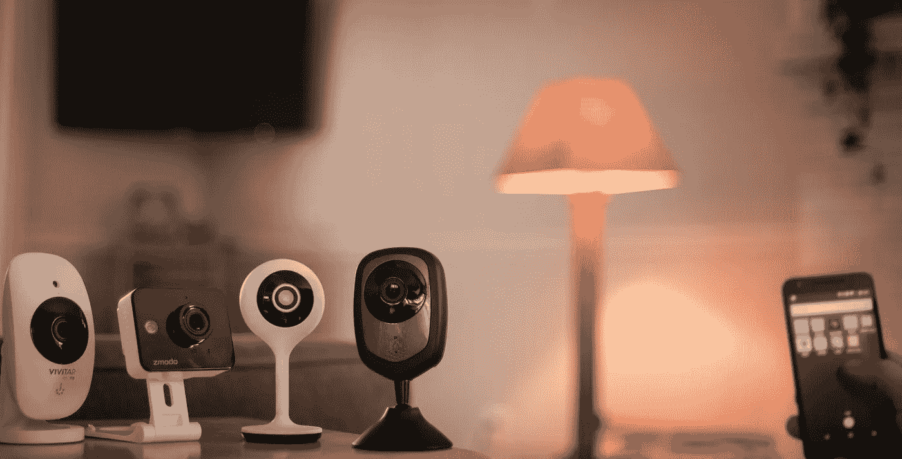

# 醒醒！现在是关心物联网安全的时候了！

> 原文：<https://medium.com/hackernoon/wake-up-the-time-to-care-about-iot-security-is-now-d4fd38bd28ae>

Several of the Consumer IoT Devices Dark Cubed Tested

他的帖子是对我们最近发布的题为“物联网的状态[安全](https://hackernoon.com/tagged/security)的报告的跟进，可以在这里找到:【stateofiotsecurity.com】T4。公众对我们报告的反应既令人谦卑又令人兴奋；我们肯定碰到了一个你们许多人都关心的问题。然而，我们也收到了一些回复，这些回复并没有让我感到惊讶，但却让我思考了安全社区在解决这个问题中的作用。

作为一名安全专家，我理解与讨论物联网设备安全性相关的疲劳；坦白地说，我有一段时间也有同样的感觉。然而，在观察到我们的客户被物联网设备的僵尸网络无情地攻击后，我们的团队决定亲自调查此事。这项研究改变了我对物联网安全的看法，我希望您能多花几分钟时间来了解原因。我将从我的论点和三个关键点开始，然后跟进一些关于我们研究的更多细节。

# 我的论点

物联网安全不是一个安全问题，它同时是一个公共安全和国家安全问题。安全社区必须优先解决这些问题。

1.  **从宏观层面来看，物联网安全是我们这个时代最严峻的挑战之一。**任何单个设备的安全性或缺乏安全性都没有影响，就像一滴水一样。然而，无数水滴的宏观效应通过创造山脉、山谷和海洋塑造了地球的面貌。同样，规模更大的物联网生态系统的安全将对每个国家的国家和经济安全产生深远影响。正是这些类型的复杂、宏观层面的安全问题是最困难的。作为一个安全社区，我们不能放弃。
2.  世界上最大的传感器网络的运行和维护伴随着非凡的能力和责任；我们没有注意。与快速增长的消费物联网基础设施相关的传感器网格可以收集音频、视频、运动、能耗、位置数据等等。不管是谁操作这个电网，他都能接触到海量的高质量数据，并控制每一台设备。许多国家都在关注中国在电信基础设施方面日益增长的作用，但我们难道不担心中国公司运营消费物联网基础设施吗？我认为，消费者物联网基础设施将比任何其他基础设施都更有价值，如果还没有的话。我们必须从战略角度认识到这一基础设施的价值，并相应地确定我们行动的优先顺序。
3.  **没有人承担物联网安全的责任。**我们已经证明，制造商和零售商都没有承担开发和销售安全可靠的消费类物联网设备的责任。政府也没有承担监督的责任。整个安全社区已经放弃了。在这种缺乏问责的软黏中心，消费者每年都在部署数十亿台新设备。作为一个安全社区，推动安全责任和问责是我们的工作，但我们正在失败。首先，我建议零售商必须在政府授权行动之前获得物联网安全的所有权。

# 关于我们的学习

O 我们的测试并不复杂、深奥，相反，它们是简单、无聊的安全测试，任何考虑安全性的人都会进行。我们通过对每台设备进行严格、详尽的审查来执行这些测试，以收集这些设备缺乏安全性的真实、确凿的数据，我们很高兴在本报告中分享测试结果。我们的发现是对 12 种现成物联网设备与 3000 多台外部服务器之间的 125 万次通信进行分析的结果。

一方面，我们的发现并不令人惊讶。这些设备中有许多是不安全的。许多相关的基础设施都不安全。一些 Android 应用程序处于危险边缘。是的，想到某个陌生人可能会看着你的孩子睡觉是很可怕的(用我们讨论过的一些设备很容易做到)。我们还发现，有人只要在浏览器中粘贴一个 URL，就可以反复触发您安全系统的警报，让您抓狂。我们还证明，我们可以编写一个简单的五行计算机脚本来查看灯泡或插座的每次开关，这可以由任何能够访问您的手机所连接的任何网络的人来完成。一想到有人可以从你的设备上拦截流量并获取诸如你的生日、电子邮件地址、电话号码甚至你的密码之类的信息，就令人害怕。作为我们研究的一部分，我们发现所有这些事情都很容易在一种或另一种设备上完成。

这些事情很可怕，但与我们作为安全专家在宏观层面上担心的事情相比，它们算不了什么。

如果我们从全球的角度来看待这些设备，考虑到不仅仅是一两个不安全设备的影响，而是数十亿个不安全设备的影响，会发生什么？虽然如果我们的恒温器在寒冷的夜晚停止工作可能会带来不便，但如果大都市的每个恒温器都引起大规模的电涌并导致电网瘫痪，会怎么样呢？如果数百万个智能灯泡和插座同时着火会怎样？如果一个外国情报机构可以让数以百万计的摄像头和安全系统根据命令捕捉音频和视频会怎么样？你认为这不可能发生吗？我们发现，与这些设备相关的制造商和基础设施与中国沟通或相关的程度令人震惊，并具有重大的国家安全影响。

现在，我们的报告并不都是悲观的。我们最终想问一个简单的问题…如果普通大众可以做一些小事来改变未来会怎样？

我们正在谈论消费者和零售商采取立场，要求制造商和这些设备使用的平台至少考虑安全性，以及美国公民的数据在他们的设备和相关基础设施的开发中存储在哪里。

令人惊讶的是，通过要求基本的安全水平，没有必要增加消费者的成本。我们审查的不安全设备的价格与安全设备相似，但零售商似乎没有意识到或不关心将这些设备与消费者区分开来，尽管有明显的[营销](https://hackernoon.com/tagged/marketing)优势，并且迫切需要证明他们确实关心客户的隐私和安全。

我们很高兴终于发布了我们的报告，并与社区分享我们的发现。我希望您能花时间通读一遍，并让我们知道您的想法！您可以在[http://www.thestateofiotsecurity.com](http://www.thestateofiotsecurity.com)访问该报告，并确保在 Twitter @ darkcubedcyber 上关注我们，因为我们将在未来几天和几周内发布更多与该报告相关的内容。

*本帖原载于暗黑立方博客，网址:*