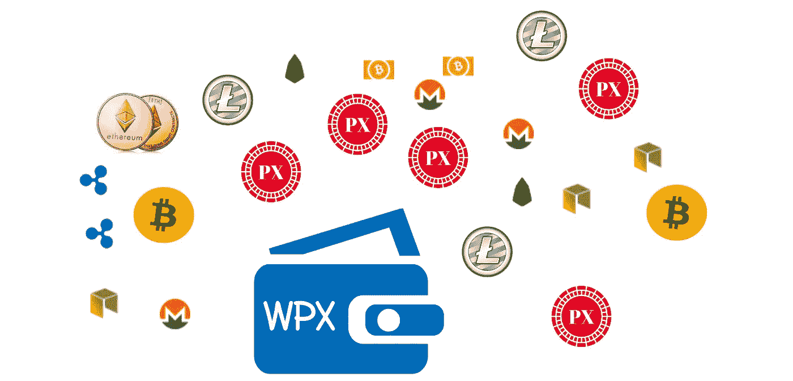

# 钱包项目 X“WPX”第一个点对点分散和安全的 DApp，免费交换接受加密货币和法定货币

> 原文：<https://medium.com/hackernoon/wallet-project-x-wpx-introduces-the-first-peer-to-peer-decentralized-secure-dapp-no-fee-601ebc674f6b>

# 通过实时市场数据，在安全的环境中提供最佳的交易

由 Project X 开源的 **X 共识**第三代智能合约多区块链提供支持，了解更多请访问【PXOS.org】

*被我打乱 2018 年 6 月 25 日*

# [WPX](http://pxos.org) ，是第一个在安全 DAPP 中提供旨在降低成本、免费点对点交换服务的分散式交换

> **加密货币市场去年经历了指数级增长。随着新货币的不断发展，预计今年该行业将达到更高的水平。此外，个别虚拟货币和整体市场的市值继续在全球范围内扩大。**

鉴于这种前所未有的增长，今天仍然很难获得加密货币。最有可能的是，法定货币需要存放在海外，以便能够直接购买加密货币，或者避免向比特币基地支付每 5 万美元比特币或以太币 2500 美元的费用。WPX 将取消所有这些费用，并允许在没有中间人的情况下使用大多数货币进行点对点交易。

随着越来越多的资金涌入加密货币领域，交易所变得更加脆弱。在过去的几年里，他们中的许多人经历了网络攻击，导致投资者遭受巨大损失。此外，为了避免加密货币交易的风险，当前的平台对其服务收取高额佣金或大幅提高汇率。

> [WPX，](http://www.pxos.org)是一个旨在改变加密货币交易生态系统的新项目。该服务的关键要素是一个 WPX 聚合器，它使用户能够以最佳价格直接在彼此之间交换法定货币和虚拟货币，而无需任何中介，这是一个实时和安全应用的点对点系统。

> 在提供最大限度的安全性的同时，WPX 确保每笔交易除了智能合同的天然气成本之外没有其他费用。没有会员费或最低或最高，是由买方和卖方。

***【DApp】***上的每笔交易都由买卖双方手动执行，其价格由 ***实时市场数据库*** 按照主要加密货币交易市场的平均交易价格计算。另一个未来是我们将允许买家和卖家包括新的硬币，ICO 时间表和建议，以及加密资本。例如，要用 BTC 兑换 ETH，用户必须在“卖出”窗口输入#BTC，市场价格将在“买入”窗口计算 ETH 的确切数量，并输入比特币和以太坊钱包地址。在接受条款后，DAPP 将发布智能合同来进行硬币的交换和转移。

[**PXOS**](http://www.pxos.org) **加密货币【PX】**可以作为任何其他货币使用，通过使用 PXOS 钱包**【WPX】**用户可以将代币兑换成另一种货币免佣金。一旦 PXOS，用户下载 WPX 钱包，并建立一个帐户，他/她将能够购买，出售，并发送 PX 令牌直接到任何链接的帐户(信用卡，银行帐户等)。).资金将自动转换成所选择的当地法定货币，例如美元、墨西哥比索、欧元、英镑等。，除了用于进行区块链交易的汽油费或哈希费之外，没有增加任何费用。PXOS 钱包应用程序“WPX”，可以作为一个银行账户，你可以检查你的每一个代币余额拥有，我们的 DApp 即将发布，回来更新。

我们的法律团队正在根据给定的法规开展工作，以确保我们的服务符合给定的规则。

## 目前，PXs 代币预计售价为每枚 0.02 美元。PXOS.org 尚未持有 ICO，仅发布奖励令牌，拥有令牌的用户将获得服务和其他系统权限。

> [**WPX**](http://PXOS.org) 团队将宣布上线，有兴趣的可以现在报名参加即将到来的早期发布版本。