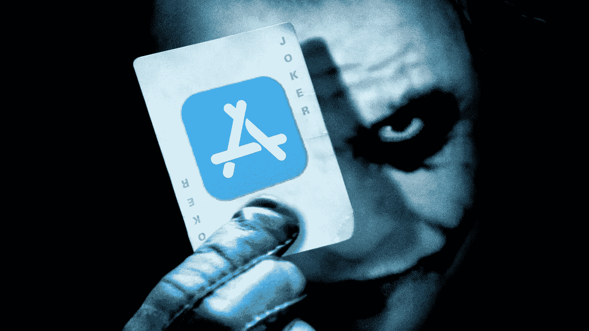
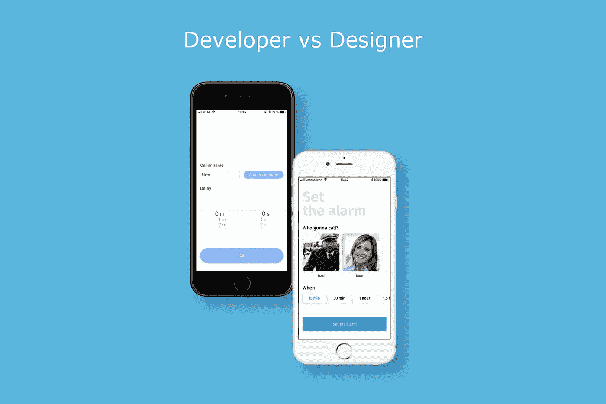
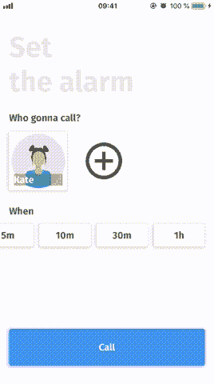

# 想知道我怎么会有这些伤疤吗？我已经尝试发布到应用程序商店。

> 原文：<https://medium.com/hackernoon/wanna-know-how-i-got-these-scars-ive-tried-to-publish-to-the-app-store-6bbfcbf6339d>

每个人都知道，一个成功的产品发布由许多部分组成。开发、设计、营销、推广、客户开发只是其中的一部分。但是如果你不遵循这些指导方针，所有这些都可能是无用的。这里我将谈谈我第一次使用独立开发的经历，以及为什么我的应用程序看不到任何用户。

我开发应用程序大约有五年了。所以这不是我第一次申请。然而，这是我第一次从想法到实现。

**我为什么决定做 app？答案很简单，我想同时记住代码技能和检查我的产品技能。去年，我根本没有写代码，而是作为一名产品经理来管理人。我以为我再也不会写代码了，因为太无聊了。但是两个月前，我意识到，我想用我的程序员技能做一些事情。**

**那么，我是如何找到未来应用的想法的？有几次在一次尴尬的约会中，我给朋友发了一条短信:“救救我”，然后等着电话。有一天，我在看一个 Instagram 博客，上面有约会的故事。有许多妇女描述了同样的问题。啊哈！至此，我决定了我要做哪个 app。我的应用程序将帮助人们逃离无聊的约会或会议。**

你叫什么名字？起初，我想把它命名为 TinderCall。很简单。后来，我正在向我的朋友描述我的想法。她告诉我，她总是给她的朋友凯特发短信。啊哈！卡特卡尔是个完美的名字。

有人在吗？我开始看 AppStore 里有没有类似这样的应用，找到了几个类似的应用。大多数情况下，他们相当糟糕。没有设计，你需要在通话前一直打开应用程序。我决定要做一个更漂亮更实用的应用。使用 CallKit(模仿真实的呼叫行为)和 PushKit(无需一直打开应用程序)

**里面是什么？**来电者姓名、日期和通话按钮。所以我决定自己做这个设计。很简单，对吧？一些蓝色背景，一个网格，一堆控件，就这样。我做到了，并意识到我最好向我的设计师朋友寻求帮助。

**我选择了设计师版本**开始了我的工作。从项目创建到点击提交到 AppStore 按钮花了 35 天。17 次提交和大约 40 个小时的代码编写、阅读文章和处理 bug。大多数作案都是在周四。

也许我应该加点什么？主要功能完成后，我认定这还不够。我想添加一个新的屏幕，有呼叫等待时间，反馈屏幕，点击，语音选择，…一切看起来都很重要。

App’s workflow

我需要停下来。在某个时候，我意识到是时候提交申请了。因为我可以不断改进它。如果苹果拒绝了，也许我需要修复一些东西。而且……我的应用被两点拒绝: *1.1.6 支持匿名或恶作剧电话或短信/彩信的应用将被拒绝*和 *5.2.5 你的应用包含模仿 iOS 呼叫界面或行为的功能*。

**坏消息。那很糟糕，但并不严重。我知道我会上诉。不幸的是，与出版处的对话没有任何结果。假电话绝不能与 CallKit 和 VoIP push 结合使用。认为这不是恶作剧的观点没有帮助。**

**接下来是什么？**我已经计划好如何在 ProductHunt 上推广我的应用，成为一名真正的创业创客。现在我不能发布它所有的好功能。我需要要么让我的应用程序像 AppStore 中的其他应用程序一样，取消 CallKit，要么找到另一个解决方案。我更喜欢第二种选择。

**我从中得到了什么？**我更新了我的代码技能，更新了 github 上的 repo 和下一个应用的必做清单:

1.  阅读 AppStore 出版物指南
2.  尽快发布应用程序
3.  如果商店里没有类似的应用程序，我会更仔细地阅读指南。
4.  不是和苹果开玩笑。

感谢阅读！

*项目的编码可用* [*此处*](https://github.com/olgavorona/Kate-Call) *。*