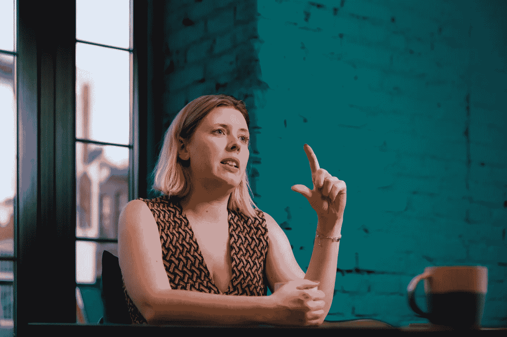
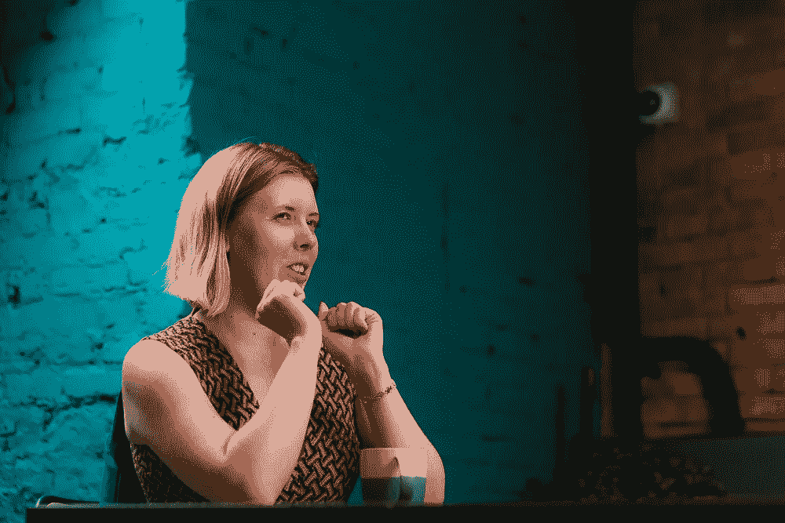
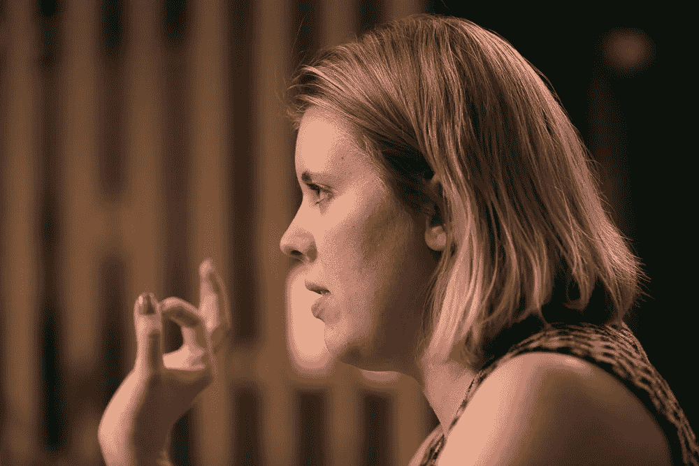

# “想从 ICO 那里得到 3000 万美元？制作 500 份出版物”

> 原文：<https://medium.com/hackernoon/want-30-million-from-an-ico-make-500-publications-1604e94f1d9>

Mariya Lapuk talking about ICO PR tactics and secrets

推广一个 [ICO](https://hackernoon.com/tagged/ico) 的效果如何？一个[区块链](https://hackernoon.com/tagged/blockchain)的创业公司需要多少资金，哪个营销渠道最重要？回答这些问题的是玛利亚·拉普克，达芬奇机构的联合创始人，他曾为互联网倡议发展基金(IIDF)和俄罗斯顶级社交媒体之一 Odnoklassniki 从事公关工作。

**——你是如何参与推广区块链项目的？**

这一切都始于 2017 年达芬奇机构成立之时。最初，我们专注于技术和风险创业公司，但随着时间的推移，我们也增加了区块链堆栈。

我们作为公关承包商的第一个 ICO 是 Cindicator。这是一种混合智能，基于“群体的智慧”做出预测，这是个人资料专家和人工智能的集体意见。2017 年 8 月，该项目在为期三周的象征性销售中筹集了 1500 万美元。然后是 INS 生态系统的象征性出售，最终成为该机构最大的 ICO。我们筹集了 4200 万美元，这是一个非常好的结果。毕竟，这是在 2017 年 12 月，市场动荡，竞争激烈。还有其他项目，包括阿迪夫，深渊等。

**—为什么杨永晴代理网站上没有提到 ICOs？你在隐瞒吗？**

这是一个没有鞋子的鞋匠的故事。一旦我们对 ICO 做了有吸引力的介绍，游戏规则就会改变，信息就会过时。例如，在 2018 年春天，我们达到了一个点，我们已经学会了在日本很好地工作，并找到了好的执行人和承包商。我们甚至为日本接了一个新客户。但是第二天规则就改变了。我们被迫重做一切。

Mariya Lapuk and Kirill Bezverhi during the conversation

**—说到媒体出版物，就网站访问量或浏览量而言，目前最佳转化率在哪里？**

我认为考虑自媒体的转化，原则上把流量和 PR 的 KPI 捆绑在一起是不合适的——这毕竟不是营销。尽管如此，媒体报道越多，你就能期待收到越多的观点。如果 TechCrunch 写了你，那么其他媒体会转载它。

**—如果你采用区块链媒体和付费新闻稿出版物，那么你应该知道最佳效果在哪里。**

不同的材料在相同的介质中表现出不同的转化率。除此之外，并不是所有的媒体都披露文章浏览量的信息。对于一个 ICO 来说，公关不是为了流量，而是为了建立对一个新公司和产品的信任。即使有现成的产品，区块链项目团队也会为一个想法筹集资金。人们的信任是在某种预期下货币化的。这就是心理学。因此，公关没有必要用浏览量和点击率来衡量转化率。

风险市场上的公关也是如此。创业公司需要公关有两个主要原因。第一种情况发生在需要交易时，双方开始就价格“讨价还价”。第二种是当一家公司变得很大，声誉很重要的时候。因为技术是很难感受到的，这是一个靠信誉的生意。

在 crypto 中，每个项目都需要升级，因为他们通常什么都没有。他们想从人们那里拿很多钱，他们需要告诉他们，他们将为这些钱做些事情。

**—您是否曾在加密媒体购买过出版物，但没有流量或他们没有履行义务？你建议避开什么媒体？**

必须立即判断形势。例如，在过去的一年年底，有这样的情况，相当小的媒体在两周内大大增加了流量。我们认为它膨胀了。但现在，如果你看看这些媒体，你会发现它们已经成为常规的大型媒体，因为它们有独特的新闻和优秀的社论内容。市场是非常动态的，你不能说一个媒体是好的，另一个是坏的。

**——持有 ICO 时，公关预算应该是什么样的？**

Mariya Lapuk during the talk about money

看你想筹多少了。如果你有 1000 万美元的硬性上限，那么你会在今年年初来找我，我会说你应该在营销上花 100 万美元，也就是 1 比 10 的比例。现在，对于有现有产品和真实现金流的项目，这更像是 1 比 5。原则上，对于其他人来说，这是一个大问题。你必须考虑你想在哪些地区筹集资金。如果你在看公关预算，那么一个 ICO 应该是 10 万到 15 万美元。如果营销预算是 100 万，那么这大约是 10-15%。

**—你在谈论年初的支出。现在呢？**

市场有点下滑，谷歌、脸书和中国门户网站禁止了很多东西。这是一个大大增加营销成本的问题。就 ICO 的营销投资和收益的比率而言，1 比 5 的转换率现在被认为是好的。如果你想赚 1000 万美元，就投资 200 万美元。同样，你需要 10-15%用于公关。

好吧，你的公关预算是 10 万美元。你建议怎么花？

我不会急着花掉它。你总是有时间去买。我更倾向于制造新闻并在媒体上宣传。我们多次在 CoinDesk、Cointelegraph 和美国《福布斯》上寻找免费出版物。

简单来说，新闻是好的，我们转向了我们需要的记者。当然，我们有很多客户，我们经常和同一个记者谈论不同的项目。但是，总的来说，我们找到媒体，我们找到谁写了相关主题的新闻，我们通过 LinkedIn，Twitter，有时是脸书(取决于国家)联系作者，我们推介新闻。这很像典型的“媒体关系”。

一般认为，媒体在加密市场中是特定的。他们明白你为什么来找他们，为此他们想要钱。这与 21 世纪初俄罗斯地区媒体市场非常相似，当时资金充裕；有选举和与之相关的一切。随着时间的推移，市场变得“更干净”，留下来的要么是那些制造好消息的人，要么是那些精打细算的人。我相信，过一段时间，区块链媒体市场也会“净化”起来。

Mariya Lapuk and Kirill Bezverhi during the conversation

**——因此，10-15%的营销预算应该用于公关。与我们分享一些成功推广 ICO 的其他指标。**

我们有 30 比 70 的公式。这意味着，在推广区块链或其他创业公司时，30%的新闻是关于技术的，70%的信息应该创造这是一个很酷的项目的预期。

这可能包括一些新闻的甜蜜部分，但它不应该是关于技术的，因为大多数投机者既没有时间也没有必要了解它。70%的消息应该是某种买入信号。例如，如果我说某家初创公司与微软签署了协议，这是购买其代币或股票的非常强烈的信号。

也有一些数字是通过经验获得的。在最后一个例子中，我并不声称绝对真实，但我们习惯于认为，如果你想筹集 3000 万美元，那么你应该在媒体上发表不少于 500 篇文章。例如，如果这个数字是 1000 万美元，那么这意味着 150-200 个出版物。

在这方面，他们中的 10–15%应该属于一级(顶级媒体)媒体。此外，不管它是关于加密还是关于商业。如果你想攫取世界，那么这意味着福布斯、TechCrunch、Coindesk 和 Cointelegraph。在俄罗斯，这将是 Kommersant，Vedomosti，Forbes 和 ForkLog。

**——是否有必要在俄罗斯媒体上发表文章，并且总体上关注俄罗斯？**

这取决于项目。每个市场都有自己的特点。例如，我们在印度没有业务，但几个金融科技项目在那里进展顺利。在韩国，网络体育项目正受到欢呼。如果需要日内交易者，你当然应该在俄罗斯工作。

这并不是说俄罗斯有很多人参与 crypto，但肯定是在土耳其和东欧的水平上，这不是无足轻重的。世界上到处都是俄语加密基金，它们接受私人投资。此外，至少在更早的时候，就有将法定货币转移到 crypto 的历史，以供那些想要提取资金的人使用。

Kirill Bezverhi asking about investors from Russia

所以，我不会说俄罗斯不值得研究。我们承接的所有项目都有一部分资金是在俄罗斯筹集的。俄罗斯一直排在前 7 名，对一些人来说，是筹款最多的 3 个国家之一。我见证了俄罗斯一个 ICO 怎么有 7%，对这个国家来说是个不错的成绩。

与此同时，俄罗斯不能成为唯一的焦点。不管是什么项目，人们甚至可以不创建俄语网站、聊天或电报频道，因为每个在俄罗斯投资的人或多或少都懂英语。

你说俄罗斯有许多日间交易者，这是将 ICO 瞄准俄罗斯人的因素之一。这里有什么联系？

从后 ICO 时代需要流动性的角度来看，日内交易者适合任何项目。代币出售后，上市发生，你应该有真正的销售和购买。否则，加密资产将变得不流动，汇率也会大幅波动，这对企业不利。

大家都觉得一个 ICO 的要点是筹钱。不。实际上，筹集资金并不复杂。什么是*非常复杂，然而，在你上市后开始，你需要真正开发项目，保持正常的象征性价格，参与合作伙伴关系，以及其他一切。*

*这就像股票市场，但有大量的内幕交易，仍然没有任何法规或规则。这就是投资者可能高兴或不高兴的地方，你必须回答他们。任何时候，你的代币都可能下跌，例如，有大量资金想要退出。这是真正让创始人头疼的事情，比收钱还突兀。*

***——如果你考虑过去所有的 ico，哪一个是公关组织最强的？***

*一个超级案例是 EOS。他们在公关方面做的很棒。没有产品，他们把整个公关策略建立在预期上。在 crypto 中应该是这样的。Ilya Perekopskiy 的 Blackmoon 有非常好的公关，筹集了大约 3000 万美元，成为俄罗斯最大的 ico 之一。中国 VeChain 也创造了良好的炒作。*

*对于一个 ICO 的成功，什么样的营销渠道最重要:社区、IR、路演还是其他？*

**

*Mariya Lapuk pointing out the role of community management in ICO*

*社区。这是因为无论是在 ICO 期间还是在 ICO 之后，社区都为项目做出了最大的贡献。来自社区的人是最有积极性的，而且通常不会在上市后立即在交易所抛售股票。此外，考虑到对各种工具的禁止，现在投资社区更有利可图。*

***—但我们看到，在 ICO 集合中，与一年前的情况相比，社区在众筹中的份额占 20-30%，其余部分由基金和资金池筹集。那么社区的作用真的很重要吗？***

*当人们明白他们可以做很多“X”时，他们就会很好地投资。现在不是做“X”的时候。一旦人们看到他们能够保证他们的投资增加 2-3 倍，他们就会再次开始投资。在这种情况下，市场资金的比例大约为 50/50。*

***—ICO 市场的发展前景如何？你看到了什么趋势？***

*如果我们谈论的是 ICO 筹资，那么硬上限在 1500 万到 5000 万美元的平均项目已经从市场上消失了。现在剩下的是筹集 1000 万到 1500 万美元(他们希望免费获得)的小型项目和寻求筹集至少 5000 万美元的大型和真正复杂的基础设施项目。*

*就一般趋势而言，今年秋天，我说过这一切将在春天结束。我以为项目的第一笔债务会得到执行，不会发生任何事情，市场会对 ico 失望。但我现在没看到。人们仍然希望赚钱，部分原因是市场并没有真正全球化。在俄罗斯，很早就有炒作，但是，从与我的合作伙伴的谈话来看，在美国仍然没有。在纽约参与保密工作仍然被认为是不正当的。所以，我们还是会看到非常酷的项目和 ico。加密将极大地改变世界，去中心化是真正的新互联网。*

**作者基里尔·贝兹弗希**