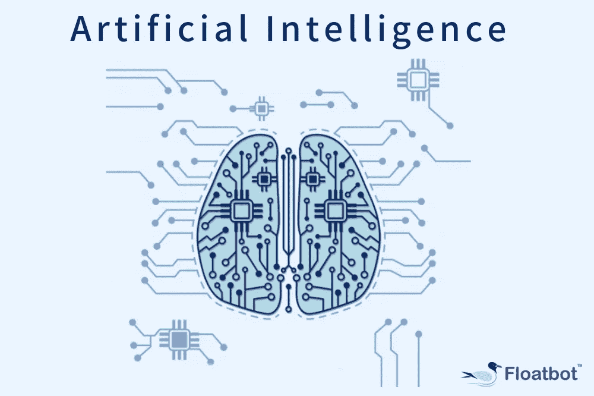
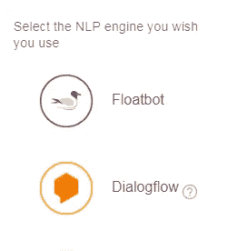
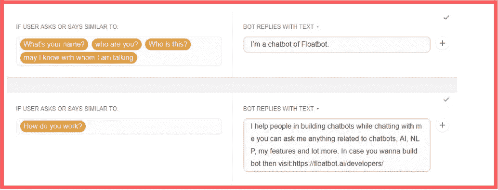
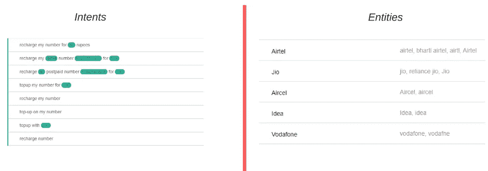

# 想造 AI Bot？了解为什么 AI 在聊天机器人开发中起着关键作用？

> 原文：<https://medium.com/hackernoon/want-to-build-ai-bot-get-to-know-why-ai-plays-a-key-role-in-chatbot-development-ba1f72c440de>

在这个业务不断增长的世界里，这句话通常让我们保持繁荣- **变化是永恒的**。

通过根据客户的购买模式、购买行为、对个性化服务的需求、售后服务支持等来研究我们的客户，我们可以感受到这种变化。

通过了解它们，各种品牌开始测试人工智能聊天机器人提供个性化体验、实时对话和预测客户需求的能力。

让品牌有可能做到这一切的肯定是聊天机器人，但它的核心在于人工智能。这个博客将帮助你理解为什么人工智能需要成为聊天机器人开发过程中不可或缺的一部分。

聊天机器人现在主要从事回答常见问题、提供帮助和解决用户提出的问题等活动。

在进行这种对话时，重要的是保持人情味，直到结束。我说的人情味是什么意思？

让我们看看下面几点，看看在人与人的对话中发生了什么？

*   在 h2h 对话中，所说的话被*理解得很清楚。*
*   我们不会同时谈论两件不同的事情(除非有争论)。我们保持对话的*语境。*
*   在对话中了解主要的*难点*。

所有这些要点使对话变得可以理解、愉快，并朝着一个方向流动。聊天机器人因其与用户进行对话的能力而流行，上述要点在提供更好的用户体验方面起着必不可少的作用，使对话看起来更像人而不是机器人。

机器人可以在人工智能的帮助下有效地执行这种活动。人工智能赋予机器人像人类一样思考和说话的能力。

人工智能包括两大要素，即自然语言处理和机器学习。它们是相互关联的术语，都是为了提供高质量的输出。

**机器学习**是一种帮助机器人从查询/数据中学习的算法。当查询被触发时，机器学习帮助机器人首先监控它与用户过去的对话，并相应地给出响应。

**自然语言处理**俗称 NLP，为机器人理解和解释信息提供帮助。使用 NLP，你可以用用户在对话中输入的各种意图来训练你的聊天机器人，这些意图将简化对查询的响应。

NLP 和机器学习的结合，给你一个了解客户需求的第一手数据。但是这里的问题可能是我们如何使用这项技术？或者他们必须如何设置？

随着技术的进步，你不需要创建机器学习工具，你需要做的只是使用聊天机器人开发平台部署一个人工智能聊天机器人。聊天机器人开发平台可以帮助你根据自己的需求构建聊天机器人。

Floatbot 是一个 AI 驱动的聊天机器人开发平台，允许你在它自己和 Dialogflow 之间选择你的 NLP 引擎。你可以使用 Dialogflow 的 NLP，享受我们平台的好处。

作为一个人工智能提供者，浮动机器人让你在人工智能的基础水平和高级水平训练你的机器人。使用基本人工智能，你可以训练你的机器人回答常见问题和常规查询，其中的回答可以以文本或流的形式设置。有了高级人工智能，机器人会根据你的用户可能说的话，用各种用户意图和实体来训练。

*Floatbot dashboard- Basic AI*

*Floatbot dashboard- Advance AI*

人工智能有助于改善客户服务，因为它使聊天机器人能够密切理解用户的查询，并触发解决问题的响应。解决这个问题是我们大多数人的主要关注点，随着人工智能的出现，这成为可能。

在聊天机器人开发平台的帮助下，在你的机器人中包含人工智能不再是一项火箭科学，你可以从遵循我们方便的指南开始，这些指南将帮助你从零开始构建一个[聊天机器人](https://floatbot.ai/blog/how-to-build-a-chatbot-from-scratch)，并通过浏览我们的[文档页面](https://floatbot.ai/developers)来推进你的开发过程。