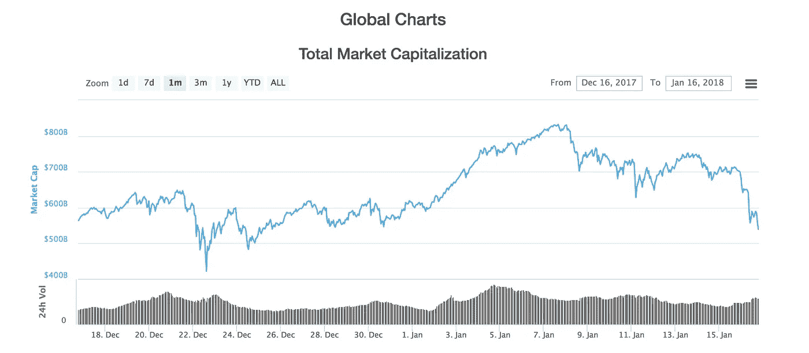
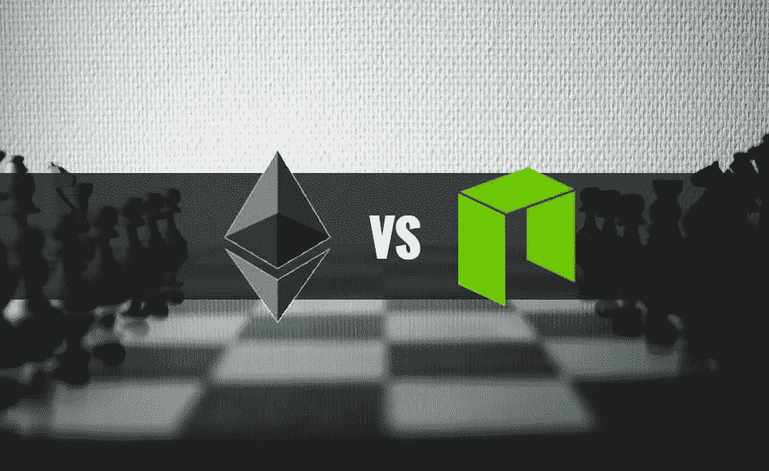
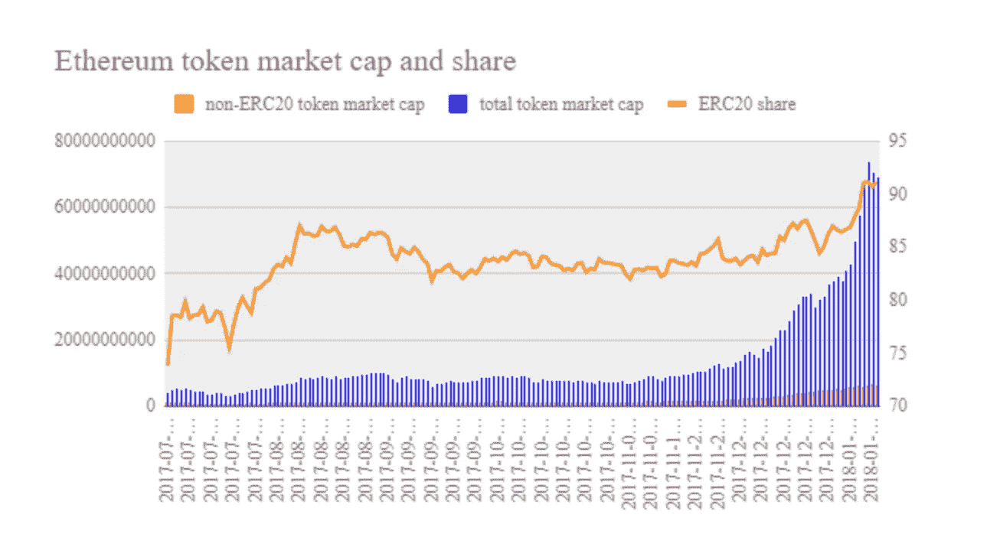
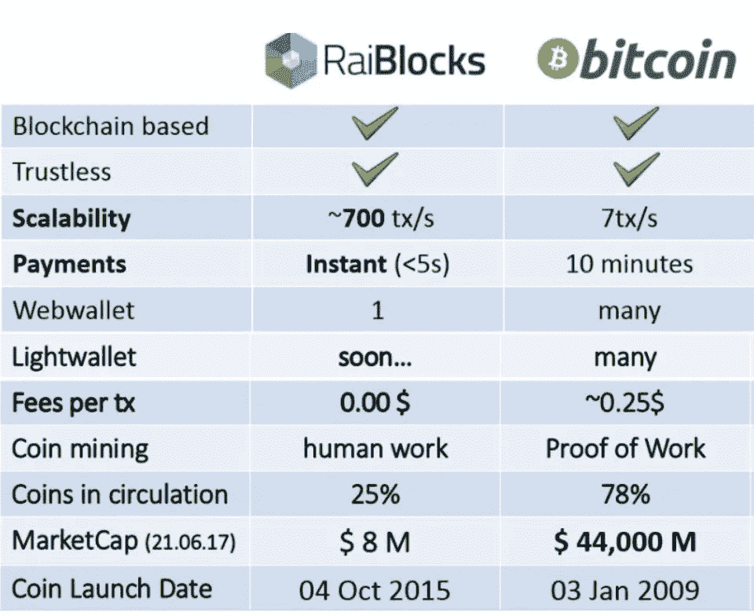

# 想在一个不成熟的秘密市场多样化？

> 原文：<https://medium.com/hackernoon/want-to-diversify-in-an-immature-crypto-market-8227e712f81b>

## 学会投资区块链技术的不同应用

A wild 30 days to say the least.

加密货币作为一种资产类别刚刚开始蓬勃发展，在其当前不成熟的状态下，风险很高，难以量化。

为了管理波动性和下行风险，一些项目正在致力于创建由加密货币支持的金融工具，无论是为机构投资者推出比特币[期货](https://hackernoon.com/tagged/futures)的 [CME，还是为投资组合经理和散户投资者使用和创建自己的指数和衍生产品定义协议的](http://www.cmegroup.com/trading/bitcoin-futures.html)[奥林巴斯实验室](https://www.olympuslabs.io/web)等公司。

然而，在这些解决方案成为主流并容易获得之前，投资者会受到市场波动和价格相关性的支配。我已经在这里写了使用不同市值进行多样化的方法，但是进一步分散风险的另一种方法是投资于解决不同市场需求的项目。

当普通人想到加密货币时，他们认为所有 1400+硬币都只是作为货币使用。**事实并非如此**。公司决定通过首次发行硬币来筹集资金，并在此过程中创造自己的硬币，但重要的是要注意，硬币的用途因公司而异。

## 投资一枚硬币就是对一个项目的广泛采用进行投机，通过将你的投资分散到区块链技术的不同应用中，你最有可能成为一名成功的投资者。

# **平台币**

Source: [https://cryptocanucks.com/head-head-neo-neo-ethereum-eth/](https://cryptocanucks.com/head-head-neo-neo-ethereum-eth/)

*它们是什么:*

*   每个项目[区块链](https://hackernoon.com/tagged/blockchain)的原币(以太坊、Neo、QTUM、Cardano、RChain)

*示例:*

*   ETH、NEO、QTUM、ADA、RHOC

*用法:*

*   在他们的区块链中操作智能合同
*   管理
*   立桩标界

*你正在投资什么:*

*   区块链将被信誉良好的公司采用，或用于在其基础区块链之上构建的其他项目。例如，请求网络(REQ)是建立在以太坊之上的项目，深度大脑链(DBC)是建立在 NEO 之上的项目。
*   以太坊是平台币的明显领导者，拥有[企业以太坊联盟](https://entethalliance.org/)的实力和市场上 [ERC-20 代币](https://steemit.com/cryptocurrency/@pandorasbox/ethereum-rules-crypto-tokens-91-of-all-tokens-are-ethereum-erc20-tokens)的绝对数量。

Thanks to [PandorasBox](https://steemit.com/cryptocurrency/@pandorasbox/ethereum-rules-crypto-tokens-91-of-all-tokens-are-ethereum-erc20-tokens) on Steemit for this graphic showing Ethereum’s dominance as a blockchain platform.

# 货币硬币

*它们是什么:*

*   建立在自己的区块链上的专门用于价值交易的硬币

*例子:*

*   比特币(BTC)、莱特币(LTC)、恒星流明(XLM)、RaiBlocks (XRB)

*用法:*

*   价值储存(BTC)
*   跨境交易(XLM)
*   快速、免费支付(XRB)

*你投资的是什么:*

*   你在投机于在零售环境中作为合法货币的采用，和/或投机于更多的人认为硬币是有价值的，这使得价格上升。
*   比特币通常需要几个小时来处理一笔交易，莱特币不到一个小时，Stellar 和 Raiblocks 通常不到 10 秒。

Obviously a dated [graphic](https://steemit.com/cryptocurrency/@cj23/attention-crypto-fans-getting-to-know-raiblocks-xrb), now that RaiBlocks market cap is $2.6 Billion as of Jan. 15, 2017…

# **公用事业代币**

*它们是什么:*

*   访问服务所必需的硬币，类似于 API 密钥。

*示例:*

*   请求网络，QuantStamp，ChainLink，0x，币安硬币

*用法:*

*   需要一定数量的令牌来访问服务
*   管理
*   立桩标界
*   交换费折扣

*你正在投资什么:*

*   实用令牌撒下了一张大网，每个令牌在其各自的生态系统中都有特定的用法。对于请求网络，参与者需要在 REQ 中支付网络费用，该费用将被烧毁。对于 0x 协议，ZRX 令牌用于对协议的更改进行投票，并支付中继者(在分散式交换机上维护订单簿)的交易费用。
*   交换代币是公用代币的一个有趣的发展。当你购买像币安币或库币股份这样的交易所代币时，你是在投机大众对交易所的接受程度。这些交易所通过在使用交易所时提供交易费折扣来激励人们购买硬币。

# 那现在怎么办？

我个人认为最大的投资机会存在于平台币和实用币。我认为，一些平台非常适合企业，而另一些平台非常适合面向消费者的应用程序，如果背后的项目有坚实的合作伙伴关系、优秀的开发团队和合理的市场需求，一些实用工具就有很大的机会。

## 一如既往，你自己的研究，因为一切仍然是完全投机。了解项目团队、白皮书和市场需求将有助于投资一个在泡沫破裂后仍将存在的项目。

> 在 Medium 和 [LinkedIn](https://www.linkedin.com/in/bharat-vishnubhotla-81a962b9/) 上关注我，了解更多信息。