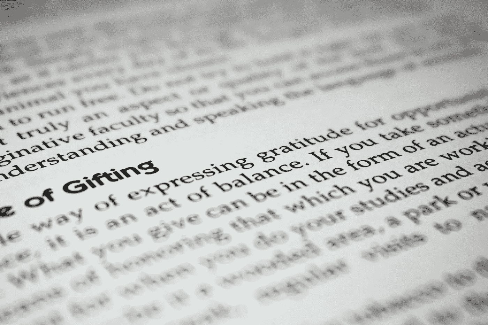
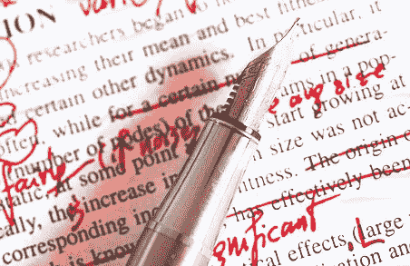
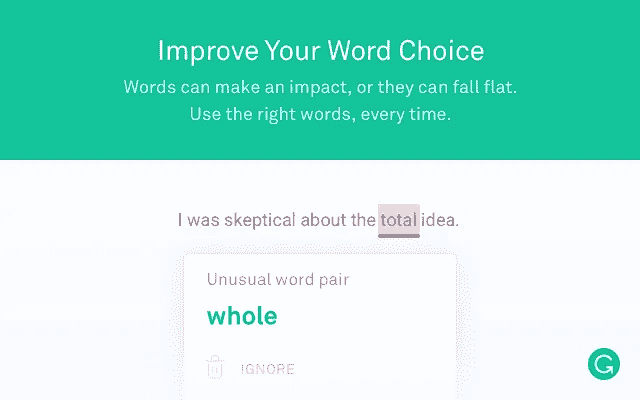
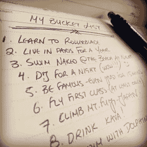

# 想提高工作效率吗？从提高你的写作效率开始

> 原文：<https://medium.com/hackernoon/want-to-get-more-productive-starts-by-making-your-writings-more-effective-6c1cab4f0e2f>

我们今天的话题比电子邮件要大得多，但是你会发现你的电子邮件交流从一种更加面向行动和有效的写作风格中受益匪浅。事实上，任何在专业背景下撰写的文档都可以通过以下原则得到改进。它增强了与团队其他成员以及外部沟通的有效性:当您编写的文档是可理解和可访问的时，客户会很感激。

在向展示**七个有效的习惯以使你的文章被每个人理解之前，我们先来看看什么是有效的写作。最后，我们将把它与电子邮件联系起来，看看一种有效的写作风格如何能够减少来回奔波，加速邮件的处理。**

# 什么是有效写作？

有效的写作指的是一个人能够**写出清晰、结构良好且易于理解的文章。即使两种写作风格都需要对语言机制的透彻理解，它也与诗歌无关。**

事实上，有效写作的要点是一个人运用语言手段组织论点的能力。如果作者的思维过程很容易理解，并且他清楚地表达了文章的目标，就会增加读者理解和遵守文章的可能性。

有效的写作不一定是“面向行动的”,它适用于任何类型的提示，包括纯粹的信息性提示。

# 有效写作的基本规则

有效写作的基础很简单，但根据你目前的写作习惯，实现起来或多或少有些难度。他们在这里:

*   **一个清晰的文本结构**:段落的顺序与介绍文中所辩护论点的初始陈述相关。
*   信息的逻辑流程:文本的不同部分是有逻辑联系的。作者使用连接词向读者表明论点的进展，并使用过渡语句将段落彼此连接起来。
*   **利用句子结构支持文本信息流**:每个句子都建立在前一个句子的基础上。在整篇文章中，指称必须清晰一致，这样读者才不会失去线索，永远不会对句子的主题感到疑惑。
*   **连贯的段落结构**:一个段落把相关的句子重新组合在一起，逻辑地呈现出来。通常，它以一个句子开始，宣布整个段落的想法。下面的句子是为了支持和发展它。最后，你可以用一个介绍下一段的过渡句来结束这一段。

# 成为有效作家的 7 个习惯

## 1.给你的文本一个清晰的结构

如前所述，文本的结构对于使其易于理解至关重要。不要忘记你写作的媒介(电脑),并使用它的所有功能。例如，有序列表和无序列表非常适合用来组织你的论点。如果你写一篇很长的内容，考虑使用不同级别的标题(h2，h3，h3…)。

## 2.简洁就是清晰

杂乱无章无助于表达你的观点。第一稿通常包含一些单词，甚至是完整的句子，这些单词或句子在与文本的其余部分一起考虑时变得不必要或多余。毫无悔意地抹去它们。**剪辑要狠**。

## 3.写出你的意思

优雅地表达自己，花时间找到合适的词是值得的。研究表明，**的 2145 个单词占了所有英语文本的 80%**([来源:大卫·科尼亚姆](https://www.researchgate.net/publication/272536147_The_linguistic_accuracy_of_chatbots_Usability_from_an_ESL_perspective))。剩下的 20%由不太常用的单词组成，如果使用正确，人们会注意到并记住它们。

## 4.DONT 害羞了

用“可能”、“应该”和“可能”来掩饰你的表达，对你自己和你的读者都是一种伤害。你的表情是有目的的；风格永远不足以掩盖内容的缺失。对你的写作含糊不清或过于谨慎会让每个相关的人都浪费时间。尽量让动词用主动语态，让你的文章更有力，让主语和动词靠得更近。

## 5.写作时想想你的读者

你为观众写作，永远不要忘记他们。在你开始给读者写信之前，试着从他们的角度来考虑你自己。如果你是为具有不同技术水平的读者写文章，尽可能避免行话，并定义你可能仍然使用的技术术语。验证你的草稿的最好方法是把它交到别人手里:没有人对他或她的写作完全诚实。如果不能，大声读出来可能就足以看到/听到它的瑕疵。

## 6.不要太执着于初稿

写作是一个反复的过程。第一稿的魔力主要是一个神话——它可能是创造性写作的东西，但它对以清晰为主要目标的作品不起作用。系统地重复你的草稿是确保你的文章简单易懂的唯一可靠的方法。

## 7.避免常见错误

对某些人来说，这似乎是显而易见的，但值得提醒。语法规则组织交流。你的读者会根据你的知识和对这些规则的遵守来评判你。它甚至可能不是有意识的，但是如果你忽略了语法错误，你的提示对一个以英语为母语的人来说会“感觉不对”。

好消息是有非常好的软件可以帮助你。作为一个法国人，语法帮助我确保我的写作不会脱轨。

语法上只适用于英语。如果你用另一种语言写作，检查[语言工具](https://www.languagetool.org/languages)或[语法选择法语](https://dicollecte.org/)。

# 有效写作在电子邮件中的应用

有效的写作实践适用于任何书面交流，从论文到博客文章。当然，这在电子邮件中非常有效:一个有效的作者可以可靠地表达他的观点，避免不必要的来回。让我们看看怎么做。

## 尊重你的读者(注意)

在写作中节约是非常有益的。**你说的越少，越有人愿意听你说**；电子邮件也是如此。注意力是一种稀缺资源:承认它是对读者的一种尊重。

“信噪比”的概念很好地说明了这一点。**尊重读者注意力的人**——最大限度减少噪音的人——最终将从读者的更多关注中获益**。另一方面，那些倾向于将关键信息淹没在一堆废话中的人可能会面对完全跳过他们交流的读者。保持你的信噪比高！**

## **为清晰起见，格式化你的电子邮件**

**我们之前谈了很多关于文本结构的重要性，以便于理解。对于电子邮件，使用列表对你有双重好处。首先，它迫使你以清晰的结构简洁地呈现信息。这也让你更容易找到你的邮件。回复者可以提到第三项，甚至只提到`3/`而不是`Monday's discussion with the marketing team regarding the pricing strategy`。**

****

## **让你的邮件以行动为导向**

**为了让你的邮件更有效率，写邮件的时候要有一个目标。这是通知、要求什么，还是朝着一个决定前进？无论你的目标是什么，在邮件的开头就清楚地陈述出来。**

**在你发送邮件之前，想想你期待的答案，并适应它。例如，如果你计划和某人见面，不要直接要求。通过在第一封邮件中提供几个日期，你可以为自己(和你要会见的人)节省几封邮件。收件人将能够用一个简单的回复“结束会议”:简洁而高效。**

# **总结并继续前进**

**我们希望您能从我们有效的写作建议中找到价值。努力减少写作中的噪音是一个崇高的目标，如果你在日常生活中彻底实施有效的写作实践，你会很快看到好处。**

**在结束之前，我们已经收集了一些有趣的资源，你可以用它们来进一步提高写作的质量、清晰度和效率:**

*   **大学通常有很好的资源来帮助学生提高写作水平。[汉密尔顿大学“写作中心”特别有见地](https://www.hamilton.edu/academics/centers/writing/writing-resources)资源清晰、详细，涵盖很多话题。它们提供了全面的指南，几乎回答了作家可能有的任何问题:写作规则、风格、不同类型文章的具体指南、语法指南以及避免性别歧视语言的提示和解决方案。**
*   **如果你想走上职业作家的道路，他们有大量的博客为你提供来自内部的见解。作家喜欢写作，尤其是关于他们的经历。以下是一个松散的选择:[戈因斯，作家博客](https://goinswriter.com/blog/)，[可怕的头脑](http://terribleminds.com/ramble/blog/)，[日常写作技巧](http://www.dailywritingtips.com/)**
*   **对于网络写手来说:又一次，文案博客很多，但是[文案博客](https://www.copyblogger.com/blog/)脱颖而出。**
*   **最后，如果你准备写一整本书，特克和柯克曼的《有效写作:提高科学、技术和商业交流》很清楚，会给你一个主要技巧的详细概述。如果你在找更便宜的东西，不要犹豫去查一下以前的版本。**

***原载于 2018 年 10 月 16 日*[*gwapit.com*](https://gwapit.com/blog/email/effective-writing/)*。***