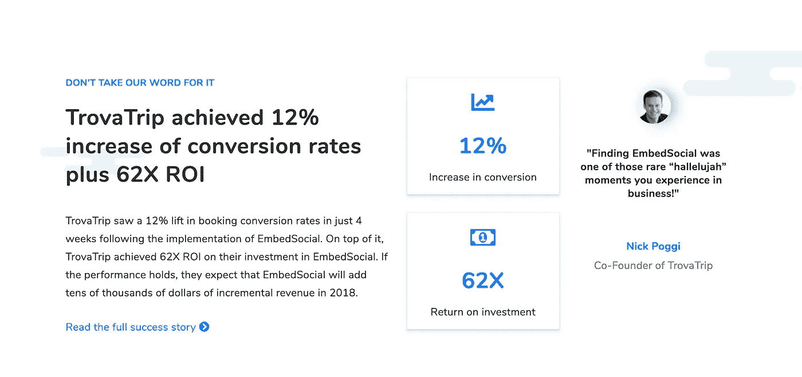

# 想得到更多合格的 demos？在你的 SaaS 网站上使用这 10 个小技巧

> 原文：<https://medium.com/hackernoon/want-to-get-more-qualified-demos-use-these-10-tweaks-on-your-saas-website-6584b92e49d2>

Full breakdown of this page later in this article

我已经厌倦了看到这么多优秀的创业公司因为没有一个合适的方法将访客转化为演示而失去大量的线索。

为什么他们把如此简单的事情弄得如此错误？幸运的是，我会一步一步教你如何不成为他们中的一员。

如果你使用高接触方法(特别是如果你的产品是高价票)，你可以很容易地通过用合格的销售线索填满销售人员的日历来产生大量的收入。

你的初创公司如何安排这么多演示？

嗯…如果你有正确的流程和正确的渠道，这是很容易做到的，你可以产生大量的收入，因为你知道你可以将 25%的演示/销售电话转化为客户。

[Prove]在下面，您可以找到访问我的网站并进行转换的人给我打来的电话数量。这些基本上是我自己业务的“演示”，还不包括我从电子邮件课程中获得的线索:)

100% Inbound calls generated from my own website

我已经可以用这些文章把免费的冷流量变成几千块钱了，你为什么不可以呢？

在这篇文章中，我将教你安排更多演示背后的原则，以及一些简单的调整，你现在就可以用来增加演示的数量！

# 仅此一项就能让你的演示增加 3 倍

大多数人不准备把他们的时间给他们今天遇到的几十家公司中的任何一家。

认为您可以简单地添加一个“安排演示”CTA，并获得大量销售线索，这是不现实的。抱歉，那是不可能的。

现在，我伤了你的心，你有了正确的期望，你会开始注意到你可以如何温暖你的访客，让他们相信你会给你一些时间。

只有一小部分人会接受你的演示，所以你需要提供替代方案，以便其他人最终可以转换到演示中，同时你也使他们合格。 **‍**

> ***相关文章:*** [*为什么你可能会错过 70%的转化率(以及如何修复)*](https://www.cortes.design/post/why-saas-startups-are-missing-out-on-70-of-conversions-how-to-fix-it)

 [## 为什么 SaaS 的创业公司错过了 70%以上的转化率(+如何解决)

### 大多数人只是没有准备好立即转换，所以你的网站应该是一个可预测的转换系统…

www.cortes.design](https://www.cortes.design/post/why-saas-startups-are-missing-out-on-70-of-conversions-how-to-fix-it) 

# 演示前如何让参观者热身

本质上你想首先提供价值！它可以是培训视频、文章、案例研究或任何可以补充您所提供的解决方案的形式。

弄清楚什么类型的内容可以让你的访问者感觉你知道你在谈论什么，或者至少与他们分享一些你的结果和你以前客户的过程。

因此，对于那些还没有准备好立即转化的人，为他们创造一些销售线索磁铁，使用电子邮件序列来跟进他们，并通过电话联系他们，正如我在下面的文章中提到的漏斗列表。

> ***相关文章:*** [*亲爱的创业公司，你不需要登陆页面你需要一个合适的漏斗！*](https://www.cortes.design/post/dear-saas-startups-you-dont-need-a-landing-page-you-need-a-proper-funnel-heres-how)

 [## 亲爱的 SaaS 创业公司...你不需要一个登陆页面，你需要一个合适的漏斗！以下是原因(以及…

### 我看到大多数创始人担心他们的登陆页面，担心它的外观和如何转换...但是专注于…

www.cortes.design](https://www.cortes.design/post/dear-saas-startups-you-dont-need-a-landing-page-you-need-a-proper-funnel-heres-how) 

这样，您可能会在漏斗中获得更高的转化率，但通过适当的流程，您将能够就您的解决方案对他们进行培训，并使他们有资格在不久之后进行演示/销售拜访。

# 例子

Free trial CTA around Blog posts

‍**close . io**——steli(创始人)在创业界被视为“销售/冰冷的电子邮件人”。他提供了惊人的内容，当应用时，可以给你带来惊人的结果，尽管你需要一个 CRM 来管理所有正在进行的交易，猜猜看…这正是 Close.io 所提供的！

他们能够解释如何解决销售问题，并让人们意识到他们可以使用他的产品来解决问题，这样，他们就可以将人们从铅磁铁转化为客户。

Image from [EmbedSocial](https://embedsocial.com/)

EmbedSocial 让你可以查看他们的成功故事，这样你在阅读后更有可能转变。

我觉得这里的执行力很棒，你绝对应该拿来做参考。

Demo section from a full Landing page breakdown, [full article here](http://www.cortes.design/post/breaking-down)

这是一个更“偷偷摸摸”的例子，因为我将演示用作第二个 CTA，并确保期望回答关于产品的任何问题，并且我们有一个支持团队来做这件事。

本质上，人们会觉得他们还没有准备好转换，所以演示将是一个回答他们问题的好方法。

他们不知道这是故意的，因此您可以在通话中演示并转换他们。

这对于复杂/技术产品或简单的高价产品特别有效。 **‍**

> ***相关文章:*** [*分解一个转化驱动的 SaaS 登陆页面(旨在捕捉更多线索)*](http://www.cortes.design/post/breaking-down)

 [## 打破旨在获取更多线索的 SaaS 登录页面

### 在这篇文章中，我将向你展示我是如何设计一个概念页面来捕捉线索的，在这种情况下，它是…

www.cortes.design](https://www.cortes.design/post/breaking-down) 

# 让愚蠢的计划变得简单

Fuze

"请填写表格，我们的专家将尽快与您联系."

**为什么公司一直这么做！？**

像“请求”或说“我们会保持联系”…就像客户需要做所有的工作！

你可以简单地在你的网站上免费嵌入[日历](http://calendly.com/)，让人们选择自己的时间。

这样，人们可以简单地通过你的申请过程，选择他们的时间，100%自动驾驶，没有后退前进的信息

Good funnel from [Copilotai.co](http://copilotai.co/)

在本例中，您可以安排与销售人员进行一次 15 分钟的即时会面，使公司能够进一步了解他们的潜在客户，并在电话中与他们达成交易。

# 我为什么要安排？

站在潜在客户的角度想想，他/她为什么要安排电话？

接听电话会带来什么价值和好处？

这会有助于他们发现你是否合适吗？

或者…找出他们遇到的问题的原因？

你 100%需要解释为什么他们应该安排一个电话，因为如果没有好处，就没有打电话的动力，**让你没有转换。**

The page where I get the calls, [check it (or schedule one) here](http://www.cortes.design/consultation)‍

这是我接听来电的页面，请注意如何提醒他们无论结果如何，来电都应该是有用的。

这非常简单，但这也是因为我已经做了所有的工作，好文章，铅磁铁和社会证明之前，他们甚至到了这一页！ **‍**

还有，你为什么要一个人解决所有的问题？你可以简单地[和我安排一次免费的战略会议](http://www.cortes.design/consultation)，这样我们可以讨论你的问题和目标。 **‍**

# 展示演示电话价值的好例子

Good example of a demo opt-in page from Freshdesk

**本文稍后将对一个优秀的演示应用程序页面进行全面分析。**

# 减少承诺

我们能做的很少，以避免大量的时间承诺演示可以为您的访客，所以我们唯一能做的是尽量使它看起来不那么承诺。

有 3 种主要(简单)的方法可以做到这一点。

# #1 —减少 time‍的通话

演示时间不要超过 30 分钟，尝试使用销售脚本或适当的流程，这样您就可以尽快达到拜访的目标。这对双方都有好处。 **‍**

# #2 —让电话有价值(不考虑 outcome)‍

如果有人觉得不管结果如何，这通电话都是有价值的，他们就不会在整个通话过程中感到被推销的压力。

人们讨厌被推销，所以如果他们觉得没有价值，他们就不会转化，尤其是那些具有最高终身价值的客户(因为他们被推销的次数更多)。

# #3 —甚至在他们接通电话之前就对他们进行资格鉴定

我们知道你不可能 100%地卖出你的电话，但是你可以通过使用你的一个很好的申请过程来预先限定人们来节省你的时间，我将在下面教你。

如果你有制作好漏斗的经验，我不会这么做，因为你可能会冒着不转化任何人的风险，但不管怎样，这是减少你和潜在客户通话时间的好方法。

# 改进您的行动号召

Bad example of a demo form. I removed the name for privacy reasons.

发送消息！？不要试图在你的 CTA 文案内容上太有创意。

不同的场景可能会使用一些特殊的副本，但通常最好坚持使用简单易懂的内容，这样你就不会冒人们不理解你向他们提供的内容的风险。

# CTA 文案的好例子。

*   安排演示
*   预订时间
*   与团队成员聊天
*   与支持人员交谈
*   自由策略会议

# 掌握您的演示应用程序流程

The Ideal Demo page for SaaS Startups. Will be breaking this down step-by-step below

现在我将分解这个简单但有效的演示页面。

请注意这么简单的一页包含了多少细节。所有这些细节组合在一起，尽可能产生最佳效果。

幸运的是，你可以复制/遵循这个过程！

# #1 —移除导航

这在电子商务世界中很常见，它用于避免人们一旦进入结账流程就离开，并减少客户质疑其购买决定的机会。

我完全支持提供替代的 CTA(正如你在上面读到的)，但现在人们正在考虑转换，如果你想获得一些转换，你需要让他们坚持到最后。

# #2 —提醒他们为什么在这里

使用标题提醒他们您的价值主张，并简要说明为什么电话会有用。

# #3 —让它看起来像是为他们量身定做的。

使用标题下方的文字来支持您在上面写的价值主张，并使用一些要点来展示此次拜访的价值。

# #4 —删除不必要的步骤

我总是在联系表单上看到完全不必要的字段…就好像他们不想得到线索一样！

删除任何可能导致开放式问题的内容，这不是一个重要的优先事项，也不是你可以在电话中直接询问的内容。

为什么要用这些无用的输入字段增加转换的承诺？

# #5 —添加社交证明

Good demo/call page from Credo

这是一个来自 [Credo](http://www.getcredo.com/) 的例子，你可以看出他们以前帮助过大公司。

如果这对更大或同等规模的公司有效，为什么对他们无效呢？看到这里的逻辑了吗？

如果你使用他们的竞争对手，这对 FOMO 也有好处，这是促使他们采取行动的另一个好方法:)

你可以使用一些熟悉的公司的标志或其他客户的证明，作为对你的潜在客户来说这可能是一个很好的电话，你有权力解决他们的问题的额外信心。

# #6 —展示进度

如果你的申请过程超过一步，你真的应该考虑添加一个进度条来显示人们离接到电话还有多远。

仅仅是因为不知道他们离电话有多近，他们可能会担心这个过程会太长。

猜猜如果你不这么做会发生什么？他们不会改变信仰…

# #7 —向他们展示接下来的步骤

遵循与上述相同的原则，你应该向你的访问者展示他们在申请过程的下一步会做什么，这样他们就知道会发生什么。

正如你可以从设计中看到的，我给了你一些提示，你可以在第一步输入几个数据点后安排准确的时间。

# #8 —跟踪每一步

非常重要的一点是，要准确理解是什么让你无法获得更多的演示，因为 90%的情况下你至少会遇到这两个问题中的一个。

**问题#1:** 如果你的演示页面吸引了大量的人，但只有不到 10%的人转化，那么很可能这个页面有问题。

您应该检查输入字段是否理想，以及您是否正确地解释了调用的值。 **‍**

**问题#2:** 如果你没有让很多人从某个页面进入这个演示页面(例如:[登陆页面](https://hackernoon.com/tagged/landing-page) - >演示页面)，那么你就没有在他们进入页面之前传达通话的价值，所以大多数人甚至不会进入这个页面。

使用 Hotjar 轻松跟踪漏斗(免费)

我建议你使用 Hotjar 中的漏斗工具(它更简单，可以免费跟踪每个输入字段的转换),或者使用 Google analytics 中不太用户友好的漏斗功能。

# 想要用合格的演示来填满您的日历吗？

获得更多的演示是将访客转化为高价[SaaS](https://hackernoon.com/tagged/saas)(1000 美元以上的年度计划)客户的一种令人惊叹的方式，但这也是从客户那里获得更多反馈的一种令人惊叹的方式，告诉他们如何用一种更低接触的方式来转化他们。 **‍**

线索会得到处理，您(或您的销售团队)可以专注于成交！

**在免费的策略会议之后，你会明白:**

*   为什么你可能没有从你的网站上获得足够的演示或客户。
*   你需要改进什么来使你的网站获得大规模的销售线索。
*   找出对你来说最好的解决方案，不管你最终是否和我一起工作(我们也会讨论是否合适)。

> ***我们聊聊吧！*** [*在这里*](http://www.cortes.design/consultation) 安排你的自由策略会话

*原载于*[*www . cortes . design*](https://www.cortes.design/post/want-to-get-more-qualified-demos-use-these-10-tweaks-on-your-saas-website)*。*