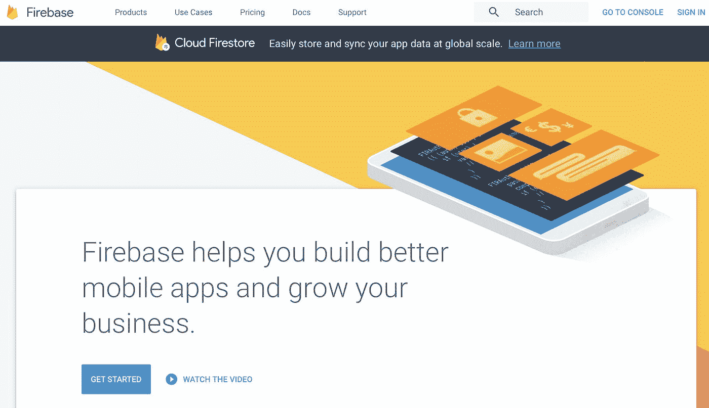
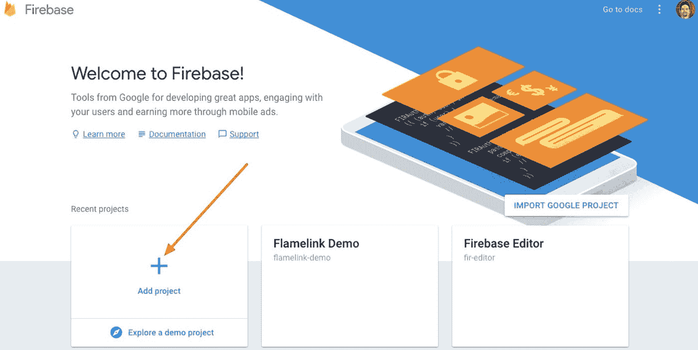
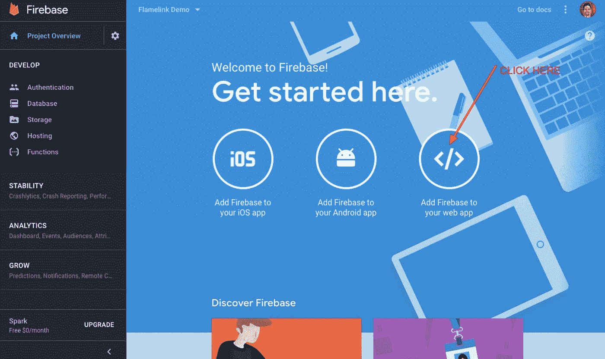
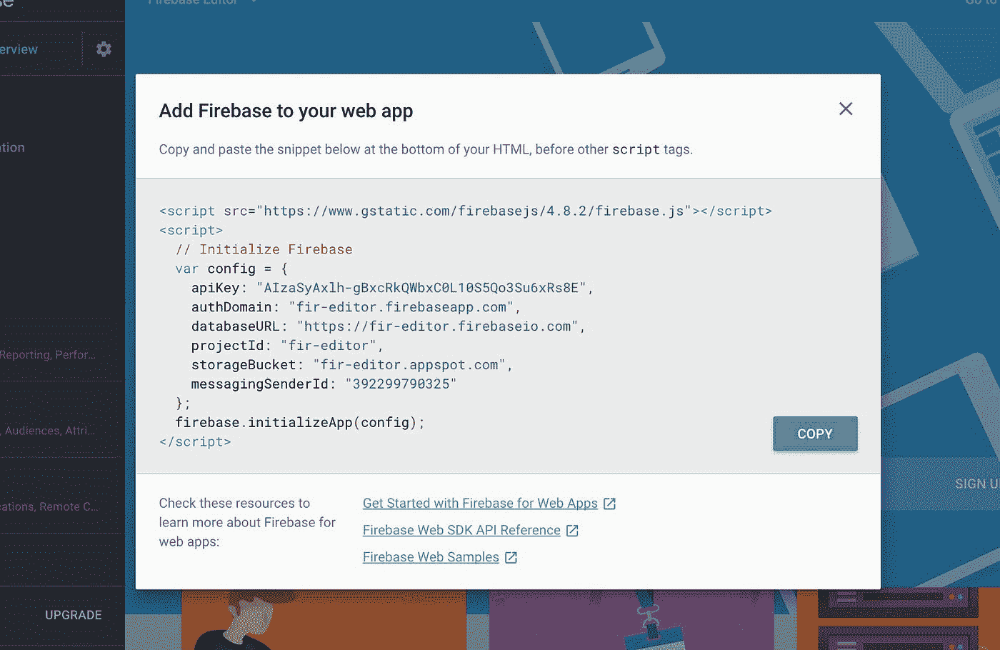
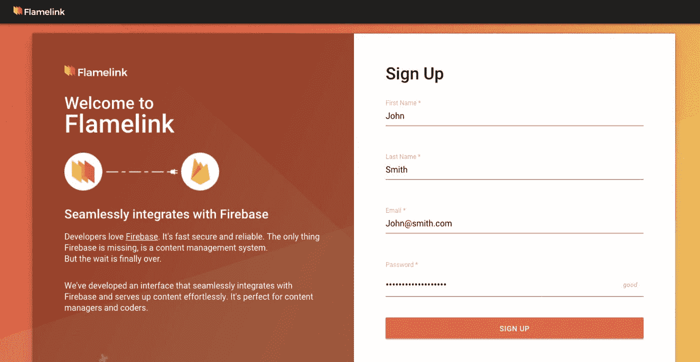
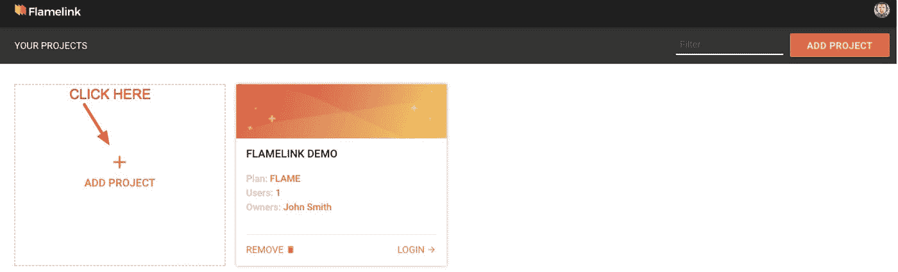
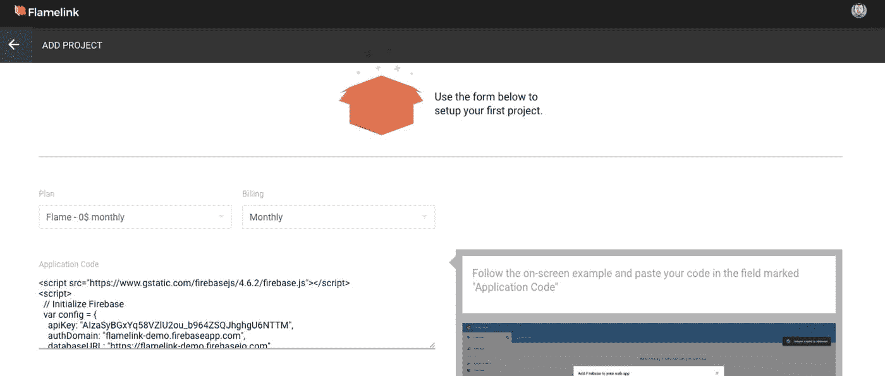
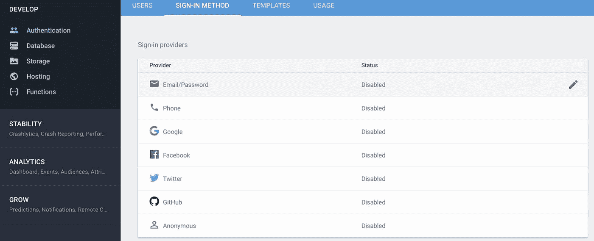
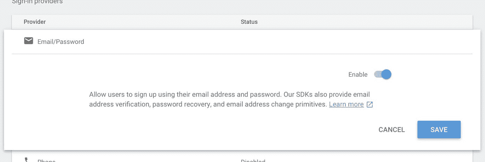
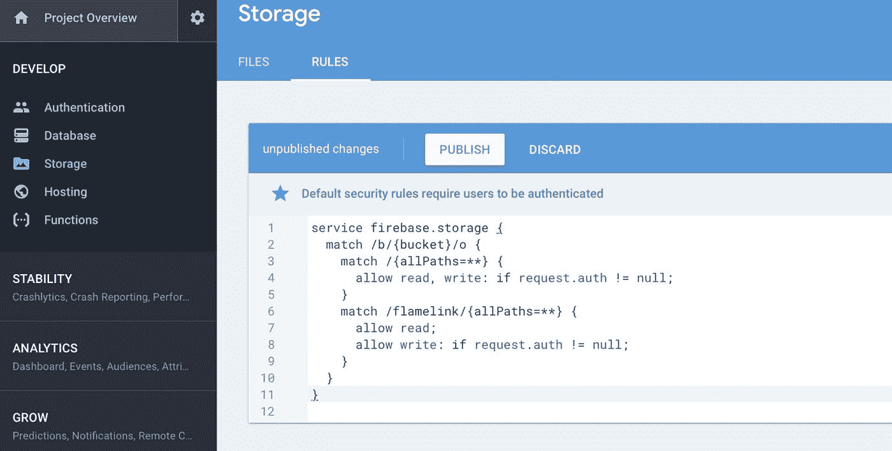

# 更新:想现在就开始使用 Firebase CMS Flamelink 吗？

> 原文：<https://medium.com/hackernoon/want-to-get-started-with-flamelink-a-firebase-cms-right-now-2eb93d6d7be9>

您是一名 **Firebase 开发者**吗？您正在寻找一个易于使用的界面来添加、管理和更新您的 [Firebase](https://hackernoon.com/tagged/firebase) 项目中的内容吗？

好吧，别再找了。[**flamelink . io**](http://Flamelink.io)**是一个无头 CMS，它与**谷歌的 Firebase** 无缝集成，允许 Firebase 开发人员继续编写热门代码，同时允许内容管理人员毫不费力地动态添加、管理和更新内容。**

**我们的团队在假期一直努力工作。我们的技术向导一直致力于一些修复和功能，以帮助使 [Flamelink](https://hackernoon.com/tagged/flamelink) 成为您开发工具箱中一个真正强大的工具，而我们的营销团队一直在创建许多超级有用的视频教程中的第一个，我们将向您展示如何开始使用 Flamelink，这是一个用于 Google Firebase 的无头 CMS。**

****在下面的视频中，我们将带你完成 Flamelink 与 Firebase 的连接，并添加你的第一个项目。****

**Find out how to hook Flamelink up to your Firebase Projects**

**一定要喜欢我们的视频并订阅我们的 [YouTube 频道](https://www.youtube.com/channel/UCPSOGjXxn2he52czV1XsW3g)——因为我们将在未来发布更多的视频教程和有用的内容。**

**下面是开始使用 Flamelink 的第一个项目所需步骤的截图。这些步骤与上面的视频截屏遵循相同的大纲。**

## **第一步:用你的 gmail 账户登录 https://firebase.google.com/的 Firebase。**

****

## **第二步:进入你的 Firebase 控制台并“添加项目”(你也可以使用一个现有的项目)。**

****

## **步骤 3:在你的 Firebase 项目仪表板上，点击“将 Firebase 添加到你的 web 应用程序”图标。**

****

## **步骤 4:单击复制按钮获取代码片段。**

****

## **第五步:在 [https://flamelink.io](https://flamelink.io) 注册 Flamelink。**

****

## **第 6 步:验证您的电子邮件地址并登录。**

**一旦您登录到 Flamelink，如果这是您的第一个项目，您将看到一个向导来添加您的项目并与 Firebase 链接。**

****

## **步骤 7:将上一步中的 web 应用程序代码粘贴到应用程序代码输入中**

****

## **步骤 8:检查“我已经为此项目启用了电子邮件/密码验证”。**

*   **在 Firebase 中，在开发菜单项下，选择身份验证**
*   **单击“设置登录方法”按钮**
*   **选择顶部的电子邮件/密码**
*   **启用此项并单击保存**

********

## **步骤 9:检查“我已经为这个项目更新了我的数据库规则”**

**以下数据库规则将确保您可以正确地将数据保存到 Firebase:**

**{
“规则”:{
”。读“:”auth！= null“，
”。写“:”auth！= null "，
"flamelink": {
"。读“:”auth！= null“，
”。写“:”auth！= null"
}
}
}**

**步骤 10:检查“我已经更新了该项目的存储桶规则”**

**需要更新您的存储桶规则，以包括 Flamelink 名称空间来进行读写访问，如下所示:**

**service firebase . storage {
match/b/{ bucket }/o {
match/{ all paths = * * } {
允许读取、写入:if request.auth！= null
}
match/flamelink/{ all paths = * * } {
允许读取；
允许写入:if request.auth！= null
}
}
}**

## **最后一步是输入您希望为项目注册的初始用户**

*   **通过添加项目，您将被视为项目所有者。如果您选择“使用我的凭据”，我们将使用您当前的登录详细信息创建初始用户。**
*   **将使用您当前的 Flamelink 用户名和密码创建初始用户，但是如果它们不同，系统会提示您输入用于设置 Firebase 帐户的密码。**
*   **请注意，您也可以通过 Flamelink 的“用户”部分向项目添加其他用户。**

****

**我真的希望这能帮助你开始使用 Flamelink，一个 Firebase 的 CMS。如需更多技术支持，请加入 Flamelink Slack 频道:[https://flamelink.io/slack](https://flamelink.io/slack)**

**你也可以**在社交媒体上与我们联系**，我们希望收到你的来信。**

**[脸书](https://www.facebook.com/FlamelinkCMS/)
[推特](https://twitter.com/FlamelinkCMS)
[LinkedIn](https://www.linkedin.com/in/flame-lin...)
[insta gram](https://www.instagram.com/flamelink/)**