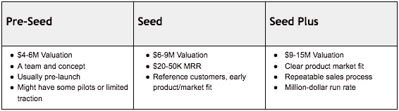

# 想养个 A 轮？seed 更聪明

> 原文：<https://medium.com/hackernoon/want-to-raise-a-series-a-be-smarter-at-seed-e40a42f21c4e>

[*大卫·弗兰科尔*](https://twitter.com/dafrankel) *，管理合伙人*

“首轮危机”有时仍让人感觉真实。这注定了许多初创公司，如果他们在种子阶段的融资上更具战略性，本来可以轻松生存下来。

随着资本涌入风险市场，“种子”早已从一个阶段变成一个梯度，涵盖从 50 万美元的支票到 500 万美元的专业轮次。创业者需要明白这个[新](https://hackernoon.com/the-seed-stage-is-now-the-seed-gradient-d0e5fa65698e)现实。没有意识到新的种子资金市场的流动性，就有可能以许多新的方式过度投资或优化你的融资策略(除了所有旧的融资方式会带来挑战之外)。

# 种子梯度

在边缘有部门和地理过滤器和例外，增加了细微差别，但早期阶段的企业家很可能被归入这些桶之一。危险在于，企业家尚未消化这些微妙的区别，他们正在寻找资本，却没有意识到这种不断演变的格局带来的一些新危险。

## 你的目标仍然(可能)是筹集 A 轮融资

很少有创业公司计划在单轮融资中盈利，所以他们需要考虑一系列的融资。2018 年理想的 A 轮融资看起来至少有 3000 万美元的估值。为了证明这一投资水平的合理性，一家初创公司需要达到 500 万美元的运营成本，或者有真正令人信服的用户增长数字，或者有关于其技术堆栈的真实案例。如果你的计划没有达到这些里程碑，你会想重新考虑你的种子期是一个多阶段的事情。

# 种子梯度失效模式

## 跳过前面的阶段

仅针对种子阶段的估值进行优化是一个陷阱。我见过大学里聪明的高年级学生试图以 1000 万美元的前期估值为前期产品初创公司筹集资金。目前，避免稀释感觉像是一个重大胜利，但我预计，当这些创始人无法证明他们的估值合理，并且无法在 12-18 个月内找到后续投资者时，他们中的许多人会感到失败。这些企业家正在为失败做准备，或者至少是一轮或两轮。

过度融资在初创企业生命的任何阶段都是一种风险，但在后期阶段更容易控制。如果一家初创公司已经找到了产品/市场契合度，正在创造收入，并且能够有机增长，那么它就有可能成长为一家估值颇高的公司。种子阶段的创业公司没有这种奢侈。

## 一千次提升的死亡

“一次付清”的过度融资的变体是一个千倍加薪的失败。现在可以:

*   根据创始人简历和商业计划筹集 25-50 万美元
*   筹集 1 美元——在一个工作原型和几个参考客户上 2M
*   在进入首轮融资之前，再筹集 1 美元 2M，以提升指标
*   当公司难以扩大规模，但相邻市场中有机会的火花时，优秀的创始人可以再筹集 1 美元——2M 更多的支点承诺。
*   一旦团队产生了稳定的 MRR，但不足以提高 A，已经承诺的种子投资者可能会再开一张 100 万的过桥支票来刺激指标；尤其是当创业公司转向“热门”市场时。

三到四年过去了，你已经筹集了超过 500 万美元的“种子”资本，但仍然没有足够的资金进入 A 领域。最终，投资者失去了热情，公司逐渐倒闭，或者幸运地被收购。

## 未能达到逃逸速度

种子梯度的“种子加”部分和首轮融资的最低门槛之间存在明显的差距。对于种子阶段的初创公司来说，很容易陷入 1 美元至 2M 的区间，并且没有足够的无形因素来达成交易。

# 如何导航种子渐变

## 痴迷于牵引力

这是最基本的建议，但任何维度的牵引力——用户、收入、参与度、下降的 CAC 或参考客户——都是创始人可以拿出来的最有价值的东西。一家看起来正在改变的初创公司可以掩盖这样一个事实，即它陷入了一个很酷的类别，或者由简历不完整的人领导。

## 高估值、快速成交、优秀投资者——选择两个

在今天的市场上，你可以选择优化价格，速度，或质量的投资者。除非你已经实现了产品/市场匹配，并建立了一个可重复的销售模式，否则如果你以较低的估值比较高的估值融资，你很可能会更快成交。完全清楚地说，这样的话，创始人会遭受更多的稀释，但他们会“完成任务”,并最有可能减少他们在达到产品/市场契合度之前高估自己的机会。飞行教练告诉年轻的飞行员，“跑道在你前面比在你后面好”，同样的基本建议也适用于 venture。我并不是建议创始人在估值上妥协——我是建议你思考一下，在价格、速度和投资者的感知质量之间，你认为哪个方面最重要。

## 构思你的故事

如今，创始人比以往任何时候都需要更好地解释他们在融资方面的进展，以及产品如何适应宏观环境。我们看到种子基金决定不投资有前途的公司，因为他们认为他们已经得到了种子资金，而实际上，他们的资金更符合种子前一轮。提前应对任何潜在的误解，否则就有过早关门的风险。指标是推介的基本要素，但创始人有能力通过谄媚的镜头展示它们。投入 100 万美元进入产品市场/适应市场令人印象深刻。在投资了 500 万英镑之后，继续摸索产品/市场的契合度……就不那么令人印象深刻了。

## 乘浪前进

我们已经看到，与指标更好的同行公司相比，指标差的公司以更高的估值、更快的速度筹集资金，而且通常来自更好的投资者，因为他们可以讲述一个令人信服的故事，说明他们的初创公司如何利用区块链、深度学习等。请不要认为这意味着你应该讲一个不真实的故事，或者将你的产品路线图转向当今的技术来筹集资金。这些从众行为有一个半衰期，你不应该为了一轮融资而抵押你的未来，但了解你何时以及为什么会真正有风在背后也是有帮助的。

# 你或许可以推迟一段时间筹集资金

从历史上看，资本很容易获得，这导致许多创业公司将其视为一种常年资源。创始人需要培养一种在预算内生活的能力，以免落入上述“加薪一千就死”的陷阱。我们之前已经强调过 [50 多家公司](https://hackernoon.com/50-big-companies-that-started-with-little-or-no-money-4ef1b68aac25)变得巨大，有些上市了，没有筹集风险资本，更不用说种子期了。不要忘记天使以及朋友和家人。他们投资是因为他们喜欢你或你的想法，而不是期望的回报。事实上，用很少的资金建造非凡的东西还是有可能的。