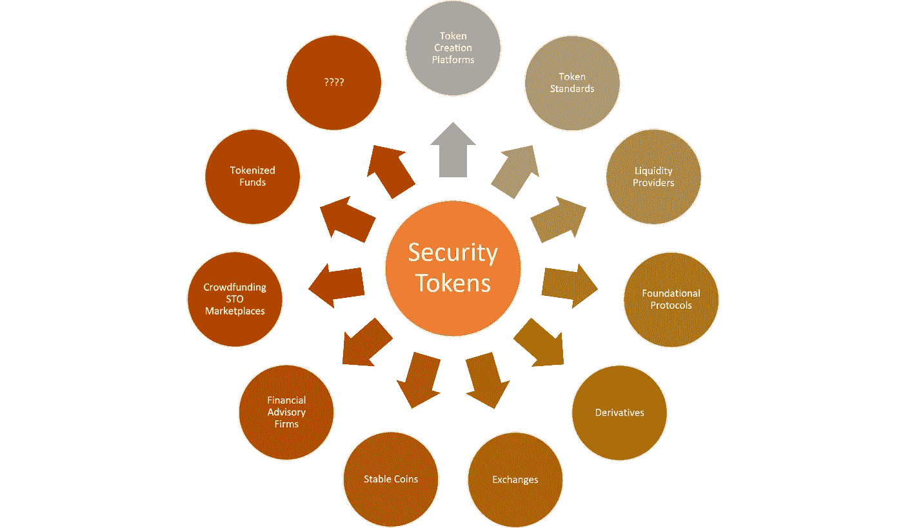
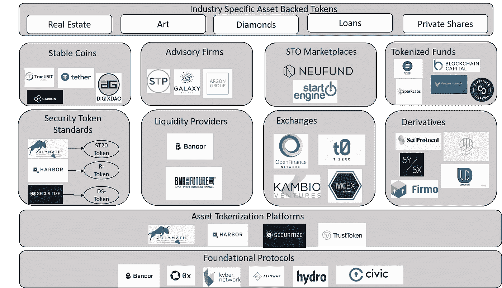

# 想了解安全令牌吗？看看这个市场分类

> 原文：<https://medium.com/hackernoon/want-to-understand-security-tokens-look-at-this-market-taxonomy-aa70fedfb1aa>

如果你认为安全令牌是一个小的生态系统，请三思。与新兴的加密资产市场相比，这个空间可能很小，但是它一定会以非常快的速度增长，并且要跟上它变得非常困难。每周，我都会收到一些请求，要求我对安全令牌领域的 2-3 个项目进行评审，我发现其中大多数项目都具有智力优势和适当的技术严谨性。安全令牌固有的复杂性正在转化为一个非常庞大而复杂的生态系统。想想看，要创建一个实用令牌，你只需要理解 ERC-20 和一些其他加密协议。在安全令牌领域，任何令牌都必须与更多的构建模块交互，包括发行者平台、流动性提供者、监管模型等。

使证券代币生态系统如此复杂的另一个方面是它与公共股票市场的相似性。安全令牌的行为类似于股票、债券或期权等成熟的金融产品，这一事实使得金融市场中的许多产品的架构都适用于安全令牌空间。毫不奇怪，我们已经看到了新的加密协议的爆炸，这些协议试图从金融工具(如衍生品、保险模型、指数基金)中借鉴思想，并将其应用于安全令牌空间。最终结果是，我们有了一个新生但已经非常拥挤的生态系统，在这个生态系统中，区分信号和噪声变得越来越困难。

为了驾驭日益复杂的安全令牌生态系统，我决定创建一个市场分类法的初始版本。今天，我们将讨论分类法中包含的一些主要类别，在本文的第二部分，我们将重点讨论单个产品。这种市场分类背后的想法是强调正在成为安全令牌生态系统基础的一些主要构件。这绝不是试图提供一份该领域玩家的详尽列表。根据安全令牌市场的架构，我认为以下类别正在成为相关的独立细分市场。

**资产令牌化平台:**这一类别对支持安全令牌的创建和发行的技术进行分组。

**令牌标准:**在这个组中，我们有正在成为安全令牌标准的主要协议

**流动性提供者:**这一组包括为证券代币提供流动性的平台。

此类别列出了支持安全令牌的第一波加密交换。

**基础协议:**也许我们需要为这个小组取一个更好的名字😉而是一个通用类别，包括许多安全令牌产品通用的协议。

**衍生产品:**这一组包括新兴的加密衍生协议领域，可能会对安全令牌市场产生影响。

**稳定币:**这部分列出了市场上一些主要的稳定币。

**令牌化基金:**这一组包括依靠安全令牌的第一代令牌化风险基金。

**众筹 STO 市场:**这个群体包括为私人公司提供安全令牌(STO)的平台。

**咨询公司:**并不缺少进入安全令牌领域的咨询公司。

**行业特定的资产支持令牌:**这是一个通用组，列出了在安全令牌市场中变得越来越重要的垂直类别。

还有其他类别也在安全令牌市场中稳步增长，但我认为前面的列表代表了一个良好的起点。使用我们的分类法作为基线，对安全令牌空间的初步分析如下图所示:

我知道名单不完整。如果你觉得我错过了一个重要的类别或平台，给我留言…