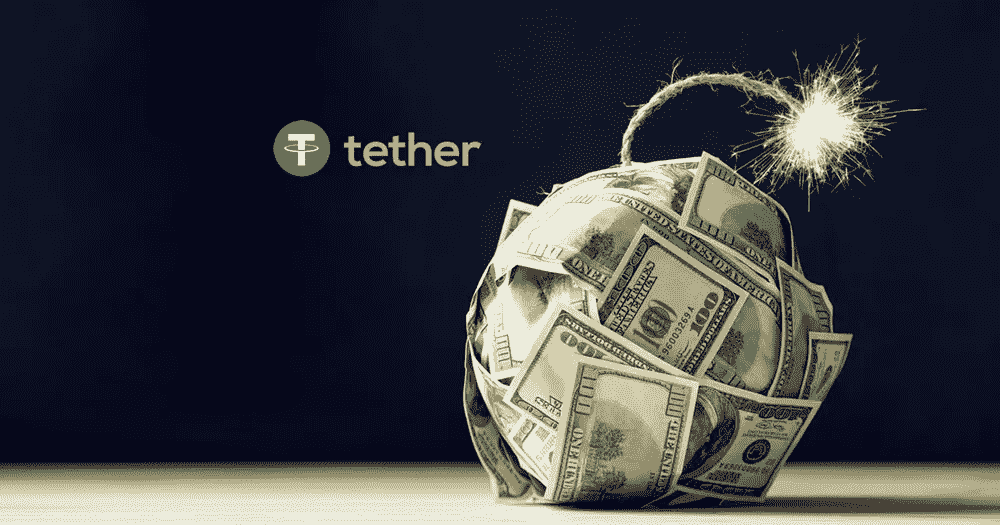
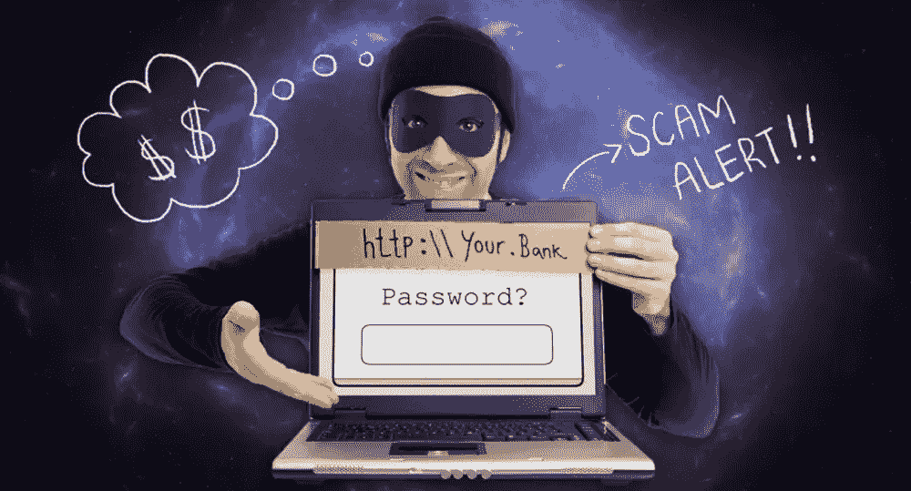

# 警告:投资比特币还能得到什么

> 原文：<https://medium.com/hackernoon/warning-what-youre-also-getting-with-a-bitcoin-investment-a9ad1df03773>

由于比特币的高波动性，投资比特币不适合胆小的人，在错误的时间投资可能会导致快速、巨大的损失。在过去的几个月里，价格从 6000 美元快速上涨到 8000 美元，然后又大幅回落到 6000 美元的范围。

即使比特币和加密货币空间整体上出现了很多好东西，但市场仍然很小，足以让其他人操纵价格。这意味着，如果美国证券交易委员会(SEC)允许，确实需要金融机构参与进来，帮助维持稳定。

如果你今天打算投资比特币，你应该清楚自己会陷入什么样的境地。以下是一些你可能不知道的比特币投资注意事项:

## **诈骗机器人**

评估哪些加密货币骗局是由人实施的是一项困难的任务，但现在我们不得不应对一支由[诈骗机器人](https://news.bitcoin.com/15000-twitter-crypto-scam-giveaway-bots-duo-security/)组成的大军。安全软件公司 Duo Security 已经发现超过 15，000 个机器人通过自动化的 Twitter 个人资料一起工作，试图延续加密货币骗局。这些机器人令人讨厌，传播垃圾邮件和恶意软件，并渗透在线讨论。

## **交往作弊**

所有加密货币投资者都应该明白，事情并不总是看上去那样。甚至顶级交易所也可能参与清洗交易。这是一种市场操纵形式，持有重要头寸的人同时买入和卖出硬币，以制造误导性的流动性统计数据。

古代哲学家托马斯·霍布斯说，如果人们认为他们可以逃脱惩罚，他们总是会寻找欺骗系统的方法。你认为随着所有这些新的不受监管的加密货币交易所的出现，会发生什么？如果他们认为他们可以欺骗系统，他们会，目前，他们这样做了。

## **系绳**

我过去喜欢 Tether，这是一种不用实际购买法定货币就能把钱转移到法定货币的方法。然而，今天它似乎是另一种形式的操纵。Tether 约占加密货币市场的 1%，但不知何故，它却负责每天超过一半的比特币交易量。这似乎有点不对劲。

每一个系绳代币应该有一美元存在银行，但许多人怀疑 Bitfinex 的创造者是否在遵循他们自己的规则。Bitfinex 已被传唤，以淡化这一情况。

## **金融机构**

我们有几家金融机构试图将 ETF 推向市场，但到目前为止都被 SEC 否决了，芝加哥期权交易所(CBOE)似乎最有可能获得批准，因为他们长期以来的卓越声誉、新产品创新和防弹保险。如果有任何比特币被盗，你可以打赌，客户都得到了很好的保护。许多人指望美国证券交易委员会(SEC)本月批准一只 ETF，但这可能要到 2019 年初才会发生，但当它真的发生时，那才是真正的烟火开始的时候。

此外，我们还有其他的[金融机构](https://hackernoon.com/dear-cryptocurrency-investors-theyre-trying-to-trick-you-6639f46ba416)试图在价格还很低的时候建立他们的加密组合。高盛(Goldman Sachs)设立了一个 100%专用的加密货币交易柜台，彭博的银河加密指数基金(Galaxy Crypto Index Fund)，比特币基地现在为大型机构投资者设立了托管服务，Susquehanna 加入了为其富裕客户交易数百万美元比特币的行列，现在全球最大的投资基金管理公司贝莱德(Blackrock)也在寻求加入这一行列。

## **基础设施**

微软和 IBM 在区块链领域总是领先一步，现在我们看到亚马逊、谷歌和脸书等其他公司也在试图留下足迹。这些公司不会进入一个地区，除非他们看到了巨大的潜力。

现在有一些真正的玩家给加密市场带来了稳定。排名第一的是洲际交易所(ICE)，它正在与微软、波士顿咨询公司(BCG)和星巴克(Starbucks)等几家公司合作，目标是让日常生活中的人们能够购买、出售和消费加密资产。

## 我们需要做点什么

尽管最近道路坎坷，比特币继续以权宜的速度增长，但随之而来的是一些严重的挫折。会有一些人想要利用暂时的混乱，试图窃取或欺骗系统。因为比特币不是一家公司，而是存在于网络空间中，这只是我们到达目的地之前所需要的现实的一部分。

对于那些还记得上世纪 90 年代的人来说，当互联网刚刚起步时，也不乏骗局，假冒的专业电子商务网站到处涌现，准备接受你的信用卡付款，但永远不会交付产品。如果你幸运的话，这将是它的结束。否则，那些不幸的人一旦掌握了你的信用卡信息，就不得不追查骗子收取的额外费用。

这催生了一个全新的商业行业，像 Verisign 这样的公司被创建出来，通过为在线购物者创建采用加密技术的数字证书，来确保要求你提供信用卡详细信息的网站确实是他们所说的人。最终，大多数诈骗犯都被踩了出来。同样的事情正在区块链发生，随之而来的是一个全新的产业正在形成，将区块链变得更好。

顺便说一下，Verisign 的市场价值从 1998 年的 1 亿美元激增到 2000 年的近 270 亿美元。仅仅两年时间就增长了 26，900%。同样的事情现在正在[crypto](https://hackernoon.com/what-i-learned-from-advising-cryptocurrency-investors-e69e2317ffdc)中发生，如果你知道进入什么名字的话。

毫无疑问，比特币仍然存在问题，这就是为什么我们继续看到如此剧烈的波动。比特币想要走高，但它不断被想要欺骗系统的欺诈者拉低。事情变化很快，朝着更好的方向发展，用不了多久，那些骗子就会被踩出局，当这种情况发生时，比特币将几乎没有任何支撑力。

## **总结**

比特币是一种[高度不稳定的投资](https://cryptoinvestinginsider.com/blog/cryptocurrency-trading-strategies-how-to-trade-for-success/)，它可以在没有警告的情况下转移投资者，但从长远来看，它面临的问题将会得到处理和解决，就像这个世界上其他任何技术一样。

我不认为比特币会很快消失，随着我们向前发展，它将继续与社会融合，更多的公司接受比特币支付，更多的用户和更多的交易。

如今，比特币并非没有风险，随着它慢慢克服自身的缺陷，它也在一步步接近完美。总有一天它会到达那里，问题是你会拥有它并骑着它走，还是会在它到达那里后买下它并使用它？

## 下一步是什么

通过拥有加密货币产品，成为区块链未来的一部分，为更好的人类解决实际问题。我已经建立了一个加密货币社区，在这里我们可以发现为明天建设更美好未来的项目，以及当它们发生时我们如何从中获利。一个这样的例子可以通过[点击这里](https://cryptoinvestinginsider.com/?utm_source=quora&utm_campaign=ledgernano)找到。如果你喜欢我们的工作方式，那还有很多。我希望能在里面见到你。