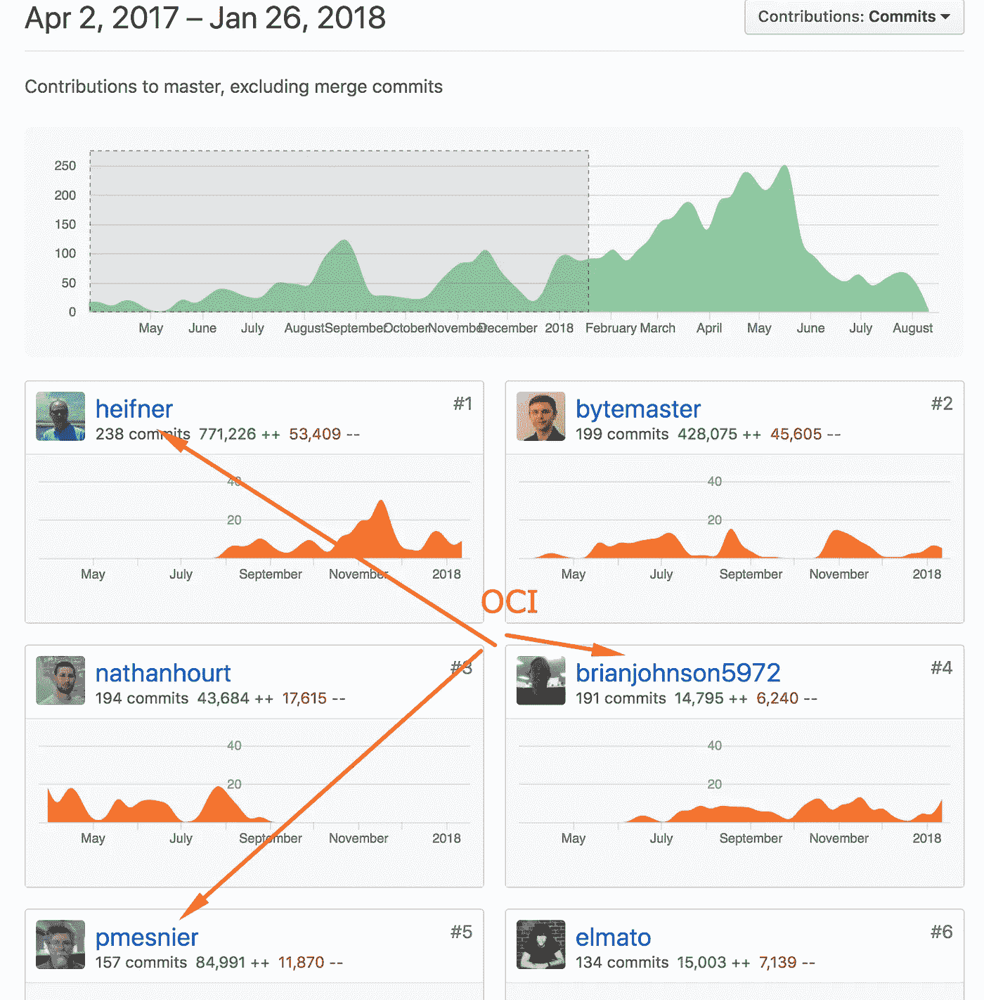

# EOS 中的核心协议开发外包了吗？

> 原文：<https://medium.com/hackernoon/was-the-core-protocol-development-in-eos-outsourced-169f435030ce>

# 什么是 EOS？

EOS 是一个 T2 区块链协议，用于构建可扩展的分布式应用。

区块链只能拥有这三个属性中的两个:[分散性、可伸缩性、安全性](https://github.com/ethereum/wiki/wiki/Sharding-FAQs)

您希望您的所有公共区块链都是安全的，因此您必须在其他两个选项中选择一个:去中心化或可伸缩性。对市场来说，测试这两种途径是很重要的。

EOS 是一个实验性的区块链，具有较低的去中心化和较高的可伸缩性。

有无数的博客帖子、推文、视频和讨论都在谈论 eos 根本没有去中心化。我不想触及那个话题，因为它已经被争论得不可开交了。

如果你不知道讨论的内容，这里有一些内容:

*   Cedric Dahl:EOS——真实还是炒作？
*   [塞德里克·达尔:EOS 能经受住现实的冲击吗？](https://www.youtube.com/watch?v=6LjGkR23RKw)
*   [约翰·奥利弗上周今夜:谈 EOS](https://youtu.be/g6iDZspbRMg?t=18m55s)

在持续一年的 ICO 期间，EOS 筹集了价值 419 亿美元的乙醚。

Block.one， [EOS 背后的公司，卖掉了 90%的代币，自己保留了 10%](https://etherscan.io/token/0x86fa049857e0209aa7d9e616f7eb3b3b78ecfdb0#balances) 的代币。[他们还在霍丁](https://www.bloks.io/account/b1)。这意味着该公司筹集了 40 亿美元现金和 4 亿美元代币。

EOS 是历史上资助最好的项目。给你一个想法， [SpaceX 只需要筹集 19 亿美元](https://www.crunchbase.com/search/funding_rounds/field/organizations/funding_total/space-exploration-technologies)就能到达月球。(双关语)

# 外包核心协议开发

*等等，这么说，一家咨询公司建造了 EOS 的大部分，世界上最大的区块链之一？*

是的。

如果你深入探究 EOS，你会在他们的 [Github](https://github.com/EOSIO/eos) 中体会到一些有趣的东西。

一家名为[对象计算公司](https://objectcomputing.com/)的咨询公司。构建了大部分核心 EOS 协议。[【1】](/p/169f435030ce#8164)

在 EOS 开发的第一年，六个核心开发人员中有三个来自 Object Computing，Inc .我们可以通过访问他们的 [Github 贡献者页面](https://github.com/EOSIO/eos/graphs/contributors)看到这一点。

帐户 heifner、brianjohnson5972 和 pmesnier 是对象计算员工。bytemaster 的账户归 EOS 首席技术官丹尼尔·拉里默所有。另外两个账户是 Steem & Bitshares 的开发者(都是 Daniel 以前的项目)。

如果你继续往下看他们的贡献者页面，我们可以发现还有 3 个来自对象计算的开发者:cj-oci，PaulCalabrese 和 mitza-oci。

这些只是显而易见的帐户，他们的 Github 帐户上有这些信息。我怀疑还有其他 OCI 员工没有在 Github 上公开这些信息。[【2】](/p/169f435030ce#ceba)

那么，什么是[对象计算公司](https://objectcomputing.com/)？

这是一家软件咨询公司，1993 年成立于密苏里州圣路易斯，现在有 70 多名员工。他们从事国防、能源、金融、医疗保健、制造、商业和电信等各种行业的项目。

# 为什么这是一个问题？

如果你正在开发任何类型的任务关键型软件，而且很少有前辈，那么你的团队中需要全职的全明星开发人员，在没有其他专业人员参与的情况下为你的项目工作，否则你将无法开发它。这种说法在构建任何一种硬技术时都更有意义，就像 EOS 正在尝试做的那样。

没有真正的技术创新是通过说“我有这个伟大的想法，现在为我建造它，这里有一些现金。”。

看看所有顶尖科技公司的名单。他们中的哪一个外包了产品关键组件的开发？[【4】](/p/169f435030ce#bbfc)

为什么人类历史上资金最不成熟的公司 Block.one 没有专门的开发团队，而是使用咨询服务来进行关键的开发活动？当然，他们可以用筹集到的资金雇佣一大批全职内部工程师来开发产品。

## 那么，EOS 不雇佣全职的内部工程团队，而是把资金花在什么上面呢？

Hiring a Q&A team? No.

Trying to hire Research Scientists in Times Square?

Creating a VC fund, because why else would developers build here?

Block.one [直到 2018 年 3 月](https://web.archive.org/web/*/https://eos.io/)才在他们的网站[上有招聘/职业页面](https://web.archive.org/web/*/https://block.one/)。2018 年 2 月之后，他们实际上雇佣了一些工程师，所以有所进展。但是为什么特别是在二月到三月，那时发生了什么？*知道就留言吧。*

# EOS 在招聘和发展团队方面能做些什么？

我只是不加思索地抛出一些想法、角色和数字来证明一个观点。

## 创建一个研究部门(18 人):

从以下每个领域雇用世界上最优秀的 3 个人:

*   分布式系统，密码学，编程语言理论，经济博弈论，分布式数据库，加密经济学

## 创建一个内部礼宾团队(20 人):

从以下每个领域雇用世界上最优秀的 5 个人:

*   C++程序员[【5】](/p/169f435030ce#0475)，QA 工程师，DevOps 工程师，渗透测试人员

## 产品团队(35 人):

从以下每个领域雇用世界上最优秀的 5 个人:

*   产品经理、产品设计师、网页开发者、移动开发者、UI 设计师、UX 设计师、平面设计师

总共有 73 个人。既然对这些人才的需求很大，我们就超过市场价格，给他们每人 100 万美元的年薪。建立这个团队的成本将是每年 7300 万美元。10 年内 7.3 亿美元。剩下 33 亿美元用于运营和营销。这难道不是花投资者钱的更好方式吗？

EOS 要么成为像脸书一样改变行业规则的历史上最引人注目的赢家，要么成为像 pets.com 一样的历史上最引人注目的输家。

你认为会是哪一个？请在评论中分享你的想法。

## 笔记

*   [1]据一家排名前 30 的 EOS Block 生产商的创始人说:“OCI 是被雇来做 Block 的。一个人的开发店，这是业内常见的商业行为。”
*   [2]另一件需要考虑的事情是深入研究代码，查看关键的核心文件，通过责备视图找出是谁写的。我很快查看了 EOS Launcher main.cpp ，其中 80%以上是由 OCI 的员工编写的。
    此外，开源应用程序中几乎没有文档？？甚至不会在代码中提到软件设计模式的问题。
*   [3]或者你用创可贴来构建它，软件将会充满错误，而开发人员不会真的去关心它。
*   [4]试图外包关键部件的公司和个人通常会被挤垮，就像 IBM & Apple 被微软挤垮一样。或者文克莱沃斯双胞胎是怎么被扎克整的。
*   [5]如果他们真的为一个研究部门雇人，这个产品可能会用函数式编程语言而不是 C++来编写。

