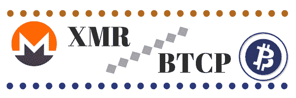
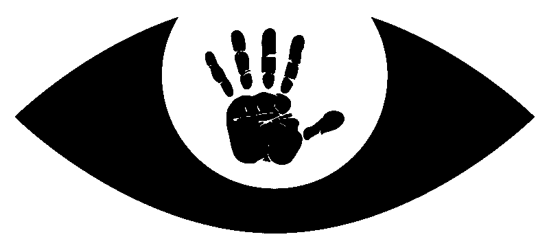
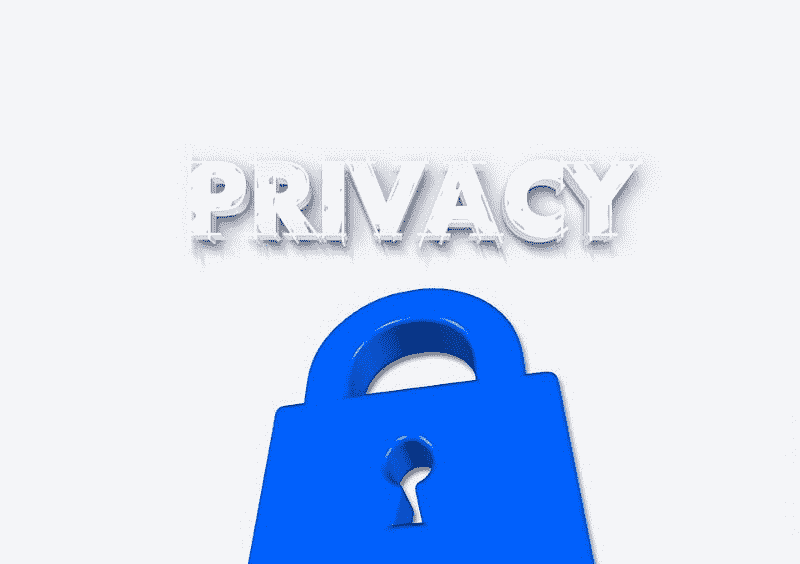

# 小心 Monero，比特币私人正在逼近！

> 原文：<https://medium.com/hackernoon/watch-out-monero-bitcoin-private-is-closing-in-2dde9716c748>

[https://www.honorablecrypto.com/crypto-infographics/](https://www.honorablecrypto.com/crypto-infographics/)

*你可能听说过这样一种说法* ***比特币不是私有的*。该公司使用区块链技术的方式有许多古怪之处，其中之一就是任何交易都可以很容易地被跟踪和追踪。大多数加密货币都是如此。对于那些认为自己的金融交易应该保密的人来说，这是一个值得关注的问题。**

出现了几种解决这个问题的硬币。从 Spectrecoin(自从成为 ICO 以来上涨了 50，000%)到本月初在币安上市的 Cloakcoin。隐私币有很多— **但是 Monero 目前是王者**。

Monero 创建于 2014 年，旨在应对比特币缺乏隐私的问题。就市值和 Reddit(和其他社交渠道)上的社区参与度而言，它是最高的隐私硬币。Monero 将隐私硬币的想法带入了主流。

像任何伟大的想法一样，人们已经开始以自己的方式在 Monero 的基础上进行建设。你可能知道许多成功的隐私币，包括 Dash、Verge 和 ZCash。

然而，你可能没有听说过他们的新对手，从比特币本身分叉出来的 ***比特币私有*** 。

# **什么是比特币私有？**

**比特币私人** ( *BTCP* )是 ZClassic 和比特币区块链的硬分叉，它可能会对 Monero 在加密货币隐私市场的把握造成毁灭性打击。

“比特币”这个名字给一枚硬币带来了很多。比特币现金、比特币黄金和比特币钻石都出现了人气飙升。比特币私人处于一个新奇的位置，成为第一个从比特币分离出来的隐私币。

我们可以从三个核心领域来评估隐私币及其主导市场的潜力:

1.  用户基础
2.  技术
3.  社区

让我们看看比特币 Private 如何与目前的市场领导者 Monero 相抗衡。

# **比特币 vs Monero**

## **用户群**

Monero 的拥有大量活跃的用户群。很多人每天都在开采、交易和持有 XMR。

然而，有一个论点需要提出来，即更多的人私下持有比特币。

**比特币私有**是比特币和 ZClassic 两者的[硬分叉。这意味着他们支付了 ZClassic 持有者(1:1)和比特币持有者(1:1)。这意味着*所有持有 ZClassic 股份的人*和所有钱包中持有比特币股份的人，他们现在都拥有私人比特币。](https://btcprivate.org/)

**人真多！**

大量发行的硬币意味着更多的交易，更多的宣传，并为长期增长铺平道路。

这两个区块链的分叉使得比特币成为可以说是分布最广的私有货币之一。

## 技术

Monero 和 Bitcoin Private 都声称在利用不同技术的同时进行私人交易，但实际上一种技术比另一种技术更私人。

**Monero** 通过环签名实现大部分隐私。环签名是隐私游戏中的老技术了。他们通过使用一次性隐形地址来隐藏 XMR 的交易，这种方法一直很有效，直到 Monero 开始被用来创造其他硬币。4 月 4 日，Monero [分成了四个不同的项目](https://monero.org/forks/)。

Monero forks 给[带来了很多关于环签名系统真实隐私的不确定性](https://getmonero.org/2018/02/11/PoW-change-and-key-reuse.html)。因为环签名对交易进行加密，然后将该交易作为密钥图像存储在 Monero 区块链上，所以当 fork 发生时，隐私会受到损害。

让我们想象一个叫 Tim 的家伙持有一些 XMR。经过一个叉子，蒂姆将获得新的硬币的基础上，他已经在他的钱包硬币。所以现在 Tim 有了 XMR 和 XMR 叉的一个新硬币。

当他花费新硬币时，他创建一个密钥图像，该图像将被加密并放在新硬币的区块链上。现在，当他从钱包中支出 XMR 时，将在 XMR 区块链上创建并验证相同的密钥映像。

通过将分叉链中的关键图像与原始链进行匹配，现在可以追踪 Tim 与 XMR 和新硬币的交易了！这是 Monero forks 的一个严重的隐私缺陷。这不是 Monero 团队的错，但他们现在也无能为力。

**比特币私有**使用 ZClassic 实现的技术，称为 [zk-SNARKS](https://z.cash/technology/zksnarks.html) ，其中的“zk”代表“零知识”。

在谈论 zk-SNARKS 的优点之前，需要注意的是它缺乏环签名所具有的同行评审。然而，对于私人交易来说，它绝对是一项很有前途的技术。

比特币 Private 采用的零知识证明系统与 Monero 的环签名有很大不同。zk-SNARKS 是一个通过使整个区块链保密而不是发送关键图像给它来保持交易保密的系统。

这种形式的加密不仅隐藏了发送方和接收方的身份，还隐藏了有关交易的所有元数据。

zk-SNARKS 系统上并不比环签名更私密。然而，Monero 上最近的分叉损害了 XMR 持有者的所有隐私。

目前来看，比特币 Private 比 Monero 更私密。

## 社区

**Monero** 一直有一个相当紧密的[社区](https://www.reddit.com/r/Monero/)，但最近的分叉造成了一些损害。

任何时候你同时看到区块链的多个分叉，这意味着有相当多的人不同意你的做法。每个分支都将社区成员和开发人才从主项目中带走。

**比特币私人**是一种非常新的货币，但他们有一个强大的[社区](https://www.reddit.com/r/BitcoinPrivate/)来建立。

比特币私有很少在社交媒体上被负面谈论。他们在 Twitter 和 Reddit 上的社区影响力越来越大。随着越来越多的比特币持有者在分叉后持有他们的 BTCP，意识到它的真正潜力，这个社区将继续增长。

比特币私人在隐私币社区中绝对是一个可以追随的币，这个社区本身就是一个整体性很强的社区。

这个场景和 Verge 非常相似。《边缘》是一枚隐私硬币，它以令人难以置信的速度迅速崛起。如果 Monero 真的控制了隐私社区，这样的事件就不会发生了。

[https://www.flickr.com/photos/e-coli/23811953160](https://www.flickr.com/photos/e-coli/23811953160)

# 结论:比特币私人交易值得关注

我们现在已经概述了比特币私人可能超越 Monero 成为头号隐私加密货币的所有方式。

比特币私人采用了一种比 Monero 的当前状态更私人的技术，拥有更大的用户群，不断增长的社区，并强烈声称将成为下一个即将到来的隐私币。

这并不是说比特币私人公司将在不久的将来接管 Monero，但那些对 Monero 有浓厚兴趣的人绝对应该保持关注。

## 喜欢这篇文章吗？我们现在有电报信号组了！

我们发布**简单有效的交易信号**。所以你可以花更少的时间做技术分析，花更多的时间**得到结果。**
👉[https://t.me/coinandcrypto](http://telegram.coinandcrypto.com/medium)

