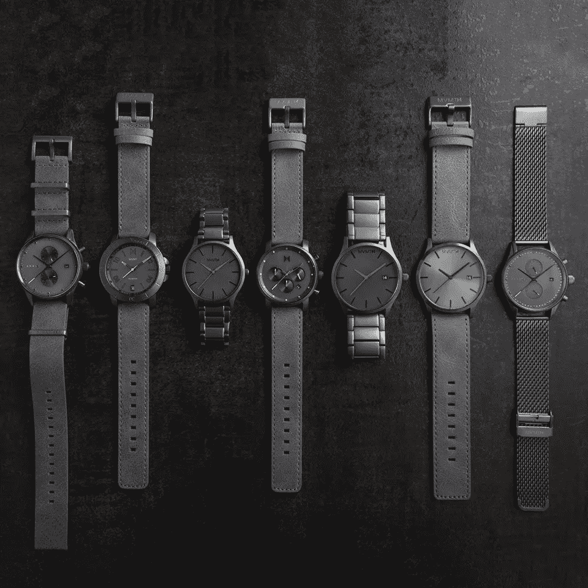

# 手表、床垫和“Meh”倍数

> 原文：<https://medium.com/hackernoon/watches-mattresses-and-meh-multiples-e2fb89de32ad>

*由* [到*约瑟夫*到](https://twitter.com/josephflaherty)

上周五，摩凡陀集团宣布以 1 亿美元收购总部位于洛杉矶的初创手表制造商 MVMT，并有额外 1 亿美元的盈利潜力。

昨天，总部位于凤凰城的 D2C 床垫创业公司 Tuft & Needle 与市场领导者舒达-席梦思合并。Tuft & Needle 的价格尚未披露，但据报道，该公司的收入为 1.7 亿美元，自成立以来一直盈利。《福布斯》估计售价在 2 亿至 8 亿美元之间，但根据比较，这个区间的下限似乎更有可能。

因此，对于直接面向消费者的产品创业公司来说，这是丰富的一周，这里有一些关于这对更广泛的生态系统可能意味着什么的想法。

# 退出价值是一个虚荣的衡量标准

一个企业家很可能以 10 亿美元的价格卖掉自己的公司，却赚不到一个以 1 亿美元卖出的创始人的钱。通过限制这一过程中不必要的稀释(如果所有盈利都得到满足)，这两家公司的四位创始人将成为亿万富翁。相比之下，在 Box 数十亿美元的首次公开募股中，明星创始人兼首席执行官 Aaron Levie 的股份仅值 4500 万美元。这并不是要从 Aaron 身上拿走什么，只是说明为什么[退出值](https://techcrunch.com/2016/09/16/venture-capital-is-a-hell-of-a-drug/)并不总是最重要的指标。

# 风险投资剧本可能已经扼杀了这些交易

想象一下，如果 MVMT 的创始人在第一次出现吸引力的迹象时，以 15 美元的投资前估值筹集了 500 万美元。然后在 2016 年，在销售额达到 5000 万美元后，他们以 6000 万美元的投资前估值再融资 2000 万美元，以加速增长。然后想象一下 2018 年的那个时刻，他们得到了 1 亿美元的报价，但被投资者阻止接受。或许这个团队会重整旗鼓，找到适应新估值的方法，但创始人获得价值数千万美元的保底退出将是不可能的。

# 付费数字采集有限制吗？

MVMT、Tuft 和 Needle 都是令人印象深刻的初创公司，它们用微薄的私募股权甚至个人储蓄创造了巨额收入。Tuft and Needle 在短短六年内就设法获得了床垫市场 1%的份额——这真是老生常谈了！你可能会说这些公司是经营最好的创业公司，没错。那么他们为什么要卖呢？

[Web Smith](https://twitter.com/web) ，T2 最敏锐的 DNVB 领域分析师之一 [认为，脸书和 Instagram 作为 D2C 产品创业公司的收购渠道](https://twitter.com/web/status/1030896687538167808)正在放缓。令人吃惊的是，这些公司中有多少是以 1 . 5 亿美元的收入门槛出售的。显然也有例外，一些 DNVBs 已经在公开市场上取得了数十亿的销售额，但这确实表明社交媒体自身能够提供的东西是有上限的。

# DNVBs 只有两种可行的融资策略吗？

MVMT 是更强大、更成熟的 DNVBs 之一，2017 年销售额为 7100 万美元，不难相信他们将在 2018 年突破 1 亿美元的销售额。对一个创始人来说，在短短五年内实现 1 亿美元的销售额是一个惊人的壮举，但 1 倍的倍数，如果一切顺利，还有可能达到 2 倍，这让许多基金很难进行风险投资。

正如[大卫·弗兰科尔](https://twitter.com/dafrankel)所说，为了让一个初创公司的收购对风险投资公司有意义，它需要至少是[基金规模的 1 倍](https://techcrunch.com/2017/05/16/theres-no-shame-in-a-100m-startup/)。不幸的是，没有那么多 1 亿美元的风投基金来主导交易。DNVB 普遍较低的倍数可能会造成基金和 DNVB 市场之间的错位，前者的规模大多在不断扩大，而后者的大部分优秀初创公司售价在 1 亿至 5 亿澳元之间。当然，也有像 Dollar Shave club 这样的异常者突破了 10 亿美元大关，但即使是像 RXBar 被 Kellogg's 收购这样引人注目的 6 亿美元的胜利，也无法推动一只 10 亿美元的基金。

似乎有两种可行的 DNVB 资助策略:

1.  用一个种子或者小 A 轮，打造一个可持续增长的引擎，或者；
2.  完全接受“要么做大，要么回家”的策略，并尝试利用资本扩大规模，达到你可以创造 10 亿或更多销售额的水平，以补偿“嗯”的倍数。

消费品创业公司应该仔细考虑他们的融资策略，因为中间道路似乎充满了危险。注意， [Founder Collective](https://twitter.com/fcollective) 从[7500 万美元的基金](https://techcrunch.com/2016/11/30/founder-collective-easily-finds-75-million-for-fund-three/)开出支票，投资 DNVBs，所以如果你有一个分类杀手，请[联系我们](http://www.foundercollective.com/)！