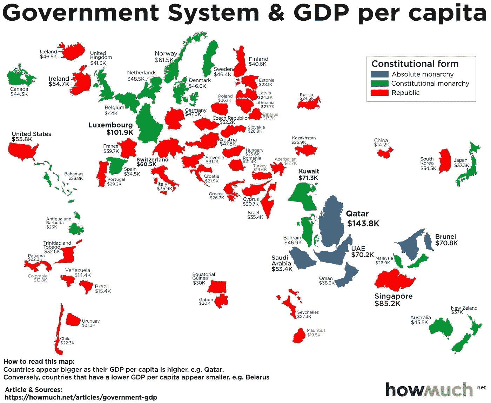
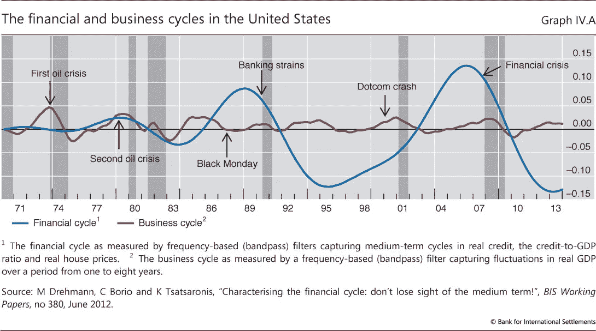
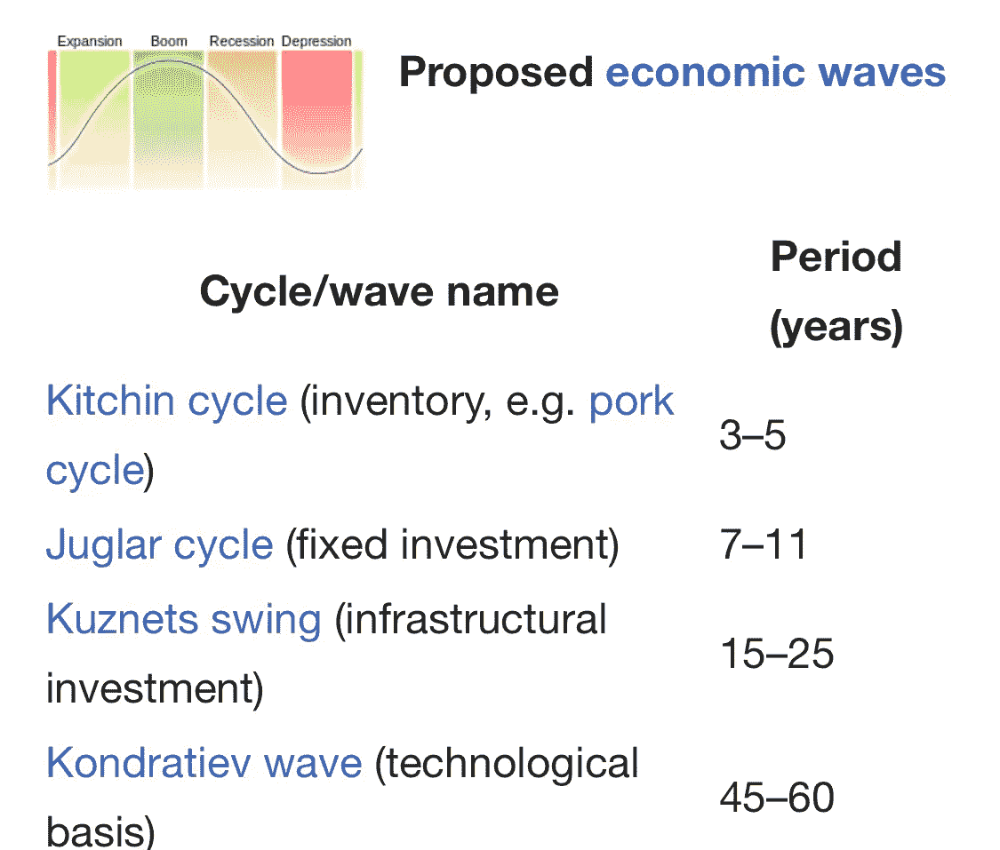
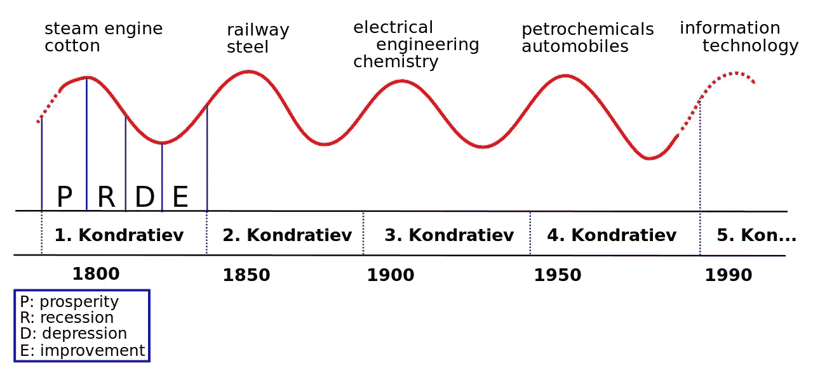

# 时间的波动

> 原文：<https://medium.com/hackernoon/waves-of-time-9a17c1645678>

## 在循环的世界中失去静态观点

> 我想我和大多数人的想法不同。我认为世界之所以是一个神秘迷人的地方，是因为生命的循环。我的身体会分解，但也许它的某个小元素会转化成一粒灰尘，经年累月，然后这粒灰尘会孕育出一朵灿烂的花。然后这朵花会滋养一只随机的大黄蜂，而这只大黄蜂又会被一只乌鸦吃掉。所以，在未来的生活中，我将能够飞翔。我很期待。我一直很钦佩鸟类的自由——e . m .克雷恩

在接受 CNN 采访时，马克·扎克伯格说“我不确定我们不应该被监管”。这与脸书卷入的剑桥分析风波有关。社交媒体应该被监管吗？这个问题类似于问区块链是否应该受到监管。但是，监管是否意味着平台的对立面，而这些平台本应是开放、去中心化和绝对自由的象征。那么，在脸书和区块链等平台上，恶意行为者的存在促进了对看门人或分散但可能有害的平台的集中监管的要求，这难道不具有讽刺意味吗？这篇文章提倡一种不同的思维方式。在考虑长期后果时，从静态思维转向循环思维。事物的自然规律循环往复。那么，为什么我们的长期思考会有所不同呢？

# 聪教我的是

从 2008 年金融危机的灰烬中诞生了比特币。尽管加密货币的概念早于比特币，但中本聪在 2008 年 10 月 31 日撰写的比特币白皮书却设想了一场无政府状态下的大实验。在书中，Satoshi 说:

*“我一直在开发一个新的电子现金系统，它是完全点对点的，没有可信的第三方……”*

随着我对比特币了解的越来越多，我开始质疑它的长期影响，尤其是在不了解参与者(节点)或银行业术语中的 KYC(了解你的客户)的情况下。如果区块链成为主流，它需要监管吗？很多人会说绝对是。这是为了保护小投资者或演员。但是，如今的警察与央行行长或监管者会有什么不同吗？如果答案是否定的，那么我们又回到起点了吗？

显然，我们学到了很多东西，包括金钱的基本价值。鉴于法定货币仅由主权承诺支持，比特币与其他货币有何不同？这是颠覆者的观点。另一方面，现任者接受区块链的价值以及比特币提供的概念证明。这是一个完全对等的支付网络的证明，尤其有利于远距离小额支付。他们需要解决的只是普通人的利益。

> 另一种思考问题的方式是质疑是否存在符合性的合理判断错觉？大多数人。并不总是正确的。

永远要考虑脱离群体的后果，就像埃隆·马斯克考虑别人认为完全不合理的事情一样。

比特币监管的答案将帮助你预测其未来的价值，即你处于周期的哪个阶段，以及你认为周期将转向哪个方向。有一点是肯定的，那就是现金、塑料和其他形式的货币可以和谐共存。

# 不同世界的相同回声

如果金融危机、季节和文明可以被视为循环，那么三个简单的现实生活例子也可以补充为什么我们需要采取循环的观点。

Zerohedge.com

## **政权**

这些不仅是技术采用的循环，也是政府的循环。阿拉伯之春始于 2011 年的突尼斯，当时一名男子自焚以抗议警方对他的虐待。这反过来又引起了包括埃及在内的大部分阿拉伯世界的抗议。随后，该地区的情况偏离了长期民主的设想。

罗马帝国之后是英国，接着是美国。

独裁之后是民主，民主之后是政变和独裁或寡头政治的复苏。

## 现实生活应用

每一个新的解决方案都有它自己的一系列问题。让我们举一个简单的数字压缩的例子，它带来了音乐播放器的复兴，包括 iPod 和数码相机革命。纯粹主义者和爱好者很快意识到降低文件大小的代价是质量的损失。现在，对老式单反相机和黑胶唱片机的需求越来越大。似乎永无止境的循环。

## 经济周期

风险的概念必须始终放在时间的背景下来看待。因此，流动性变得很重要。在股市崩盘的时候，黄金或债券可能会帮助你度过下行周期，同时保持同样的生活水平。

Bank of International Settlements (BIS)

对于企业家来说，有一个商业周期，宏观经济因素可能会导致商业模式的波动。对冲风险变得很重要，以生存下来的因素，我们很少或没有控制。

理解长期周期的最有用的工具之一是 Kondratiev 波，用于预测 50-60 年的周期。

Wikipedia

这一循环以社会经济学家尼古拉·康德拉蒂耶夫命名，利用经验观察将时间分割成不同的经济波。

# 超长期

[《全球目录》的作者 Stewart Brand](http://sb.longnow.org/SB_homepage/Home.html) (这本书因史蒂夫·乔布斯引用的台词“保持饥饿，保持愚蠢”而闻名)鼓励千年或万年的超长期思考。

斯图尔特是 Long Now 基金会的创始人之一，并就该主题举办了多次讲座。根据其网站:

*Long Now 基金会的每月研讨会始于 2003 年 2 月，旨在建立一个关于长期思考的令人信服的思想体系；帮助推动文明朝着我们的目标前进，使长期思考自动化和普遍，而不是困难和罕见。*

他策划了这些每月一次的研讨会，称为长期思考研讨会(SALT)。这是詹妮弗·帕尔卡的一个研讨会的例子，她谈到了政府改革。

 [## 詹妮弗·帕尔卡

### 詹妮弗·帕尔卡是“美国代码”的创始人和执行董事。她曾担任美国副首席技术…

longnow.org](http://longnow.org/seminars/02017/feb/01/fixing-government-bottom-and-outside/) 

# 行动的季节

旺加里·马塔伊(2004 年诺贝尔和平奖得主)说:“*破坏环境的一代人并不是付出代价的一代人。这就是问题所在”*

气候变化是真实存在的，而其他一些人则更加乐观它不是，而且还有时间。无论你站在辩论的哪一边，你仍然需要质疑你的每一个行动，并思考它是否会给下一代带来债务或好处。如果我们以有限的眼光看待资源，债务的论点会变得更加有力。

受人类本性的影响，自然还有其他明显的影响。例如，上周，最后一只名叫苏丹的雄性北方白犀牛在肯尼亚死去。尽管拯救北方雄性犀牛的努力仍在进行，但许多其他物种，如猎豹，也面临着同样的命运。根据最近的估计，今天只有 7100 只猎豹存活，占据了它们曾经占据的 9%的领土。主要的收获是理解一些周期突然结束是因为一些资源不能被补充。

或许，周期是事物的自然规律。虽然我们的思想可能集中在某个时间点上，但事实是这个时间点是更大的潮汐波的一部分。预测我们所处位置的能力将帮助我们引导我们的长期思维。

在历史背景下理解时代的精神对于不断变化的繁荣是绝对重要的。我们可能不希望毁灭，但这可能是建立新秩序的唯一途径。

在我们的情况下，让我们希望这是对短期、自私利益的破坏。